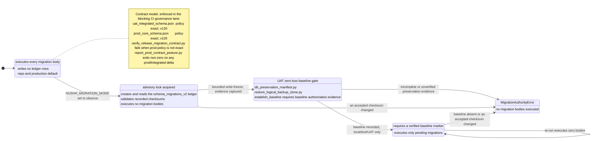

# Migration Governance

## Visual Context

Canonical visual owner: [Operations Index](README.md). Use that map for the top-down operations view; this page defines the database migration authority and the environment contract model.

## Visual Map

Execution mode is a fail-closed state machine in `migration_authority.py`. The
contract model is a separate, always-exact parity check.



## One Authority

The only canonical release lane is:

- `consent-protocol/db/migrations/`
- `consent-protocol/db/release_migration_manifest.json`

Everything else is supporting material, not release authority.

Migration execution authority is implemented by:

- `consent-protocol/db/migration_authority.py`
- `consent-protocol/db/foundations/schema_migrations_v2.sql`

The SQL migration files remain the authored schema history. The ledger records
which immutable checksums an environment has accepted; it is not a second
authored manifest.

## Execution Modes

- `replay` preserves the historical replay-all behavior. It remains the repo
  and production default until a separately approved production cutover.
- `observe` acquires the migration advisory lock, creates/reads the additive
  ledger authority, and validates any recorded checksums. It executes no
  migration bodies.
- `ledger` requires a verified baseline marker and executes only pending
  migrations. It fails closed when the baseline is absent or an accepted
  checksum changes.

UAT mode is controlled independently from production. Turning on `ledger` is
not a normal deploy flag change: it requires the zero-loss baseline procedure
below.

## UAT Zero-Loss Baseline Gate

Before establishing a UAT baseline:

1. capture the read-only preservation manifest with
   `scripts/ops/db_preservation_manifest.py`;
2. create and independently checksum a fresh immutable logical backup;
3. restore that exact checksum into a named isolated clone using
   `scripts/ops/restore_logical_backup_clone.py`;
4. prove exact clone parity, then run the additive preservation comparison;
5. complete the PKM zero-loss and reviewer readback gates;
6. enter the approved bounded UAT write-freeze and capture final evidence;
7. establish the baseline marker against the same database identity;
8. switch UAT to `ledger`, re-enable writes, and verify a second run executes
   zero migration bodies.

Evidence is accepted only when the source identity, clone comparison, backup
checksum, catalog digest, information digests, and freshness window all match.
The dump and restore clients must use the source PostgreSQL major version;
operators set `PG_RESTORE_BIN` explicitly when the host default differs.
Reports remain under ignored `tmp/` and never contain plaintext protected
information.

This logical dump/restore procedure is a **UAT baseline tool only**. It is not the
production recovery path: production recovery is Cloud SQL automated backups plus
PITR, described in
[production-db-backup-and-recovery.md](./production-db-backup-and-recovery.md).

## Environment Contract Model

UAT and production run the same Cloud SQL schema, so both contracts are exact and
must stay at the same migration version:

- `uat_integrated_schema.json`
  - exact policy
  - tracks the current integrated release lane
- `prod_core_schema.json`
  - exact policy
  - mirrors the integrated contract table-for-table
  - validated read-only

Production is converged to the integrated contract. Any delta between the two
files is drift to close, not accepted policy, and
`verify_release_migration_contract.py` fails when the production contract is not
`exact`. (The earlier "frozen subset" model, where production pinned a lower
minimum version and a reduced table set, is retired.)

## Surface Taxonomy

### Authoritative release migrations

- `consent-protocol/db/migrations/*.sql`
- `consent-protocol/db/release_migration_manifest.json`

Use for:

- numbered schema evolution
- release-lane verification
- UAT integrated contract checks

### Bootstrap / legacy initialization

- `consent-protocol/db/legacy/init_legacy_schema.sql`
- `consent-protocol/db/legacy/COMBINED_MIGRATION.sql`

Use for:

- controlled maintenance/bootstrap cases only

Do not use as:

- normal contributor migration flow
- release authority

### Repair / one-off scripts

Examples:

- `consent-protocol/db/repair/add_onboarding_column.py`
- `consent-protocol/scripts/apply_consent_notify_trigger.py`
- `consent-protocol/scripts/migrate_financial_v2.py`

Use for:

- scoped repair or historical maintenance

Do not use as:

- first-run setup
- release-lane truth

### Read-only verification

- `scripts/ops/db_migration_release_guard.py`
- `scripts/ops/verify_release_migration_contract.py`
- `scripts/ops/report_prod_contract_posture.py`

Use for:

- contract alignment
- UAT exact verification
- production/integrated contract parity reporting

### Data migration / seed utilities

- `consent-protocol/db/seeds/seed_investors.py`
- `consent-protocol/scripts/reset_dev_user_data.py`
- `consent-protocol/scripts/setup_kai_test_marketplace_profiles.py`

Use for:

- disposable local/UAT data setup

Do not use as:

- release migrations

## Canonical Commands

```bash
./bin/hushh db verify-release-contract
./bin/hushh db verify-uat-schema
./bin/hushh db report-prod-posture
./bin/hushh codex data-model-audit
python3 consent-protocol/db/migrate.py --release --migration-mode observe
```

Meaning:

- `verify-release-contract`
  - verifies manifest head and contract-file alignment locally
- `verify-uat-schema`
  - runs the exact UAT contract against live UAT runtime DB settings, read-only
- `report-prod-posture`
  - reports any delta between the production and integrated contracts, and exits
    non-zero when they have drifted apart (expected delta: none)
- `data-model-audit`
  - verifies migration-created tables are classified under the runtime DB data-plane contract
  - blocks unclassified tables and canonical writes into legacy memory tables

## Contributor Rule

Do not require contributors to run ad hoc SQL files just to start development.

If a disposable seed path is needed, keep it:

- named
- idempotent
- separate from release migrations

## Maintainer Rule

When a new numbered migration lands:

1. add the SQL file under `db/migrations/`
2. update `release_migration_manifest.json`
3. update `uat_integrated_schema.json` when the integrated contract advances
4. advance `prod_core_schema.json` in the same change so it stays an exact mirror of the integrated contract
5. follow the maintainer SOP in [data-model-governance.md](../architecture/data-model-governance.md)
6. update [runtime-db-data-plane-contract.json](../architecture/runtime-db-data-plane-contract.json) when the migration creates or renames tables
7. run `./bin/hushh codex data-model-audit` before claiming the migration is production-ready

Every new table must have a declared owner, data class, primary access path, expected row-growth posture, retention policy, deletion behavior, and plaintext/ciphertext posture. Prefer adding the table to an existing family. Create a new family only when the table cannot honestly fit an existing bounded context.
