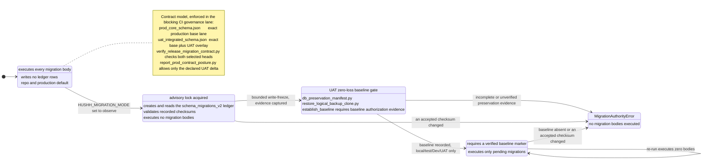

# Migration Governance

## Visual Context

### Dev-only migration promotion

Promotion is separate release work, not part of a private-pod dev rollout. Inspect the current release and dev manifests, migration authority and environment contracts before choosing migration identifiers. Reconcile already-applied dev migrations and checksums; do not assume renumbered SQL is safe to replay. Update affected dev-manifest entries in the same change so moved files cannot break dev deployment; retain the lane while other dev-only migrations remain. Update table-family lifecycle declarations and regenerate their projections. Rehearse against a disposable restoration and run the existing release-migration contract gates before an authorized rollout. Historical migration numbers and blanket idempotence claims are not instructions.

Canonical visual owner: [Operations Index](README.md). Use that map for the top-down operations view; this page defines the database migration authority and the environment contract model.

## Visual Map

Execution mode is a fail-closed state machine in `migration_authority.py`. The
contract model is a separate, always-exact parity check.


```mermaid
stateDiagram-v2
  direction LR

  [*] --> replay

  replay: executes every migration body
  replay: writes no ledger rows
  replay: repo and production default

  observe: advisory lock acquired
  observe: creates and reads the schema_migrations_v2 ledger
  observe: validates recorded checksums
  observe: executes no migration bodies

  baselineGate: UAT zero-loss baseline gate
  baselineGate: db_preservation_manifest.py
  baselineGate: restore_logical_backup_clone.py
  baselineGate: establish_baseline requires baseline authorization evidence

  ledger: requires a verified baseline marker
  ledger: executes only pending migrations

  failClosed: MigrationAuthorityError
  failClosed: no migration bodies executed

  replay --> observe: HUSHH_MIGRATION_MODE set to observe
  observe --> baselineGate: bounded write-freeze, evidence captured
  baselineGate --> ledger: baseline recorded, local/test/Dev/UAT only
  baselineGate --> failClosed: incomplete or unverified preservation evidence
  ledger --> ledger: re-run executes zero bodies
  observe --> failClosed: an accepted checksum changed
  ledger --> failClosed: baseline absent or an accepted checksum changed

  note right of replay
    Contract model, enforced in the blocking CI governance lane:
    prod_core_schema.json       exact production base lane
    uat_integrated_schema.json  exact base plus UAT overlay
    verify_release_migration_contract.py checks both selected heads
    report_prod_contract_posture.py allows only the declared UAT delta
  end note
```

## One Authority

The only canonical release lane is:

- `consent-protocol/db/migrations/`
- `consent-protocol/db/release_migration_manifest.json`

Everything else is supporting material, not release authority.

Migration execution authority is implemented by:

- `consent-protocol/db/migration_authority.py`
- `consent-protocol/db/foundations/schema_migrations_v2.sql`

The SQL migration files remain the authored schema history. The ledger records
which immutable checksums an environment has accepted; it is not a second
authored manifest.

## Shared-dev compatibility deferral — 2026-10-09

Main's canonical migration 249 is destructive chat-history cleanup. This branch
previously used that number for a public-profile bridge, now registered as 294.
Shared-dev runs **replay**, which ignores ledger/baseline coverage and records no
release receipts. Synchronizing the canonical SQL must not trigger another
history cutover during an ordinary application deployment.

The existing dev manifest pins 249's filename and checksum as deferred. Only an
explicit `hushh-pda-dev` / `shared-dev` / `postgres` target using the production
base lane excludes it from replay execution. Observe still inspects canonical
history; ledger refuses until the deferral is resolved. Production, UAT and the
isolated commerce preview retain their canonical selectors and baselines.
Changed SQL or invalid deferral metadata refuses before migration execution.

A release schema check proves shape and the minimum head, not execution of every
canonical migration. Record this deferral in deployment evidence. The prior
parked 944 receipt is separate and cannot stand in for canonical 249. Removing
the deferral requires the approved history-cutover recovery, writer drain and
command-settlement evidence; do not change a baseline or mark 249 applied.

## Execution Modes

- `replay` preserves the historical replay-all behavior. It remains the repo
  and production default until a separately approved production cutover.
- `observe` acquires the migration advisory lock, creates/reads the additive
  ledger authority, and validates any recorded checksums. It executes no
  migration bodies.
- `ledger` requires a verified baseline marker and executes only pending
  migrations. It fails closed when the baseline is absent or an accepted
  checksum changes.

UAT mode is controlled independently from production. Turning on `ledger` is
not a normal deploy flag change: it requires the zero-loss baseline procedure
below.

A migration whose first line is `-- migration: transactional=false` opts out of
the ledger transaction wrapper. Use this only for a single statement that requires
top-level execution, such as `CREATE INDEX CONCURRENTLY`; include no `BEGIN` or
`COMMIT`. The header is part of the immutable checksum. Replay already runs each
file without an explicit wrapper, and observe still executes no migration bodies.
Concurrent builds may leave an invalid index after interruption, so dependent
migrations must check index validity and document explicit rebuild instructions.
The Feed 203–204 sequence and its recovery are documented in
[Feed notification model](../one/feed-notification-model.md).

### Replay and table locks

Because `replay` re-runs every file on every deploy, a statement that is a no-op
on an applied database still takes its lock. `ALTER TABLE ... SET DEFAULT`,
`ADD COLUMN IF NOT EXISTS`, `ALTER COLUMN ... TYPE`, `DROP/ADD CONSTRAINT` and
`DROP TRIGGER` take ACCESS EXCLUSIVE before they discover there is nothing to
do; `CREATE INDEX IF NOT EXISTS` takes SHARE. On a busy table that lock waits
behind live traffic until the runner's 5s `lock_timeout` fires (SQLSTATE 55P03).
Across 21 backend UAT deploy attempts, 6 failed this way, in migrations 025
(five times) and 039 (once).

For a statement on a busy table, wrap it in a `DO` block that checks the catalog
(`pg_attrdef`, `pg_attribute`, `pg_constraint` with `pg_get_constraintdef`,
`pg_trigger`, `pg_class`) and skips only when the effect is already exactly in
place. Otherwise the original statement runs unchanged. Migrations 025, 039,
046, 093, 117 (the `consent_audit` trigger) and 172 follow this pattern. Replay
writes no ledger rows, so editing a file this way leaves nothing to re-verify.
In `ledger` mode, any checksum a baseline recorded would need the baseline
procedure again.

When a lock times out, the runner logs the relation and lock mode it waited for.
It also logs each blocking session's pid, `application_name`, state, wait event,
and transaction and query ages. It samples these from a second pool connection
while the statement waits. It never reads another session's query text.

## UAT Zero-Loss Baseline Gate

The same preservation authority supports an explicitly authorized Dev cutover.
Verify the complete canonical release history before recording its baseline;
parked migration receipts do not prove a release prefix. Preserve divergent
preview SQL and receipts without relabeling accepted history. A Dev baseline
requires the same backup, restored-clone, source-preservation and readback proof.
The current CLI help still says UAT/local; the enforced environment allowlist
also includes Dev. That help correction belongs to the migration CLI owner;
it does not change baseline authorization or permit production use.

Before establishing a UAT baseline:

1. capture the read-only preservation manifest with
   `scripts/ops/db_preservation_manifest.py`;
2. create and independently checksum a fresh immutable logical backup;
3. restore that exact checksum into a named isolated clone using
   `scripts/ops/restore_logical_backup_clone.py`;
4. prove exact clone parity, then run the additive preservation comparison;
5. complete the PKM zero-loss and reviewer readback gates;
6. enter the approved bounded UAT write-freeze and capture final evidence;
7. establish the baseline marker against the same database identity;
8. switch UAT to `ledger`, re-enable writes, and verify a second run executes
   zero migration bodies.

Evidence is accepted only when the source identity, clone comparison, backup
checksum, catalog digest, information digests, and freshness window all match.
The dump and restore clients must use the source PostgreSQL major version;
operators set `PG_RESTORE_BIN` explicitly when the host default differs.
Reports remain under ignored `tmp/` and never contain plaintext protected
information.

Capture runs within one repeatable-read, read-only transaction, including the
catalog, table digests, null counts and ciphertext aggregates. For a logical
backup, keep an exporting transaction open and pass its `pg_export_snapshot()`
identifier to both the capture tool's `--snapshot-id` and `pg_dump --snapshot`.
Close the exporter only after both operations finish. Keep the identifier in
process memory. The final source-preservation check still requires current
state under the bounded write-freeze; an earlier shared snapshot cannot prove
that subsequent writes preserved the source.

Pin extension namespaces and versions before restoring into the empty clone.
PostgreSQL client-major parity alone does not prevent `CREATE EXTENSION` from
selecting a newer default version. A restore that differs in extension version
or catalog representation is not accepted evidence. Reconstruct a deparsed
object only in the disposable clone, from its exact authored migration DDL,
after independently checking its column types, constraint/index flags and
bindings. Retain the repair recipe and source hashes, then rerun the unchanged
exact catalog and information comparison. Do not normalize away differences or
omit changing operational tables to obtain a pass.

This logical dump/restore procedure is a **nonproduction baseline tool**. It is not the
production recovery path: production recovery is Cloud SQL automated backups plus
PITR, described in
[production-db-backup-and-recovery.md](./production-db-backup-and-recovery.md).

## Environment Contract Model

The release manifest has a production-safe base lane and explicit environment
overlays. Production never inherits an overlay by default:

- `prod_core_schema.json`
  - exact policy
  - tracks `ordered_migrations` only
  - validated read-only
- `uat_integrated_schema.json`
  - exact policy
  - tracks the numeric-order union of `ordered_migrations` and `environment_overlays.uat`
- `dev_minimum_schema.json`
  - minimum policy
  - remains on the production base lane unless a separate dev overlay is added

The parser defaults to `production`. Selecting `uat` requires an explicit
`--release-environment uat` argument and the canonical UAT project and Cloud SQL
instance markers. The contract verifier rejects duplicate base/overlay entries,
missing files, an unaccounted repository head, or a contract that does not match
its selected lane.

## Surface Taxonomy

### Authoritative release migrations

- `consent-protocol/db/migrations/*.sql`
- `consent-protocol/db/release_migration_manifest.json`

Use for:

- numbered schema evolution
- release-lane verification
- UAT integrated contract checks

### Bootstrap / legacy initialization

- `consent-protocol/db/legacy/init_legacy_schema.sql`
- `consent-protocol/db/legacy/COMBINED_MIGRATION.sql`

Use for:

- controlled maintenance/bootstrap cases only

Do not use as:

- normal contributor migration flow
- release authority

### Repair / one-off scripts

Examples:

- `consent-protocol/db/repair/add_onboarding_column.py`
- `consent-protocol/scripts/apply_consent_notify_trigger.py`
- `consent-protocol/scripts/migrate_financial_v2.py`

Use for:

- scoped repair or historical maintenance

Do not use as:

- first-run setup
- release-lane truth

### Read-only verification

- `scripts/ops/db_migration_release_guard.py`
- `scripts/ops/verify_release_migration_contract.py`
- `scripts/ops/report_prod_contract_posture.py`

Use for:

- contract alignment
- UAT exact verification
- production/integrated contract parity reporting

### Data migration / seed utilities

- `consent-protocol/db/seeds/seed_investors.py`
- `consent-protocol/scripts/reset_dev_user_data.py`
- `consent-protocol/scripts/setup_kai_test_marketplace_profiles.py`

Use for:

- disposable local/UAT data setup

Do not use as:

- release migrations

## Canonical Commands

```bash
./bin/hushh db verify-release-contract
./bin/hushh db verify-uat-schema
./bin/hushh db report-prod-posture
./bin/hushh codex data-model-audit
python3 consent-protocol/db/migrate.py --release --release-environment production --migration-mode observe
python3 consent-protocol/db/migrate.py --release --release-environment uat --migration-mode observe
```

Meaning:

- `verify-release-contract`
  - verifies manifest head and contract-file alignment locally
- `verify-uat-schema`
  - runs the exact UAT contract against live UAT runtime DB settings, read-only
- `report-prod-posture`
  - permits only the exact declared UAT-only table delta and exits non-zero on
    any other production/UAT contract drift
- `data-model-audit`
  - verifies migration-created tables are classified under the runtime DB data-plane contract
  - blocks unclassified tables and canonical writes into legacy memory tables

## Contributor Rule

Do not require contributors to run ad hoc SQL files just to start development.

If a disposable seed path is needed, keep it:

- named
- idempotent
- separate from release migrations

## Maintainer Rule

When a new numbered migration lands:

1. add the SQL file under `db/migrations/`
2. add a production migration to `ordered_migrations`, or a UAT-only migration
   to `environment_overlays.uat`; never add the same file to both
3. update the schema contract for every lane that selects the migration
4. keep production and dev on the base head when a change is explicitly UAT-only
5. follow the maintainer SOP in [data-model-governance.md](../architecture/data-model-governance.md)
6. update [runtime-db-data-plane-contract.json](../architecture/runtime-db-data-plane-contract.json) when the migration creates or renames tables
7. run `./bin/hushh codex data-model-audit` before claiming the migration is production-ready

Every new table must have a declared owner, data class, primary access path, expected row-growth posture, retention policy, deletion behavior, and plaintext/ciphertext posture. Prefer adding the table to an existing family. Create a new family only when the table cannot honestly fit an existing bounded context.

### Infrastructure integration lineage (2026-10-09)

Main migrations 284–288 retain their canonical identities. The infrastructure
branch's commerce and explicit Shared-choice SQL is registered unchanged as 289
and 290. Original branch-only 284/287 files and rollbacks remain in `db/legacy/`
as historical preview evidence, outside the release manifest. Never relabel an
applied ledger row or replay this lineage on a preview that recorded the old IDs.
The shared dev ledger readback contained neither old ID; recheck the target ledger
and recovery immediately before any governed deployment.
