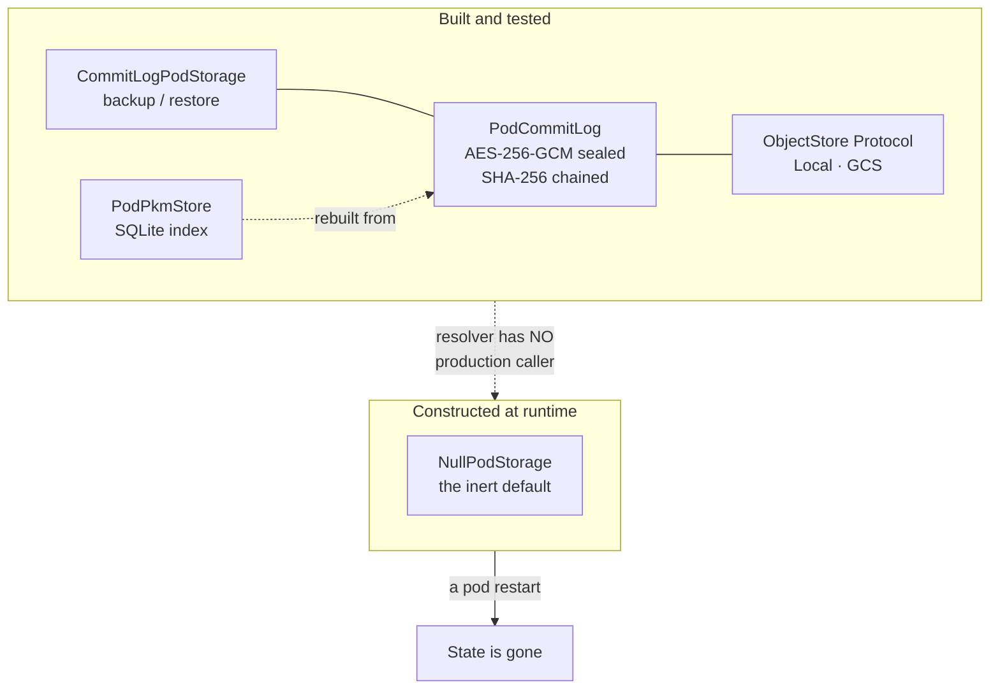

# Pod backup and recovery — what exists, what runs, and what a person would lose

**Dated 2026-08-07; materially updated 2026-08-08.** The operational half of
[the north star](../architecture/private-agent-north-star.md): if a person's private agent
is defined by memory that accumulates, then losing that memory is the product's worst
failure, and this is the record of how close we are to being able to prevent it.

**What was true on 2026-08-07, and is worth keeping because it explains the shape of
everything below:** the durability stack was designed, tested, and **never constructed**.
`resolve_pod_storage()` was referenced from its own definition and from tests — nowhere
else in `consent-protocol/`. `PodCommitLog` was constructed in exactly three places: that
unreachable resolver, the multi-pod simulation script, and the test suite. No deployed pod
on any target had ever written a durable record.

**What is true on 2026-08-08.** The stack is constructed and reached, for **agent memory
only**:

| | Written from a pod? | Survives a cold boot? |
|---|---|---|
| Agent memory (`PodMemoryService`) | yes — appended to the sealed commit log | yes — replayed on first use after boot |
| PKM (`PodPkmStore`) | **no** — no production caller | n/a; nothing is written to survive |
| Session history | **no** — `InMemorySessionService` | no |
| Per-pod identity key | **no** — ephemeral (task #114) | no |

So this is now a **runbook for the memory path and still a design review for the rest**.
Read §1 and §4 for exactly what moved. The distinction matters operationally: a pod today
resumes its conversation and learned preferences and starts every turn ungrounded in the
owner's holdings, because `api/routes/one/pod_turn.py` is deliberately ungrounded and says
so in its own docstring.

## Erasure verification corrections (2026-09-05)

Artifact Registry deletion is asynchronous. The substrate executor checks the returned
operation identity, observes completion without a provider error, and requires repository
absence before recording a successful removal. Pending operations remain incomplete and
preserve recovery authority for retry. A repository already absent on retry is accepted.
See the [provider deletion contract](https://docs.cloud.google.com/artifact-registry/docs/reference/rest/v1/projects.locations.repositories/delete).

KMS versions scheduled for destruction remain incomplete until their state is
`DESTROYED`. These checks do not establish complete account erasure: Memory Bank
erasure, retained object versions, soft deletion, and restore prevention still need
their own lifecycle evidence. The account deletion guard continues to refuse a clean
deletion claim while external resources have not been proven erased.

## Visual Map

## The five things that are true today

### 1. The whole stack is unreachable, not merely off — ✅ HALF CLOSED (2026-08-08)

The usual shape of an unfinished feature is a flag defaulting to off. This was one step
further back: `POD_STORAGE_BACKEND` selected `commit_log` correctly and failed loud on a
missing bucket or key — and **nothing called the function that read it**. Turning the flag
on changed nothing, because the code that would honour it never ran.

**What changed.** `resolve_pod_storage()` now has a production caller:
`pod_memory_service._resolve_log()`, reached from `resolve_pod_memory_service()` when the
process is a pod. So `CommitLogPodStorage` is instantiated for real, and agent memory is
appended to the sealed log as it is made and replayed on first use after a boot.

**What has not changed.** PKM. `api/routes/one/pod_turn.py` is deliberately ungrounded
(`pkm_context=None`, `grounded: false`, `InMemorySessionService`), so no PKM read or write
happens in a pod turn at all; `PodPkmStore` is rebuild-capable and still has no production
caller. Read every claim below about "the pod's holdings" with that split in mind:
**agent memory is durable, PKM is not yet written from a pod.**

### 2. `backup()` records a pointer; nothing writes what it points at

`CommitLogPodStorage.backup` appends one `storage_pointer` record naming a blob — its ref,
wrapping key id, algorithm, size, and timestamp. `EncryptedBlobRef` is constructed at
exactly one site in the codebase: inside `restore()`, reading a record back. **No code
anywhere produces the ciphertext the pointer names.**

So even fully wired, `backup()` would be a manifest of blobs that do not exist. The seam is
right — no plaintext crosses it, which is the property that makes it legible — but the
half that moves bytes has not been written.

### 3. The inert default is success-shaped

`NullPodStorage.backup` performs no I/O and returns a dictionary carrying a status string,
a backend id, and the HusshID. A caller that does not inspect the status field cannot
distinguish it from a completed backup. This is the same failure mode as a `200` on an
empty page, and it is worth fixing before anything calls `backup()` in earnest: the moment
a caller exists, "did the backup work?" must not be answerable only by string comparison.

### 4. Neither renderer emits any of the four variables the stack needs — ✅ CLOSED for hushh-managed GCP (2026-08-08)

`POD_STORAGE_BACKEND`, `POD_STORAGE_GCS_BUCKET`, `HUSSH_POD_LOG_KEY`,
`HUSSH_POD_MEMORY_KEY` and `HUSSH_POD_PRIVATE_KEY` appeared in **no** deploy renderer, on
either target, and in no file under `deploy/` or `scripts/deploy/`. On every pod deployed
before this: the log key was absent, so the commit log could not be constructed; memory
was off; storage resolved to Null; the pod identity key was ephemeral.

**What changed.** `gcp_backend._durable_state_env` emits `POD_STORAGE_BACKEND`,
`POD_STORAGE_GCS_BUCKET`, `POD_STORAGE_GCS_PREFIX` (one prefix per owner — this is what
keeps one pod's log out of another's replay), `HUSSH_POD_LOG_KEY`, `HUSSH_POD_MEMORY_KEY`
and `POD_AGENT_MEMORY_ENABLED`. All six or none: `resolve_pod_storage` fails loud on a
partial config, so half a setting would turn a missing value into a pod that refuses to
boot. `scripts/deploy/backend-deploy.sh` supplies the two inputs in the dev block —
`${PROJECT_ID}-pod-state` and the `HUSSH_POD_KEY_MASTER` secret.

`POD_AGENT_MEMORY_ENABLED` is in that list for a reason worth remembering: it defaults OFF
and was set by nothing anywhere, so shipping the memory key alone would have handed every
pod a sealing key it never used — durability that reads as configured and behaves as
amnesia. The flag and the key are now emitted together or not at all.

**Verified live, not inferred.** A pod provisioned through `GcpBackend` had all six read
back *from Cloud Run* and reached `live`. (A first attempt failed its startup probe on
`APP_SIGNING_KEY must be set` — the harness had not mirrored the hub's
`HUSSH_POD_SIGNING_KEY_SECRET`. Recorded because it looks exactly like the new env block
breaking boot, and is not. It also shows the startup probe is genuinely HTTP: a TCP probe
would have been satisfied by gunicorn's bind before the worker died.)

**Still open:** `HUSSH_POD_PRIVATE_KEY` (per-pod identity, task #114), the Anypoint
renderer, and BYOC — where the log key must come from the person's own KMS key rather than
any hushh-held master. See §5.

### 5. The user-owned GCP bootstrap designs the substrate — and now connects it (fixed 2026-08-11)

`UserGcpBackend.render_bootstrap_plan` provisions the person's own KMS key, a
CMEK-encrypted GCS bucket, a least-privilege pod service account, the Cloud Run service, a
Pub/Sub topic, a subscription, a Cloud Scheduler job that re-arms the Gmail watch before
its 7-day expiry, and (added 2026-08-11) a Secret Manager entry holding the pod's own
signing key — and grants the pod exactly the IAM to match.

**Until 2026-08-11 it never set `POD_STORAGE_GCS_BUCKET` to that bucket.** Worse than
disconnected: `render_deploy_config` reused the managed renderer wholesale, so a BYOC pod
was rendered pointing at **hushh's** bucket, carrying **hushh-derived plaintext** log and
memory keys, and with **no runtime identity** — meaning the project's default compute
account. `byoc_key_env`, the function written to prevent exactly the first two, had no
caller.

All of it is now joined and asserted against the rendered artifact rather than the helper.
Verified live in `hushh-byoc-test`: a pod ran as `one-pod-…@<user-project>`, wrote to
`one-pod-…-blobs`, carried `HUSSH_POD_KMS_KEY` and no plaintext key of any kind, and
passed an HTTP `/health` startup probe.

**Custody changed with it, and the change was forced by execution.** This runbook and the
custody module both said the log key was wrapped "at bootstrap" by hushh's impersonated
token. Against a real project that returns `403 useToEncrypt denied`: the bootstrap account
holds `cloudkms.admin` and deliberately neither encrypter nor decrypter, so it cannot use
the key it creates. The pod now mints and wraps its own key on **first boot**, guarded by
`ifGenerationMatch=0` so two cold starts cannot write two keys and orphan each other's
records. hussh's inability to read a person's history is now a property of the IAM policy
the bootstrap writes, not a sentence in a document.

## Answering the question directly: is GCS required?

**An object store is required.** On both production paths. The commit log is the system of
record and the SQLite index is a rebuildable projection over it, so without a durable
object store there is nothing to rebuild from and a restart is indistinguishable from a
new agent.

**GCS specifically is not required.** The `ObjectStore` Protocol is four async methods with
no GCS types, and already has two implementers with entirely different mechanics. But:

| Concern | On user-owned GCP (path A) | On Anypoint (path B) |
|---|---|---|
| Object store implementation | `GcsObjectStore` exists | none — see [the Anypoint evaluation](../architecture/anypoint-vs-user-gcp.md) |
| Credential path | keyless, GCE metadata server | no ambient Google identity to borrow |
| CAS primitive | `ifGenerationMatch`, numeric generation | unresolved; an ETag CAS may or may not map |
| Substrate provisioned | yes, by the bootstrap | no equivalent rendered |

So on path A, GCS is effectively the answer because it is the only implementation that
exists. On path B something must be built before backup or recovery can be discussed at
all.

## What recovery would and would not restore

Assume, for the sake of the design review, that the stack is wired. Then:

**Restored by a replay:** every record the pod ever appended, in order, chain-verified —
and from those, the SQLite index, rebuilt by `PodPkmStore.rebuild`.

**Not restored, because nothing writes them:** the blobs named by `storage_pointer`
records. Anything held only in process memory. The pod's identity key, which is generated
at startup and is ephemeral by configuration.

**Not restored, by design:** a pod that was reaped. The reap path tears down the **host and
only the host** — the registry row, the HusshID, the phone hash, the pod public key and the
A2A address all survive, deliberately, so the owner pays one cold start instead of weeks of
idle warm floor. But with no commit log, "re-provisioned" returns an *address*, not an
agent that remembers. The idle cutoff defaults to **168 hours**.

Two things about the reap worth stating plainly:

- It is not attached anywhere. `server.py` has no attach point for the reconcile worker, by
  a deliberate decision, and the sweep needs two independent flags.
- **The schema has no truthful source of pod idleness.** `personal_agent_registry` has no
  last-activity column, and `updated_at` has no `ON UPDATE` trigger and is never written —
  so it is effectively the row's creation time. Wiring an adapter that reads it would reap
  by row AGE, not inactivity. That gap must close before the sweep runs anywhere a wrong
  answer costs someone their warm pod.

**Account deletion does deprovision the agent.** `DELETE` on the account calls
`PersonalAgentProvisioningService.deprovision`, which revokes the standing read, tombstones
the HusshID and deletes the row — account teardown, a different act from a reap. That path
is wired; it was wired before this review and is not a gap.

## Four defects a real backup story has to close

### Replay cost grows without bound

`replay()` walks the chain backwards from the head pointer, one object fetch per record,
**strictly serial** — the next key is inside the record just decrypted, so nothing can be
prefetched or parallelised. On GCS each fetch is two HTTPS round trips (metadata for the
generation, then media), giving roughly `2(n+1)` round trips for `n` records.

There is no snapshot and no compaction anywhere in the module. A pod with a long history
pays that cost on every cold start, which collides directly with an economy tier that
scales to zero. **A snapshot record — a sealed materialised state at sequence `N`, with
replay starting there — is the single highest-value addition to the log.**

### A truncation to a valid prefix passes verification

Chain verification is genuinely strong against *alteration*: each record binds its
predecessor's hash, AES-GCM authenticates each record, and a missing record raises. The
sequence check asserts the replayed sequences are contiguous from 1.

A rollback satisfies all of that. `head.json` is **not sealed** — it is plain JSON holding
a sequence, a key and a hash. An actor who can write to the bucket and who kept an earlier
copy of `head.json` can restore it; the chain from that older head verifies perfectly and
the sequences are contiguous from 1. Nothing persists a high-water sequence to compare
against, so history is silently truncated.

The fix is small and should land with the snapshot work: **persist the highest sequence
ever observed outside the log's own head** and refuse a head that moves backwards.

### Erasure has no mechanism

Records are append-only and each is sealed with the log key. A deletion is a *forward*
record expressing an intent; the content it deletes remains in the earlier sealed records
forever. There is no compaction, no rewrite, and no per-record key.

So the only true erasure lever is destroying the log key, which erases **everything** — and
nothing manages that key's lifecycle today. For a consent-first product that owes people
removal on request, per-record or per-epoch key derivation is not an optimisation; it is
the mechanism by which "delete my information" becomes a true statement.

**Update 2026-09-02 — erasure after a UI pod deletion.** Observed on dev: a person
deleted their pod from the app (registry row gone, `deprovision_requested` tombstone
written), then deleted their account ten minutes later, and their own project still held
`one-bootstrap@` with ten admin roles, the `hushh-one` keyring and the `one-pod` artifact
repo. `_teardown_byoc_substrate` answered "nothing BYOC here" the moment the row was
missing, so the substrate teardown never ran and the only record that anything was left
was a `unreclaimed=true` tombstone. Closed in code: the deprovision tombstone now always
carries the cloud coordinates for a `user_gcp` row (project, region, bootstrap account,
target), and account deletion rebuilds its anchor from `byoc_setup_jobs` plus
`PersonalAgentRegistryRepo.latest_tombstone_for_project(...)` when the row is gone. The
30-day `pod_lifecycle_events` log is also purged at erasure instead of waiting on its
TTL. Guard: `consent-protocol/tests/test_byoc_substrate_teardown_rowless.py`. The
person's project itself is still never deleted by hushh; on 2026-09-02 the owner deleted
it by hand with `gcloud projects delete` (30-day undelete window).

**Update 2026-09-04 — hushh gives its own access back at erasure.** The observation
above named `one-bootstrap@` with ten admin roles as residue, and the fix that followed
addressed the *anchor* rather than that account. So teardown kept deleting the person's
infrastructure while leaving hushh's `roles/iam.serviceAccountTokenCreator` binding on
the bootstrap account standing: after an account was erased, hushh could still mint
900-second tokens as an identity holding `storage.admin`, `secretmanager.admin`,
`cloudkms.admin` and `run.admin` inside that person's project, indefinitely, with the
product reporting the account as erased.

Account deletion now revokes that binding as the **last** action of the teardown plan
(`service_account_iam_binding`, priority 120). Last is load-bearing: it is the identity
every other delete runs as, so giving it up earlier strands teardown in a project hushh
has just lost the only way back into. If the revoke itself fails, the grant is still
there and a retry can still mint.

**What is deliberately NOT done: the account is not deleted** (founder decision,
2026-09-04). Deleting `one-bootstrap@` would be a larger irreversible act in a project
hushh does not own, and it is not what ends hushh's access -- the binding is. The person
keeps their own account to delete or reuse; hushh keeps nothing. This is the same command
`deploy/iam/authorize_byoc_project.sh` documents as the revoke, now performed on the
person's behalf instead of left as homework nobody knows they have.

The honest bound is unchanged from that script: a token already minted lives out its
remaining 900 seconds, because Google does not revoke issued access tokens. Erasure ends
future authority and at most fifteen more minutes of the old. Guard:
`consent-protocol/tests/test_byoc_substrate_teardown_is_loud.py` -- five tests covering
the ordering, the omission when either identity is unknown, the read-modify-write that
keeps the person's own bindings, idempotency on a deleted account, and a refused revoke
raising instead of minting a clean-erase summary over surviving access.

### One key, one blast radius

`HUSSH_POD_LOG_KEY` seals every record for the life of the pod. There is no rotation, no
epoch, and no re-seal path. Rotating it makes prior history unreadable; not rotating it
means one key compromise exposes the entire history.

## The order to do this in

Each step is a precondition for the next, so the sequence is not a preference.

1. **Construct the stack.** Give `resolve_pod_storage()` a production caller and render the
   four variables on both targets. Until this, nothing else on this list is observable.
2. **Write the blob half of `backup()`**, or narrow the contract to say the log *is* the
   backup and remove the pointer path. Both are defensible; shipping neither is not.
3. **Point the bootstrap's bucket at `POD_STORAGE_GCS_BUCKET`.** Path A's substrate already
   exists in the plan.
4. **Make the inert default distinguishable** from a real write at the type level, not by a
   status string.
5. **Snapshot and compaction**, with the high-water sequence landing in the same change —
   they touch the same code and the anti-rollback fix is nearly free alongside it.
6. **Key epochs**, which is what makes both rotation and erasure possible.
7. **A real last-activity column** before the reap sweep is enabled anywhere.

## The test that would keep this honest

The parity test's `REQUIRED_SLOTS` is two entries long — the hub URL and the consent public
keys. Adding the persistence variables to it turns every backend red until each one
answers, which is the cheapest way to make the gaps above unskippable rather than merely
written down here.

And the acceptance bar for step 1 is not a passing test. It is: **restart a pod and have it
remember.** Two processes, one write, one read, state proven to survive the gap — the same
probe that proved memory is erased today.

## Sources

- Verified reading of `pod_storage.py`, `pod_commit_log.py`, `pod_pkm_store.py`, `user_gcp_backend.py`, `personal_agent_reconcile_worker.py`, `runtime_settings.py` and `api/routes/account.py`, plus an exhaustive caller search for the storage resolver and commit log across `consent-protocol/`, 2026-08-07.
- Companion records: [the north star](../architecture/private-agent-north-star.md), [Anypoint vs user-owned GCP](../architecture/anypoint-vs-user-gcp.md), and [the plan of record](../architecture/private-agent-one-plan-of-record.md).

## Upgrading a running pod to the hub's current image

A heal converges a pod to the digest it already runs, on purpose: a heal must never
silently change what a person is running. The consequence, found on 2026-09-02, was
that nothing else moved a pod either. The founder's first user-owned pod stayed on an
image five commits behind the hub that built it and served that older code's 502 on
the calendar door while every hub-side test was green.

The upgrade path is the deliberate roll-forward, and it is the only path that
resolves the mutable source tag again:

- **Backend** (`UserGcpBackend.upgrade`, `GcpBackend.upgrade`): copies the hub's
  current image into the person's own registry, replaces the Cloud Run service in
  place (PUT, never delete and create, so the URL survives), waits for Ready, and
  raises rather than records when the new revision does not come up. Cloud Run keeps
  serving the previous revision in that case.
- **Service** (`PersonalAgentProvisioningService.upgrade_pod`): reads everything from
  the registry row, re-derives nothing, and writes back only the image facts
  (`record_image_upgrade`). Status, `provisioned_at`, the identity key columns and
  the substrate receipt are untouched by construction. Memory and identity survive
  because they live in the person's bucket and pod service account, not in the
  container.
- **Sweep**: the reconcile worker moves a bounded batch per pass once
  `PERSONAL_AGENT_UPGRADE_SWEEP_ENABLED=true` (`PERSONAL_AGENT_UPGRADE_BATCH`,
  default 3). The hub's own `HUSSH_ONE_POD_IMAGE` is the fleet target, so the
  invariant is "hub at sha X, pods at sha X" a few passes after each deploy. A pod
  that fails three times on one image is left alone until the image moves again.
- **Single-flight**: the reconcile loop runs in every gunicorn worker, so `upgrade_pod` first takes a lease (`claim_image_upgrade`, one conditional UPDATE on the row's `backend_metadata.upgradeLease`, ten-minute expiry); the loser skips with `in_progress`. Seen before the lease: two workers replaced the same pod thirty seconds apart and a copy failure was counted twice per pass.
- **Operator hand**: `uv run python scripts/ops/pod_upgrade.py --list | --user-id <uid> | --all`
  from a hub environment. `--image <tag>` rolls a pod back to a tag that still exists.

Guard: `consent-protocol/tests/test_pod_image_upgrade_path.py`, the ledger item
`pod-image-has-a-supported-upgrade-path`.

## Detecting an update, honestly (2026-09-03)

The founder's rule is that an upgrade is *a software update when the person opens the
app*. A software update starts with knowing the installed version, and until 2026-09-03
nothing on the login path could say one: the status carried no version, and the pod
image carried no build identity at all.

**The pod says what it runs, the hub says what it wants, and the difference is the
update.**

- `Dockerfile.pod` bakes `POD_IMAGE_TAG` (Cloud Build passes `--build-arg
  POD_IMAGE_TAG=${_IMAGE_TAG}`) into `HUSSH_POD_IMAGE_TAG`. `/pod/info` reports it as
  `imageTag` with the Cloud Run `revision`; a pod built outside Cloud Build reports
  nothing rather than a guess.
- The heartbeat now carries that self-report (`imageTag`, `revision`, and the
  `memoryBankEngine` below). It is the one self-report the hub accepts: a health claim
  is unfalsifiable, an image tag is checkable against the row. It lands under
  `backend_metadata.observed`, a key of its own, never on the deployed record
  (`source_image` / `image_digest`), so "what I deployed" and "what the pod says it is"
  can disagree and the disagreement is logged as `personal_agent.image_drift` instead of
  papered over. Bodyless beats from older pods stay valid.
- `GET /api/one/personal-agent/status` compares them on read, zero new I/O:
  `runningImage`, `targetImage`, `updateAvailable`, `updateInProgress` (the upgrade
  lease is fresh), `updateFailed` + `updateError` (three failures on this image). Tri-state
  like `hostReady`: a field is **absent** when its evidence is absent (no lane target,
  nothing recorded), never coerced to `false`. Tag equality, not digest equality: the
  person's copy is a digest in their own registry and the hub's target is a tag.
- The update is narrated as its own lifecycle stage, `updating` (progress 97, below
  `authority_live`), before the outcome (`upgraded` / `upgrade_noop` / `upgrade_failed`)
  is written under `authority_live`; the previous revision keeps serving throughout.
  A feed event `personal_agent_updated` is written only when the revision actually
  moved.
- In the app: the presence chip reads **Updating** while the lease is fresh, its
  tooltip names an available update or the last failure, the "Private agent" rail
  carries an *Updating your private agent* card, and the status poll keeps going (every
  15s) while an update is available or in flight so the chip goes available -> updating
  -> current without a reload (`decideFollow(updateMoving)`).

Guard: `tests/test_pod_update_detection.py`, `__tests__/feed/agent-update-detection.test.ts`.

**Two sweep defects seen on the first deploy of this (2026-09-03), both fixed in the follow-up:**

- **An older hub revision moved a pod backwards.** During a rollout Cloud Run keeps the
  previous hub revision's instances alive for a while, and each instance sweeps against
  its own `HUSSH_ONE_POD_IMAGE`; revisions 00060 and 00061 alternately moved the founder's
  pod forward and back (a ~90s PUT and a restart each time) until the old instances
  drained. The upgrade now records `backend_metadata.imageSetByRevision` (the hub's
  `K_REVISION`), and `set_by_newer_hub` makes an older revision skip any row a newer one
  already wrote. Revision names are zero-padded and monotonic per service, so string
  order is deploy order.
- **The second worker's lease claim raised instead of yielding.** The lease value is
  `<iso>|<target>` and the claim SQL cast the whole string to `timestamptz`; every
  contested claim surfaced as `DatabaseExecutionError`. It now casts
  `split_part(..., '|', 1)`.
- The reconcile worker's failure line carries `detail=`, because `error=ImageCopyError`
  alone said nothing about which grant or repo refused. **Since 2026-09-04 that detail is
  REDACTED, not raw** — the comment above it always forbade logging the message, and the
  message reads `403 Client Error: Forbidden for url: …/namespaces/<their project>/…`, so
  every failed sweep was writing a person's own project id into hub logs. URLs,
  `projects/<id>` and `namespaces/<id>` paths and token-shaped runs are stripped; the
  status code, which is the diagnosis, survives.
- **What that detail said, first time out:** `could not start blob upload for sha256:…: HTTP 403`
  on a pod whose project was authorised before the copy-writer grant existed
  (`artifact_repo_grant_copy_writer`). The copy into the person's own `one-pod` repository is
  refused, the marker caps at three attempts, and the pod stays on its build.
- **CLOSED 2026-09-04 — the heal step exists and no longer needs an operator.** `upgrade_pod`
  re-applies the person's substrate and retries **once**, and only for a refusal that can
  actually be fixed that way. `ImageCopyError` now carries `status` and `side`, and
  `heals_with_substrate` is true only for a **403 against the DESTINATION** — the person's own
  registry, which `artifact_repo_grant_copy_writer` exists to permit. A 403 reading the
  **source** is hushh's own registry: re-granting in their project would change nothing and
  would only hide the real cause behind a retry, so it is deliberately not healed.

  Ensuring the substrate before *every* upgrade would be the obvious fix and the wrong one —
  many API calls into someone else's cloud on a path that almost always needs none of them.
  Healing on the specific refusal costs nothing in the common case. One retry, never a loop:
  if the substrate applied and the push still refuses, the cause is not this one and the
  failure is recorded exactly as before.

  The orchestrator ASKS rather than names — `getattr(exc, "heals_with_substrate", False)` —
  because `personal_agent_provisioning_service` is the common layer that
  `test_deployment_boundary_holds` refuses to let name a provider. Guards:
  `tests/test_pod_image_upgrade_path.py`, four tests covering the classification, the heal,
  the deliberate non-heal, and the single retry.
- **A second retry also stacked once more** because the second worker judged the cooldown on a
  row it had read before the first worker's failure landed; `upgrade_pod` now re-reads the row
  after the lease claim.

## Memory Bank on the person's own Vertex (2026-09-03)

Founder decision: the pod's ADK memory is **Vertex AI Memory Bank in the person's
project**. Until now recall was keyed word-overlap over the sealed commit log; Memory
Bank is the first non-lexical retrieval in the system.

- **The pod creates its own engine.** Verified live in a BYOC project: the bootstrap
  account holds no Vertex role (`aiplatform.reasoningEngines.list` denied) and the hub
  cannot mint as the pod (`iam_bootstrap_can_run_as_pod` is actAs, not tokenCreator).
  The pod's service account already holds `roles/aiplatform.user`, so
  `pod_memory_bank.ensure_memory_bank` finds-or-creates a Memory-Bank-only Agent Engine
  named `one-pod-memory-<hushh_id>` at the pod's own region (Agent Engine is regional;
  `POD_MEMORY_BANK_LOCATION`, rendered by `UserGcpBackend`), off the boot path, and
  records the id once in the pod's own object store (`memory_bank.json`).
- **Over REST, not the ADK class.** `VertexAiMemoryBankService` imports
  `google-cloud-aiplatform`, which pins `google-genai<2` and cannot share a graph with ADK
  2.x (`pyproject.toml` keeps the `gcp` extra out on purpose; the founder's pod created its
  engine and then hit `ImportError`, 2026-09-03). `build_rest_memory_bank_service` makes the
  generation and recall calls directly on the pod's ADC. Generation acknowledgement
  and subsequent operation lookup are tracked durably as described below;
  `memories:retrieve` remains synchronous. Startup/resolution failures populate `memoryBankError`;
  runtime bank failures are logged by exception type and fall back to the sealed log.
- **Composite, log underneath.** `build_pod_memory_service(bank=...)` commits each event to
  the sealed log before attempting the bank; `search_memory` asks the bank first and falls back to
  the log. `load_memory` stays bound and observable (`pod_memory.recall
  backend=memory_bank|commit_log`); `preload_memory` stays off. A bank failure is logged
  and never fails a turn.
- **Visible.** `/pod/info` reports `memoryBackend`, `memoryBankEngine`, `memoryBankError`;
  the heartbeat carries the engine id to the row.
- **Erasure remains incomplete (2026-09-05 correction).** The bootstrap token cannot
  delete the engine. Account deletion now refuses an unverified external-resource
  cascade before destroying the pod. Completing deletion requires a pod-held erasure
  step, durable lifecycle fence, provider verification and strict aggregate receipt.
- Rendered for BYOC pods only (`POD_MEMORY_BACKEND=memory_bank`); managed pods stay on the
  commit log.

Guard: `tests/test_pod_memory_bank.py`.

### Sealed-log write visibility (2026-09-05)

The memory service seals each event, awaits its log append, and only then adds it to
the searchable in-process index. A refused append cannot leave an uncommitted fact
recallable until restart. If a later event fails, earlier committed events remain
available both before and after restart. This is per-event durability, not an atomic
session write or retry deduplication guarantee. A lost acknowledgement after a real
commit still requires replay to establish durable state.

Memory Bank readiness is resolved per text turn. A turn started before the bank is
ready uses the sealed log; a subsequent turn can use the ready bank. Historical
backfill into Memory Bank is not established by this behavior.

### Recovery record and creation reservation (2026-09-05)

The existing `memory_bank.json` binds recovery coordinates to project, region and
owner display name. Missing storage, denied reads, invalid JSON and mismatched bindings
cannot trigger creation. Before a provider create call, the pod atomically reserves
this same object with `status: creating` and reads it back. This proves write authority
and prevents competing boots from issuing another create.

After a timeout or restart with a pending reservation, recovery only lists existing
engines. A complete, unambiguous matching inventory can finish the record with compare
and swap. An empty, denied, incomplete or ambiguous inventory remains unresolved;
absence does not prove an earlier create can never finish. The reservation must not
be deleted merely to retry. This conservative recovery can require operator
reconciliation after a definitively failed creation; automatic failure reconciliation
and operation-level erasure tracking remain incomplete.

**Rollback constraint:** do not downgrade a pod with a pending reservation to an image
that predates this contract. Older readers treat a record without `engineId` as missing
and can create again. Preserve the reservation and sealed log, reconcile the provider
inventory, and only use a reservation-aware recovery image. A recorded engine ID proves
recovery coordinates, not live provider health or completed external erasure.

The REST memory adapter independently checks the session/recall owner before examining
events or requesting provider credentials. This reinforces the existing pod turn gate;
it does not replace consent or turn authorization.

### Durable generation acknowledgement (2026-09-06)

The existing `memory_bank.json` now tracks one generation attempt through
`submitting` and `pending`, alongside its owner/project/region/engine binding. It
contains only operational metadata. Before submission the adapter reserves the slot
with compare and swap and confirms the durable write. A lost provider response,
process cancellation or unconfirmed acknowledgement write leaves the reservation
intact across restart. It must not be cleared merely to retry.

A later turn polls the recorded operation. Only an exact operation identity and a
valid terminal result release its slot; malformed responses, denied lookups and
nonterminal results remain incomplete. A terminal failure clears the completed
attempt but reports failure; it does not submit that turn again. Concurrent writers
and late completion cannot overwrite a newer record generation or lifecycle state.

Generation returns an asynchronous operation under the provider's
[generation contract](https://docs.cloud.google.com/gemini-enterprise-agent-platform/reference/rest/v1beta1/projects.locations.reasoningEngines.memories/generate).
The generic [operation lookup](https://docs.cloud.google.com/gemini-enterprise-agent-platform/reference/rest/v1beta1/operations/get)
does not require an engine segment in the name. The adapter associates the operation
with the engine through the acknowledgement to its own configured-engine POST, then
requires that exact identity on polls. It accepts project/region operations or
operations explicitly nested under that same engine; other shapes fail closed.
An authenticated GET of the configured engine establishes its project-number alias.
All requests retain the configured regional host and disable redirects. These are
contract and synthetic-test checks; a live provider receipt is still required.

While generation is busy or unresolved, later turns remain in the sealed log and
explicit recall remains available. This is not a queue: skipped bank submissions
are not automatically backfilled. Retrieval availability does not prove generation
health. Error/status reporting retains exception classes rather than private text.

**Rollback constraint:** use a generation-aware recovery image once the record has
`status: ready` and `generationProtocol: 1`. Older images may ignore these fields or
refuse the record. Never remove an unresolved slot or downgrade to bypass it. This
tracking is a prerequisite for draining writes before erasure; it does not implement
provider deletion, an erasure fence, restore protection or completed account deletion.

Recovery tombstones retain their supplied metadata atomically. If that write fails
or its acknowledgement is uncertain, the registry adapter propagates failure; it
does not retry a reduced record without cloud coordinates. An installation lacking
the existing tombstone-metadata migration must report incomplete cleanup until its
schema is aligned. This preserves recovery information but does not make the
append-only tombstone writer an idempotent erasure coordinator.

## Only the pod can vouch for its model (2026-09-03)

The receipt Pillar 6 needs before voice moves to the pod, "the person's own project can
reach `gemini-live-2.5-flash-native-audio`", cannot be produced by any hub-side identity
(see above). `GET /pod/diagnostics/model?model=...&location=...` runs a free
`countTokens` as the pod itself; the owner reaches it through the same door as
`/pod/info`: `GET /api/one/u/{hushh_id}/diagnostics/model?model=...`. A bidi-only live
model answers with a typed "not supported" that still proves it exists; a 404 is the one
answer that says it does not; a 403 names the missing role.

Guard: `tests/test_pod_model_diagnostic.py`.
