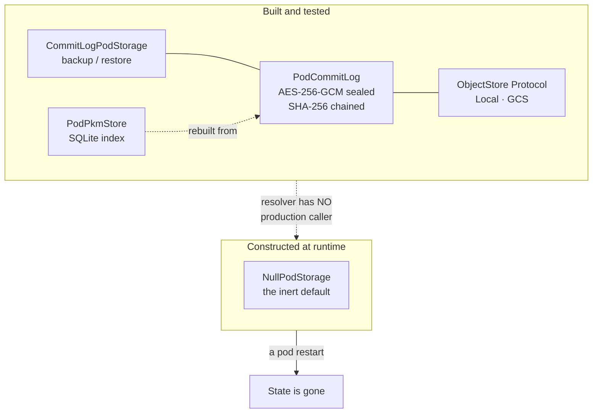

# Pod backup and recovery — what exists, what runs, and what a person would lose

**Dated 2026-08-07.** The operational half of
[the north star](../architecture/private-agent-north-star.md): if a person's private agent
is defined by memory that accumulates, then losing that memory is the product's worst
failure, and this is the record of how close we are to being able to prevent it.

**Stated once, up front, because everything below depends on it:** the durability stack is
designed, tested, and **never constructed**. `resolve_pod_storage()` is referenced from
its own definition and from tests — nowhere else in `consent-protocol/`. `PodCommitLog` is
constructed in exactly three places: that unreachable resolver, the multi-pod simulation
script, and the test suite. So no deployed pod on any target has ever written a durable
record, and no pod has ever needed to be recovered because no pod has ever had state to
lose.

That makes this a **design review with a working prototype**, not a runbook. Treating it as
a runbook is the specific error this page exists to prevent.

## Visual Map

## The five things that are true today

### 1. The whole stack is unreachable, not merely off

The usual shape of an unfinished feature is a flag defaulting to off. This is one step
further back: `POD_STORAGE_BACKEND` selects `commit_log` correctly and fails loud on a
missing bucket or key — and **nothing calls the function that reads it**. Turning the flag
on changes nothing, because the code that would honour it never runs.

Consequence: `NullPodStorage` is not the default that a deployment overrides. It is the
only implementation the system has ever instantiated outside a test.

### 2. `backup()` records a pointer; nothing writes what it points at

`CommitLogPodStorage.backup` appends one `storage_pointer` record naming a blob — its ref,
wrapping key id, algorithm, size, and timestamp. `EncryptedBlobRef` is constructed at
exactly one site in the codebase: inside `restore()`, reading a record back. **No code
anywhere produces the ciphertext the pointer names.**

So even fully wired, `backup()` would be a manifest of blobs that do not exist. The seam is
right — no plaintext crosses it, which is the property that makes it legible — but the
half that moves bytes has not been written.

### 3. The inert default is success-shaped

`NullPodStorage.backup` performs no I/O and returns a dictionary carrying a status string,
a backend id, and the HusshID. A caller that does not inspect the status field cannot
distinguish it from a completed backup. This is the same failure mode as a `200` on an
empty page, and it is worth fixing before anything calls `backup()` in earnest: the moment
a caller exists, "did the backup work?" must not be answerable only by string comparison.

### 4. Neither renderer emits any of the four variables the stack needs

`POD_STORAGE_BACKEND`, `POD_STORAGE_GCS_BUCKET`, `HUSSH_POD_LOG_KEY`,
`HUSSH_POD_MEMORY_KEY` and `HUSSH_POD_PRIVATE_KEY` appear in **no** deploy renderer, on
either target, and in no file under `deploy/` or `scripts/deploy/`. On every pod ever
deployed: the log key is absent, so the commit log cannot be constructed; memory is off;
storage resolves to Null; the pod identity key is ephemeral.

### 5. The user-owned GCP bootstrap designs the substrate and never connects it

`UserGcpBackend.render_bootstrap_plan` provisions seven resources in the person's own
project — a per-user KMS key, a CMEK-encrypted GCS bucket, a least-privilege pod service
account, the Cloud Run service, a Pub/Sub topic, a subscription, and a Cloud Scheduler job
that re-arms the Gmail watch before its 7-day expiry — and grants the pod
`roles/storage.objectAdmin` on that bucket.

It never sets `POD_STORAGE_GCS_BUCKET` to the bucket's name. The substrate and the pod are
both correct and are not introduced to each other.

## Answering the question directly: is GCS required?

**An object store is required.** On both production paths. The commit log is the system of
record and the SQLite index is a rebuildable projection over it, so without a durable
object store there is nothing to rebuild from and a restart is indistinguishable from a
new agent.

**GCS specifically is not required.** The `ObjectStore` Protocol is four async methods with
no GCS types, and already has two implementers with entirely different mechanics. But:

| Concern | On user-owned GCP (path A) | On Anypoint (path B) |
|---|---|---|
| Object store implementation | `GcsObjectStore` exists | none — see [the Anypoint evaluation](../architecture/anypoint-vs-user-gcp.md) |
| Credential path | keyless, GCE metadata server | no ambient Google identity to borrow |
| CAS primitive | `ifGenerationMatch`, numeric generation | unresolved; an ETag CAS may or may not map |
| Substrate provisioned | yes, by the bootstrap | no equivalent rendered |

So on path A, GCS is effectively the answer because it is the only implementation that
exists. On path B something must be built before backup or recovery can be discussed at
all.

## What recovery would and would not restore

Assume, for the sake of the design review, that the stack is wired. Then:

**Restored by a replay:** every record the pod ever appended, in order, chain-verified —
and from those, the SQLite index, rebuilt by `PodPkmStore.rebuild`.

**Not restored, because nothing writes them:** the blobs named by `storage_pointer`
records. Anything held only in process memory. The pod's identity key, which is generated
at startup and is ephemeral by configuration.

**Not restored, by design:** a pod that was reaped. The reap path tears down the **host and
only the host** — the registry row, the HusshID, the phone hash, the pod public key and the
A2A address all survive, deliberately, so the owner pays one cold start instead of weeks of
idle warm floor. But with no commit log, "re-provisioned" returns an *address*, not an
agent that remembers. The idle cutoff defaults to **168 hours**.

Two things about the reap worth stating plainly:

- It is not attached anywhere. `server.py` has no attach point for the reconcile worker, by
  a deliberate decision, and the sweep needs two independent flags.
- **The schema has no truthful source of pod idleness.** `personal_agent_registry` has no
  last-activity column, and `updated_at` has no `ON UPDATE` trigger and is never written —
  so it is effectively the row's creation time. Wiring an adapter that reads it would reap
  by row AGE, not inactivity. That gap must close before the sweep runs anywhere a wrong
  answer costs someone their warm pod.

**Account deletion does deprovision the agent.** `DELETE` on the account calls
`PersonalAgentProvisioningService.deprovision`, which revokes the standing read, tombstones
the HusshID and deletes the row — account teardown, a different act from a reap. That path
is wired; it was wired before this review and is not a gap.

## Four defects a real backup story has to close

### Replay cost grows without bound

`replay()` walks the chain backwards from the head pointer, one object fetch per record,
**strictly serial** — the next key is inside the record just decrypted, so nothing can be
prefetched or parallelised. On GCS each fetch is two HTTPS round trips (metadata for the
generation, then media), giving roughly `2(n+1)` round trips for `n` records.

There is no snapshot and no compaction anywhere in the module. A pod with a long history
pays that cost on every cold start, which collides directly with an economy tier that
scales to zero. **A snapshot record — a sealed materialised state at sequence `N`, with
replay starting there — is the single highest-value addition to the log.**

### A truncation to a valid prefix passes verification

Chain verification is genuinely strong against *alteration*: each record binds its
predecessor's hash, AES-GCM authenticates each record, and a missing record raises. The
sequence check asserts the replayed sequences are contiguous from 1.

A rollback satisfies all of that. `head.json` is **not sealed** — it is plain JSON holding
a sequence, a key and a hash. An actor who can write to the bucket and who kept an earlier
copy of `head.json` can restore it; the chain from that older head verifies perfectly and
the sequences are contiguous from 1. Nothing persists a high-water sequence to compare
against, so history is silently truncated.

The fix is small and should land with the snapshot work: **persist the highest sequence
ever observed outside the log's own head** and refuse a head that moves backwards.

### Erasure has no mechanism

Records are append-only and each is sealed with the log key. A deletion is a *forward*
record expressing an intent; the content it deletes remains in the earlier sealed records
forever. There is no compaction, no rewrite, and no per-record key.

So the only true erasure lever is destroying the log key, which erases **everything** — and
nothing manages that key's lifecycle today. For a consent-first product that owes people
removal on request, per-record or per-epoch key derivation is not an optimisation; it is
the mechanism by which "delete my information" becomes a true statement.

### One key, one blast radius

`HUSSH_POD_LOG_KEY` seals every record for the life of the pod. There is no rotation, no
epoch, and no re-seal path. Rotating it makes prior history unreadable; not rotating it
means one key compromise exposes the entire history.

## The order to do this in

Each step is a precondition for the next, so the sequence is not a preference.

1. **Construct the stack.** Give `resolve_pod_storage()` a production caller and render the
   four variables on both targets. Until this, nothing else on this list is observable.
2. **Write the blob half of `backup()`**, or narrow the contract to say the log *is* the
   backup and remove the pointer path. Both are defensible; shipping neither is not.
3. **Point the bootstrap's bucket at `POD_STORAGE_GCS_BUCKET`.** Path A's substrate already
   exists in the plan.
4. **Make the inert default distinguishable** from a real write at the type level, not by a
   status string.
5. **Snapshot and compaction**, with the high-water sequence landing in the same change —
   they touch the same code and the anti-rollback fix is nearly free alongside it.
6. **Key epochs**, which is what makes both rotation and erasure possible.
7. **A real last-activity column** before the reap sweep is enabled anywhere.

## The test that would keep this honest

The parity test's `REQUIRED_SLOTS` is two entries long — the hub URL and the consent public
keys. Adding the persistence variables to it turns every backend red until each one
answers, which is the cheapest way to make the gaps above unskippable rather than merely
written down here.

And the acceptance bar for step 1 is not a passing test. It is: **restart a pod and have it
remember.** Two processes, one write, one read, state proven to survive the gap — the same
probe that proved memory is erased today.

## Sources

- Verified reading of `pod_storage.py`, `pod_commit_log.py`, `pod_pkm_store.py`, `user_gcp_backend.py`, `personal_agent_reconcile_worker.py`, `runtime_settings.py` and `api/routes/account.py`, plus an exhaustive caller search for the storage resolver and commit log across `consent-protocol/`, 2026-08-07.
- Companion records: [the north star](../architecture/private-agent-north-star.md), [Anypoint vs user-owned GCP](../architecture/anypoint-vs-user-gcp.md), and [the plan of record](../architecture/private-agent-one-plan-of-record.md).
