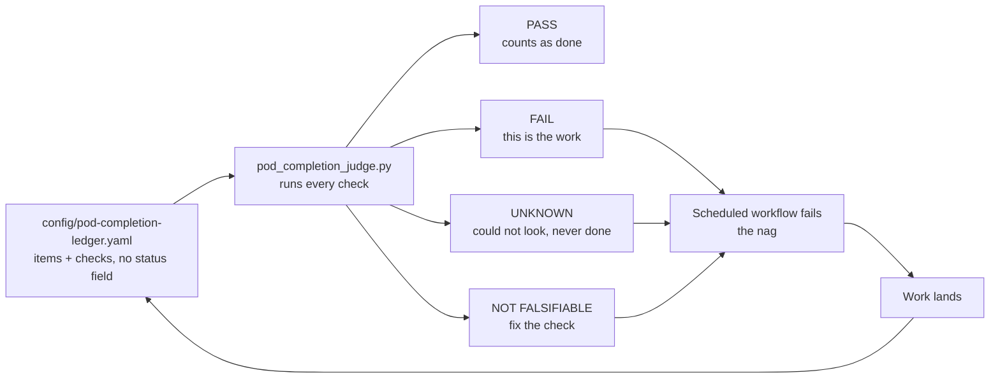

# The pod completion judge

## Visual Map



**Question it answers:** is the private pod deployment finished, and if not, what is left?

**Where the truth lives:** `config/pod-completion-ledger.yaml`. Every item is something that
must be TRUE before "the private pod deployment is complete" is an honest sentence, and every
item carries a **check**. There is deliberately **no status field**. Nobody can mark an item
done; they can only make its check pass. Status is derived, never declared, because a declared
status is exactly what drifts.

```bash
cd consent-protocol
uv run python scripts/ops/pod_completion_judge.py                      # today's answer
uv run python scripts/ops/pod_completion_judge.py --only firstrun      # one area
uv run python scripts/ops/pod_completion_judge.py --fail-on-unfinished # the nag, exits 1
```

## The three invariants, and the failure each one prevents

1. **Unevaluable reports UNKNOWN, never PASS.** A judge that answers green because it could not
   look is worse than no judge, because it is believed. Checks needing a cloud, a database, or a
   credential the runner lacks degrade to UNKNOWN and are reported separately. UNKNOWN never
   counts toward finished.
2. **A check that cannot fail is not evidence.** Each item declares `falsifiable`. A hollow check
   is reported as a defect in the ledger rather than as a pass. This caught a real one on the
   first run: a file-wide grep for the audit-chain call passed because the string existed
   elsewhere in the file, so the check now parses the function it claims to be about.
3. **Do not nag about the unfixable.** An item gated on something outside our control carries
   `blocked_by`. It is reported, never shouted, and never appears in the FAILING column. A judge
   that cries wolf teaches people to ignore it, which is worse than silence.

## The nag

`.github/workflows/pod-completion-judge.yml` runs the judge on a weekday cadence, on dispatch,
and on any change to the ledger or the judge itself. **It fails while anything is unfinished**,
on purpose: a green run that means "still not done" is indistinguishable from one that means
"done", which is the lie the whole mechanism exists to prevent. The verdict is written to the
run summary and kept as an artifact.

The workflow runs the judge's own tests **before** trusting its verdict, because a judge with a
broken guard can report anything.

**Activation:** GitHub fires `schedule:` only from the default branch. Until this file is on
`main` the cadence is off and the judge runs on dispatch and on ledger changes only.

## Adding an item

Add to `assertions:` with an `id`, a `requirement`, a one-sentence `statement` a founder can
read, a `check`, and `falsifiable`. Check kinds:

| kind | use it for | fails when |
|---|---|---|
| `pytest` | a named test that already runs in CI | the test fails |
| `command` | a shell check; declare `requires:` for tools | non-zero exit (a missing tool is UNKNOWN) |
| `grep` | a pattern that must be present or absent in a file | the pattern is on the wrong side (a missing file is UNKNOWN) |
| `manual` | something only a human or a live environment can settle | never passes from here; always UNKNOWN |

Prefer `pytest` and `command` over `grep`, and `grep` over `manual`. A `manual` item is a promise
to come back, not a result. `tests/test_pod_completion_judge.py` enforces that every shipped item
declares falsifiability, has a runnable check kind, and has a unique id.

## Related

- [dev-pod-first-light-runbook.md](./dev-pod-first-light-runbook.md): standing a pod up by hand.
- [dev-fast-lane.md](./dev-fast-lane.md): previewing a branch on dev.
- `docs/reference/architecture/private-agent-north-star.md`: the seven requirements the ledger
  scores against.
