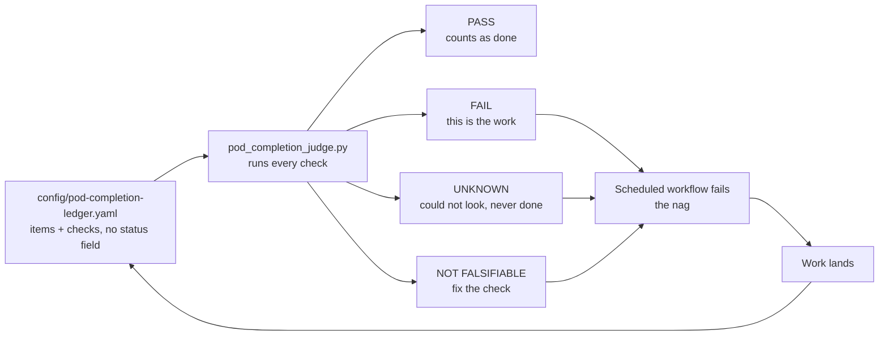

# The pod completion judge

## Visual Map



**Question it answers:** is the private pod deployment finished, and if not, what is left?

**Where the truth lives:** `config/pod-completion-ledger.yaml`. Every item is something that
must be TRUE before "the private pod deployment is complete" is an honest sentence, and every
item carries a **check**. There is deliberately **no status field**. Nobody can mark an item
done; they can only make its check pass. Status is derived, never declared, because a declared
status is exactly what drifts.

```bash
cd consent-protocol
uv run python scripts/ops/pod_completion_judge.py                      # today's answer
uv run python scripts/ops/pod_completion_judge.py --only firstrun      # one area
uv run python scripts/ops/pod_completion_judge.py --fail-on-unfinished # the nag, exits 1
```

## The three invariants, and the failure each one prevents

1. **Unevaluable reports UNKNOWN, never PASS.** A judge that answers green because it could not
   look is worse than no judge, because it is believed. Checks needing a cloud, a database, or a
   credential the runner lacks degrade to UNKNOWN and are reported separately. UNKNOWN never
   counts toward finished.
2. **A check that cannot fail is not evidence.** Each item declares `falsifiable`. A hollow check
   is reported as a defect in the ledger rather than as a pass. This caught a real one on the
   first run: a file-wide grep for the audit-chain call passed because the string existed
   elsewhere in the file, so the check now parses the function it claims to be about.
3. **Do not nag about the unfixable.** An item gated on something outside our control carries
   `blocked_by`. It is reported, never shouted, and never appears in the FAILING column. A judge
   that cries wolf teaches people to ignore it, which is worse than silence.

## Controls, and the void run

The judge grades two synthetic items before it grades anything real: one that must pass and one
that must fail. If either misbehaves the run is **void** and it publishes **no verdict at all**.

The canonical [judging contract](../../../.codex/skills/puppy-one-harness/references/judging-contract.md)
also governs this judge. Both use the same negative and positive control boundary.

- A void run publishes no result, *"not a number with a caveat, because a number with a caveat
  gets quoted without the caveat"*.
- **Negative control passed** means the judge is not reading, so nothing it says is worth having.
- **Positive control failed** means it over-flags, so its complaints are noise nobody can act on.

The controls run on every invocation rather than as a separate step, because a control someone
can skip is not a control.

## The nag

`.github/workflows/pod-completion-judge.yml` runs the judge on a weekday cadence, on dispatch,
and on any change to the ledger or the judge itself. **It fails while anything is unfinished**,
on purpose: a green run that means "still not done" is indistinguishable from one that means
"done", which is the lie the whole mechanism exists to prevent. The verdict is written to the
run summary and kept as an artifact.

The workflow runs the judge's own tests **before** trusting its verdict, because a judge with a
broken guard can report anything.

**Activation:** GitHub fires `schedule:` only from the default branch. Check the current default-branch workflow and remote run history to establish
activation; local file presence alone does not prove that a schedule is active.

## Adding an item

Add to `assertions:` with an `id`, a `requirement`, a one-sentence `statement` a founder can
read, a `check`, and `falsifiable`. Check kinds:

| kind | use it for | fails when |
|---|---|---|
| `pytest` | a named test that already runs in CI | the test fails, or the named test does not exist |
| `command` | a shell check; declare `requires:` for tools | non-zero exit (a missing tool is UNKNOWN) |
| `grep` | a pattern that must be present or absent in a file | the pattern is on the wrong side (a missing file is UNKNOWN) |
| `receipt` | a dated proof from a live run that no CI runner can do | the artifact is absent, stale, mismatched, or its source/observations no longer satisfy the ledger |
| `manual` | genuinely nothing else fits | never; it is UNKNOWN by construction, which is why it is last |

Choose the check that proves the statement. Unit tests prove modeled behavior;
source patterns prove only source presence. Neither establishes live recovery,
provider success, erasure, or scheduled execution. Those assertions require
measured receipts. Reach for `manual` only when nothing else fits.

**Why `manual` is close to banned.** `check_manual` returns UNKNOWN unconditionally, so an item
that stays `manual` makes the scheduled nag red on every run for all time, and a nag that is
always red is furniture. Worse, the six `manual` items this ledger shipped with carried a `note`
field, and two of those notes read `PROVEN 2026-08-28...` and `MEASURED 2026-08-28...`. That is
the declared status this whole mechanism exists to abolish, renamed to `note` and shipped inside
it. Both notes also pointed at scratchpad scripts that no clone contained.

**A receipt requires structured evidence.** Date and historical prose alone fail. The
existing `receipt` check accepts a tracked, sanitized JSON `artifact` and its
`artifact_sha256`. The artifact has `version: 1`, matching `assertion_id`,
`result: "pass"`, integer `exit_code: 0`, timezone-aware `completed_at`, a resolvable
40-character `source_commit`, `source_sha256` mapping and measured `observations`.
The timestamp, normalized to UTC, must agree with `verified_on`; freshness uses
the UTC calendar date and `expires_after_days`, independently of the host timezone.

The ledger declares `source_paths`, including the producer and relevant runtime
scope, and `observation_requirements` independently of the artifact. Every source
hash must match both the cited revision and the current working tree. Unrelated
commits do not invalidate evidence. Observation rules support strictly typed
`equals`, numeric `minimum` and numeric `maximum`; no new latency or cost budget
is inferred. First-run HTTP concurrency does not establish database occupancy.

An independently declared `expected_target` must exactly match artifact `target`.
It names `mode` (`local` or `deployed`) and `environment`; deployed mode also names
`project`, `region` and immutable `image_digest`. Include separate frontend/backend
origins and digests for cross-surface runs, and service/window for cost evidence.
Never derive the expected target from the receipt under validation. A local
synthetic run cannot establish a deployed lifecycle assertion.

Digests establish integrity and invalidation, **not signed attestation**. The
operator must still verify the producer and sanitize its output. Existing prose
is dated history; producers that do not yet serialize these observations remain
unfinished. Do not manufacture artifacts from historical claims. Missing tracked
artifacts fail consistently in CI. The manual repeat run uses the same ledger,
reruns affected producers, records the target independently and replaces the
artifact/digest only after validation. This audit adds no schedule.

`tests/test_pod_completion_judge.py` enforces that every shipped item declares falsifiability,
has a runnable check kind and a unique id, that every receipt's `reproduce` path exists, and that
no unblocked item is `manual` (which is the guard that keeps YES reachable).

### Upgrade evidence

`tests/test_pod_image_upgrade_path.py` exists and exercises the supported upgrade
contract. Passing local tests does not establish a successful deployed upgrade,
restore or recall drill; those require fresh target-bound operational evidence.

## Related

- [dev-pod-first-light-runbook.md](./dev-pod-first-light-runbook.md): standing a pod up by hand.
- [dev-fast-lane.md](./dev-fast-lane.md): previewing a branch on dev.
- `docs/reference/architecture/private-agent-north-star.md`: the seven requirements the ledger
  scores against.


## First-run producer boundary

`hushh-webapp/scripts/testing/first-run-reachability.mjs` composes the canonical
reviewer preflight and session harness in read-only, headless mode. It checks
owner-scoped bootstrap state, clicks the real cloud-setup tile, verifies the
chooser route and rechecks session ownership. One browser-journey deadline
covers authentication through chooser verification; preflight and browser
launch are outside that measured budget.

Its JSON contains booleans, counts, durations and finite failure stages. It does
not persist tokens, owner identifiers, raw response bodies, console text or URLs.
Requests are counted by identity until completion, including duplicate URLs.
Browser API concurrency is not database occupancy. First-run state is not proof
that the account was freshly created; creation and database-pool assertions
remain unearned until independently measured. No fixture is reset by this driver.

### Lifecycle producer evidence boundary

The lifecycle drill compares each returned synthetic record with the taught
record after whitespace and case normalization. Echoing a query keyword,
returning a wrong value, or adding contradictory text cannot prove recall.
Every record is checked before compute replacement. Both identity reads must
return the same nonempty key identifier and a literal true durability flag.
Missing or malformed identity never produces a whole-drill pass.

This conservative oracle measures verbatim answer recovery, not paraphrase
quality, provenance, receipted recall-tool execution, revocation or cost. The live
fleet's disposable-resource ownership and verified cleanup remain incomplete;
its current teardown attempt is not an erasure receipt. Do not use this producer
to delete an existing owner's compute.
