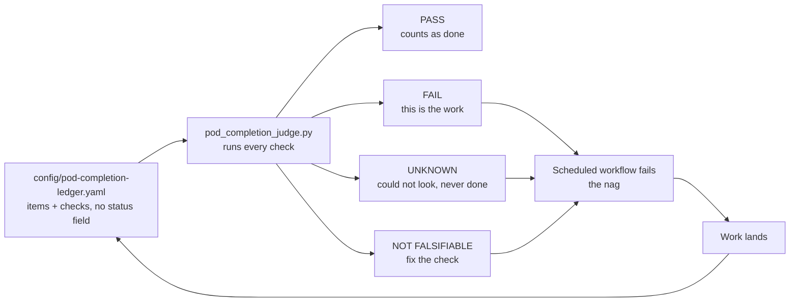

# The pod completion judge

## Visual Map



**Question it answers:** is the private pod deployment finished, and if not, what is left?

**Where the truth lives:** `config/pod-completion-ledger.yaml`. Every item is something that
must be TRUE before "the private pod deployment is complete" is an honest sentence, and every
item carries a **check**. There is deliberately **no status field**. Nobody can mark an item
done; they can only make its check pass. Status is derived, never declared, because a declared
status is exactly what drifts.

```bash
cd consent-protocol
uv run python scripts/ops/pod_completion_judge.py                      # today's answer
uv run python scripts/ops/pod_completion_judge.py --only firstrun      # one area
uv run python scripts/ops/pod_completion_judge.py --fail-on-unfinished # the nag, exits 1
```

## The three invariants, and the failure each one prevents

1. **Unevaluable reports UNKNOWN, never PASS.** A judge that answers green because it could not
   look is worse than no judge, because it is believed. Checks needing a cloud, a database, or a
   credential the runner lacks degrade to UNKNOWN and are reported separately. UNKNOWN never
   counts toward finished.
2. **A check that cannot fail is not evidence.** Each item declares `falsifiable`. A hollow check
   is reported as a defect in the ledger rather than as a pass. This caught a real one on the
   first run: a file-wide grep for the audit-chain call passed because the string existed
   elsewhere in the file, so the check now parses the function it claims to be about.
3. **Do not nag about the unfixable.** An item gated on something outside our control carries
   `blocked_by`. It is reported, never shouted, and never appears in the FAILING column. A judge
   that cries wolf teaches people to ignore it, which is worse than silence.

## Controls, and the void run

The judge grades two synthetic items before it grades anything real: one that must pass and one
that must fail. If either misbehaves the run is **void** and it publishes **no verdict at all**.

This is the house judging doctrine, taken from the puppy-one harness's judging contract
(`.codex/skills/puppy-one-harness/references/judging-contract.md`, currently on the
`feat/puppy-one-on-device` branch and **not yet on this one**) so the two judges in this repo
hold the same line. That the contract is reachable only from another branch is itself worth
noting: the on-device work and the pod work are diverging, and shared doctrine is the first
thing that gets duplicated when that happens. Its wording is the reason:

- A void run publishes no result, *"not a number with a caveat, because a number with a caveat
  gets quoted without the caveat"*.
- **Negative control passed** means the judge is not reading, so nothing it says is worth having.
- **Positive control failed** means it over-flags, so its complaints are noise nobody can act on.

The controls run on every invocation rather than as a separate step, because a control someone
can skip is not a control.

## The nag

`.github/workflows/pod-completion-judge.yml` runs the judge on a weekday cadence, on dispatch,
and on any change to the ledger or the judge itself. **It fails while anything is unfinished**,
on purpose: a green run that means "still not done" is indistinguishable from one that means
"done", which is the lie the whole mechanism exists to prevent. The verdict is written to the
run summary and kept as an artifact.

The workflow runs the judge's own tests **before** trusting its verdict, because a judge with a
broken guard can report anything.

**Activation:** GitHub fires `schedule:` only from the default branch. Until this file is on
`main` the cadence is off and the judge runs on dispatch and on ledger changes only.

## Adding an item

Add to `assertions:` with an `id`, a `requirement`, a one-sentence `statement` a founder can
read, a `check`, and `falsifiable`. Check kinds:

| kind | use it for | fails when |
|---|---|---|
| `pytest` | a named test that already runs in CI | the test fails, or the named test does not exist |
| `command` | a shell check; declare `requires:` for tools | non-zero exit (a missing tool is UNKNOWN) |
| `grep` | a pattern that must be present or absent in a file | the pattern is on the wrong side (a missing file is UNKNOWN) |
| `receipt` | a dated proof from a live run that no CI runner can do | the receipt expires, or its `reproduce` path is not in the tree |
| `manual` | genuinely nothing else fits | never; it is UNKNOWN by construction, which is why it is last |

Prefer `pytest` and `command` over `grep`, and `grep` over `receipt`. Reach for `manual` only when
nothing else fits, and never leave one in the ledger unblocked.

**Why `manual` is close to banned.** `check_manual` returns UNKNOWN unconditionally, so an item
that stays `manual` makes the scheduled nag red on every run for all time, and a nag that is
always red is furniture. Worse, the six `manual` items this ledger shipped with carried a `note`
field, and two of those notes read `PROVEN 2026-08-28...` and `MEASURED 2026-08-28...`. That is
the declared status this whole mechanism exists to abolish, renamed to `note` and shipped inside
it. Both notes also pointed at scratchpad scripts that no clone contained.

**A receipt is the honest version of that.** It carries `verified_on`, `expires_after_days`, a
`reproduce` path that must exist in the tree, and the `evidence` in prose. It passes only while
it is fresh, and when it goes stale it **fails** rather than decaying to UNKNOWN, because "run it
again" is actionable in a way that "we could not look" is not. A receipt with no `verified_on`
yet fails too, and reports its `pending` line as the reason.

`tests/test_pod_completion_judge.py` enforces that every shipped item declares falsifiability,
has a runnable check kind and a unique id, that every receipt's `reproduce` path exists, and that
no unblocked item is `manual` (which is the guard that keeps YES reachable).

### Naming a test that does not exist yet

`pod-image-has-a-supported-upgrade-path` points at `tests/test_pod_image_upgrade_path.py`, which
has not been written. That is deliberate: a missing pytest target **fails**, and "fails" is the
accurate word for "nobody has built this". `manual` would have said UNKNOWN forever about work
that is entirely within our control.

## Related

- [dev-pod-first-light-runbook.md](./dev-pod-first-light-runbook.md): standing a pod up by hand.
- [dev-fast-lane.md](./dev-fast-lane.md): previewing a branch on dev.
- `docs/reference/architecture/private-agent-north-star.md`: the seven requirements the ledger
  scores against.
