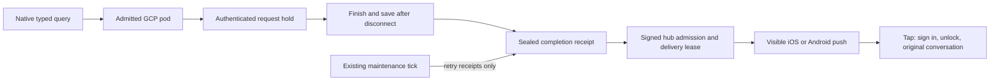

# Private agent reply notifications

## Visual Map

The hold is qualified only for the renderer's eight-request GCP deployment.
Attached terminals, stop, errors and drain suppress the completion notice.

The native app asks the existing typed AG-UI route to notify after a detached
turn. On a qualified owner-cloud pod, the admitted producer keeps consuming the
installed bridge after the mobile HTTP stream closes. It saves the answer and
settles memory hooks before publishing an opaque completion receipt. A client
that receives a terminal event, a stopped turn, an error, or server draining does
not produce a detached reply notification.

The hub verifies the current serving pod's signed request and sends a visible
FCM notification to registered iOS and Android devices. Copy is fixed: the push
contains no answer, prompt, title, vault key, or account identifier. Its opaque
conversation link survives sign-in; the normal vault unlock and owner-scoped
history route remain authoritative. One does not add calendar reminders.

## Hosting qualification and limits

Only the GCP renderer advertising `HUSSH_POD_REQUEST_CONCURRENCY=8` enables the
retained producer. It opens an owner-authenticated self-request before inference
and requires the receiving process to recognize the live random hold. The hold
does not receive a chat key and never starts or resumes inference. It requires
the exact initiating subject, trust version, signing pod key and incarnation.
The admitted HTTPS origin cannot redirect. Three chat/hold pairs leave control
capacity in the eight-request deployment.

The hold keeps an inbound request active under Cloud Run request-based CPU
allocation. The model deadline remains 200 seconds and the key's original
300-second maximum and initiating session expiry bound retained work. A failed
hold, expired authority, revoked session or process loss cancels the producer;
there is no inference recovery after restart. Older GCP revisions, fractional-CPU
concurrency-one deployments, Azure and local pods retain their existing attached
behavior. Do not manually advertise eight slots on an unqualified deployment.
This change does not increase provisioned CPU or switch billing mode.

See [Cloud Run billing and CPU allocation](https://docs.cloud.google.com/run/docs/configuring/billing-settings)
and [FCM message types](https://firebase.google.com/docs/cloud-messaging/customize-messages/set-message-type).
Runtime qualification still requires the cloud acceptance checks below.

## Delivery and retry

The pod records encrypted completion metadata in its existing commit log and a
bounded sealed projection. Recovery replays verified receipts. Crypto-erasure
fences both. A signed courier sends immediately; the existing authenticated pod
maintenance tick retries pending receipts. That scheduled job processes completed
signals only: it never has the person's request key and never runs a model.

The hub ledger admits one lease per owner/event, retains accepted device hashes,
and rechecks serving identity, erasure admission, lease and current token ownership
after provider credential refresh, before dispatch. A pending receipt has a six-hour lifetime and at most eight
hub attempts. The courier backs off pending receipts so later replies are not
starved. Expired hub receipts are pruned opportunistically after one day. Sealed
log receipts follow existing owner log erasure; the projection holds at most 512
live receipts. No visible-read acknowledgement is added to the app in this change.

FCM HTTP v1 has no automatic send retries here. A 45-second batch admission
budget bounds dispatch decisions; socket timeouts are inactivity bounds, not a
strict wall-clock guarantee. Accepted device hashes prevent known repeat sends.
An unknown network outcome can still result in redelivery; stable Android tags
and APNs collapse identifiers reduce duplicate presentation but do not provide
exactly-once delivery. OS permission, provider configuration and OS scheduling
govern actual delivery. Force-stop and notification-denied behavior require
device verification; a successful provider acceptance is not proof of display.

## Development rollout and rollback

This is a development POD-branch feature, not a production rollout. Apply the
dev manifest's additive migrations `959_pod_reply_deliveries` and
`960_user_push_devices` before enabling delivery. Keep the existing signed pod
identity and `PERSONAL_AGENT_ENABLED` controls. Deploy the matching hub, pod and
native client together to a test owner; verify the rendered concurrency and
serving-key binding before enabling detached turns. No production migration,
secret, deployment or billing setting is changed by this PR.

The compatibility token registry remains in place. The additive device registry
is dual-written and cleaned whenever installed, including with the feature flag
off, so disabling and re-enabling cannot restore a previous token owner. A new
account without an actor profile still registers in the compatibility registry.
New clients unregister the exact local token; older clients keep their existing
owner/platform cleanup semantics. An unabortable native token deletion that
finishes after another login renews the current device using that owner's fresh
identity token. Earlier registration acknowledgements cannot replace the latest
device token cached for sign-out.

Rollback first disables retained-turn qualification, waits for admitted turns
and holds to settle, and disables hub reply delivery. Preserve pending receipts
if continuity is needed, then deploy the previous binaries. The two explicit
down migrations remove only their additive tables. Do not drop the legacy token
registry or erase the pod log to roll this feature back. Re-enabling uses the
same stable event identifiers and existing receipt state.

## Acceptance before release

Local tests cover the installed SDK and real ASGI disconnect, authority/hold
refusal and loss, encrypted replay and erasure, isolated PostgreSQL claims and
migration rollback, visible native payloads, token transfer, delayed logout,
native permission actions and authentication-preserved conversation links.

Release qualification additionally requires a real test-owner GCP deployment
with request-based CPU billing and iOS/Android devices with real APNs/FCM setup:

1. Leave during a slow typed answer. Confirm the answer saves, one visible push
   arrives with the app backgrounded, and tapping opens the original history
   through sign-in/unlock when needed.
2. Stay through the terminal event, press Stop, revoke the initiating session,
   or interrupt the hold. Confirm no successful-completion push for those turns.
3. Exercise offline delivery, courier/provider failure, partial device delivery,
   expired receipts, restart recovery, standby promotion and account erasure.
4. Exercise two same-platform devices, token refresh, rapid account switches,
   delayed logout and exact-device sign-out. Other devices retain registration.
5. Deny permission, use the explicit Settings action, return after granting,
   and test background, terminated and OS force-stop states separately.

Windows verification cannot replace an Xcode archive or physical device/cloud
acceptance. Record device versions, deployed revision and provider evidence in
the PR before promoting this feature.
