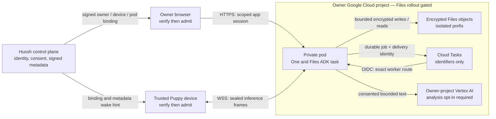

# Private Files library

**Source status — 2026-09-25:** implementation on the infrastructure branch, behind
owner setup and Files gates. This is not evidence of a deployed library. Read the
[readiness audit](../quality/adk-orchestration-docs-audit.md#files-continuation-evidence--2026-09-25)
and [private-agent north star](../architecture/private-agent-north-star.md) together.

## Visual Map

Files uses encrypted objects in an isolated `files/v1` prefix beneath the owner's
existing pod bucket prefix. It does not mount GCS as a filesystem. Recovery logs
and PKM keep their existing prefixes and authority. The storage adapter verifies
bucket ownership, default KMS encryption, uniform access and public-access prevention;
its observed retention settings are shown in Files.

Each file has an opaque stable identifier, an encrypted manifest, immutable encrypted
4 MiB chunks, and a rolling content digest. Names, folders, revisions, undo and
analysis preferences are encrypted. Folder indexes contain opaque identifiers and
are rebuildable hints; readers validate the authoritative manifest. Directory and
repair requests process at most 100 entries, with no whole-library startup replay.

The browser sends content directly through its admitted owner-pod session. The hub
publishes public verification keys and signed endpoint/binding metadata. Both the
browser and Puppy verify signatures before contacting the pod or signing a challenge.
An endpoint becomes pinned only after admission. An existing valid admission may
reconnect during a hub outage; new or expired grants require the control plane.

## Upload, download and retention

Uploads resume against the same immutable file identity after the browser verifies
that the selected original file matches the accepted prefix. Completed uploads are
idempotent. Downloads stream into a user-selected local file in supporting browsers;
a network interruption can resume while the page and its in-memory handle remain
open. The saved prefix is hashed before resuming, and the complete digest is verified.
Other browsers use a bounded in-memory download limited to 32 MiB.

Move and rename retain identity. Undo retains the last 20 reversible metadata changes.
Trash is reversible and **does not physically delete objects or reduce billing**.
This version has no per-file permanent-delete control. Bucket retention, soft deletion,
versioning and account teardown determine when retained bytes can actually disappear.
Account erasure must prove queue quiescence, worker identity, writer shutdown, resource
removal and recovery barriers through the existing erasure ledger; uncertain provider
results remain unresolved. Never apply a bucket-wide cleanup rule to remove Files.

## Files Agent and background organization

`agent_files` is authored in the canonical product manifest and invoked by One in
ADK task mode. System instructions own naming and folder decisions. Tools enforce
current consent, ancestor exclusions, revisions, containment and idempotency. File
contents are untrusted input; they cannot authorize tools or alter the grant.

The current content reader accepts UTF-8 text up to 256 KiB. Other formats can be
stored and downloaded, but are reported unsupported for content analysis. Uploaded
code is never executed and archives are never expanded. The specialist has no delete,
external-share or permission-changing tool.

Analysis requires opt-in. Pausing or excluding a folder applies to its descendants.
Automatic organization applies only to uploads created under the current opt-in;
existing files require an explicit request. Interactive analysis uses the selected
model provider. Background jobs disclose and use Vertex AI in the owner's project.
Model failure preserves the original upload and records a failed or pending outcome.

An encrypted outbox precedes a named Cloud Task. Only job and delivery identifiers
enter the queue. The exact worker route verifies OIDC identity and audience, then
rechecks consent and file revision. Duplicate delivery is safe, retries and model
calls are bounded, cancellation persists, and an expired uncertain execution requires
review. History is paginated. A lost queue-delivery response leaves a recoverable
pending-delivery record with an explicit retry; no autonomous outbox sweep is claimed.

## Provisioning and on-demand operation

New owner-selected Files setup requires the dev Files erasure contract (migration
938, composed with 937), the rollout gate, signed setup selection and a current
project/bootstrap-bound setup job. The fleet flag alone cannot enable an owner's
library. Queue and worker resources join the existing recovery and teardown inventory.

The opt-in economy configuration uses 1 vCPU, 1 GiB, minimum zero, maximum one,
one worker and request concurrency eight. Existing owners retain their chosen shape.
Concurrency eight remains a configured bound pending live memory/load acceptance.
Puppy's direct socket closes after ten minutes without active work; heartbeats do not
extend this grace. The trusted device then polls the existing hub metadata control
lane every 15 seconds. An owner-requested, two-minute, incarnation-bound wake hint
can reconnect an already approved device. It grants no new permission and cannot
wake a sleeping operating system.

[Cloud Run WebSockets](https://docs.cloud.google.com/run/docs/triggering/websockets)
keep an instance active, so active time includes sockets, background jobs and grace
periods. Scale-to-zero must be observed live rather than inferred from minimum zero.

## Usage and illustrative economics

Files reports uploaded bytes in paginated metadata scans, including Trash. Retained
versions, orphan chunks and other pod prefixes are additional. The UI lets the owner
adjust active-hour assumptions and a warning threshold for that view; it is not a
cloud billing alert or a quota. Crossing it never stops service.

| Partial monthly subtotal | 25 GiB | 50 GiB |
|---|---:|---:|
| Regional Standard storage | $0.50 | $1.00 |
| Storage + 10 active hours + one software KMS key version | $1.51 | $2.01 |
| Storage + 60 active hours + one software KMS key version | $6.28 | $6.78 |

Illustration: $0.02/GiB-month; request-based compute at 1 vCPU/1 GiB costs
`3600 × (0.000024 + 0.0000025) = $0.0954` per active hour; one software KMS key
version is $0.06/month. Regional rates and free allowances vary. These subtotals
exclude model inference, Memory Bank, network egress, operations, retained versions,
Cloud Tasks, builds/images, logging and the shared hub. 25–50 GiB is an example,
not a configured cap. See [Storage pricing](https://cloud.google.com/storage/pricing),
[Cloud Run pricing](https://cloud.google.com/run/pricing) and
[KMS pricing](https://cloud.google.com/kms/pricing).

## Implementation owners

- Backend: `consent-protocol/hushh_mcp/services/pod_files/` and exact pod Files routes.
- Agent: `consent-protocol/hushh_mcp/agents/files/agent.yaml` and bounded ADK tools.
- Browser: `hushh-webapp/lib/files/`, `components/files/`, and `/one/files`.
- Device: companion Hermes direct-pod client; release its compatible changes together.
- Verification: encrypted storage, transfer, setup/erasure, consent, relay and command
  suites; canonical CI; then governed dev deployment and owner-approved pod update.

Drive remains its connector. Files is neither a unified Drive filesystem nor a PKM
replacement. Google Cloud is the current deployment provider; the separate CRM
connector remains supported after Anypoint pod deployment removal.
