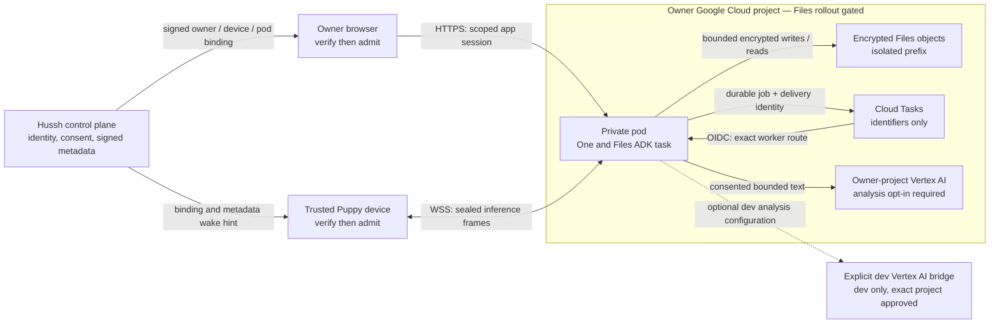

# Private Files library

**Dev status — 2026-10-02:** the personal owner completed exact Files setup and
encrypted transfer. The qualified correction is published; live organization on
that image also passed opt-in, exclusions, authenticated queue completion and
cancellation with originals preserved. Production and broad rollout remain gated. Read the
[readiness audit](../quality/adk-orchestration-docs-audit.md#journey-matrix)
and [private-agent north star](../architecture/private-agent-north-star.md) together.

## Visual Map

Files uses encrypted objects in an isolated `files/v1` prefix beneath the owner's
existing pod bucket prefix. It does not mount GCS as a filesystem. Recovery logs
and PKM keep their existing prefixes and authority. The storage adapter verifies
bucket ownership, default KMS encryption, uniform access and public-access prevention;
its observed retention settings are shown in Files.

Each file has an opaque stable identifier, an encrypted manifest, immutable encrypted
4 MiB chunks, and a rolling content digest. Names, folders, revisions, undo and
analysis preferences are encrypted. Folder indexes contain opaque identifiers and
are rebuildable hints; readers validate the authoritative manifest. Directory and
repair requests process at most 100 entries, with no whole-library startup replay.

The browser sends content directly through its admitted owner-pod session. The hub
publishes public verification keys and signed endpoint/binding metadata. Both the
browser and Puppy verify signatures before contacting the pod or signing a challenge.
An endpoint becomes pinned only after admission. An existing valid admission may
reconnect during a hub outage; new or expired grants require the control plane.

```mermaid
flowchart LR
  H["Hussh control plane<br/>identity, consent, signed metadata"]
  B["Owner browser<br/>verify then admit"]
  D["Trusted Puppy device<br/>verify then admit"]
  subgraph OWNER["Owner Google Cloud project — Files rollout gated"]
    P["Private pod<br/>One and Files ADK task"]
    G["Encrypted Files objects<br/>isolated prefix"]
    Q["Cloud Tasks<br/>identifiers only"]
    V["Owner-project Vertex AI<br/>analysis opt-in required"]
    P -->|"bounded encrypted writes / reads"| G
    P -->|"durable job + delivery identity"| Q
    Q -->|"OIDC: exact worker route"| P
    P -->|"consented bounded text"| V
  end
  DEV["Explicit dev Vertex AI bridge<br/>dev only, exact project approved"]
  P -.->|"optional dev analysis configuration"| DEV
  H -->|"signed owner / device / pod binding"| B
  H -->|"binding and metadata wake hint"| D
  B -->|"HTTPS: scoped app session"| P
  D <-->|"WSS: sealed inference frames"| P
```

## Upload, download and retention

Uploads resume against the same immutable file identity after the browser verifies
that the selected original file matches the accepted prefix. Completed uploads are
idempotent. Downloads stream into a user-selected local file in supporting browsers;
a network interruption can resume while the page and its in-memory handle remain
open. The saved prefix is hashed before resuming, and the complete digest is verified.
Other browsers use a bounded in-memory download limited to 32 MiB.

Move and rename retain identity. Undo retains the last 20 reversible metadata changes.
Trash is reversible and **does not physically delete objects or reduce billing**.
This version has no per-file permanent-delete control. Bucket retention, soft deletion,
versioning and account teardown determine when retained bytes can actually disappear.
Account erasure must prove queue quiescence, worker identity, writer shutdown, resource
removal and recovery barriers through the existing erasure ledger; uncertain provider
results remain unresolved. Never apply a bucket-wide cleanup rule to remove Files.

## Files Agent and background organization

Files is a development-only agent in One's `/one` roster and shared navigation catalog;
its dedicated `/one/files` explorer owns the library and analysis preferences.
Hosting contains hosting controls, not a Files launcher or embedded explorer.
Discovery does not establish installed capability or consent; the workspace
checks the owner's admitted pod and Files setup before enabling library tools.

`agent_files` is authored in the canonical product manifest and invoked by One in
ADK task mode. System instructions own naming and folder decisions. Tools enforce
current consent, ancestor exclusions, revisions, containment and idempotency. File
contents are untrusted input; they cannot authorize tools or alter the grant.

The current content reader accepts UTF-8 text up to 256 KiB. Other formats can be
stored and downloaded, but are reported unsupported for content analysis. Uploaded
code is never executed and archives are never expanded. The specialist has no delete,
external-share or permission-changing tool.

Analysis requires opt-in. Pausing or excluding a folder applies to its descendants.
Automatic organization applies only to uploads created under the current opt-in;
existing files require an explicit request. Interactive analysis uses the selected
model provider. Background jobs disclose and use Vertex AI in the owner's project.
Dev may use the explicitly configured Vertex AI bridge when its exact project is
included in the owner-approved Files activation. Production cannot use this exception.
Model failure preserves the original upload and records a failed or pending outcome.

An encrypted outbox precedes a named Cloud Task. Only job and delivery identifiers
enter the queue. The exact worker route verifies OIDC identity and audience, then
rechecks consent and file revision. Duplicate delivery is safe, retries and model
calls are bounded, cancellation persists, and an expired uncertain execution requires
review. History is paginated. A lost queue-delivery response leaves a recoverable
pending-delivery record with an explicit retry; no autonomous outbox sweep is claimed.

## Provisioning and on-demand operation

New owner-selected Files setup requires the dev Files erasure contract (migration
941, composed with 940), the rollout gate, signed setup selection and a current
project/bootstrap-bound setup job. The fleet flag alone cannot enable an owner's
library. Queue and worker resources join the existing recovery and teardown inventory.

Existing owners review and approve Files setup in the `/one/files` activation
panel. Hosting remains limited to hosting controls; Software updates shows the
installed version and durable update operation. Files setup is a distinct
approval bound to the owner, pod incarnation, observed configuration, immutable image
and resource plan; approving an image alone cannot activate Files. The existing update
operation records each cloud step before and after execution, preserves compute and
custody settings, and verifies installed configuration before reporting completion.
Its dev recovery contract additionally requires migration 943. No queue payload,
file content or provider credential belongs in these update receipts.

A lost replacement response can be recovered by observing the exact attempt marker,
pod identity, image and Files configuration after all resource checkpoints completed.
An incomplete or uncertain cloud step stays reserved for reconciliation. The worker
does not replay whole-pod bootstrap or clear its reservation on a timeout. Partial
resource reconciliation and retry acceptance still require broader evidence. The
personal dev rehearsal completed one denied queue-create continuation under its
original operation; that receipt does not qualify other uncertain provider outcomes.

The new economy qualification configuration uses 1 vCPU, 2 GiB, minimum zero, maximum one,
one worker and request concurrency eight. Existing owners retain their chosen shape.
Concurrency eight remains a configured bound pending live memory/load acceptance.
Puppy's direct socket closes after ten minutes without active work; heartbeats do not
extend this grace. The trusted device then polls the existing hub metadata control
lane every 15 seconds. An owner-requested, two-minute, incarnation-bound wake hint
can reconnect an already approved device. It grants no new permission and cannot
wake a sleeping operating system.

[Cloud Run WebSockets](https://docs.cloud.google.com/run/docs/triggering/websockets)
keep an instance active, so active time includes sockets, background jobs and grace
periods. Scale-to-zero must be observed live rather than inferred from minimum zero.

## Usage and illustrative economics

Files reports uploaded bytes in paginated metadata scans, including Trash. Retained
versions, orphan chunks and other pod prefixes are additional. The UI lets the owner
adjust active-hour assumptions and a warning threshold for that view; it is not a
cloud billing alert or a quota. Crossing it never stops service.

| Partial monthly subtotal | 25 GiB | 50 GiB |
|---|---:|---:|
| Regional Standard storage | $0.50 | $1.00 |
| Storage + 10 active hours + one software KMS key version | $1.60 | $2.10 |
| Storage + 60 active hours + one software KMS key version | $6.82 | $7.32 |

Illustration: $0.02/GiB-month; request-based compute at 1 vCPU/2 GiB costs
`3600 × (0.000024 + 2 × 0.0000025) = $0.1044` per active hour; one software KMS key
version is $0.06/month. Regional rates and free allowances vary. These subtotals
exclude model inference, Memory Bank, network egress, operations, retained versions,
Cloud Tasks, builds/images, logging and the shared hub. 25–50 GiB is an example,
not a configured cap. See [Storage pricing](https://cloud.google.com/storage/pricing),
[Cloud Run pricing](https://cloud.google.com/run/pricing) and
[KMS pricing](https://cloud.google.com/kms/pricing).

### Separate pod hours from model calls — October 7, 2026

The infrastructure subtotal is not the complete cost of an AI agent. Report compute,
stored bytes and persistent services separately from model calls and billed input,
cached input, output/reasoning, retries and provider-memory usage. Do not infer request
capacity or a monthly bundle from CPU or model-deployment quota.

For an equal-resource illustration, 1 vCPU / 2 GiB costs approximately $0.1044 per
Google request-based active hour or $0.108 per Azure Consumption running-replica hour
(Iowa / East US, before allowances). At 50 GiB, modeled storage, keys/secrets and image
custody produce these partial monthly subtotals:

| Billable hours / month | Google | Azure |
| --- | ---: | ---: |
| 10 | $2.52 | $7.30 |
| 30 | $4.61 | $9.46 |
| 60 | $7.74 | $12.70 |

Google assumes a 2 GiB image, one key/secret version, 10k operations in each modeled
category and one schedule. Azure assumes Basic image registry (about $5 per 30 days),
10k RSA-3072 operations and 10k ordinary vault operations. These comparisons exclude
AI, downloads, request charges, provider memory, queues, logs, builds and extra versions.
They do not resize existing owners or qualify Azure background organization.

Unused compute grants can lower these subtotals: Google's pool is shared by billing
account, Azure's by subscription. Both cover 180k vCPU-seconds and 360k GiB-seconds;
startup boost and other apps consume that pool too. Google's modeled 25 GiB floor
is about $0.98 when compute is covered, before additional services and model usage.
Never advertise that conditional figure as an all-inclusive agent price.

Gmail push has no CPU minimum. Cloud Run below 1 vCPU requires concurrency one,
request-based billing and the first-generation execution environment. That shape
cannot serve an open Puppy socket plus concurrent browser requests on the same single
instance. Azure Consumption pairs 1 vCPU with 2 GiB; qualify that option with measured
cold startup and overlapping work before offering a change.

**October 7 sizing evidence:** local encrypted upload/download probes at 1, 2, 4 and
8 concurrent 64 MiB files, using 4 MiB chunks, preserved exact bytes and peaked at
601.8 MiB RSS. These are unconstrained local-adapter measurements, not cloud storage
or combined chat/Puppy load. The selected Azure 0.5 vCPU / 1 GiB pod reached 369.6 MiB
in low-load observations; no resource change was made. A smaller 1 vCPU / 1 GiB Google
option requires its own constrained overlap evidence. The approved cross-cloud
qualification target is 1 vCPU / 2 GiB, minimum zero, maximum one and one worker;
this does not resize existing owners. Moving to 2 GiB adds about $0.27
at 30 billable hours before allowances; it buys headroom, not proven capacity.
The pod coordinates provider inference or the trusted device's local model; these
figures do not include running model weights in pod RAM. A 50 GiB object library
also does not require 50 GiB of RAM: transfers and indexes stay bounded. Computer
Use needs its own measured browser envelope and remains disabled; do not infer
that Chromium fits this Files economy configuration.

Idle admission and status must not repeatedly wake an owner pod. The current hub status
reader and Hermes activation wait use control-plane metadata; relay heartbeats do not
extend idle grace. Count open sockets and jobs separately from brief notification wakes.
Azure's minimum-zero replicas remain billed until actually scaled down; Google's
request-based idle non-minimum instances are not charged. Compare measured billable
windows, not equal screen time. Verify coalesced delivery, bounded retries, recovery,
idle closure and scale-to-zero on each selected configuration before claiming savings.

Pricing references: [Cloud Run CPU contract](https://docs.cloud.google.com/run/docs/configuring/services/cpu),
[Azure supported resource pairs](https://learn.microsoft.com/en-us/azure/container-apps/containers),
[Azure billing](https://learn.microsoft.com/en-us/azure/container-apps/billing),
[Azure retail rates](https://prices.azure.com/api/retail/prices), and
[Gmail push](https://developers.google.com/workspace/gmail/api/guides/push).

### Whole-package planning budget

October 7, 2026 estimates, 30 days, USD list rates, no free allowances. Model calls
assume 20,000 uncached input and 1,000 billed output/reasoning tokens; call counts
are illustrative, not completed tasks or a quota. Current Gemini 3.8 Flash
introductory credits and Azure GPT-6 Luna Global Standard prices are used;
equivalent task quality and owner-pod model access remain unqualified.

| Monthly use | GCP request-based + Flash | Azure Consumption + Luna |
| --- | ---: | ---: |
| 10 billable hours, 25 GiB, 300 model calls | $13.60 | $13.05 |
| 30 billable hours, 50 GiB, 1,500 model calls | $38.69 | $18.74 |
| 60 billable hours, 50 GiB, 3,000 model calls | $69.96 | $25.73 |

Each package adds 5 GiB internet egress, ten HTTP requests per model call,
10,000 object reads and writes each, and a **$5 planning reserve**, alongside
the compute, storage, image and key custody above. Google also includes 1 GiB
provider-memory storage and two reads/one write per call. The reserve covers
unmeasured memory-model usage, queues, logs, builds and retained versions; it is
not a measured tariff, guarantee or shutdown cap. Hussh fees, taxes, premium
voice/search, Computer Use and local hardware/electricity remain outside the
estimate. Reconcile actual billing before quoting a customer price.

At the middle scenario, stopped/deallocated VM packages are approximately
$42.84 Google / $23.92 Azure; continuously running VMs are $70.74 / $52.45.
They retain the same object storage, image custody, keys and AI assumptions,
plus a 32 GiB boot disk, retained IPv4 and, when stopped, an authenticated wake
broker estimate. The broker assumes one 30-second 1 CPU/0.5 GiB request per model
call, costing $1.13685 for 1,500 calls. This is a conservative workload proxy,
not an implemented or qualified VM path. Self-managed TLS is assumed, without
a dedicated load balancer or high availability; VM administration is additional.
N1 custom and A1 v2 have different CPU and disk characteristics; equal nominal
resources do not establish performance parity.

Google instance billing is $0.0792/hour at 1 CPU/2 GiB, but charges the entire
instance lifetime. Its lifetime must remain below about 1.318 times the
request-billed duration to beat the $0.1044 request rate before request fees.
Keep model usage fixed when comparing hosting curves. Measure wake, useful
work, socket grace and platform tail independently; never replace those
measurements with foreground screen time.

Sources: [Cloud Run billing](https://docs.cloud.google.com/run/docs/configuring/billing-settings),
[provider memory](https://cloud.google.com/products/gemini-enterprise-agent-platform/pricing),
[Gemini prices](https://cloud.google.com/gemini-enterprise-agent-platform/generative-ai/pricing),
[Azure model prices](https://azure.microsoft.com/en-us/blog/gpt-6-astra-sol-and-luna-for-production-agents-in-microsoft-foundry/),
[Google disks](https://cloud.google.com/products/block-storage),
[Google IP and transfer](https://cloud.google.com/vpc/network-pricing), and
[Azure retail meters](https://prices.azure.com/api/retail/prices).

### Azure Files source qualification

The October 7 local candidate adds bounded encrypted Blob operations, custody
readback, managed-identity model binding and identifier-only Storage Queue delivery.
One consumer retains visibility leases during work, fences future mutations when
a lease expires and acknowledges only durable terminal outcomes. The KEDA rule
counts visible and leased messages; standby pods refuse work. Optional setup grants
belong to the pod identity, and erasure addresses those grants before hub grants.

The local candidate now composes new-setup selection, rebuild/adoption checks and
an exact owner-approved capability plan for existing pods. Azure plan version 2
uses the existing update operation and durable checkpoints; GCP version 1 stays
unchanged. Dev-only migration 957 retains the queue and grant inventory across an
erasure race. Fresh Microsoft authorization verifies custody before mutation;
unverified provider results retain their reservation. Success requires readback of
the exact queue, managed identity, storage binding and single-instance rule.

This source is not a live Azure Files acceptance receipt. Schema deployment,
predecessor-image recovery, owner approval and live identity/queue/model
qualification remain release gates. Do not activate Files with a manual flag.

## Implementation owners

- Backend: `consent-protocol/hushh_mcp/services/pod_files/` and exact pod Files routes.
- Agent: `consent-protocol/hushh_mcp/agents/files/agent.yaml` and bounded ADK tools.
- Browser: `hushh-webapp/lib/files/`, `components/files/`, and `/one/files`.
- Device: companion Hermes direct-pod client; release its compatible changes together.
- Verification: encrypted storage, transfer, setup/erasure, consent, relay and command
  suites; canonical CI; then governed dev deployment and owner-approved pod update.

Drive remains its connector. Files is neither a unified Drive filesystem nor a PKM
replacement. GCP and Azure BYOC have distinct capability gates; Azure background organization
requires the qualified queue and model binding. The separate CRM connector remains supported after Anypoint
pod deployment removal.
