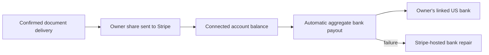

# Connected-account bank payout status

This surface is for the **owner's aggregate bank deposits**, not for one
document request. A confirmed document delivery may produce one Stripe
Transfer to the owner's connected Stripe balance. Stripe's automatic bank
Payout can combine that transfer with other earnings and adjustments. A
Transfer must never be labeled “bank paid.”

## Visual Map

## UAT and production setup

Use the existing US Express connected account for each owner. UAT must use a
Stripe sandbox/test key and test connected accounts; production uses live keys
and separately onboarded live accounts. Stripe object IDs, hosted onboarding
links, bank accounts, and webhook signing secrets do not cross modes. The
backend payment configuration rejects a live key in UAT and a test key in
production. Deployment configuration uses separate UAT and production Cloud SQL
instances. Do not copy `pkm_owner_payout_accounts` between environments.

In each Stripe environment, create a **Connected accounts** event destination
pointing to `POST /api/one/payouts/connect/webhook`. Select `account.updated`,
`payout.created`, `payout.updated`, `payout.paid`, and `payout.failed`. Store that
destination's signing secret as `STRIPE_CONNECT_WEBHOOK_SECRET` in the backend
Secret Manager project. It must differ from the platform Checkout endpoint's
`STRIPE_WEBHOOK_SECRET`. Bind both secrets only to the backend runtime, never
the webapp. Production Connect destinations may deliver test and live events;
the handler checks `event.livemode`, top-level `event.account`, the mapped
connected account, and a provider read under the matching Stripe API key.

The webhook validates Stripe's signature over raw bytes, fetches the latest
connected-account Payout or Account, and records each event ID once. A stale
`payout.created` event cannot downgrade `paid`; `payout.failed` can supersede
`paid` if the bank later rejects the deposit. Provider failures return a retryable
error. The account owner can read at most 20 recent deposits through
`GET /api/one/payouts/account/bank-payouts`; the response has no bank account
details and no document request ID.

## Product status language

Per document request: **Earning pending** → **Sent to Stripe** when its Transfer
is confirmed. In the owner's payout summary: **Bank payout scheduled**
(`pending`), **On the way** (`in_transit`), **Bank payout completed** (`paid`),
or **Bank payout failed** (`failed`). A failed external account requires the
owner to repair their bank details in Stripe-hosted account management.
`expectedArrivalAt` is an estimate, not a promise.

For exact attribution of an **automatic** deposit later, wait for
`payout.reconciliation_completed`, list all connected-account balance
transactions with `payout=po_...` and pagination, and match them to each
Transfer's `destination_payment`. This is not needed to show aggregate bank
status. Stripe's payout balance-transaction filter does not support manual
payouts, so never infer a one-to-one document-to-bank relationship.

UAT acceptance uses Stripe's test US bank numbers: routing `110000000`,
account `000123456789` for success and `000111111116` for a `no_account`
failure. These simulate a bank deposit; they do not move real money or prove
live identity verification. Launch still requires live onboarding, live
webhook registration, and a controlled live smoke transaction.

References: [Express onboarding](https://docs.stripe.com/connect/express-accounts),
[Connect webhooks](https://docs.stripe.com/connect/webhooks.md),
[connected-account payouts](https://docs.stripe.com/connect/payouts-connected-accounts.md),
[test bank accounts](https://docs.stripe.com/connect/testing.md),
[balance transactions by automatic payout](https://docs.stripe.com/api/balance_transactions/list).
