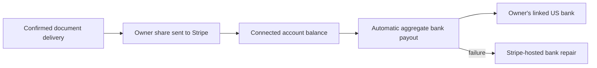

# Connected-account bank payout status

This surface is for the **owner's aggregate bank deposits**, not for one
document request. A confirmed document delivery may produce one Stripe
Transfer to the owner's connected Stripe balance. Stripe's automatic bank
Payout can combine that transfer with other earnings and adjustments. A
Transfer must never be labeled “bank paid.”

## Visual Map

## UAT and production setup

Use the owner's US Express connected account for the configured Stripe mode.
UAT defaults to test mode and can explicitly select live through
`STRIPE_UAT_MODE`; production requires live. The backend rejects keys that do
not match `STRIPE_MODE`. Live UAT uses its own secret bindings and webhook
destinations. Stripe object IDs, hosted onboarding links, bank accounts, and
webhook signing secrets do not cross modes. Migration 298 adds
`stripe_owner_payout_accounts`, keyed by owner and mode, while preserving the
legacy mapping for rolling compatibility. Test onboarding never satisfies live
payout readiness. UAT and production retain separate Cloud SQL instances; do not
copy payout mappings between them. See the [live UAT rollout](./drive-request-stripe-paywall.md).

A live API key does not prove Connect is activated. Before offering live bank
setup, finish Stripe Dashboard → Connect → Set up, including any required
identity verification and final-details review. Stripe can reject account
creation with “complete your platform profile” even after the platform
questionnaire is marked complete. The app returns
`PAYOUT_PLATFORM_SETUP_REQUIRED` and explains that Hussh must activate payouts;
the owner should not be sent into a repeated bank-setup retry loop. This provider
prerequisite cannot be repaired by replacing an owner's bank or changing keys.

Legacy sandbox account recovery accepts only Stripe's explicit, account-specific
test-mode verdict or missing-resource response. Stripe's Python SDK decodes the
test-mode HTTP 400 as `InvalidRequestError`; transport-level tests cover that
actual decoding. Authentication, network, and unrelated provider failures must
never authorize a replacement connected account.

In each Stripe environment, create a **Connected accounts** event destination
pointing to `POST /api/one/payouts/connect/webhook`. Select `account.updated`,
`account.external_account.created`, `account.external_account.updated`,
`account.external_account.deleted`, `payout.created`, `payout.updated`,
`payout.paid`, and `payout.failed`. Store that
destination's signing secret as `STRIPE_CONNECT_WEBHOOK_SECRET` in the backend
Secret Manager project. It must differ from the platform Checkout endpoint's
`STRIPE_WEBHOOK_SECRET`. Bind both secrets only to the backend runtime, never
the webapp. Production Connect destinations may deliver test and live events;
the handler checks `event.livemode`, top-level `event.account`, the mapped
connected account, and a provider read under the matching Stripe API key.

The webhook validates Stripe's signature over raw bytes, fetches the latest
connected-account Payout or Account, and records each event ID once. A stale
`payout.created` event cannot downgrade `paid`; `payout.failed` can supersede
`paid` if the bank later rejects the deposit. Provider failures return a retryable
error. The account owner can read at most 20 recent deposits through
`GET /api/one/payouts/account/bank-payouts`; the response has no bank account
details and no document request ID.

## Bank management

Profile → Payouts → **Manage bank** issues a fresh, owner-scoped Express login
link. Stripe verifies the owner and handles adding, replacing, and removing
eligible payout banks. Hussh never accepts account numbers or routing numbers.
Deleted, non-US, or non-Express accounts cannot receive a management link.
Restricted Express accounts remain manageable so the owner can fix a failed
bank or finish verification.

Express login links use either `https://stripe.com/express/...` or
`https://connect.stripe.com/express/...`. Both backend and frontend accept these
documented forms while rejecting unrelated hosts, paths, credentials, and
ports. The link is short-lived; request a fresh link for every visit. Successful
navigation or a return URL alone does not prove that bank setup is complete.

The platform's Stripe **Connect → Payouts → External accounts** setting controls
whether owners may keep several banks in one currency (up to ten). Enable
**Collect multiple external accounts per currency** to offer that capability.
Do not promise that the final/default bank can be removed: Stripe can require
a replacement before removal. Changing a bank does not redirect a deposit
already in transit, delete transactions, reverse an earning, or start another
transfer. Those remain separate provider-backed records.

`GET /api/one/payouts/account` returns the default US dollar bank's display name,
last four digits, and status when Stripe exposes them, along with
`canManageBank`. `bankStatus` is `linked`, `missing`, `needs_attention`, or
`unavailable`. A truncated or omitted bank preview is `unavailable`, never
evidence that a bank was removed. A missing, failed, or unverified default bank
blocks new paid requests even if Stripe's general payouts flag remains enabled. Returning from Stripe refreshes account state; signed external-account
events also recompute readiness from the current Stripe Account and publish the
owner's existing state notification. Event payloads never replace authoritative
account state, and duplicate events do not create duplicate deposits.

Provider references: [Express account settings](https://docs.stripe.com/connect/express-dashboard),
[external bank collection settings](https://docs.stripe.com/connect/payouts-bank-accounts),
[bank replacement and deposits in transit](https://support.stripe.com/questions/update-existing-bank-account-information).

## Product status language

Per document request: **Earning pending** → **Sent to Stripe** when its Transfer
is confirmed. In the owner's payout summary: **Bank payout scheduled**
(`pending`), **On the way** (`in_transit`), **Bank payout completed** (`paid`),
or **Bank payout failed** (`failed`). A failed external account requires the
owner to repair their bank details in Stripe-hosted account management.
`expectedArrivalAt` is an estimate, not a promise.

For exact attribution of an **automatic** deposit later, wait for
`payout.reconciliation_completed`, list all connected-account balance
transactions with `payout=po_...` and pagination, and match them to each
Transfer's `destination_payment`. This is not needed to show aggregate bank
status. Stripe's payout balance-transaction filter does not support manual
payouts, so never infer a one-to-one document-to-bank relationship.

Test-mode acceptance uses Stripe's test US bank numbers: routing `110000000`,
account `000123456789` for success and `000111111116` for a `no_account`
failure. These simulate a bank deposit; they do not move real money or prove
live identity verification. Launch still requires live onboarding, live
webhook registration, and a controlled live smoke transaction.

References: [Express onboarding](https://docs.stripe.com/connect/express-accounts),
[Connect webhooks](https://docs.stripe.com/connect/webhooks.md),
[connected-account payouts](https://docs.stripe.com/connect/payouts-connected-accounts.md),
[test bank accounts](https://docs.stripe.com/connect/testing.md),
[balance transactions by automatic payout](https://docs.stripe.com/api/balance_transactions/list).
