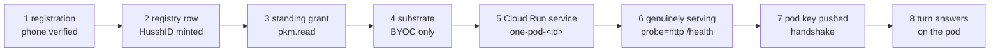

# Tracing one person's 0→1 private-agent journey

When someone signs in and their private agent does not appear, this is how to find out
where it stopped. Every stage below is observable; the point of this page is that you
should never have to guess which one failed.

## Visual Context

Canonical visual owner: [Operations Index](./README.md). Companion contracts:
[dev-fast-lane.md](./dev-fast-lane.md) (how the branch under test got deployed),
[../architecture/deployment-standard.md](../architecture/deployment-standard.md)
(which layer each stage belongs to).



Stages 4 and 5 are the two layers of [the deployment
standard](../architecture/deployment-standard.md): substrate must apply before an
instance is built on it, so a stage-4 failure is never diagnosed at stage 5.

## The one identifier that joins everything

The **HusshID** (`ha1_…`) is the opaque public handle for a person's agent. It is
derived by HMAC from their verified phone and is not reversible to it. It is also:

- the A2A route — `/u/{hushh_id}`
- the Cloud Run service name — `one-pod-<hushh-id>` (lowercased, DNS-safe)
- the correlation key in every hub and pod log line along the journey

So one value joins the hub's logs, the registry row, the GCP resource, and the pod's own
logs. Get it from the status endpoint (`hushhId`), from the registry, or from any
`personal_agent.*` log line.

> Log lines used to emit `hushh_id_present=True` instead. That reads like a privacy
> control and was not one — the value was already in the URL and the service name — while
> making two people's journeys produce byte-identical, unjoinable lines. Guard:
> `consent-protocol/tests/test_journey_is_traceable.py`.

## Start here

```bash
cd consent-protocol
uv run python scripts/ops/trace_pod_journey.py --hushh-id ha1_XXXX
```

It walks all eight stages, prints PASS/FAIL/SKIP with the evidence it read, and names
the **first** failure in journey order plus the next thing to look at. It is strictly
read-only — it never writes to the registry, Cloud Run, or the pod.

**Three exit codes, because there are three outcomes:**

| Code | Meaning |
|---|---|
| `0` | every stage was read and none failed — the person has an agent that serves |
| `1` | a stage failed; `FIRST FAILURE` names it |
| `2` | **unproven** — nothing failed and nothing was confirmed, because stages were skipped |

Code `2` exists because the tool once printed *"the journey is complete: this person has
a private agent that serves"* for a trace in which all eight stages were skipped. That
is the same defect the tool exists to detect, committed by the tool. A caller that gates
on this must treat `2` as "look again with credentials", never as a pass.

## Which plane the pod lives on

Stages 3–5 and 8 read Cloud Run. That is right for exactly one backend, and the honest
answers for the other two are *different answers*, not failures. The backend is read
from the registry row; `--backend {gcp,user_gcp,anypoint}` overrides it when the row
cannot be read.

| Backend | What stages 3–5 and 8 do |
|---|---|
| `gcp` | full trace against hushh's own project |
| `user_gcp` | **SKIP** — the pod is in the person's own project and hushh holds no standing credential there. That absence *is* the BYOC promise, not an outage. Re-run with a consent-gated impersonated token, or from inside their project. |
| `anypoint` | **SKIP** — the pod is a Mule application on CloudHub 2.0, not a Cloud Run service. The equivalent of stages 3–5 is the application's deployment status and private-endpoint binding in Anypoint Runtime Manager. |

Reporting either of the last two as FAIL would be literally true and completely
misleading — it would send an operator hunting for a service that was never supposed to
exist.

With DB credentials in the environment it reads the registry row directly. Without them
it says so and prints the SQL, rather than reporting "no row" for a query that never ran
— those are opposite diagnoses and the tool keeps them apart.

## The stages, and what a failure at each one means

| # | Stage | Failure means |
|---|---|---|
| 1 | registry row exists | Phone verification never reached `register_pending`. Check `PERSONAL_AGENT_ENABLED`. |
| 2 | a host was requested | Reserved but never provisioned — the autoprovision hook did not fire or failed. Grep `personal_agent.autoprovision_failed hushh_id=`. |
| 3 | Cloud Run service exists | `provision()` never reached Cloud Run. Usually `GcpBackend` still in plan mode: check `HUSSH_GCP_BACKEND_LIVE` and the dev simulation guard. |
| 4 | service genuinely serves | Container never came up. `Ready=True` alone is **not** proof — see below. |
| 5 | hub may invoke the pod | No `run.invoker` binding, so key collection can only 403. Check `HUSSH_POD_INVOKER_MEMBER`; the backend logs `gcp_backend.no_invoker_member`. |
| 6 | pod published its key | Host is live, handshake never completed. **Nothing retries this** — see below. |
| 7 | standing read is live | `provision()` raised; the traceback is in the hub log under this HusshID. |
| 8 | pod answers `/health` | Service is Ready but the app is not answering — the workers-dead shape. |

### `Ready=True` is not proof a pod serves

Cloud Run's default startup probe is a TCP connect, and gunicorn binds its port before
its workers boot. A pod whose workers die on import therefore reports `Ready=True` and
`ContainerHealthy=True` while returning 503 to everything. The pod spec sets an explicit
HTTP probe on `/health` so the condition means what it says; the trace reports
`probe=` and warns when it is TCP.

### `connecting` is the state with no owner

`fetch_stalled_agents` deliberately excludes `connecting`: that row has a **live host**
mid-handshake, and re-running `provision()` against it would replace a running service.
That is correct, and it leaves the state unwatched — if the pod never publishes its key
the row sits there forever and the person watches a spinner.

The status poll is where that is now noticed. Past `_HANDSHAKE_OVERDUE_SECONDS` (10
minutes) it logs:

```
personal_agent.handshake_overdue hushh_id=… service=one-pod-… journey_age_seconds=…
```

It only observes — it never writes, for the reason above. Guard:
`test_journey_is_traceable.py::test_the_handshake_stall_is_detected_somewhere`.

Note the age is the **whole journey's** age, not time-in-state: `updated_at` has no
`ON UPDATE` trigger and the repo never writes it, so it equals `created_at`. The field is
named `journey_age_seconds` so it cannot be misread as something finer.

## The other tools, and when each is the right one

| Tool | Answers |
|---|---|
| `trace_pod_journey.py` | Where did **this person's** journey stop? |
| `verify_pod_journey.py --sha <sha>` | Is the **serving hub** able to give *anyone* an agent? Run before a test session. |
| `pod_fleet.py` | What pods exist, and which genuinely serve? Run after, to confirm teardown. |
| `pod_curl.py` | Talk to one pod, once it is addressable. |

A pod reached from outside the perimeter returns a Google front-end **404**, because pods
use `internal` ingress. That is the expected answer and says nothing about the pod —
misreading it once produced ten fabricated sub-second "cold starts" that were all GFE
404s. The trace reports it as SKIP, not FAIL.

## In the browser

The status hook keeps the last known state when a poll fails, so the UI never disagrees
with the backend on a guess. After three consecutive failures it warns in the console —
a status call that 401s every tick otherwise renders exactly like an agent that has not
changed state, which is onboarding appearing to hang with nothing to say why.

## Dev is shared and costed

Pods left running cost money. Check the fleet before creating more, and tear down what a
session created:

```bash
uv run python scripts/ops/pod_fleet.py --project hushh-pda-dev --region us-central1
```
