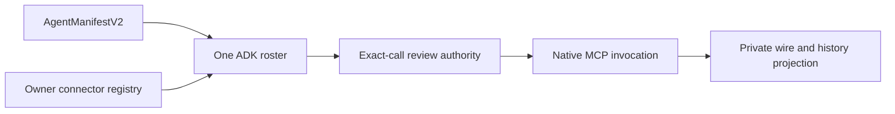
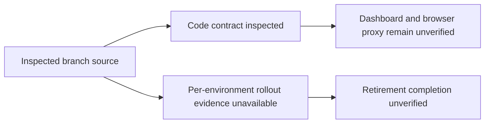

# ADK Orchestration Documentation Audit

## Visual Map

The [One agent hierarchy](../one/one-agent-hierarchy.md) maps the runtime owners.
This audit records revision-specific implementation and verification beneath that map.

**Review basis:** repository `HEAD` `4fb27f5a06a397ac3d42599a55e5da2245ddf5a2`, inspected 2026-09-23. The Plaid retirement implementation is committed on this branch; this documentation audit is an uncommitted working-tree change. Branch source inspection does not establish that the code is deployed or that per-environment cleanup completed.

## Shared MCP transport checkpoint — 2026-09-24

On ADK base `236db2404`, discovery and invocation now use the same public-HTTPS
transport. Validation happens at each socket connection: all DNS answers must
be public, TCP uses a vetted numeric address, and TLS retains the original host.
Redirect following, environment proxies, Unix sockets and connection retries are
disabled. The initial endpoint policy admits HTTPS port 443 without userinfo,
query credentials or fragments; nonstandard ports/query-based endpoints are not
admitted by this policy. Error messages do not include endpoint contents.

The implementation uses the documented public
[HTTPcore network-backend seam](https://www.encode.io/httpcore/network-backends/)
and [HTTPX transport interface](https://www.python-httpx.org/advanced/transports/).
HTTPcore is now an explicit dependency, without changing its installed version.

Verification: **104 focused tests passed**, covering the transport and existing
Workspace provider/runtime contracts. These include DNS rebinding, mixed private
and public answers, TLS host preservation, redirect/proxy refusal, timeouts, and
both MCP discovery and call factory wiring. This is automated evidence, not a
live provider, custom-registration, browser, native or release acceptance claim.

Subsequent bounded checkpoints: `8b8a5a661` verifies private-registration erasure
on disposable PostgreSQL; `5ce3f3453` adds owner-private REST registration with
29 focused checks. Neither establishes private connector UI or live execution.

Catalog admission now validates bounded JSON Schema 2020-12 object schemas,
retains their constraints, and rejects remote references, rebasing IDs and
unsupported dialects explicitly. Literal `$ref`/`$id` properties in example or
constant information are not interpreted as schema directives. Refresh rejects
late discovery at the caller boundary, not only at cache insertion. Fifty focused
catalog, refresh, privacy and Workspace tests passed; the final ordering-only
change was rechecked with 25 catalog/cache tests. This remains automated proof.

Still open: OAuth discovery protections, shared ADK toolset admission/approval, Settings/Chat
catalog refresh, governed continuation, and the approved live/release gates.
Response normalization limits are not proof of a wire-level response-byte limit.

## Product-agent hierarchy audit — 2026-09-24

### Shared native toolset integration checkpoint

`one_adk/governed_mcp_toolset.py` now subclasses installed ADK `McpToolset` and
uses native `McpTool` invocation, with bounded complete discovery, namespaced
tools, call-time connection resolution, stale catalog/connection rejection, and
an application-owned approval callback. Native tool errors are sanitized without
retrying an uncertain mutation. `RegisteredMcpToolset` now joins the admitted
typed-Chat roster for owner-private registrations and uses the existing exact-call
approval callback. It discovers through the owner registry within task-local
resources (32 connectors, four concurrent discoveries, 20-second discovery bound,
500 aggregate tools). It disables ADK's invocation-ID-only cache and clears its
retained catalog at turn teardown. Curated Google adapters remain separate until
parity is verified; custom OAuth and live browser/native proof remain open.
Native calls now establish the existing external-content barrier before dispatch;
continued calls are limited to actual native tools using exact-call review.
Tool names/annotations cannot admit an unreviewed downstream action. This does
not yet establish same-turn first-party Memory capture or curated-action parity.

The shared toolset accepts application-owned catalog and result policy ports for
curated-provider migration. Discovery remains native MCP; a catalog policy cannot
invent tools, and call arguments must satisfy both the original provider schema
and its narrowed advertised schema, each at its own local-reference root. Catalog
revisions include both views so changing either requires fresh review. Result
projection runs within the existing bounded normalization path, without a second
provider dispatch. These ports do not yet migrate Google's credential owners or
activate curated providers through this toolset. Pending reviews created with the
older revision digest require review again rather than silent compatibility.

The existing action ledger now requires exact current contract, argument and
resource-binding HMAC matches at confirmation and consumption for
`connector.mcp.invoke`. No second approval table was added. Existing non-MCP
callers retain their contracts. Thirty-seven focused tests passed, including
installed ADK invocation against a synthetic session and actual disposable
PostgreSQL rejection of changed arguments, schema revision, connection generation,
missing terms and replay. Provider/network, browser and release proof remain open.

Follow-up review fixes serialize catalog publication by discovery sequence and
recheck discovery before review and dispatch; a slower discovery cannot supersede
a later one. Native session creation is single-attempt without ADK's raw-error
retry logger. Provider error payloads are not returned, and private calls refuse
SDK HTTP-exchange diagnostics. Reserved framework tool names are excluded from
the callable set. Provider descriptions remain untrusted tool metadata, never
permission or an instruction-layer replacement.

The registry credential resolver now verifies current owner-token authority,
owner-scoped registration, connection status, expiry and the same-row credential
generation/version before opening its encrypted envelope. It covers registry-owned
credentials; Google account credentials in other services still need their owning
adapters. Forty-eight focused tests cover these paths and the existing ledger,
including native SDK session-creation failure privacy. The confirmation endpoint,
transient Chat review card, and private-registry roster now have implementations;
live proof remains open. Dynamic-tool wire/history redaction
was subsequently verified in `6cd38b9a9`; per-turn resource cleanup and owner
isolation were committed in `06a4ef2dc`.

The exact-call approval adapter now derives the existing ledger's HMAC terms
from current connector, endpoint, credential generation/version, catalog, tool,
arguments and owner session. The execution callback requires committed receipt
consumption before provider dispatch; caller-owned database transactions are
rejected. Expiry checks use wall-clock time, not a transaction-start timestamp.

Integration inspection found that the old `typed_chat` foreign key targets
legacy `agent_chat_conversations`, not current encrypted ADK sessions. Migration
244 adds an `adk_chat` reference to the existing ledger, with an exact
`(app_name,user_id,session_id)` foreign key to `one_adk_sessions`. It preserves
legacy workflows and accepts native TEXT thread identities without creating
shadow legacy conversations. The rollback intentionally retains this additive
schema and receipts; roll back callers, not historical authority evidence.
Explicit conversation deletion cascades its approval metadata, matching the
legacy conversation-ledger lifetime; this is not a separate permanent audit
archive. It also invalidates outstanding receipts. No conversation was deleted
outside the disposable synthetic test schema.

Verification: 66 focused tests passed, including disposable PostgreSQL
owner/session binding, one-time consumption, argument/catalog/grant changes,
session deletion and expiry in a long-running transaction. Migration 244 is
registered in release/schema contracts but **has not been applied to shared
environments**. Approval endpoint, live review card and root-roster activation
remain required; this checkpoint does not claim live connector acceptance.

Source baseline: ADK `6ae5a2a5965a79d75ec72e4fdf5e90b667df1a2b`.
Read-only comparison: infrastructure branch
`5e0ade416f8b76fb81b472e762258401fb0d1250`. Neither branch was switched
or merged for this audit. The earlier findings below retain their original revision.

All 19 top-level manifests were inventoried against the generated registry and
hierarchy verifier. This is structural/source evidence, not live verification of
every specialist or a latency benchmark.

| Manifest family | Declared composition / boundary |
|---|---|
| One | Chat root; bounded intro and public-search children; curated Workspace tools |
| Kai | Finance task; RIA, brochure, Investor, optimizer, fundamental, sentiment, valuation, debate, synthesis, chat children |
| Wallet | One's bounded task child; private reveal remains client-owned |
| Nav / Connections | Nav chat specialist with Consent child; Connections parent is Nav |
| Documents | Task with live-search planner, suggestions, interpreter; distinct from generic Workspace reads |
| Email | Task with read planner/interpreter, request classifier, receipt extractor, draft, enrichment |
| Location | Task plus transcriber; generated actions retain their own authority |
| Personal Information | Task plus attribute learner; not a replacement PKM store |
| Connected Systems | Chat plus CRM schema mapper; ingress/admission remains required |
| Calendar | One-parent manifest with existing tools; do not infer an independent ADK root from its presence |
| Onboarding | Deterministic runtime with bounded assessment contract |
| KYC | Route, redraft, full-redraft, extract/draft stages; not a registered local dispatch handler |
| Portfolio Import | Extract, relevance, comprehensive stages |
| Memory Segmentation / Intent / Merge / PKM Structure | Separate semantic preparation stages, not four top-level conversational routers |
| Financial Guard | Bounded guard definition, not another conversational head |

The five local dispatch registrations and five external scope-admitted identifiers
are intentionally different sets. Registry presence, a parent field, an AgentTool,
and an A2A endpoint are not interchangeable evidence. Missing explicit runtime
fields require tracing their consumer; adding a chat runtime everywhere is not an
optimization. The infrastructure comparison does not justify wholesale hierarchy
replacement; preserve its already-integrated specialist boundaries.

### Bounded correction and remaining work

- Removed three Python repetitions of One's authored cancellation policy and a
  contradictory Python Nav ownership paragraph. The YAML retains cancellation
  priority, exact confirmation requirements, direct consent tools, and Connections
  delegation. Regression coverage checks the authored policy survives composition.
- One still composes substantial static Python instructions alongside its YAML.
  Consolidate remaining static semantics through the authored owner in bounded
  parity-tested changes; keep dynamic admission/context overlays in runtime code.
- Generic Workspace reads and Documents' delegated interpretation are different
  contracts. Their selection guidance and the external-read turn barrier still
  need alignment before claiming same-turn read-to-reviewed-action composition.
- Explicit credential-scoped MCP refresh and its Settings/Chat tool inventory are
  unfinished. A cache invalidation primitive alone does not establish refresh UX.
- No claim of faster Gemini responses, complete specialist acceptance, physical
  device proof, release readiness, or deployment follows from this audit.

Verification: focused manifest/factory/One runtime tests passed **326**, with
**74 skipped**; generated registry and hierarchy checks passed. The ADK/A2A
compliance check passed **preview containment only**, explicitly reporting
`ADK_A2A_SDK_MATRIX_UNVERIFIED` and `official_a2a_v1.ready=false`.
Do not promote that result to full A2A compatibility.

Google's [ADK A2A guidance](https://adk.dev/a2a/) distinguishes local agents
from remote agents. Its [MCP integration guidance](https://adk.dev/tools-custom/mcp-tools/)
supports discovered tool integration. Apply these through the installed SDK's
tested contracts: preserve local bounded delegation, owner-bound MCP admission,
and explicit remote task compatibility gates rather than replacing every local
specialist with a network hop.

## Earlier documentation audit

See the [canonical runtime architecture visuals](../architecture/architecture.md).

## Findings

| Area | Status | Evidence and boundary |
|---|---|---|
| One delegation | Verified in checkout | [Agent hierarchy](../one/one-agent-hierarchy.md) distinguishes ADK `AgentTool`, process-local dispatch, and external scoped A2A. `adk_bridge` has five mapped specialist scope IDs; local dispatch registers document, location, email, Nav, and Personal Information handlers. These are separate contracts, not one universal router. |
| Plaid vault passthrough | Implemented on branch; integration and rollout unverified | [`plaid_vault.py`](../../../consent-protocol/api/routes/kai/plaid_vault.py) exposes link-token, exchange, snapshot, and remove operations with owner authorization and no vault-route database persistence. The backend transiently receives access tokens and readable upstream records. The current portfolio hook reloads vault financial context and derives Plaid status from it; source inspection does not establish deployed UI behavior. The retirement route and migration are present on this branch; no per-environment migration, key cleanup, or disconnection evidence was reviewed. |
| Browser proxy caching | Needs verification | Backend vault responses set `Cache-Control: no-store`, but the inspected generic Next Kai proxy rebuilds JSON through `withRequestIdJson` without visibly forwarding that header. Do not claim browser-facing proxy responses are no-store. Verify propagation in the owning frontend/API-contract workflow. |
| Mail/Drive UAT | Deployment verified; acceptance incomplete | [Acceptance record](../operations/mail-drive-uat-acceptance.md) records successful post-merge deployment, while connector flags and the internal-owner cohort remain off and the user journey is not accepted. Deployment evidence does not establish feature acceptance. |
| Recursive documentation model | Split recommendations stale | [Knowledge model](../operations/documentation-recursive-knowledge-model.md) now records that mobile and location guides already have their child documents; no further restructure is indicated. |
| Runtime model claims | Repo defaults verified; deployment selection varies | [`model_catalog.py`](../../../consent-protocol/hushh_mcp/runtime_providers/model_catalog.py) lists `gemini-3.8-flash` and `gemini-3.7-flash`; manifests can use `gemini-default`, and [`live_compatibility.py`](../../../consent-protocol/hushh_mcp/runtime_providers/live_compatibility.py) documents Live model compatibility. Voice model selection is environment/configuration dependent. These sources do not support describing One as entirely model-agnostic or proving a deployed model selection. |

## Follow-up ownership

- **Frontend proxy and dashboard integration:** verify response-header propagation through [`api-contract-change`](../../../.codex/workflows/api-contract-change/workflow.json) and migrate/verify the mounted status/refresh consumer against the vault contract through [`frontend-cache-coherence`](../../../.codex/workflows/frontend-cache-coherence/workflow.json). Evidence required: route-level header test and a same-contract dashboard integration check.
- **Plaid retirement rollout:** verify migration 239 through [`data-model-audit`](../../../.codex/workflows/data-model-audit/workflow.json), then prove migration and environment cleanup/disconnection through [`uat-scoped-deploy`](../../../.codex/workflows/uat-scoped-deploy/workflow.json) and the repo-operations owner. Evidence required: migration ledger and environment-specific cleanup results. Until then, retirement is implemented on this branch, not a completed rollout.
- **Mail/Drive acceptance:** keep the acceptance record open until flags/cohort are enabled and the end-to-end document-sharing journey passes.

## Canonical evidence

- [One agent hierarchy](../one/one-agent-hierarchy.md) and [agent development](../../../consent-protocol/docs/reference/agent-development.md)
- [Kai brokerage connectivity architecture](../kai/kai-brokerage-connectivity-architecture.md) and [Plaid passthrough contract](../kai/plaid-vault-passthrough.md)
- [Mail/Drive UAT acceptance](../operations/mail-drive-uat-acceptance.md)
- [Backend ADK bridge and agent tree](../../../consent-protocol/hushh_mcp/adk_bridge/__init__.py), [`delegation.py`](../../../consent-protocol/hushh_mcp/adk_bridge/delegation.py), [`agent_tree.py`](../../../consent-protocol/hushh_mcp/one_adk/agent_tree.py)
- [Runtime model catalog](../../../consent-protocol/hushh_mcp/runtime_providers/model_catalog.py), [Live compatibility rules](../../../consent-protocol/hushh_mcp/runtime_providers/live_compatibility.py)
