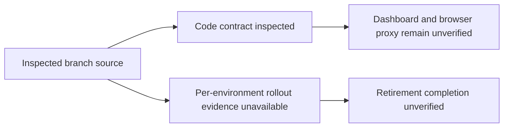

# ADK Orchestration Documentation Audit

**Review basis:** 2026-09-23 local pod integration, refreshed through pod base `812deaae16c26eccf4b80509021931d5cc467952`, remote ADK `b48a85d5bcff39f225e421bf033b38480c02ce7c` (contained in main), local ADK reviewer change `53aa5386dd3ac63eaf36ddbbf9c9ab1338f954f1`, and remote main `c7586798aef46797db8fda528fda164ba3daf8da`. The final source revision is the commit containing this report. Source inspection does not establish per-environment rollout or cleanup.

## Visual Context

See the [canonical runtime architecture visuals](../architecture/architecture.md).

## Findings

| Area | Status | Evidence and boundary |
|---|---|---|
| One delegation | Verified in checkout | [Agent hierarchy](../one/one-agent-hierarchy.md) distinguishes ADK `AgentTool`, process-local dispatch, and external scoped A2A. `SPECIALIST_A2A_SCOPE_MAP` has five admitted identifiers; default shared-runtime local dispatch registers Documents, Location, Email, Nav, and Personal Information handlers. An owner-bound pod may add Connections and Connected Systems for its own turn. These are separate contracts, not one universal router. |
| Plaid vault passthrough | Implemented in inspected source; rollout unverified | [`plaid_vault.py`](../../../consent-protocol/api/routes/kai/plaid_vault.py) exposes link-token, exchange, snapshot, and remove operations with owner authorization and no vault-route database persistence. The backend transiently receives access tokens and readable upstream records. The portfolio hook loads vault financial context and derives Plaid status from it; source inspection does not establish deployed UI behavior. The legacy server-backed route is absent from the integrated source, and migration 239 is present; no per-environment migration, key cleanup, or disconnection evidence was reviewed. |
| Browser proxy caching | Needs verification | Backend vault responses set `Cache-Control: no-store`, but the inspected generic Next Kai proxy rebuilds JSON through `withRequestIdJson` without visibly forwarding that header. Do not claim browser-facing proxy responses are no-store. Verify propagation in the owning frontend/API-contract workflow. |
| Plaid exchange retry | Boundary risk | The shared [Plaid client](../../../consent-protocol/hushh_mcp/integrations/plaid/client.py) retries network failures without excluding the single-use public-token exchange. A timeout can leave the exchange outcome unknown. The Plaid owner should prove one provider attempt on that path and define recovery. |
| Plaid vault refresh and projection | Needs focused tests | [Vault sync](../../../hushh-webapp/lib/kai/plaid-vault/vault-sync.ts) reads pages before a domain write; test concurrent refresh/relink and provider failure against retention and cursor fencing. [Projection](../../../hushh-webapp/lib/kai/plaid-vault/projection.ts) needs an Item-scoped account-ID collision test before asserting holdings remain distinct across Items. |
| Shareable financial summary | Boundary proof missing | The [quality scanner](../../../hushh-webapp/lib/kai/plaid-vault/quality.ts) checks summary leaks in tests. Verify planted private identifiers and amounts at the actual grant/export boundary; the raw financial branches remain denied by policy. |
| Mail/Drive UAT | Implementation evidence; live acceptance unverified | [Acceptance record](../operations/mail-drive-uat-acceptance.md) describes source and synthetic test checkpoints. Its current status calls for separate live rollout and two-account acceptance; this source audit does not establish deployment or feature acceptance. |
| Recursive documentation model | Corrected | [Knowledge model](../operations/documentation-recursive-knowledge-model.md) now identifies the existing mobile and One Location entrypoints and their child pages. |
| Pod authority and erasure | Fixed in inspected source; rollout unverified | The integration fails closed on explicit owner-authentication errors, retains owner-scoped memory, and keeps account erasure aligned with migration 239's removed tables. Focused source tests passed. A deployed pod or migration result was not proven. |
| Cloud Build environment | Fixed in inspected source | The deploy script accepts a bounded packed Drive secret setting so the backend build step stays below Cloud Build's 100-entry environment limit. The image build contract test passed; no image was built or deployed here. |
| Native parity reports | Follow-up required | Static parity validation passed, but the report-verification command found stale generated report artifacts. Refresh them through the native parity workflow before treating those artifacts as current. |
| Runtime model claims | Repo defaults verified; deployment selection varies | [`model_catalog.py`](../../../consent-protocol/hushh_mcp/runtime_providers/model_catalog.py) lists `gemini-3.8-flash` and `gemini-3.7-flash`; manifests can use `gemini-default`, and [`live_compatibility.py`](../../../consent-protocol/hushh_mcp/runtime_providers/live_compatibility.py) documents Live model compatibility. Voice model selection is environment/configuration dependent. These sources do not support describing One as entirely model-agnostic or proving a deployed model selection. |
| Pod refresh toward main | Source integrated; rollout unverified | The pod candidate contains the 2026-09-23 main Drive drawer changes and the local ADK reviewer identity capture. The capability graph now records the previous pod workflow revision as an additive predecessor. Shared-runtime `/health/ready` checks dependencies; the private pod reports process readiness without hub database credentials. The reviewed pod ingress allowlist includes upgrade routes behind the machine wall. Source and focused contract checks do not prove a deployed pod image or recovery rehearsal. |
| Reviewer and native test contracts | Corrected in candidate | First-run reviewer authentication now uses an owner-bound authenticated state without injecting a vault passphrase; established-vault continuity still requires unlock. The harness installs its read-only guard before navigation and suppresses only listed analytics collection hosts. Native test artifact output resolves absolute or relative selected directories. These checks are local, not a live browser or device rehearsal. |
| Drive work-drain deploy settings | Restored in source; rollout unverified | The UAT workflow's four scheduler substitutions again reach the backend deploy script through one validated Cloud Build entry, under the 100-entry step limit. The script forwards the flag and OIDC identity to the runtime. Contract tests passed; no Cloud Build or scheduler run was performed. |
| Account deletion production release | Source integrated; rollout unverified | The refreshed main production workflow and cleanup scheduler contract are present in the pod candidate. The user-table inventory now distinguishes executed deletes, checked FK cascades, and the specialized Drive cleanup path; focused account tests and the local PostgreSQL Drive erasure scenarios passed. These establish source behavior, not a completed production migration, scheduler setup, or full-environment erasure rehearsal. |

## Follow-up ownership

- **Frontend proxy and dashboard integration:** verify response-header propagation through [`api-contract-change`](../../../.codex/workflows/api-contract-change/workflow.json) and migrate/verify the mounted status/refresh consumer against the vault contract through [`frontend-cache-coherence`](../../../.codex/workflows/frontend-cache-coherence/workflow.json). Evidence required: route-level header test and a same-contract dashboard integration check.
- **Plaid retry, vault sync, and grant boundaries:** use the existing vault/PKM and IAM/consent owner workflows for single-use exchange recovery, Item-scoped projection keys, concurrent cursor/retention behavior, and summary export inspection. Preserve sealed records during any key migration.
- **Plaid retirement rollout:** verify migration 239 through [`data-model-audit`](../../../.codex/workflows/data-model-audit/workflow.json), then prove migration and environment cleanup/disconnection through [`uat-scoped-deploy`](../../../.codex/workflows/uat-scoped-deploy/workflow.json) and the repo-operations owner. Evidence required: migration ledger and environment-specific cleanup results. Until then, retirement is present in inspected source, not a completed rollout.
- **Mail/Drive acceptance:** keep the acceptance record open until live rollout and the end-to-end two-account document-sharing journey pass.
- **Main promotion:** complete full branch and restored-work checks, refresh real native parity reports through the mobile workflow, and verify the serving pod image and recovery before proposing a main merge. Source ancestry alone is not deployment evidence.

## Canonical evidence

- [One agent hierarchy](../one/one-agent-hierarchy.md) and [agent development](../../../consent-protocol/docs/reference/agent-development.md)
- [Kai brokerage connectivity architecture](../kai/kai-brokerage-connectivity-architecture.md) and [Plaid passthrough contract](../kai/plaid-vault-passthrough.md)
- [Mail/Drive UAT acceptance](../operations/mail-drive-uat-acceptance.md)
- [Backend ADK bridge and agent tree](../../../consent-protocol/hushh_mcp/adk_bridge/__init__.py), [`delegation.py`](../../../consent-protocol/hushh_mcp/adk_bridge/delegation.py), [`agent_tree.py`](../../../consent-protocol/hushh_mcp/one_adk/agent_tree.py)
- [Runtime model catalog](../../../consent-protocol/hushh_mcp/runtime_providers/model_catalog.py), [Live compatibility rules](../../../consent-protocol/hushh_mcp/runtime_providers/live_compatibility.py)
