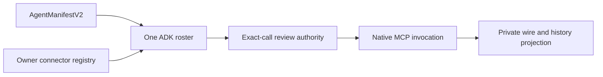
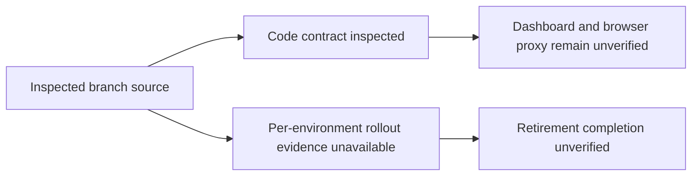

# ADK Orchestration Documentation Audit

## Visual Map

The [One agent hierarchy](../one/one-agent-hierarchy.md) maps the runtime owners.
This audit records revision-specific implementation and verification beneath that map.

**Earlier promoted baseline:** 2026-09-24 integration candidate `5e0ade416f8b76fb81b472e762258401fb0d1250`, containing pod branch start `4dd42848c1d7f213e3bf5bab3cb45f38ab83f9c1`, refreshed `origin/main` `75c3528bd499c99d6e8830e19e5c25a41db79e1d`, remote ADK `1748f5684a7a06906b61ea3170e682b122cc120f`, and local ADK `2f2d0399021efba757906b476266908f938e8c48`; all four are verified ancestors. This candidate was fast-forwarded onto the original pod branch, `claude/hushh-infrastructure-analysis-7o991c`. After restoring the combined dirty work, its snapshot excluding this report matched `69eefa31f445d9fa840ffa874229d6acba932c7a`; the pre-promotion root hashes also passed. The hosting and Puppy source changes and preserved pod work remain uncommitted. Source checks do not establish per-environment rollout, device acceptance, migration execution, or cleanup.

## Visual Context

Canonical visual owner: [Quality and Design System Index](README.md).
Topology audit ownership: [Runtime topology maintenance](../architecture/runtime-topology-maintenance.md).
This report records revision-bound evidence; it does not establish deployment acceptance.

## Current integration checkpoint — 2026-09-24

The existing pod branch is at `7d38d0d67`, containing remote main
`a4a42abe2`, local committed ADK `de2498bd1`, and the earlier pod baseline
`5e0ade416`. Before the final two-commit ADK refresh, the restored working set
matched 187 of 188 changed candidate paths byte for byte; this report was the
one intentional root-only edit. Of the 141 saved root files, 84 retain their
bytes in the working tree, 52 were
reconciled with the newer candidate, and five were archived with their bytes
intact: two migration-243 drafts and three local evidence files. ADK already
owns migration 243, so the active profile bridge is migration 245. The two
root-only fixture scripts remain in the working tree. The ADK worktree's
uncommitted edits remain separate. The final ADK refresh preserved 187 of 190
saved working files byte for byte and merged its three overlapping MCP files.

The latest committed ADK delta adds reviewed draft continuation after connector
reads. Its one overlapping projection file was restored from a saved patch after
the merge; the prior redacted receipt behavior remains in the working tree.
The combined external-read and governed MCP checks passed 162 tests, and the
two affected MCP modules passed mypy. The earlier committed ADK delta passed
75 focused backend and 76 focused web
tests; the combined account, PKM, profile and Drive set passed 157 backend
tests. TypeScript, documentation, diagram, governance, schema alignment, and
the production web build passed on the candidate. The complete local CI run
is **not green**: full Vitest attempts under heavy host CPU contention had
timing failures in unrelated interaction suites. Focused serial reruns passed,
including 243 tests across nine affected files and 278 tests across two large
suites. The web CI command now bounds worker count and permits a local override;
this still needs a complete terminal CI result on the final working state.
After promotion, the root branch passed 167 focused backend tests, 189 focused
web tests, 130 hosting/Puppy/update authority tests, TypeScript, skill lint,
and the full documentation/link/diagram gate. The final governed MCP/Workspace
integration passed another 128 focused backend tests. These bounded checks do
not replace the incomplete canonical CI run.

The main-defined dev pipeline prerequisite landed through the explicitly
authorized Admin PR path and passed exact-SHA post-merge smoke. Its updated
workflow was merged into this pod branch; 24 focused Cloud Build, candidate,
and release-classification checks plus 104 Connect tests passed. The preceding
190-file working set was snapshotted and restored: 187 files remain byte-identical,
and three overlapping files were reconciled with main. No governed dev
deployment, migration, pod image publication,
owner upgrade, or live acceptance is claimed. Live environment inspection found
the intended protected hub edge and distributed abuse budget incomplete; capacity
and rollback need an environment-specific rehearsal. The direct BYOC Puppy device
client and a verified supported predecessor for owner-approved pod updates also
remain launch blockers.

The blocking backend manifest now lists each database-audit suite once. Four
unreferenced, one-off local reviewer scripts were preserved in the private
operator archive and removed from the candidate; their useful acceptance
conditions belong in the existing evaluation and release records rather than
another permanent test harness.

## Fresh integration continuation — 2026-09-24

The first isolated continuation candidate was `baff32e57`, containing main
`377287dee13c9d71c4799811fb443101f07a7d47` and ADK
`e8e1dda79a85ebbc3a8aab910abba05fc065eb56`. The original pod branch remains at
`5e0ade416f8b76fb81b472e762258401fb0d1250`; no application promotion is claimed.
The candidate also rehearses 26 changed/new root paths against the hash-verified
original working snapshot. Independent root and ADK edits remain untouched.

- Preserved both source-bound Gmail delivery and saved-draft behavior, strict
  native Drive result validation and empty-search compatibility, and combined
  authored One guidance. Generated registries, capabilities and topology were
  regenerated from their owners.
- Resolved the uncommitted profile bridge's migration-number collision with ADK
  by assigning it 245 in the candidate. Release manifests and schema contracts
  align at 245; this does not mean an environment applied those migrations.
- Pod update status compares immutable digests across registry copies. Mutable
  tag equality, missing installed digests and conflicting heartbeat tags do not
  establish currency. Exact owner-operation/incarnation/provider receipts are
  required for verified completion. Successful replacement now retains its
  already persisted acknowledgement. The focused update/admission/handoff/
  rollback set passed 139 tests; this is not a live update rehearsal.
- The complete `./bin/hushh ci --include-advisory` run passed on the
  `6d4677b45` snapshot with 162 hash-verified changed paths: 9,642 frontend
  tests and 6,152 backend tests passed (three and 201 skips respectively).
  Documentation, generated contracts and governance passed. Earlier connector
  expectation and native Drive typing failures were corrected before that run.
  The newer ADK merge passed 134 focused MCP/privacy tests and 72 frontend
  configuration/persistence tests. Its optional-owner typing failure was fixed
  with an explicit owner guard. The subsequent backend gate passed 6,197 tests
  with 201 skips before the later combined run below.
- The refreshed `baff32e57` candidate subsequently passed complete canonical CI
  including advisories: 9,696 frontend tests, 6,214 backend tests and 521 voice
  tests passed (three frontend and 201 backend skips). All 176 recorded working
  paths retained their hashes through that run. Two integrated React effect
  dependencies were corrected before the passing run. This remains source
  verification, not dev acceptance.
- New ADK primitives preserve outcome-only durable MCP history and refuse writes
  after failed encrypted-settings reads. The latest source now connects the
  encrypted connector catalog to Chat ingress and review through a single-use
  owner/thread-bound reference; explicit empty catalogs prevent legacy custom
  registry fallback. OAuth refresh tokens are excluded from the turn projection.
  The nine-commit integration passed 213 focused backend tests, 132 frontend
  tests and mypy, including real in-memory MCP SDK messages. Current main's
  Drive retry and regional timeout fixes then merged without conflicts.
  Remote custom OAuth and live browser/provider
  acceptance remain unverified. All 169 non-overlapping preserved paths matched
  their pre-merge hashes; six overlapping paths were reconciled explicitly.
- A later isolated merge `9fe5ce0e47788a47d02ae412fa23c943b5e0db21` brings in
  12 further committed ADK connector/OAuth changes through
  `b7dbbf227689187336c9355aed0749b6741ef527`. The ongoing uncommitted
  ADK work is outside this revision. The Settings conflict retained both
  owner/vault session resets and OAuth Chat recovery. Of 170 pre-merge hashed
  candidate files, 168 remained byte-identical; only the two intentionally
  overlapping files changed. Focused OAuth/MCP checks passed 90 backend and
  60 frontend tests; documentation verification passed. The subsequent
  `./bin/hushh ci --include-advisory` run completed successfully on this
  merge plus the preserved working set: 9,720 frontend, 6,220 backend and
  521 voice tests passed (three frontend and 201 backend skips), with the
  subtree advisory completed. The first two attempts exposed a React effect
  lint warning and nine OAuth typing errors; both were corrected before the
  successful run. Live provider/browser acceptance remains unverified.
- The rehearsed profile bridge now refuses fixture provenance outside an explicit
  local fixture database and rejects retained contact details, including encoded
  URL paths. Existing-entity updates must reference a frozen assessment candidate;
  HusshOne still owns identity assessment and returned IDs. Claim preparation and
  PKM writes use the same canonical domain resolver. Explicit legacy `scan` remains
  supported; unknown protocol values fail closed. The focused boundary checks
  include a real PostgreSQL UPSERT rehearsal.
- A compatibility bridge based on the observed legacy dev source passed 4,218
  backend tests with 193 skips after its deployment interfaces were added.
  Its later commit `c7982672cd6ac2518269ad087ae7ef457f97a7aa` passed the full
  [GitHub CI run](https://github.com/hushh-labs/hushh-research/actions/runs/36079360736),
  including native iOS; manual-run branch freshness and PR-only checks were
  intentionally skipped. This is source verification, not live acceptance.
  The separate main pipeline prerequisite rejects missing candidate helpers before
  secret synchronization or migrations, pins the image before migration, verifies
  candidate health/provenance before traffic promotion, and protects the captured
  rollback revision. [PR #7070](https://github.com/hushh-labs/hushh-research/pull/7070)
  passed its required checks but still awaits review; no pipeline landing or
  live application deployment is claimed.
- Retirement direction is already authorized. Preserve original consent-to-Item
  linkage before disconnecting Items; backup completion alone is not restoration
  proof. The existing account-deletion fence does not quiesce all legacy Plaid
  requests/workers. A verified compatible bridge or complete maintenance barrier
  is still required before migration 239. Environment evidence stays in the
  private operational audit.
- Dev release metadata now binds reviewed notes, source revision, workflow run
  and immutable image. Installation requires an explicitly supported predecessor;
  the authored descriptor currently permits none. New incompatible approvals
  are refused before cloud access while durable recovery retains its original
  release. Focused metadata/authority checks passed 36 tests and settings passed
  seven. These checks do not establish published images or live continuity.
- A dev backup was restored to an isolated task-owned database. Read-only
  protected-record digests and original consent-to-Item linkage matched the
  source. This bounded restore check does not prove full application recovery;
  it does not authorize running migration 239 before legacy-runtime quiescence.
- The compatibility bridge's release and dev-extra migrations replayed on that
  restored database, preserving the four protected record sets' digests. Its
  dev schema guard passed afterward. The serving database was not modified.
- Three affected Wiki articles were corrected and read back: One ADK, Connected
  Systems and One App Shell. Full Wiki public-safety lint checked 564 pages with
  zero errors; 36 warnings and 439 informational findings remain dated in the
  private editorial audit. Lint does not establish universal claim freshness or
  external-link availability.
- Direct BYOC Puppy client implementation, actual two-device acceptance,
  provenance-bound release publication/update continuity, hub edge and measured
  capacity remain open. Neither these source tests nor earlier green CI establish
  dev, UAT or production readiness.

## Earlier dev readiness integration checkpoint — 2026-09-24

The earlier isolated candidate was detached at `c4e83ec66153d4cf63c76f3c9f459d2d6ee83f16`,
including ADK through `0b0b3a546dfb4b5d9200b4b7d2f6e63573ec712c` over the earlier
`cae394479` integration of the preserved pod
HEAD `5e0ade416f8b76fb81b472e762258401fb0d1250`, local ADK snapshot
`4dfe1a7c953b10f121f98b303676c94a51536f73`, and refreshed main
`f3569d646c402ef7c65edb87c366fc9738eb52b8`. The pod worktree's existing changes were
rehearsed over that candidate. The original branch and independent ADK worktree
remain unchanged by this checkpoint. The implementation below is uncommitted
candidate work, except the restored pod-image build steps included in the merge.

- Restored explicitly requested dev pod-image builds; publication remains off by
  default. Build and Cloud Build argument contracts passed (44 tests).
- Shared Chat admission uses authenticated owner identity and server-observed
  placement. Assigned/pending pods retain private-runtime routing; unknown
  placement refuses admission. Chat, hosting and MCP resume checks passed (87 tests).
- Added Hosting and Software updates to the existing owner settings hierarchy.
  Missing update eligibility no longer implies permission to install. Status is
  fetched with lifecycle streaming and cleared on owner changes. Frontend typecheck,
  26 update/navigation tests and eight Settings/status tests passed.
- Canonical local CI first stopped at two history secret-scan findings. Both were
  byte-identical to already reviewed public fixtures (a FIDO identifier and a
  wrapping-algorithm label); only those commit-specific fingerprints were excluded.
  Subsequent doc and generated-route failures were corrected. Disk exhaustion
  during dependency installation was resolved by retiring eight inactive worktrees
  after preserving unique files and retaining their branches. The full frontend
  suite then passed 9,618 tests (three skipped). Route IDs, voice screen mappings
  and stale capability graph projections were corrected. Two ADK return types and
  two outdated contract assertions were fixed; 74 focused tests and the backend
  mypy check passed. Complete canonical CI passed on the restored `cae394479`
  snapshot (9,618 frontend and 5,625 backend tests passed, with declared skips;
  PKM upgrade gate passed). The refreshed `c4e83ec` snapshot then passed the
  expanded canonical CI run: 9,619 frontend tests and 6,040 backend tests passed
  (three frontend and 199 backend skips), plus the PKM upgrade gate.
  The original branch/HEAD are unchanged. Its 113 original hashes matched before
  seven later concurrent profile-discovery edits; those newer versions were separately
  preserved and must be rehearsed before promotion.
- The dev pipeline candidate now builds/pins the backend before migration, checks
  selected non-serving revisions and nonredirect HTTP health before promotion,
  retains bounded candidate reports, and protects the rollback revision during
  post-acceptance retention. Calendar parity and its rollback classification were
  restored alongside supported voice configuration checks. A combined focused
  run passed 154 tests; the account-deletion workflow suite separately passed.
  Docs verification passed. This does not prove migration recovery or live health.
- The independent ADK worktree advanced to
  `4dfe1a7c953b10f121f98b303676c94a51536f73` during execution. Those three native MCP
  review commits are now merged into the isolated candidate. The merge guard passed
  with pod-image building preserved; the subsequent focused ADK/Chat/MCP run passed
  126 tests. Candidate work was restored from a named checkpoint; the original
  worktrees were not modified. Frontend typecheck and 90 focused navigation,
  Settings, status and MCP review tests passed after the merge. Docs and runtime
  topology checks passed, as did `git diff --check`. Refresh branch and dirty-file
  evidence again before promotion.

The blocking backend manifest now includes 25 existing suites for hosting,
pod identity/session/Puppy, upgrade admission and recovery, exact-reviewed MCP,
and dev candidate provenance. Collection alone had not exercised these contracts.
The first-tool evaluation harness now resolves native toolsets through the installed
ADK API with no owner context and closes them; its 41 tests passed.
The added set passed 410 tests; device-route fixtures now carry signed BYOC
placement and reject missing or hosted placement over HTTP. This is automated
contract evidence, not live device or update-continuity acceptance.

Execution prerequisites still pending: an explicitly identified dev owner/pod
plus two real Puppy devices, and a schema-compatible dev transition. No push,
main merge, deployment or owner upgrade was performed at this checkpoint.
Authorized affected Wiki corrections were read back; historical decisions and
private visibility were preserved. The detached candidate and named stash
`5f92631b46700c73e455d588ff0088a8f1ef1b23` retain work until verified promotion;
they are not disposable before their unique work is preserved.

| Acceptance lane | Current disposition | Required evidence |
|---|---|---|
| Source/main | Isolated snapshot CI passed; not ready for application promotion | Rehearse newer root edits; complete release and device contracts |
| Dev | No deployment in this checkpoint | Governed pipeline prerequisite, exact candidate deployment and live acceptance |
| UAT | Not assessed as ready | Deployed schema/configuration comparison and acceptance of landed SHA |
| Production | Not assessed as ready | Separate release decision, capacity, recovery and stable-channel acceptance |

Open blockers include provenance-bound release notes and compatibility, immutable
image update detection, owner-approved update continuity, the Hermes direct BYOC
relay adapter and real two-device rehearsal, and hub capacity/edge evidence.
The refreshed Wiki inventory retains 563 content-page dispositions plus the
existing private audit, with no inventory additions. Affected internal links were
checked, and edited articles were read back. Settings reports missing verified release
metadata as unverified. No production release or owner upgrade is implied.

### Migration and rollback boundary

A disposable local PostgreSQL rehearsal passed the existing tombstone/stale-writer
test. A separate bounded migration-239 rehearsal refused live Items and records
in all six protected tables without deleting their rows, then applied and replayed
after the synthetic Items were removed. These fixtures do not establish full-schema,
full-account, provider cleanup or live-environment acceptance.

The read-only dev provenance check identifies an older serving source that still
issues unconditional deletes against tables removed by migration 239. The live dev inventory also contains records that migration 239 is required to
preserve by refusing the transition; their retirement/retention decision is pending.
A compatible
bridge must preserve pre-migration cleanup, tolerate post-migration absence without
cached existence errors, and retire table-backed legacy Plaid/funding entrypoints
and workers. Verify both schemas and bind evidence to the bridge image before
using it as a rollback target. Keep the existing deletion fence and activation
contract; never treat recreation of empty tables as recovery of records or Items.
Private environment identifiers and evidence remain in the existing private audit.

## Shared MCP transport checkpoint — 2026-09-24

On ADK base `236db2404`, discovery and invocation now use the same public-HTTPS
transport. Validation happens at each socket connection: all DNS answers must
be public, TCP uses a vetted numeric address, and TLS retains the original host.
Redirect following, environment proxies, Unix sockets and connection retries are
disabled. The initial endpoint policy admits HTTPS port 443 without userinfo,
query credentials or fragments; nonstandard ports/query-based endpoints are not
admitted by this policy. Error messages do not include endpoint contents.

The implementation uses the documented public
[HTTPcore network-backend seam](https://www.encode.io/httpcore/network-backends/)
and [HTTPX transport interface](https://www.python-httpx.org/advanced/transports/).
HTTPcore is now an explicit dependency, without changing its installed version.

Verification: **104 focused tests passed**, covering the transport and existing
Workspace provider/runtime contracts. These include DNS rebinding, mixed private
and public answers, TLS host preservation, redirect/proxy refusal, timeouts, and
both MCP discovery and call factory wiring. This is automated evidence, not a
live provider, custom-registration, browser, native or release acceptance claim.

Subsequent bounded checkpoints: `8b8a5a661` verifies private-registration erasure
on disposable PostgreSQL; `5ce3f3453` adds owner-private REST registration with
29 focused checks. Neither establishes private connector UI or live execution.

Catalog admission now validates bounded JSON Schema 2020-12 object schemas,
retains their constraints, and rejects remote references, rebasing IDs and
unsupported dialects explicitly. Literal `$ref`/`$id` properties in example or
constant information are not interpreted as schema directives. Refresh rejects
late discovery at the caller boundary, not only at cache insertion. Fifty focused
catalog, refresh, privacy and Workspace tests passed; the final ordering-only
change was rechecked with 25 catalog/cache tests. This remains automated proof.

Still open: OAuth discovery protections, shared ADK toolset admission/approval, Settings/Chat
catalog refresh, governed continuation, and the approved live/release gates.
Response normalization limits are not proof of a wire-level response-byte limit.

## Product-agent hierarchy audit — 2026-09-24

### Shared native toolset integration checkpoint

`one_adk/governed_mcp_toolset.py` now subclasses installed ADK `McpToolset` and
uses native `McpTool` invocation, with bounded complete discovery, namespaced
tools, call-time connection resolution, stale catalog/connection rejection, and
an application-owned approval callback. Native tool errors are sanitized without
retrying an uncertain mutation. `RegisteredMcpToolset` now joins the admitted
typed-Chat roster for owner-private registrations and uses the existing exact-call
approval callback. It discovers through the owner registry within task-local
resources (32 connectors, four concurrent discoveries, 20-second discovery bound,
500 aggregate tools). It disables ADK's invocation-ID-only cache and clears its
retained catalog at turn teardown. Curated Google adapters remain separate until
parity is verified; custom OAuth and live browser/native proof remain open.
Native calls now establish the existing external-content barrier before dispatch;
continued calls are limited to actual native tools using exact-call review.
Tool names/annotations cannot admit an unreviewed downstream action. This does
not yet establish same-turn first-party Memory capture or curated-action parity.

The shared toolset accepts application-owned catalog and result policy ports for
curated-provider migration. Discovery remains native MCP; a catalog policy cannot
invent tools, and call arguments must satisfy both the original provider schema
and its narrowed advertised schema, each at its own local-reference root. Catalog
revisions include both views so changing either requires fresh review. Result
projection runs within the existing bounded normalization path, without a second
provider dispatch. These ports do not yet migrate Google's credential owners or
activate curated providers through this toolset. Pending reviews created with the
older revision digest require review again rather than silent compatibility.

The existing action ledger now requires exact current contract, argument and
resource-binding HMAC matches at confirmation and consumption for
`connector.mcp.invoke`. No second approval table was added. Existing non-MCP
callers retain their contracts. Thirty-seven focused tests passed, including
installed ADK invocation against a synthetic session and actual disposable
PostgreSQL rejection of changed arguments, schema revision, connection generation,
missing terms and replay. Provider/network, browser and release proof remain open.

Follow-up review fixes serialize catalog publication by discovery sequence and
recheck discovery before review and dispatch; a slower discovery cannot supersede
a later one. Native session creation is single-attempt without ADK's raw-error
retry logger. Provider error payloads are not returned, and private calls refuse
SDK HTTP-exchange diagnostics. Reserved framework tool names are excluded from
the callable set. Provider descriptions remain untrusted tool metadata, never
permission or an instruction-layer replacement.

The registry credential resolver now verifies current owner-token authority,
owner-scoped registration, connection status, expiry and the same-row credential
generation/version before opening its encrypted envelope. It covers registry-owned
credentials; Google account credentials in other services still need their owning
adapters. Forty-eight focused tests cover these paths and the existing ledger,
including native SDK session-creation failure privacy. The confirmation endpoint,
transient Chat review card, and private-registry roster now have implementations;
live proof remains open. Dynamic-tool wire/history redaction
was subsequently verified in `6cd38b9a9`; per-turn resource cleanup and owner
isolation were committed in `06a4ef2dc`.

The exact-call approval adapter now derives the existing ledger's HMAC terms
from current connector, endpoint, credential generation/version, catalog, tool,
arguments and owner session. The execution callback requires committed receipt
consumption before provider dispatch; caller-owned database transactions are
rejected. Expiry checks use wall-clock time, not a transaction-start timestamp.

Integration inspection found that the old `typed_chat` foreign key targets
legacy `agent_chat_conversations`, not current encrypted ADK sessions. Migration
244 adds an `adk_chat` reference to the existing ledger, with an exact
`(app_name,user_id,session_id)` foreign key to `one_adk_sessions`. It preserves
legacy workflows and accepts native TEXT thread identities without creating
shadow legacy conversations. The rollback intentionally retains this additive
schema and receipts; roll back callers, not historical authority evidence.
Explicit conversation deletion cascades its approval metadata, matching the
legacy conversation-ledger lifetime; this is not a separate permanent audit
archive. It also invalidates outstanding receipts. No conversation was deleted
outside the disposable synthetic test schema.

Verification: 66 focused tests passed, including disposable PostgreSQL
owner/session binding, one-time consumption, argument/catalog/grant changes,
session deletion and expiry in a long-running transaction. Migration 244 is
registered in release/schema contracts but **has not been applied to shared
environments**. Approval endpoint, live review card and root-roster activation
remain required; this checkpoint does not claim live connector acceptance.

Source baseline: ADK `6ae5a2a5965a79d75ec72e4fdf5e90b667df1a2b`.
Read-only comparison: infrastructure branch
`5e0ade416f8b76fb81b472e762258401fb0d1250`. Neither branch was switched
or merged for this audit. The earlier findings below retain their original revision.

All 19 top-level manifests were inventoried against the generated registry and
hierarchy verifier. This is structural/source evidence, not live verification of
every specialist or a latency benchmark.

| Manifest family | Declared composition / boundary |
|---|---|
| One | Chat root; bounded intro and public-search children; curated Workspace tools |
| Kai | Finance task; RIA, brochure, Investor, optimizer, fundamental, sentiment, valuation, debate, synthesis, chat children |
| Wallet | One's bounded task child; private reveal remains client-owned |
| Nav / Connections | Nav chat specialist with Consent child; Connections parent is Nav |
| Documents | Task with live-search planner, suggestions, interpreter; distinct from generic Workspace reads |
| Email | Task with read planner/interpreter, request classifier, receipt extractor, draft, enrichment |
| Location | Task plus transcriber; generated actions retain their own authority |
| Personal Information | Task plus attribute learner; not a replacement PKM store |
| Connected Systems | Chat plus CRM schema mapper; ingress/admission remains required |
| Calendar | One-parent manifest with existing tools; do not infer an independent ADK root from its presence |
| Onboarding | Deterministic runtime with bounded assessment contract |
| KYC | Route, redraft, full-redraft, extract/draft stages; not a registered local dispatch handler |
| Portfolio Import | Extract, relevance, comprehensive stages |
| Memory Segmentation / Intent / Merge / PKM Structure | Separate semantic preparation stages, not four top-level conversational routers |
| Financial Guard | Bounded guard definition, not another conversational head |

The five local dispatch registrations and five external scope-admitted identifiers
are intentionally different sets. Registry presence, a parent field, an AgentTool,
and an A2A endpoint are not interchangeable evidence. Missing explicit runtime
fields require tracing their consumer; adding a chat runtime everywhere is not an
optimization. The infrastructure comparison does not justify wholesale hierarchy
replacement; preserve its already-integrated specialist boundaries.

### Bounded correction and remaining work

- Removed three Python repetitions of One's authored cancellation policy and a
  contradictory Python Nav ownership paragraph. The YAML retains cancellation
  priority, exact confirmation requirements, direct consent tools, and Connections
  delegation. Regression coverage checks the authored policy survives composition.
- One still composes substantial static Python instructions alongside its YAML.
  Consolidate remaining static semantics through the authored owner in bounded
  parity-tested changes; keep dynamic admission/context overlays in runtime code.
- Generic Workspace reads and Documents' delegated interpretation are different
  contracts. Their selection guidance and the external-read turn barrier still
  need alignment before claiming same-turn read-to-reviewed-action composition.
- Explicit credential-scoped MCP refresh and its Settings/Chat tool inventory are
  unfinished. A cache invalidation primitive alone does not establish refresh UX.
- No claim of faster Gemini responses, complete specialist acceptance, physical
  device proof, release readiness, or deployment follows from this audit.

Verification: focused manifest/factory/One runtime tests passed **326**, with
**74 skipped**; generated registry and hierarchy checks passed. The ADK/A2A
compliance check passed **preview containment only**, explicitly reporting
`ADK_A2A_SDK_MATRIX_UNVERIFIED` and `official_a2a_v1.ready=false`.
Do not promote that result to full A2A compatibility.

Google's [ADK A2A guidance](https://adk.dev/a2a/) distinguishes local agents
from remote agents. Its [MCP integration guidance](https://adk.dev/tools-custom/mcp-tools/)
supports discovered tool integration. Apply these through the installed SDK's
tested contracts: preserve local bounded delegation, owner-bound MCP admission,
and explicit remote task compatibility gates rather than replacing every local
specialist with a network hop.

## Earlier documentation audit

See the [canonical runtime architecture visuals](../architecture/architecture.md).

## Findings

| Area | Status | Evidence and boundary |
|---|---|---|
| One delegation | Verified in checkout | [Agent hierarchy](../one/one-agent-hierarchy.md) distinguishes ADK `AgentTool`, process-local dispatch, and external scoped A2A. `SPECIALIST_A2A_SCOPE_MAP` has five admitted identifiers; default shared-runtime local dispatch registers Documents, Location, Email, Nav, and Personal Information handlers. An owner-bound pod may add Connections and Connected Systems for its own turn. These are separate contracts, not one universal router. |
| Plaid vault passthrough | Implemented in inspected source; rollout unverified | [`plaid_vault.py`](../../../consent-protocol/api/routes/kai/plaid_vault.py) exposes link-token, exchange, snapshot, and remove operations with owner authorization and no vault-route database persistence. The backend transiently receives access tokens and readable upstream records. The portfolio hook loads vault financial context and derives Plaid status from it; source inspection does not establish deployed UI behavior. The legacy server-backed route is absent from the integrated source, and migration 239 is present; no per-environment migration, key cleanup, or disconnection evidence was reviewed. |
| Browser proxy caching | Needs verification | Backend vault responses set `Cache-Control: no-store`, but the inspected generic Next Kai proxy rebuilds JSON through `withRequestIdJson` without visibly forwarding that header. Do not claim browser-facing proxy responses are no-store. Verify propagation in the owning frontend/API-contract workflow. |
| Plaid exchange retry | Boundary risk | The shared [Plaid client](../../../consent-protocol/hushh_mcp/integrations/plaid/client.py) retries network failures without excluding the single-use public-token exchange. A timeout can leave the exchange outcome unknown. The Plaid owner should prove one provider attempt on that path and define recovery. |
| Plaid vault refresh and projection | Needs focused tests | [Vault sync](../../../hushh-webapp/lib/kai/plaid-vault/vault-sync.ts) reads pages before a domain write; test concurrent refresh/relink and provider failure against retention and cursor fencing. [Projection](../../../hushh-webapp/lib/kai/plaid-vault/projection.ts) needs an Item-scoped account-ID collision test before asserting holdings remain distinct across Items. |
| Shareable financial summary | Boundary proof missing | The [quality scanner](../../../hushh-webapp/lib/kai/plaid-vault/quality.ts) checks summary leaks in tests. Verify planted private identifiers and amounts at the actual grant/export boundary; the raw financial branches remain denied by policy. |
| Mail/Drive UAT | Implementation evidence; live acceptance unverified | [Acceptance record](../operations/mail-drive-uat-acceptance.md) describes source and synthetic test checkpoints. Its current status calls for separate live rollout and two-account acceptance; this source audit does not establish deployment or feature acceptance. |
| Recursive documentation model | Corrected | [Knowledge model](../operations/documentation-recursive-knowledge-model.md) now identifies the existing mobile and One Location entrypoints and their child pages. |
| Pod authority and erasure | Fixed in inspected source; rollout unverified | The integration fails closed on explicit owner-authentication errors, retains owner-scoped memory, and keeps account erasure aligned with migration 239's removed tables. Focused source tests passed. A deployed pod or migration result was not proven. |
| Cloud Build environment | Fixed in inspected source | The deploy script accepts a bounded packed Drive secret setting so the backend build step stays below Cloud Build's 100-entry environment limit. The image build contract test passed; no image was built or deployed here. |
| Native parity reports | Follow-up required | Static parity validation passed, but the report-verification command found stale generated report artifacts. Refresh them through the native parity workflow before treating those artifacts as current. |
| Runtime model claims | Repo defaults verified; deployment selection varies | [`model_catalog.py`](../../../consent-protocol/hushh_mcp/runtime_providers/model_catalog.py) lists `gemini-3.7-flash` and `gemini-3.6-flash`; manifests can use `gemini-default`, and [`live_compatibility.py`](../../../consent-protocol/hushh_mcp/runtime_providers/live_compatibility.py) documents Live model compatibility. Voice model selection is environment/configuration dependent. These sources do not support describing One as entirely model-agnostic or proving a deployed model selection. |
| Pod refresh toward main | Source ancestry verified; rollout unverified | The integration candidate contains refreshed main, remote ADK, and local ADK revisions listed above; each source SHA is an ancestor of the candidate. This verifies local Git ancestry only. It does not verify a serving image, environment rollout, or recovery rehearsal. |
| Migration 240–242 and erasure | Release contract verified locally; rollout unverified | Profile discovery is migration 240, Drive live sharing is 241, and the refreshed-main Drive live-query request contract is 242. The candidate's UAT and production contracts are exact at v242, and dev is at least v242. `drive_share_live_sources` is removed through the existing request-scoped Drive erasure helper; the erasure inventory test covers the current table set. The release verifier and full backend suite pass; no database migration execution was performed. |
| Hosting placement and existing accounts | Shared default is source-verified; user rollout unverified | The candidate resolves an account with no pod assignment and no pending setup to Hussh Shared only after registry and setup-job reads succeed. `user_gcp` means BYOC; `gcp` means Hussh Pods, whose new assignment remains gated. Existing assignments and pending setup are preserved. Model credentials do not assign or provision a pod. No user records were bulk-migrated. |
| Puppy placement and device relay | Backend source is BYOC-gated; device integration unverified | The candidate issues Puppy inference scope only for a registry-confirmed `user_gcp` deployment and binds the signed device grant to the owner and pod. Direct pod turns require that binding and the pod-local device broker; Shared and Hussh Pods are refused. The legacy hub relay remains as a compatibility path and is not proof that both devices connect to the same private pod relay. The Hermes client still lacks verified signed-binding discovery and direct BYOC endpoint connection, so end-to-end Puppy is not established. |
| Reviewer and native test contracts | Corrected in candidate | First-run reviewer authentication now uses an owner-bound authenticated state without injecting a vault passphrase; established-vault continuity still requires unlock. The harness installs its read-only guard before navigation and suppresses only listed analytics collection hosts. Native test artifact output resolves absolute or relative selected directories. These checks are local, not a live browser or device rehearsal. |
| Drive work-drain deploy settings | Restored in source; rollout unverified | The UAT workflow's four scheduler substitutions again reach the backend deploy script through one validated Cloud Build entry, under the 100-entry step limit. The script forwards the flag and OIDC identity to the runtime. Contract tests passed; no Cloud Build or scheduler run was performed. |
| Account deletion production release | Source integrated; rollout unverified | The refreshed main production workflow and cleanup scheduler contract are present in the pod candidate. The user-table inventory now distinguishes executed deletes, checked FK cascades, and the specialized Drive cleanup path; focused account tests and the local PostgreSQL Drive erasure scenarios passed. These establish source behavior, not a completed production migration, scheduler setup, or full-environment erasure rehearsal. |

## Verification update (2026-09-24)

The newest `origin/main` tip (`75c3528bd499c99d6e8830e19e5c25a41db79e1d`) arrived during the first validation pass. It adds Drive live-query consent and migration 242. The candidate was refreshed, the API service timeout conflict was resolved to preserve explicit request timeouts and the 180-second Drive query allowance, and the release and topology projections were regenerated or reconciled from their owners.

The final candidate passed the blocking checks in stage form: secret and governance checks; full frontend typecheck, lint, build, and Vitest (9,555 passed, 3 skipped); voice and native parity (521 voice tests, 18 plugin contracts); backend quality checks and the full protocol suite (5,470 passed, 198 skipped; Bandit reported zero medium/high findings); the 88-test frontend and 91-test backend integration bundle; and the MCP package tests plus packed-runtime verification. The release-contract verifier reported production and UAT at v242, with dev at least v242. The first `./bin/hushh ci` wrapper invocation was terminated during Vitest (exit 143); each blocking stage was then rerun against the refreshed candidate. No push, deploy, migration execution, or live Puppy device rehearsal occurred.

The frontend CI helper now supplies the documented dummy `BACKEND_URL` during build, so a local build does not depend on a developer's ambient backend setting. The helper's production build passed with that default.

## Current integration checkpoint (2026-09-25)

The pod branch `claude/hushh-infrastructure-analysis-7o991c` contains main
`6328e3b3e` and the frozen local ADK snapshot `39d727ad3`; the most recent
merges are `2612c2661` and `83e7fd13d`. Main's Drive cancellation migration
retains number 243. Private MCP registration and ADK Chat action authority moved
to 244 and 245; the restored, still uncommitted public-profile bridge moved to
246. The release manifest and three schema projections report head 246 in their
declared lanes. Generated agent, capability, location-card, and topology contracts
were rebuilt from their owning sources. This is source order, not evidence that
any environment applied these migrations.

Main's governed dev pipeline prerequisite and secret-range correction landed
through exact-head Admin PRs #7070 and #7072; both main post-merge smoke runs
passed. The root worktree's ongoing edits were snapshotted before integration and
restored: 163 of 179 files were byte-identical after the main merge; 16 differed
where main's Drive work, renumbered migrations, or generated projections
intersected them. The subsequent ADK merge preserved 176 of 180 snapshotted
files byte-for-byte; four were reconciled with committed MCP work or regenerated
topology. Focused ADK/backend checks passed 111 and focused web connector checks
passed 61. The scoped application candidate `a158b1561` was pushed to the
existing pod branch, followed by `e4fa7f496`, which classifies one reviewed
synthetic idempotency fixture by exact secret-scan fingerprint. CI on that SHA
exposed a stale PostgreSQL test fixture: 75 location transaction cases failed
because the fixture omitted migration 245. Commit `24b952be6` applies that
migration in the shared fixture; all 90 affected real transaction cases passed
locally. The local ADK branch then advanced to `39d727ad3`; merge `83e7fd13d`
carried its committed per-tool MCP blocks into the pod branch. Its 104 focused
backend MCP tests, 49 focused web tests, and TypeScript typecheck passed in an
isolated checkout. CI on that merge passed protocol, Web Core, MCP, integration,
and Android, then found a missing brace in the merged iOS test file. Commit
`7728848ca` closes the test method; local Swift parsing and the next iOS CI
lane passed. That CI then exposed a document-sharing browser fixture importing
Firebase through the new custom-MCP configuration module. Commit `df6f8153b`
isolates that unused fixture branch and loads the product font explicitly;
all 24 Chromium/WebKit layout cases passed locally. Main advanced during the
next run, so merge `2612c2661` brought in its location-map fix without conflict;
118 focused map tests passed. CI on `2612c2661` then exposed an outdated Mail
receipt browser fixture: its button name and callback signature no longer
matched the source. Commit `9661ec426` aligns both; all eight affected
Chromium/WebKit cases passed locally. The exact-head PR Validation run
`36111382367` passed every lane, including its CI Status Gate, on that commit.
The complete local CI suite was verified stage by stage on the combined state;
it did not produce a single terminal green `./bin/hushh ci` run. No application
candidate has been deployed to dev yet.

A read-only dev predeploy check on 2026-09-25 found legacy Plaid Items and a
funding consent record that migration 239 would refuse. The dev-specific
retirement and disposition were completed later that day; see the dated update
below. This paragraph records the earlier observation, not the current dev state.

A direct BYOC Puppy client is implemented and focused-tested in the local Hussh
One checkout at `2d07f50ef8` (22 relay tests passed). The current dev service
recognizes an existing trusted dev device and returns an owner pod endpoint, but
its binding route returned HTTP 404. The client therefore cannot complete direct
admission against the serving dev revision yet. This check did not establish a
live two-device relay. Re-enrollment is unnecessary: the device status is active.
Keep the dev deployment and physical-device acceptance gates open.

### Combined direct-access candidate (2026-09-25)

Source baseline: pod branch `e1ce90505` plus local ADK `ed8e84f79`, including
their separately frozen working-tree edits. The isolated merge was conflict-free.
The browser now discovers a BYOC endpoint only for an active owner deployment,
checks the binding and challenge against that owner, pod, app key and environment,
and pins a new address only after successful pod admission. A failed direct turn
is visible. Endpoint publication requires a registry record for verified direct
ingress on the exact service UID, URL and pod key. Puppy inference issuance and
the compatibility grant require an owner choice bound to that same BYOC pod;
the Trusted devices screen exposes grant and withdrawal, with pending pod
revocation reported rather than treated as delivered.

The environment-bound dev retirement procedure found the legacy sandbox Items
already absent upstream and removed their server-held rows. The only remaining
funding consent row matched the approved dated smoke disposition, had no linked
transfer or trade records, and was backed up privately before its deletion.
Migration 239's dev data guard is now clear. These actions do not establish that
the migration has run or that UAT and production are ready; their inventories
and retention decisions remain separate.

Local owner-direct acceptance passed with in-memory fakes. Focused binding,
trusted-device, frontend direct-turn and TypeScript checks passed. The first
complete local CI run found one stale MCP catalog test fixture after 9,798 web
tests passed; that fixture was corrected. A subsequent full local CI run passed
all blocking lanes, including 9,801 web tests and the protocol, MCP and
integration gates. The final reconnect control and conditional direct-readiness
write were added afterward, then typecheck, focused checks, documentation
governance and diff checks passed. The dev database also has a successful
pre-migration backup after cleanup. An exact-commit full CI run, exact-head
GitHub CI, governed dev deployment, live BYOC
ingress admission and two-network browser/Puppy rehearsal are still required.
No direct-ready marker should be written solely from these local checks.

### Dev deployment and owner-pod gate (2026-09-25)

The combined pod branch was promoted at `7466824d3d960616988af145d8f7b74e73bda379`.
The final full local CI and exact-SHA PR validation passed. Governed
[Deploy to Dev run 36142680344](https://github.com/hushh-labs/hushh-research/actions/runs/36142680344)
completed successfully from `main` with that application SHA, `scope=auto`, and
pod-image building enabled. Dev now serves backend revision
`consent-protocol-00094-hsk` at 100% traffic with image digest
`sha256:b91d1b2601d816307df0dbdab391cd74fa3be668ab05e66cde13b933a0470e55`,
and frontend revision `hushh-webapp-00065-sf4` at 100% traffic with image digest
`sha256:24c1208cc3f1977e59d7be47864f1acda0b92b8ee20cb8566ee69d5ded929ff3`.
Both revisions carry the application SHA; dev login and backend health returned
HTTP 200. The workflow's migration, schema, candidate-health, provenance and
semantic gates passed. Earlier attempts found a missing optional Puppy build
substitution, then a semantic verifier that treated the correct shared-runtime
`AGENT_PRIVATE_RUNTIME_REQUIRED` refusal as unhealthy; both were corrected before
this successful run. Dev Plaid cleanup and the funding-consent disposition were
completed before migration 239. These results do not establish UAT or production
schema, migration or release readiness.

The dev hub offers pod release `2026.09-dev.1+7466824d3d96.4d1f7172` at immutable
digest `sha256:4d1f7172574b32637b3fc57e5d05ea10982c1668c25a3c6dba9e619a3a233929`.
Its reviewed `supportedUpgradeDigests` list is empty, so it cannot yet be
installed on an existing owner pod. The named test owner's BYOC service is still
ready on its original service UID and immutable digest
`sha256:a91fede9767753b8623976296effc8706affbbcf09135ce8be95d0256cfa89db`.
Its live IAM policy permits only the dev hub service account; it has no public
invoker. The older source contains upgrade handoff routes, and the registry has a
durable bootstrap receipt, but this session could not prove the protected live
handoff: the operator identity was denied permission to mint a pod-audience token.
Source ancestry and Cloud Run Ready do not prove encrypted recovery or update
continuity. Keep this predecessor out of the release compatibility list until
the authenticated handoff, recovery and rollback checks pass. A normal
owner-approved installation has not occurred.

Direct BYOC ingress and endpoint publication remain closed. Do not grant a public
invoker, record `directIngressObserved`, or write `directReadiness` until the
updated pod passes live route-wall, IAM, CORS, admission and recovery checks.
Browser and trusted Puppy access to the same pod from separate networks, including
grant/revocation and replacement cases, remain unverified. The existing trusted
device does not need re-registration solely to fetch a newer relay client.
This is a dev acceptance gap, not a passing direct-access result. The separate
consumer worktree was not part of this candidate.

Freshness check after dev deployment found a migration-number collision:
`main` added `244_drive_query_notifications.sql` after the pod branch had used
244 for private MCP registration. The first trial merge was aborted. Dev's
release lane used replay mode, which executed the branch SQL without release
ledger rows; its separate parked 900-series migrations have ledger rows. The
branch migrations were then moved to 245–247, preserving their SQL bodies, so
`main` retains 244. The combined revision passed release-migration and
generated-contract checks, full local `./bin/hushh ci`, and [exact-SHA PR
Validation run 36150445456](https://github.com/hushh-labs/hushh-research/actions/runs/36150445456).
The manual CI run did not exercise the PR-only main-freshness gate. Confirm UAT
and production baselines separately before either environment is promoted.

### Refreshed branch dev release — 2026-09-25

The branch `claude/hushh-infrastructure-analysis-7o991c` supplied application
revision `52d80f53ca0be9cebccc5ea50422b6697f8d7c65` directly to the governed
dev workflow. The workflow definition ran from `main`; the application branch
was not merged into `main`. The first [dev run
36152661214](https://github.com/hushh-labs/hushh-research/actions/runs/36152661214)
passed migrations, candidate health, schema, provenance and runtime parity, but
both semantic attempts received HTTP 503 from Gmail status after a ten-second
database-pool acquisition timeout. It classified `runtime_behavior_failed` and
rolled backend traffic back to revision `consent-protocol-00094-hsk`; the new
frontend remained serving. The failure is real evidence of release-time pool
pressure, even though it did not reproduce on retry.

The same SHA passed [dev retry
36164501207](https://github.com/hushh-labs/hushh-research/actions/runs/36164501207)
with status `healthy`. At readback, backend `consent-protocol-00096-lkw` and
frontend `hushh-webapp-00067-d96` each served 100% traffic. Both revision
labels bind dev, `deploy-dev`, run `36164501207` and the application SHA.
Backend image digest is
`sha256:a101963e67e5cecb13cad5ac1a405e4e5ab3978915378478d12a12021e1de671`;
frontend image digest is
`sha256:3a79a98f3ae95772766f591850eb0de9c35fb92a9d6c91c088baf2d03d08e844`.
Backend `/health` and the dev `/login` page returned HTTP 200. The release
artifact records successful semantic, provenance, parity and post-deploy schema
checks. RIA Stage 1 remained a degraded, nonblocking provider capability.

The dev hub advertises release `2026.09-dev.1+52d80f53ca0b.f2e30aa4` for pod
image `sha256:f2e30aa434e3e1af9560458c0ba894f6d7bcebc67b40356136f9e896f23db85a`,
bound to the same source SHA and workflow run. Its reviewed predecessor list
remains empty. No existing owner pod installation, recovery rehearsal or direct
ingress admission is claimed. The named test pod remains on its older image;
Puppy and browser access from separate networks remain unverified.

Source inspection found that market refresh holds a pooled database connection
through provider calls while its advisory lock is held in
`MarketCacheStoreService.try_with_advisory_lock`. The first failed run's logs
also show pool-acquisition timeouts with `DB_POOL_MAX_SIZE=4`. At that
revision, this was a capacity and reliability follow-up for the backend owner;
the passing retry did not prove that contention was gone. A later `main` added
its own migration 245 after this candidate froze its 245–247 sequence, so
branch-to-main freshness and migration numbering must be reconciled before PR
promotion.

### Combined ADK and pod dev verification — 2026-09-25

The pod branch integrated the locally committed ADK connector, chat and
generated-contract changes through `44c22dec4`, along with the Settings icon,
Software updates title/current-version display and refresh-state corrections.
The application revision `ca6ac85672f98b8e3c3608557b0dbb03f5af1b8c`
passed [full PR Validation run 36176404262](https://github.com/hushh-labs/hushh-research/actions/runs/36176404262),
including protocol, web core and targeted contracts, integration, MCP package,
Android and iOS. The run was dispatched for the application branch; it did not
merge that branch into `main`.

[Governed dev run 36180318045](https://github.com/hushh-labs/hushh-research/actions/runs/36180318045)
used that exact SHA with `scope=auto` and selected both services. Its release
artifact reports `healthy`, with successful candidate, provenance, runtime
parity, semantic and postdeploy database checks. At readback, backend revision
`consent-protocol-00098-gdm` and frontend revision `hushh-webapp-00068-dwt`
each served 100% traffic. Both revision labels bind `dev`, `deploy-dev`, run
`36180318045` and the application SHA. Their image digests are respectively
`sha256:c972e8636bfbaefc1baccc9096afe36f32f502f4fe854124eb29f32fd14b7d0a`
and `sha256:fc4d9db6d766465da6c73541dc21dc669988dd2b3bc410691424c4485c7305a4`.
The backend `/health` and frontend `/login` returned HTTP 200. The prior
revisions `consent-protocol-00097-nk6` and `hushh-webapp-00067-d96` remain
the recorded workflow rollback targets.

The dev backend advertises pod release
`2026.09-dev.1+ca6ac85672f9.91476f7f` for immutable pod image digest
`sha256:91476f7fabba487c1cad71027a5064e24c4499f8f6fe4347839eb50e1331e6b7`.
Its metadata binds the same source SHA and dev workflow run. Its reviewed
`supportedUpgradeDigests` list is empty, so it offers no install path for the
older named test pod without a separate compatibility and recovery rehearsal.

The pool-contention fix at `5d6a7ba` had already reached dev backend revision
`consent-protocol-00097-nk6` in [run 36170671087](https://github.com/hushh-labs/hushh-research/actions/runs/36170671087).
The latest dev run's semantic check passed; sustained capacity under concurrent
market refresh and requests remains an independent load-test question. The
candidate did not install a new image on the named BYOC test pod or widen its
private ingress. An owner-approved upgrade with recovery, live browser and
Puppy access to the same pod from separate networks, and direct-route refusal
checks remain unverified. This dev source release does not establish UAT or
production readiness. The branch still requires a fresh `main` reconciliation,
including the migration 245 collision, before an application PR is ready.

## Follow-up ownership

- **Frontend proxy and dashboard integration:** verify response-header propagation through [`api-contract-change`](../../../.codex/workflows/api-contract-change/workflow.json) and migrate/verify the mounted status/refresh consumer against the vault contract through [`frontend-cache-coherence`](../../../.codex/workflows/frontend-cache-coherence/workflow.json). Evidence required: route-level header test and a same-contract dashboard integration check.
- **Plaid retry, vault sync, and grant boundaries:** use the existing vault/PKM and IAM/consent owner workflows for single-use exchange recovery, Item-scoped projection keys, concurrent cursor/retention behavior, and summary export inspection. Preserve sealed records during any key migration.
- **Plaid retirement rollout:** verify migration 239 through [`data-model-audit`](../../../.codex/workflows/data-model-audit/workflow.json), then prove migration and environment cleanup/disconnection through [`uat-scoped-deploy`](../../../.codex/workflows/uat-scoped-deploy/workflow.json) and the repo-operations owner. Evidence required: migration ledger and environment-specific cleanup results. Until then, retirement is present in inspected source, not a completed rollout.
- **Mail/Drive acceptance:** keep the acceptance record open until live rollout and the end-to-end two-account document-sharing journey pass.
- **Hosting and Puppy rollout:** carry the Shared default and preservation rules through the account-status UI and provisioning checks; verify the selected mode against live owner registry state before rollout. Complete Hermes signed-binding discovery and direct BYOC pod-relay connection, then test owner/device/pod mismatch refusal with two devices. Keep the legacy hub relay distinct until client migration is verified.
- **Main promotion:** complete full branch and restored-work checks, refresh real native parity reports through the mobile workflow, and verify the serving pod image and recovery before proposing a main merge. Source ancestry alone is not deployment evidence.

## Canonical evidence

- [One agent hierarchy](../one/one-agent-hierarchy.md) and [agent development](../../../consent-protocol/docs/reference/agent-development.md)
- [Kai brokerage connectivity architecture](../kai/kai-brokerage-connectivity-architecture.md) and [Plaid passthrough contract](../kai/plaid-vault-passthrough.md)
- [Mail/Drive UAT acceptance](../operations/mail-drive-uat-acceptance.md)
- [Backend ADK bridge and agent tree](../../../consent-protocol/hushh_mcp/adk_bridge/__init__.py), [`delegation.py`](../../../consent-protocol/hushh_mcp/adk_bridge/delegation.py), [`agent_tree.py`](../../../consent-protocol/hushh_mcp/one_adk/agent_tree.py)
- [Runtime model catalog](../../../consent-protocol/hushh_mcp/runtime_providers/model_catalog.py), [Live compatibility rules](../../../consent-protocol/hushh_mcp/runtime_providers/live_compatibility.py)

## GCP-only pod deployment correction — 2026-09-25

Evidence base: Research `c850cd53e44e92eb108723f6d582f351ac7331d3` plus the
working-tree correction. Anypoint pod deployment has been removed from the backend
resolver, renderer, model policy and trace CLI. GCP remains the only deployment
provider: managed `gcp` and owner-project `user_gcp`; `null` is inert, not hosting.
Unsupported persisted targets fail closed and are not converted or deleted.
MuleSoft/Agentforce CRM, including its CloudHub gateway, remains a separate connector.
No AWS or Azure adapter is introduced. No cloud resource is changed by this cleanup.

The obsolete Anypoint comparison and provider-specific deployment snapshot are
removed or reduced to navigation. Their useful historical lessons are retained here:

- The 2026-08-11 bootstrap rehearsal found that API enablement is asynchronous,
  Cloud Resource Manager must be enabled before use, the Storage service agent needs
  KMS permission, and the deployer needs `actAs` on the exact pod service account.
- A control-plane bootstrap token could administer KMS but could not wrap the pod
  key. The resulting design lets the pod mint and wrap its key at first boot with
  conditional creation; widening the bootstrap token was not the fix.
- A correct helper without a production caller proves no custody boundary. Check
  the rendered service and live IAM; interface parity alone does not prove capabilities.
- Identity, consent and encrypted recovery stay separate from provider lifecycle.
  PKM remains the information authority; the pod replica and conversational memory
  do not become replacement stores. Opaque billing identifiers remain separate from
  user-selected space names. A slim pod must keep hub administration routes closed.

These observations retain their original dates and do not establish current live
recovery, direct relay acceptance or Files readiness. The Files implementation is
still being verified behind its gate; command routing and two-network acceptance
remain open in their existing owning workflows.

### Verification of the GCP-only correction

- 277 compute/model/reconciliation/BYOC tests passed; a separate 161-test BYOC
  provisioning and custody run passed (overlapping suites, not additive coverage).
- Documentation parity, links, governance, skill lint and generated-agent mirror
  checks passed. All 178 remaining Mermaid figures rendered with the pinned local
  renderer; the two changed deployment figures received visual review.
- A broader boundary suite passed 103 tests and found one pre-existing failure:
  `test_the_common_layer_cannot_name_a_cloud_provider` rejects the registry's
  explicit `user_gcp` SQL predicates. Those predicates already exist at the evidence
  base and protect BYOC readiness/ingress transitions. Preserve them; the backend
  runtime-governance owner must reconcile that static rule with repository authority
  before claiming canonical CI is green.
- No deployment, owner-row conversion, main merge or automatic pod upgrade occurred.

### Files authority remains gated

The working-tree Files plan is not rollout-ready. Owner selection now travels in
signed OAuth state, the current setup job, a project/bootstrap-bound registry
setting and `PodSpec.files_library_enabled`. Legacy state defaults off, and the
fleet flag alone does not opt in an owner. Migration 928's authorization receipt
retains its strict field contract. Setup also refuses when the Files erasure
contract is absent; keep the rollout flag off until combined acceptance passes.

New dev-only migrations 937 and 938 compose stale-reservation recovery with the
existing erasure transitions and add queue/worker receipts to that same reservation.
Queue names are checked against recorded creation/configuration evidence; Cloud
Tasks has no immutable queue incarnation token. Worker operations use its captured
service-account `uniqueId`. An uncertain mutation acknowledgement retains recovery
authority and requires reconciliation; it is not silently retried or reported erased.
These are source changes, not deployed schema or successful live cleanup evidence.

### Files continuation evidence — 2026-09-25

Evidence base remains Research `c850cd53e44e92eb108723f6d582f351ac7331d3`
plus the uncommitted working tree; Hermes companion changes remain separately
uncommitted. No owner image was upgraded during these checks.

- Browser admission/renewal checks enforce signed grant ceilings, scope containment,
  version and epoch. The endpoint and direct-transport suites pass 30 tests.
- Files storage/provisioning/jobs, selection CAS and pod sessions pass 45 focused
  tests. Folder indexes can be rebuilt from encrypted manifests in pages of at most
  100; startup does not replay the library. Metadata reads recheck authority after I/O.
- PostgreSQL reproduced migration 936 dropping earlier erasure transitions.
  Migration 937 restores them and independently checks tombstones, eligible setup,
  exact snapshot and transaction isolation during stale recovery. Nine focused
  PostgreSQL restoration cases pass, including a stale-snapshot bypass attempt.
- Three private-agent consent regressions traced to integration commit `0d514ebe2`:
  automatic issuance bypassed the renewal function, denial could reuse a prior
  grant, and equal timestamps ignored event ID. Restored the original authority
  behavior while preserving newer internal-vault lineage handling. Four focused
  PostgreSQL regression cases and 81 related consent tests pass.
- Files queue/worker erasure, legacy archive parity and migration rollback/reapply
  passed eight full PostgreSQL tests. These are isolated-schema results, not live erasure. Canonical CI, live relay, voice,
  background-work and resource-capacity acceptance remain open.

The continuation now implements pod-only transcription and semantic assessment,
with typed proposals returning to the existing hub checkpoint/action ledger. Browser
confirmation remains the effects authority. A fresh typed query is not interpreted
on the shared server. Seventy focused backend checks, two direct command admission
checks, 52 browser command/endpoint checks and three resumable-download checks pass.
The new idle relay controls pass 20 backend cases and 14 Hermes cases; these suites
overlap earlier runs and their counts are not additive coverage.

The new economy shape closes Puppy after ten idle minutes and accepts only an
owner-requested metadata activation for an existing grant. The Files UI now has
paginated organization history, resumable downloads and bucket retention disclosure.
See [Private Files library](../operations/private-files-library.md) for supported
formats, pricing assumptions, retention limits and the exact rollout boundary.

The refreshed ADK dirty inventory contained eleven paths. Nine frontend paths were
applied and their 47 focused checks passed. The two reviewer-auth paths were not
applied: they restored UID-selected identities, while this branch intentionally
requires credential-derived identity and rejects an expected-UID mismatch. The ADK
worktree remains intact.

At the earlier continuation checkpoint, canonical CI was not green: generated topology was refreshed, and the architecture
ratchet exposed new/worsened seams. The Files library now delegates transfers and
analysis policy through its existing facade; Files presentation has separate directory
rows and settings. Thirteen storage/job regression cases pass after that extraction.
Other reported architecture debt remains under review; the baseline was not inflated
to suppress it. Protocol CI and the final combined checks are still running.

Live separate-network relay, actual spoken commands, Vertex environment permission,
background delivery, scale-to-zero, capacity and owner-approved image acceptance
remain required. Lost queue-delivery responses have explicit idempotent retry;
an autonomous pending-outbox sweep is not claimed. No source check establishes those
runtime outcomes. The affected private Wiki pod page was corrected and read back;
its older dated observations remain historical.

### Integrated Files structural review — 2026-09-25

Source checkpoint: `6611385c6dde4685cb2b266ecda0f3f63bf0b58e`, combining
Research `c850cd53e`, main `b95ace9a0` and frozen local ADK `af5e63e0e`.
The integration remains isolated until final canonical verification. All 161
frozen root paths still match their recorded hashes; concurrent PDF edits and the
ADK/consumer worktrees were preserved. Credential-derived reviewer identity is
retained; the incoming UID-selected reviewer behavior was deliberately excluded.

The earlier structural failure is resolved by an explicit reviewed baseline at this
source checkpoint, **not by treating size debt as fixed**. The existing baseline
records all 1,868 findings and individually identifies the 80 retained size changes:
20 cloud lifecycle, 16 test scenarios, 13 canonical declarations/generators,
10 pod authority, 10 ADK/connector, seven frontend and four Files lifecycle findings.
No dependency-direction, import-initialization or parse finding was newly accepted.
Budgets and comparison rules are unchanged; subsequent growth fails the ratchet.

The proven extractions keep existing facades: Files transfers, catalog and analysis
policy; Files presentation rows/settings/history; browser pod access, activation and
cryptography; consent-event authority; cloud assignment/publication; and bootstrap
readback. Further splitting a consent enum, route table or ordered erasure scenario
solely to reduce lines would distribute contracts or obscure the transaction proof.
Large legacy modules remain measured debt for bounded owner-led extraction.

Verification at this checkpoint:

- Frontend: 10,030 tests pass, three skipped; typecheck, route/surface generators
  and native static parity pass. Files is explicitly web-only pending native
  transfer and owner-key continuity acceptance.
- Backend: 6,645 tests pass, 201 skipped; Ruff, mypy and Bandit pass. The new
  read-only Files session test refuses writes/device access. Real PostgreSQL
  checks preserve assigned pods and reject concurrent cloud-assignment changes.
- Integration: the PKM upgrade gate passes 92 tests. MCP package build/check passes.
- Docs: links/governance pass; all 179 Mermaid figures render with the pinned
  renderer. The Files diagram has a conditional disposition tied to its owners.
- Skills: 234 trigger checks pass with no errors or warnings; skill lint and
  database release-contract validation pass. These are source checks, not live
  schema or provider-resource proof.

Canonical CI passed on `1cca405a5ddb18949c8e42a8e8e63b4d89b2e148`.
A subsequent real-model evaluation exposed a Files task-completion defect; the
corrected candidate requires its own complete run before promotion/push. Spoken
commands, separate-network browser/Puppy access, owner-approved pod updates, Cloud
Tasks delivery, idle scale-to-zero and resource consumption remain unverified. Native Files, per-file permanent deletion and an autonomous delivery
outbox sweep are not shipped claims. The new Files option applies to explicit setup;
software updates preserve existing owners' selected configuration.

### Files task completion and model alignment — 2026-09-25

Correction based on the integrated `1cca405a5` checkpoint and installed ADK source:
the background Files task had been nested under a legacy sequential agent and read
ordinary response text as JSON. It now runs as ADK's task root and accepts only
validated `finish_task` event output. One delegation and background jobs share one
manifest-owned Files builder. The operation tool declares `rename` and `move` as
an enum; authored instructions explain separate calls and current revisions.

The inherited ADK fleet uses Gemini 3.7 Flash by default and supports 3.6 Flash as
its alternative. Files uses the authored LOW thinking policy. Runtime selection
remains subject to the environment; the existing main-owned dev workflow still
pins 3.8 and must be corrected before this candidate can be deployed through it.
No application merge to main or workflow-authority bypass occurred.

Synthetic, real-provider evaluation found and then verified the corrections:

- Receipt: content read, folder creation, rename and move succeed; original bytes
  remain intact. Before the typed-operation correction the model attempted an
  unsupported operation and correctly received a refusal.
- Malicious uploaded instructions: the task returned unchanged and preserved both
  original bytes and an unrelated file in the preceding task-completion run.
- Unsupported binary: the task returned unsupported and preserved both files.
- SDK-backed regression tests exercise structured task completion, refusal to
  treat prose as completion, LOW thinking and the operation enum. The existing
  capability-matrix suite now runs in canonical backend CI; it distinguishes local
  AgentTool execution from dispatch and derives the roster from manifests.

The local Vertex 403 was an environment mismatch: the established bootstrap
configuration uses a separate GenAI project. Updating only the ignored local
GenAI project setting made all eight existing managed-runtime probes pass (text
and ADK in three locations, command audio and semantics). No IAM grant changed.
This does not establish live pod voice or deployment-service-account access.

Hermes' canonical runner passes 14 direct-client tests. Its companion changes are
local; 16 pre-existing unpublished commits on that repository's main require
preservation and explicit release accounting before a remote update. The private
Wiki pod status and internal mega-map qualification were updated and read back.
No private evidence was added to public pages.

Follow-up verification on `de85ca828`: 10,030 frontend tests passed. The canonical
run then caught a stale generated Location workflow catalog after the Files
manifest changed the shared capability revision. Regenerating through the existing
frontend capability command changes only that catalog revision. The next canonical
run must include this projection correction.

The final synthetic malicious-content run reached the 120-second deadline after a
reversible change to its own file; original bytes and the unrelated file remained
intact. The unsupported-format case completed without alteration. This is a
bounded failure, not universal organization reliability or live acceptance.
Hermes companion `c4f367a551` now preserves exact Puppy scope and treats ambiguous
control-plane status as indeterminate; its canonical runner passes 39 focused tests.
It remains local alongside the repository's pre-existing unpublished work.

### Files candidate verification and fresh main — 2026-09-25

Complete canonical local CI passed on
`5cd1fe018f9d11b74ec71cdb82c9a8dae045a81f`: 10,030 frontend tests, 522 voice
contract tests, 6,661 backend tests and the 92-test PKM gate passed. Three frontend
and 201 backend skips remain explicit. MCP package, governance, secret hygiene,
source contracts, lint, type checks and the architecture ratchet also passed.

A final freshness check found main `b4a6c5cb8e4b35a8c494f116664cedd53365efd4`.
Its consent-status owner projection and regression test were already present via
ADK. Merge `0da7429060c3273d10bb98e9a84bcef33614754a` changes only three CI-manifest
lines, adding the existing status-owner suite. The newly registered suite and
export-read deduplication checks pass. Application code is unchanged from the
canonical run; the accompanying model-policy comment now reflects the selected
3.7/3.6 pair. Remote CI must verify the final pushed head before dev deployment.

Deployment remains separate: the main-owned dev workflow still pins 3.8. Correcting
that workflow requires resolution of the current no-main-change boundary. No
application merge to main, deployment or owner-pod installation occurred in this
verification pass. Separate-network relay, actual spoken commands, real owner
bucket/queue delivery, scale-to-zero, bounded load and exact-release owner approval
remain open. The local root servers are assigned ports 3002/8002; the ignored local
configuration now selects backend 8002 and fleet model 3.7, without changing other
settings or shared environments.

GitHub run `36222708233` on `5f78ff990` exposed a Connections browser-fixture
export mismatch: the production component imports `isVaultOwnerCredential`, while
its isolated layout boundary omitted that export. The fixture now supplies a
refusing stub, consistent with its existing prohibition on custom-credential
operations. Production authorization is unchanged. The existing 38 mounted-browser
checks pass in Chromium and WebKit on both confirmation runs. The next pushed head
must complete remote CI; this fixture repair does not establish live pod acceptance.

The agent-header browser fixture also assumed an obsolete trailing status slot.
It now reads the current resting subtitle and profile button from their production
owner, preserving the layout assertions and negative control. The focused
22-case Chromium/WebKit suite passes; the complete existing layout command exits
zero across 372 Chromium, 304 WebKit and 92 mobile-Chrome cases. One Circle-menu
case required a retry in each project (three flaky results); its isolated Chromium
confirmation passed twice without retries. This remains recorded test instability,
not a reason to change unrelated product behavior or weaken assertions. These
fixture-only changes require a new exact-head remote CI result.

### Dev reviewer candidate — 2026-09-26

The frozen refresh integrates ADK `2b3b7590f3c4e38d3bf9b124c396e088533bff16`
through `60e5daac78ebf9368530abb559a3788744de2f71`, preserving the infrastructure
branch's vault-consent header requirement. The incoming selected-email fixture now
supplies that required header. Four frozen dirty frontend files already matched;
the local bootstrap's Drive credential-source correction is carried separately.
Concurrent PDF work and the original ADK worktree remain untouched.

The independent read-only security review passed 247 focused tests on the frozen
ADK revision. Pure history/activity restoration now lives behind the existing
route entrypoints; MCP result projection/redaction is separate from dispatch.
176 integrated projection, admission and privacy checks pass after those
extractions. Owner lookup, exact approval, single dispatch and post-call authority
checks retain their ordering. No public route or response contract changed.

The architecture review records 11 specific retained imported size findings,
including the bootstrap correction, with individual reasons in the existing
baseline. The extractions remove history endpoint/module growth and the dispatch
function overage. No dependency, import-initialization, threshold or comparison
rule was relaxed. Large frontend facades and security scenario suites remain
measured debt; this is not a claim that their structure is optimal. The fitness
and alignment descriptions now accurately state that governance enforces the
post-pilot new-or-worsened ratchet. Complete canonical CI is required on the final
candidate.

Pipeline-only PR #7104 landed through the authorized Admin SOP after its exact-head
checks passed; the ordinary request enabled auto-merge but did not enter the queue.
Main `fa566cfbc0790fb96af45ae087d5a4638dfd4917` passed post-merge smoke. This changes
only dev's model substitution to 3.7. The application branch was not merged into
main, and publishing an image still cannot install it on an owner pod.

The pre-deploy dev reviewer secret/review-mode preflight passes, but the current
serving application did not complete browser session bootstrap in three attempts.
No browser acceptance or update installation is inferred from preflight. Preserve
the canonical reviewer and diagnose/retest against the verified deployment; do not
reset identity or create a replacement fixture. Custom MCP tools remain excluded
from pod mode, so the shared ADK checks do not prove BYOC custom-connector support.
Real separate-network Puppy, actual pod restart/recovery, Files queue delivery and
resource measurements remain live acceptance requirements.

### Reviewer-candidate follow-up — 2026-09-26

The integrated candidate `2b0bf05814196cec9e054e7c1b239130e65517d1` exposed
an outdated Connections layout fixture in remote CI: the newer ADK UI imports
`VaultContext` and `bearerAuthorizationValue`. The synthetic fixture now supplies
its existing vault context and refuses custom credentials; it does not replace
production connector behavior. Chromium and WebKit passed all four focused sidebar
layout cases at 390px and 768px.

A provider exception already persisted a blocked upgrade approval and retained its
lease, but status presentation could incorrectly show installation or a new offer.
The correction projects the bound original operation as blocked, including after
the configured target changes, and suppresses new offers while reconciliation is
pending. Lease freshness remains visible evidence, not proof of completion.
Settings, presence and background progress prioritize attention over installation;
copy makes no unverified claim that the previous image is still serving. Pure
status projections were extracted behind existing imports; approval, replacement
and recovery authority remain with their existing owners. Focused verification:
51 backend update/authority tests and 8 Settings tests pass. Full candidate CI
and live restart/recovery acceptance remain required.

Reviewer diagnosis reached `vault_unlocked`; the earlier timeout is not evidence
of a bad passphrase or failed authentication. `/one/profile` is a compatibility
redirect into the profile pane on `/one`, so the probe must use the canonical
navigation destination. No reviewer reset or replacement account was performed.

Fresh main `51296b7b1` introduced the bounded Drive compilation path during the
reviewer pass. The isolated merge retains ADK provider-aware connection actions,
information-request receipts, and the new source-scoped compilation controls.
Focused source checks passed 162 Drive backend tests and 140 frontend contract
tests. Nineteen imported size findings were individually reviewed and recorded in
the existing fitness baseline; no dependency, import, or authority budget was
relaxed. Compilation remains a separately authorized hub connector read, not a
fallback transport for private pod turns.

The live dev migration ledger already owns IDs 937–939 for consumer MCP changes.
The pod erasure composition and Files erasure migrations were not applied there;
their unchanged SQL and rollback bodies now use 940 and 941. The dev manifest and
PostgreSQL rehearsal follow those names. All previously applied pod migration
checksums match the inspected candidate; only 940 and 941 are pending in its dev
manifest. The pre-deploy schema check still reports `drive_owner_shares` absent;
the governed release migration step must create migration 245's additive table
before candidate promotion. No manual live schema changes were performed.

The canonical reviewer authenticated and unlocked through the existing harness.
Browser status and the read-only dev registry agree on the existing BYOC pod;
provider service inventory agrees with that assignment. Its serving image is an
older predecessor, and its registry lacks `serviceUid` and an immutable image
observation. This is not a verified normal upgrade path. Keep the predecessor
compatibility list closed until machine admission, incarnation and encrypted
recovery evidence establish that transition. Do not reset or recreate the pod.

Protected machine checks returned `/pod/info` 200 with matching pod identity and
`/api/one/pod/upgrade/status` 404 on the reviewer predecessor. The missing handoff
is a legacy bootstrap prerequisite, not a normal update success or permission to
bypass approval. The temporary integration checkout was removed after its commits
were preserved on the original branch; unrelated PDF edits remained hash-identical.
