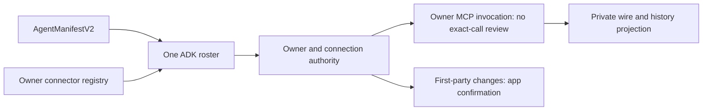
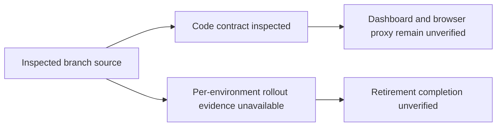

# ADK Orchestration Documentation Audit

## Visual Map

```mermaid
flowchart LR
  manifest["AgentManifestV2"] --> roster["One ADK roster"]
  registry["Owner connector registry"] --> roster
  roster --> authority["Owner and connection authority"]
  authority --> mcp["Owner MCP invocation: no exact-call review"]
  authority --> review["First-party changes: app confirmation"]
  mcp --> projection["Private wire and history projection"]
```

The [One agent hierarchy](../one/one-agent-hierarchy.md) maps the runtime owners.
This audit records revision-specific implementation and verification beneath that map.

**Earlier promoted baseline:** 2026-09-24 integration candidate `5e0ade416f8b76fb81b472e762258401fb0d1250`, containing pod branch start `4dd42848c1d7f213e3bf5bab3cb45f38ab83f9c1`, refreshed `origin/main` `75c3528bd499c99d6e8830e19e5c25a41db79e1d`, remote ADK `1748f5684a7a06906b61ea3170e682b122cc120f`, and local ADK `2f2d0399021efba757906b476266908f938e8c48`; all four are verified ancestors. This candidate was fast-forwarded onto the original pod branch, `claude/hushh-infrastructure-analysis-7o991c`. After restoring the combined dirty work, its snapshot excluding this report matched `69eefa31f445d9fa840ffa874229d6acba932c7a`; the pre-promotion root hashes also passed. The hosting and Puppy source changes and preserved pod work remain uncommitted. Source checks do not establish per-environment rollout, device acceptance, migration execution, or cleanup.

## Visual Context

Canonical visual owner: [Quality and Design System Index](README.md).
Topology audit ownership: [Runtime topology maintenance](../architecture/runtime-topology-maintenance.md).
This report records revision-bound evidence; it does not establish deployment acceptance.

## Active pod completion plan — 2026-09-27 UTC

**Branch:** `claude/hushh-infrastructure-analysis-7o991c`. Evidence base
`b13e617bc` integrates the frozen local ADK worktree at `52045f802`. Preserve concurrent
PDF work and independently active worktrees. Freeze this implementation baseline;
recheck ADK once before the combined candidate is submitted, integrating any
new delta deliberately rather than restarting the work after every upstream edit.

The target is the owner's existing GCP pod: One and its admitted specialists run
there, encrypted recovery and the Files library live in the owner's bucket, and
Hussh retains identity, consent and release coordination. Files is an encrypted
object library, not a mounted POSIX filesystem. Drive remains a connector.
Shared stays the default only for accounts without an assignment or pending setup.
Hussh Pods provisioning remains disabled. No Azure/AWS implementation is included;
the separate CRM connector is retained.

| Order | Implementation to finish | Completion evidence |
|---|---|---|
| 1. Private runtime | Bind the existing AG-UI transport, owner model, encrypted session repository and history routes to app-role pod admission. Use the same Firebase owner identity for chat encryption and an explicit HusshID boundary for pod memory. Finish specialist service ports; no shared database or model fallback. | A local browser turn and specialist invocation use the same owner pod; history survives a restart; foreign, expired and withdrawn authority refuse. Each manifest-admitted specialist has a documented usable path or an explicit product gate. |
| 2. Connector and command authority | Inject the existing MCP approval/session dependencies. Keep the hub's one-use action ledger and atomic command checkpoints authoritative through narrow authenticated ports. Preserve exact browser confirmation and structured failure states. | Approved resume executes once; changed arguments, lost responses and revocation cannot duplicate or authorize an effect. Typed/spoken commands use pod inference. |
| 3. Existing-pod Files activation | Extend the current update operation with an exact configuration-plan digest, distinct from image-only approval. Bind owner, service UID, project, region, resource identities, immutable image and Files additions. Reuse bootstrap resources, partial receipts and the existing operation lease. Support configuration-only updates. | Image approval alone cannot add resources. Queue/IAM/bucket checks precede activation; interruption leaves recoverable inventory. Activation preserves compute, ingress, keys and recovery prefixes. |
| 4. Storage and Files experience | Finish bounded chat recovery/retention, Files transfers, folder/search/history operations, analysis opt-in and exclusions, background jobs and usage estimates in existing screens. Resolve the current chat replay ceiling before rollout; describe logical deletion accurately. | Local transfer resume/integrity, concurrent revisions, restart, cancellation, undo, trash/restore, model failure and malicious-content boundaries. No credentials or file contents in hub jobs/logs. |
| 5. Upgrade and device continuity | Keep one durable Settings/Feed operation through approval, authenticated drain, restart, recovery, reconnect and verified digest. Reuse the existing trusted Puppy identity and signed same-owner/pod binding. | Local update interruption and duplicate-request checks; normal success requires installed-digest readback. No re-enrollment or silent Shared fallback. Real-device/network acceptance remains a dev check. |
| 6. Combined acceptance and dev | Run affected local contracts once after implementation, complete a local reviewer journey, then validate the exact combined SHA in GitHub CI. Deploy that branch SHA through governed dev; publish only the dev channel and exercise the normal owner approval flow. | Terminal CI/deployment results plus actual serving revisions, update receipt, retained-information continuity and real browser/device journeys. Unperformed scenarios remain unverified. |

**Compute and cost:** preserve existing owners' selected configurations. New
on-demand selection uses 1 vCPU, 1 GiB, minimum zero, maximum one, one worker and
bounded concurrency; measure its memory/socket behavior before accepting that
concurrency in dev. Files activation does not silently opt an existing pod into
that sizing. Storage of 25–50 GiB is an illustrative usage range, not a quota.
Usage and spending thresholds warn without stopping service. Close idle transport
leases as specified; a sleeping physical device is not remotely wakeable by this
software. Hub/shared capacity is evaluated independently of owner compute.

**Execution cadence:** implement cohesive changes first; use cheap static checks
and focused real-contract tests to resolve a specific risk. Do not repeatedly run
full local CI. The final combined SHA must pass canonical GitHub validation before
dev deployment. No application merge to main, UAT/production deployment, stable
release or unrelated owner upgrade is part of this pass.

**Current progress:** ADK synchronization is source-verified. The encrypted ADK
repository is mounted in the local direct AG-UI implementation; dev still serves the earlier candidate. The Nav/model correction below is locally
verified; it is not proof that all specialists or complete private chat are ready.
Existing-owner Files activation and the combined update journey remain unfinished.

## Current integration checkpoint — 2026-09-24

The existing pod branch is at `7d38d0d67`, containing remote main
`a4a42abe2`, local committed ADK `de2498bd1`, and the earlier pod baseline
`5e0ade416`. Before the final two-commit ADK refresh, the restored working set
matched 187 of 188 changed candidate paths byte for byte; this report was the
one intentional root-only edit. Of the 141 saved root files, 84 retain their
bytes in the working tree, 52 were
reconciled with the newer candidate, and five were archived with their bytes
intact: two migration-243 drafts and three local evidence files. ADK already
owns migration 243, so the active profile bridge is migration 245. The two
root-only fixture scripts remain in the working tree. The ADK worktree's
uncommitted edits remain separate. The final ADK refresh preserved 187 of 190
saved working files byte for byte and merged its three overlapping MCP files.

The latest committed ADK delta adds reviewed draft continuation after connector
reads. Its one overlapping projection file was restored from a saved patch after
the merge; the prior redacted receipt behavior remains in the working tree.
The combined external-read and governed MCP checks passed 162 tests, and the
two affected MCP modules passed mypy. The earlier committed ADK delta passed
75 focused backend and 76 focused web
tests; the combined account, PKM, profile and Drive set passed 157 backend
tests. TypeScript, documentation, diagram, governance, schema alignment, and
the production web build passed on the candidate. The complete local CI run
is **not green**: full Vitest attempts under heavy host CPU contention had
timing failures in unrelated interaction suites. Focused serial reruns passed,
including 243 tests across nine affected files and 278 tests across two large
suites. The web CI command now bounds worker count and permits a local override;
this still needs a complete terminal CI result on the final working state.
After promotion, the root branch passed 167 focused backend tests, 189 focused
web tests, 130 hosting/Puppy/update authority tests, TypeScript, skill lint,
and the full documentation/link/diagram gate. The final governed MCP/Workspace
integration passed another 128 focused backend tests. These bounded checks do
not replace the incomplete canonical CI run.

The main-defined dev pipeline prerequisite landed through the explicitly
authorized Admin PR path and passed exact-SHA post-merge smoke. Its updated
workflow was merged into this pod branch; 24 focused Cloud Build, candidate,
and release-classification checks plus 104 Connect tests passed. The preceding
190-file working set was snapshotted and restored: 187 files remain byte-identical,
and three overlapping files were reconciled with main. No governed dev
deployment, migration, pod image publication,
owner upgrade, or live acceptance is claimed. Live environment inspection found
the intended protected hub edge and distributed abuse budget incomplete; capacity
and rollback need an environment-specific rehearsal. The direct BYOC Puppy device
client and a verified supported predecessor for owner-approved pod updates also
remain launch blockers.

The blocking backend manifest now lists each database-audit suite once. Four
unreferenced, one-off local reviewer scripts were preserved in the private
operator archive and removed from the candidate; their useful acceptance
conditions belong in the existing evaluation and release records rather than
another permanent test harness.

## Fresh integration continuation — 2026-09-24

The first isolated continuation candidate was `baff32e57`, containing main
`377287dee13c9d71c4799811fb443101f07a7d47` and ADK
`e8e1dda79a85ebbc3a8aab910abba05fc065eb56`. The original pod branch remains at
`5e0ade416f8b76fb81b472e762258401fb0d1250`; no application promotion is claimed.
The candidate also rehearses 26 changed/new root paths against the hash-verified
original working snapshot. Independent root and ADK edits remain untouched.

- Preserved both source-bound Gmail delivery and saved-draft behavior, strict
  native Drive result validation and empty-search compatibility, and combined
  authored One guidance. Generated registries, capabilities and topology were
  regenerated from their owners.
- Resolved the uncommitted profile bridge's migration-number collision with ADK
  by assigning it 245 in the candidate. Release manifests and schema contracts
  align at 245; this does not mean an environment applied those migrations.
- Pod update status compares immutable digests across registry copies. Mutable
  tag equality, missing installed digests and conflicting heartbeat tags do not
  establish currency. Exact owner-operation/incarnation/provider receipts are
  required for verified completion. Successful replacement now retains its
  already persisted acknowledgement. The focused update/admission/handoff/
  rollback set passed 139 tests; this is not a live update rehearsal.
- The complete `./bin/hushh ci --include-advisory` run passed on the
  `6d4677b45` snapshot with 162 hash-verified changed paths: 9,642 frontend
  tests and 6,152 backend tests passed (three and 201 skips respectively).
  Documentation, generated contracts and governance passed. Earlier connector
  expectation and native Drive typing failures were corrected before that run.
  The newer ADK merge passed 134 focused MCP/privacy tests and 72 frontend
  configuration/persistence tests. Its optional-owner typing failure was fixed
  with an explicit owner guard. The subsequent backend gate passed 6,197 tests
  with 201 skips before the later combined run below.
- The refreshed `baff32e57` candidate subsequently passed complete canonical CI
  including advisories: 9,696 frontend tests, 6,214 backend tests and 521 voice
  tests passed (three frontend and 201 backend skips). All 176 recorded working
  paths retained their hashes through that run. Two integrated React effect
  dependencies were corrected before the passing run. This remains source
  verification, not dev acceptance.
- New ADK primitives preserve outcome-only durable MCP history and refuse writes
  after failed encrypted-settings reads. The latest source now connects the
  encrypted connector catalog to Chat ingress and review through a single-use
  owner/thread-bound reference; explicit empty catalogs prevent legacy custom
  registry fallback. OAuth refresh tokens are excluded from the turn projection.
  The nine-commit integration passed 213 focused backend tests, 132 frontend
  tests and mypy, including real in-memory MCP SDK messages. Current main's
  Drive retry and regional timeout fixes then merged without conflicts.
  Remote custom OAuth and live browser/provider
  acceptance remain unverified. All 169 non-overlapping preserved paths matched
  their pre-merge hashes; six overlapping paths were reconciled explicitly.
- A later isolated merge `9fe5ce0e47788a47d02ae412fa23c943b5e0db21` brings in
  12 further committed ADK connector/OAuth changes through
  `b7dbbf227689187336c9355aed0749b6741ef527`. The ongoing uncommitted
  ADK work is outside this revision. The Settings conflict retained both
  owner/vault session resets and OAuth Chat recovery. Of 170 pre-merge hashed
  candidate files, 168 remained byte-identical; only the two intentionally
  overlapping files changed. Focused OAuth/MCP checks passed 90 backend and
  60 frontend tests; documentation verification passed. The subsequent
  `./bin/hushh ci --include-advisory` run completed successfully on this
  merge plus the preserved working set: 9,720 frontend, 6,220 backend and
  521 voice tests passed (three frontend and 201 backend skips), with the
  subtree advisory completed. The first two attempts exposed a React effect
  lint warning and nine OAuth typing errors; both were corrected before the
  successful run. Live provider/browser acceptance remains unverified.
- The rehearsed profile bridge now refuses fixture provenance outside an explicit
  local fixture database and rejects retained contact details, including encoded
  URL paths. Existing-entity updates must reference a frozen assessment candidate;
  HusshOne still owns identity assessment and returned IDs. Claim preparation and
  PKM writes use the same canonical domain resolver. Explicit legacy `scan` remains
  supported; unknown protocol values fail closed. The focused boundary checks
  include a real PostgreSQL UPSERT rehearsal.
- A compatibility bridge based on the observed legacy dev source passed 4,218
  backend tests with 193 skips after its deployment interfaces were added.
  Its later commit `c7982672cd6ac2518269ad087ae7ef457f97a7aa` passed the full
  [GitHub CI run](https://github.com/hushh-labs/hushh-research/actions/runs/36079360736),
  including native iOS; manual-run branch freshness and PR-only checks were
  intentionally skipped. This is source verification, not live acceptance.
  The separate main pipeline prerequisite rejects missing candidate helpers before
  secret synchronization or migrations, pins the image before migration, verifies
  candidate health/provenance before traffic promotion, and protects the captured
  rollback revision. [PR #7070](https://github.com/hushh-labs/hushh-research/pull/7070)
  passed its required checks but still awaits review; no pipeline landing or
  live application deployment is claimed.
- Retirement direction is already authorized. Preserve original consent-to-Item
  linkage before disconnecting Items; backup completion alone is not restoration
  proof. The existing account-deletion fence does not quiesce all legacy Plaid
  requests/workers. A verified compatible bridge or complete maintenance barrier
  is still required before migration 239. Environment evidence stays in the
  private operational audit.
- Dev release metadata now binds reviewed notes, source revision, workflow run
  and immutable image. Installation requires an explicitly supported predecessor;
  the authored descriptor currently permits none. New incompatible approvals
  are refused before cloud access while durable recovery retains its original
  release. Focused metadata/authority checks passed 36 tests and settings passed
  seven. These checks do not establish published images or live continuity.
- A dev backup was restored to an isolated task-owned database. Read-only
  protected-record digests and original consent-to-Item linkage matched the
  source. This bounded restore check does not prove full application recovery;
  it does not authorize running migration 239 before legacy-runtime quiescence.
- The compatibility bridge's release and dev-extra migrations replayed on that
  restored database, preserving the four protected record sets' digests. Its
  dev schema guard passed afterward. The serving database was not modified.
- Three affected Wiki articles were corrected and read back: One ADK, Connected
  Systems and One App Shell. Full Wiki public-safety lint checked 564 pages with
  zero errors; 36 warnings and 439 informational findings remain dated in the
  private editorial audit. Lint does not establish universal claim freshness or
  external-link availability.
- Direct BYOC Puppy client implementation, actual two-device acceptance,
  provenance-bound release publication/update continuity, hub edge and measured
  capacity remain open. Neither these source tests nor earlier green CI establish
  dev, UAT or production readiness.

## Earlier dev readiness integration checkpoint — 2026-09-24

The earlier isolated candidate was detached at `c4e83ec66153d4cf63c76f3c9f459d2d6ee83f16`,
including ADK through `0b0b3a546dfb4b5d9200b4b7d2f6e63573ec712c` over the earlier
`cae394479` integration of the preserved pod
HEAD `5e0ade416f8b76fb81b472e762258401fb0d1250`, local ADK snapshot
`4dfe1a7c953b10f121f98b303676c94a51536f73`, and refreshed main
`f3569d646c402ef7c65edb87c366fc9738eb52b8`. The pod worktree's existing changes were
rehearsed over that candidate. The original branch and independent ADK worktree
remain unchanged by this checkpoint. The implementation below is uncommitted
candidate work, except the restored pod-image build steps included in the merge.

- Restored explicitly requested dev pod-image builds; publication remains off by
  default. Build and Cloud Build argument contracts passed (44 tests).
- Shared Chat admission uses authenticated owner identity and server-observed
  placement. Assigned/pending pods retain private-runtime routing; unknown
  placement refuses admission. Chat, hosting and MCP resume checks passed (87 tests).
- Added Hosting and Software updates to the existing owner settings hierarchy.
  Missing update eligibility no longer implies permission to install. Status is
  fetched with lifecycle streaming and cleared on owner changes. Frontend typecheck,
  26 update/navigation tests and eight Settings/status tests passed.
- Canonical local CI first stopped at two history secret-scan findings. Both were
  byte-identical to already reviewed public fixtures (a FIDO identifier and a
  wrapping-algorithm label); only those commit-specific fingerprints were excluded.
  Subsequent doc and generated-route failures were corrected. Disk exhaustion
  during dependency installation was resolved by retiring eight inactive worktrees
  after preserving unique files and retaining their branches. The full frontend
  suite then passed 9,618 tests (three skipped). Route IDs, voice screen mappings
  and stale capability graph projections were corrected. Two ADK return types and
  two outdated contract assertions were fixed; 74 focused tests and the backend
  mypy check passed. Complete canonical CI passed on the restored `cae394479`
  snapshot (9,618 frontend and 5,625 backend tests passed, with declared skips;
  PKM upgrade gate passed). The refreshed `c4e83ec` snapshot then passed the
  expanded canonical CI run: 9,619 frontend tests and 6,040 backend tests passed
  (three frontend and 199 backend skips), plus the PKM upgrade gate.
  The original branch/HEAD are unchanged. Its 113 original hashes matched before
  seven later concurrent profile-discovery edits; those newer versions were separately
  preserved and must be rehearsed before promotion.
- The dev pipeline candidate now builds/pins the backend before migration, checks
  selected non-serving revisions and nonredirect HTTP health before promotion,
  retains bounded candidate reports, and protects the rollback revision during
  post-acceptance retention. Calendar parity and its rollback classification were
  restored alongside supported voice configuration checks. A combined focused
  run passed 154 tests; the account-deletion workflow suite separately passed.
  Docs verification passed. This does not prove migration recovery or live health.
- The independent ADK worktree advanced to
  `4dfe1a7c953b10f121f98b303676c94a51536f73` during execution. Those three native MCP
  review commits are now merged into the isolated candidate. The merge guard passed
  with pod-image building preserved; the subsequent focused ADK/Chat/MCP run passed
  126 tests. Candidate work was restored from a named checkpoint; the original
  worktrees were not modified. Frontend typecheck and 90 focused navigation,
  Settings, status and MCP review tests passed after the merge. Docs and runtime
  topology checks passed, as did `git diff --check`. Refresh branch and dirty-file
  evidence again before promotion.

The blocking backend manifest now includes 25 existing suites for hosting,
pod identity/session/Puppy, upgrade admission and recovery, exact-reviewed MCP,
and dev candidate provenance. Collection alone had not exercised these contracts.
The first-tool evaluation harness now resolves native toolsets through the installed
ADK API with no owner context and closes them; its 41 tests passed.
The added set passed 410 tests; device-route fixtures now carry signed BYOC
placement and reject missing or hosted placement over HTTP. This is automated
contract evidence, not live device or update-continuity acceptance.

Execution prerequisites still pending: an explicitly identified dev owner/pod
plus two real Puppy devices, and a schema-compatible dev transition. No push,
main merge, deployment or owner upgrade was performed at this checkpoint.
Authorized affected Wiki corrections were read back; historical decisions and
private visibility were preserved. The detached candidate and named stash
`5f92631b46700c73e455d588ff0088a8f1ef1b23` retain work until verified promotion;
they are not disposable before their unique work is preserved.

| Acceptance lane | Current disposition | Required evidence |
|---|---|---|
| Source/main | Isolated snapshot CI passed; not ready for application promotion | Rehearse newer root edits; complete release and device contracts |
| Dev | No deployment in this checkpoint | Governed pipeline prerequisite, exact candidate deployment and live acceptance |
| UAT | Not assessed as ready | Deployed schema/configuration comparison and acceptance of landed SHA |
| Production | Not assessed as ready | Separate release decision, capacity, recovery and stable-channel acceptance |

Open blockers include provenance-bound release notes and compatibility, immutable
image update detection, owner-approved update continuity, the Hermes direct BYOC
relay adapter and real two-device rehearsal, and hub capacity/edge evidence.
The refreshed Wiki inventory retains 563 content-page dispositions plus the
existing private audit, with no inventory additions. Affected internal links were
checked, and edited articles were read back. Settings reports missing verified release
metadata as unverified. No production release or owner upgrade is implied.

### Migration and rollback boundary

A disposable local PostgreSQL rehearsal passed the existing tombstone/stale-writer
test. A separate bounded migration-239 rehearsal refused live Items and records
in all six protected tables without deleting their rows, then applied and replayed
after the synthetic Items were removed. These fixtures do not establish full-schema,
full-account, provider cleanup or live-environment acceptance.

The read-only dev provenance check identifies an older serving source that still
issues unconditional deletes against tables removed by migration 239. The live dev inventory also contains records that migration 239 is required to
preserve by refusing the transition; their retirement/retention decision is pending.
A compatible
bridge must preserve pre-migration cleanup, tolerate post-migration absence without
cached existence errors, and retire table-backed legacy Plaid/funding entrypoints
and workers. Verify both schemas and bind evidence to the bridge image before
using it as a rollback target. Keep the existing deletion fence and activation
contract; never treat recreation of empty tables as recovery of records or Items.
Private environment identifiers and evidence remain in the existing private audit.

## Shared MCP transport checkpoint — 2026-09-24

On ADK base `236db2404`, discovery and invocation now use the same public-HTTPS
transport. Validation happens at each socket connection: all DNS answers must
be public, TCP uses a vetted numeric address, and TLS retains the original host.
Redirect following, environment proxies, Unix sockets and connection retries are
disabled. The initial endpoint policy admits HTTPS port 443 without userinfo,
query credentials or fragments; nonstandard ports/query-based endpoints are not
admitted by this policy. Error messages do not include endpoint contents.

The implementation uses the documented public
[HTTPcore network-backend seam](https://www.encode.io/httpcore/network-backends/)
and [HTTPX transport interface](https://www.python-httpx.org/advanced/transports/).
HTTPcore is now an explicit dependency, without changing its installed version.

Verification: **104 focused tests passed**, covering the transport and existing
Workspace provider/runtime contracts. These include DNS rebinding, mixed private
and public answers, TLS host preservation, redirect/proxy refusal, timeouts, and
both MCP discovery and call factory wiring. This is automated evidence, not a
live provider, custom-registration, browser, native or release acceptance claim.

Subsequent bounded checkpoints: `8b8a5a661` verifies private-registration erasure
on disposable PostgreSQL; `5ce3f3453` adds owner-private REST registration with
29 focused checks. Neither establishes private connector UI or live execution.

Catalog admission now validates bounded JSON Schema 2020-12 object schemas,
retains their constraints, and rejects remote references, rebasing IDs and
unsupported dialects explicitly. Literal `$ref`/`$id` properties in example or
constant information are not interpreted as schema directives. Refresh rejects
late discovery at the caller boundary, not only at cache insertion. Fifty focused
catalog, refresh, privacy and Workspace tests passed; the final ordering-only
change was rechecked with 25 catalog/cache tests. This remains automated proof.

Still open: OAuth discovery protections, shared ADK toolset admission/approval, Settings/Chat
catalog refresh, governed continuation, and the approved live/release gates.
Response normalization limits are not proof of a wire-level response-byte limit.

## Product-agent hierarchy audit — 2026-09-24

### Shared native toolset integration checkpoint

`one_adk/governed_mcp_toolset.py` now subclasses installed ADK `McpToolset` and
uses native `McpTool` invocation, with bounded complete discovery, namespaced
tools, call-time connection resolution, stale catalog/connection rejection, and
an application-owned approval callback. Native tool errors are sanitized without
retrying an uncertain mutation. `RegisteredMcpToolset` now joins the admitted
typed-Chat roster for owner-private registrations and uses the existing exact-call
approval callback. It discovers through the owner registry within task-local
resources (32 connectors, four concurrent discoveries, 20-second discovery bound,
500 aggregate tools). It disables ADK's invocation-ID-only cache and clears its
retained catalog at turn teardown. Curated Google adapters remain separate until
parity is verified; custom OAuth and live browser/native proof remain open.
Native calls now establish the existing external-content barrier before dispatch;
continued calls are limited to actual native tools using exact-call review.
Tool names/annotations cannot admit an unreviewed downstream action. Since
2026-09-27 the person's own connectors run without review (founder decision);
curated rows and owner-blocked tools keep it. This does
not yet establish same-turn first-party Memory capture or curated-action parity.

The shared toolset accepts application-owned catalog and result policy ports for
curated-provider migration. Discovery remains native MCP; a catalog policy cannot
invent tools, and call arguments must satisfy both the original provider schema
and its narrowed advertised schema, each at its own local-reference root. Catalog
revisions include both views so changing either requires fresh review. Result
projection runs within the existing bounded normalization path, without a second
provider dispatch. These ports do not yet migrate Google's credential owners or
activate curated providers through this toolset. Pending reviews created with the
older revision digest require review again rather than silent compatibility.

The existing action ledger now requires exact current contract, argument and
resource-binding HMAC matches at confirmation and consumption for
`connector.mcp.invoke`. No second approval table was added. Existing non-MCP
callers retain their contracts. Thirty-seven focused tests passed, including
installed ADK invocation against a synthetic session and actual disposable
PostgreSQL rejection of changed arguments, schema revision, connection generation,
missing terms and replay. Provider/network, browser and release proof remain open.

Follow-up review fixes serialize catalog publication by discovery sequence and
recheck discovery before review and dispatch; a slower discovery cannot supersede
a later one. Native session creation is single-attempt without ADK's raw-error
retry logger. Provider error payloads are not returned, and private calls refuse
SDK HTTP-exchange diagnostics. Reserved framework tool names are excluded from
the callable set. Provider descriptions remain untrusted tool metadata, never
permission or an instruction-layer replacement.

The registry credential resolver now verifies current owner-token authority,
owner-scoped registration, connection status, expiry and the same-row credential
generation/version before opening its encrypted envelope. It covers registry-owned
credentials; Google account credentials in other services still need their owning
adapters. Forty-eight focused tests cover these paths and the existing ledger,
including native SDK session-creation failure privacy. The confirmation endpoint,
transient Chat review card, and private-registry roster now have implementations;
live proof remains open. Dynamic-tool wire/history redaction
was subsequently verified in `6cd38b9a9`; per-turn resource cleanup and owner
isolation were committed in `06a4ef2dc`.

The exact-call approval adapter now derives the existing ledger's HMAC terms
from current connector, endpoint, credential generation/version, catalog, tool,
arguments and owner session. The execution callback requires committed receipt
consumption before provider dispatch; caller-owned database transactions are
rejected. Expiry checks use wall-clock time, not a transaction-start timestamp.

Integration inspection found that the old `typed_chat` foreign key targets
legacy `agent_chat_conversations`, not current encrypted ADK sessions. Migration
244 adds an `adk_chat` reference to the existing ledger, with an exact
`(app_name,user_id,session_id)` foreign key to `one_adk_sessions`. It preserves
legacy workflows and accepts native TEXT thread identities without creating
shadow legacy conversations. The rollback intentionally retains this additive
schema and receipts; roll back callers, not historical authority evidence.
Explicit conversation deletion cascades its approval metadata, matching the
legacy conversation-ledger lifetime; this is not a separate permanent audit
archive. It also invalidates outstanding receipts. No conversation was deleted
outside the disposable synthetic test schema.

Verification: 66 focused tests passed, including disposable PostgreSQL
owner/session binding, one-time consumption, argument/catalog/grant changes,
session deletion and expiry in a long-running transaction. Migration 244 is
registered in release/schema contracts but **has not been applied to shared
environments**. Approval endpoint, live review card and root-roster activation
remain required; this checkpoint does not claim live connector acceptance.

Source baseline: ADK `6ae5a2a5965a79d75ec72e4fdf5e90b667df1a2b`.
Read-only comparison: infrastructure branch
`5e0ade416f8b76fb81b472e762258401fb0d1250`. Neither branch was switched
or merged for this audit. The earlier findings below retain their original revision.

All 19 top-level manifests were inventoried against the generated registry and
hierarchy verifier. This is structural/source evidence, not live verification of
every specialist or a latency benchmark.

| Manifest family | Declared composition / boundary |
|---|---|
| One | Chat root; bounded intro and public-search children; curated Workspace tools |
| Kai | Finance task; RIA, brochure, Investor, optimizer, fundamental, sentiment, valuation, debate, synthesis, chat children |
| Wallet | One's bounded task child; private reveal remains client-owned |
| Nav / Connections | Nav chat specialist with Consent child; Connections parent is Nav |
| Documents | Task with live-search planner, suggestions, interpreter; distinct from generic Workspace reads |
| Email | Task with read planner/interpreter, request classifier, receipt extractor, draft, enrichment |
| Location | Task plus transcriber; generated actions retain their own authority |
| Personal Information | Task plus attribute learner; not a replacement PKM store |
| Connected Systems | Chat plus CRM schema mapper; ingress/admission remains required |
| Calendar | One-parent manifest with existing tools; do not infer an independent ADK root from its presence |
| Onboarding | Deterministic runtime with bounded assessment contract |
| KYC | Route, redraft, full-redraft, extract/draft stages; not a registered local dispatch handler |
| Portfolio Import | Extract, relevance, comprehensive stages |
| Memory Segmentation / Intent / Merge / PKM Structure | Separate semantic preparation stages, not four top-level conversational routers |
| Financial Guard | Bounded guard definition, not another conversational head |

The five local dispatch registrations and five external scope-admitted identifiers
are intentionally different sets. Registry presence, a parent field, an AgentTool,
and an A2A endpoint are not interchangeable evidence. Missing explicit runtime
fields require tracing their consumer; adding a chat runtime everywhere is not an
optimization. The infrastructure comparison does not justify wholesale hierarchy
replacement; preserve its already-integrated specialist boundaries.

### Bounded correction and remaining work

- Removed three Python repetitions of One's authored cancellation policy and a
  contradictory Python Nav ownership paragraph. The YAML retains cancellation
  priority, exact confirmation requirements, direct consent tools, and Connections
  delegation. Regression coverage checks the authored policy survives composition.
- One still composes substantial static Python instructions alongside its YAML.
  Consolidate remaining static semantics through the authored owner in bounded
  parity-tested changes; keep dynamic admission/context overlays in runtime code.
- Generic Workspace reads and Documents' delegated interpretation are different
  contracts. Their selection guidance and the external-read turn barrier still
  need alignment before claiming same-turn read-to-reviewed-action composition.
- Explicit credential-scoped MCP refresh and its Settings/Chat tool inventory are
  unfinished. A cache invalidation primitive alone does not establish refresh UX.
- No claim of faster Gemini responses, complete specialist acceptance, physical
  device proof, release readiness, or deployment follows from this audit.

Verification: focused manifest/factory/One runtime tests passed **326**, with
**74 skipped**; generated registry and hierarchy checks passed. The ADK/A2A
compliance check passed **preview containment only**, explicitly reporting
`ADK_A2A_SDK_MATRIX_UNVERIFIED` and `official_a2a_v1.ready=false`.
Do not promote that result to full A2A compatibility.

Google's [ADK A2A guidance](https://adk.dev/a2a/) distinguishes local agents
from remote agents. Its [MCP integration guidance](https://adk.dev/tools-custom/mcp-tools/)
supports discovered tool integration. Apply these through the installed SDK's
tested contracts: preserve local bounded delegation, owner-bound MCP admission,
and explicit remote task compatibility gates rather than replacing every local
specialist with a network hop.

## Earlier documentation audit

See the [canonical runtime architecture visuals](../architecture/architecture.md).

```mermaid
flowchart LR
  source["Inspected branch source"] --> code["Code contract inspected"]
  code --> integration["Dashboard and browser proxy remain unverified"]
  source --> deployment["Per-environment rollout evidence unavailable"]
  deployment --> retirement["Retirement completion unverified"]
```

## Findings

| Area | Status | Evidence and boundary |
|---|---|---|
| One delegation | Verified in checkout | [Agent hierarchy](../one/one-agent-hierarchy.md) distinguishes ADK `AgentTool`, process-local dispatch, and external scoped A2A. `SPECIALIST_A2A_SCOPE_MAP` has five admitted identifiers; default shared-runtime local dispatch registers Documents, Location, Email, Nav, and Personal Information handlers. An owner-bound pod may add Connections and Connected Systems for its own turn. These are separate contracts, not one universal router. |
| Plaid vault passthrough | Implemented in inspected source; rollout unverified | [`plaid_vault.py`](../../../consent-protocol/api/routes/kai/plaid_vault.py) exposes link-token, exchange, snapshot, and remove operations with owner authorization and no vault-route database persistence. The backend transiently receives access tokens and readable upstream records. The portfolio hook loads vault financial context and derives Plaid status from it; source inspection does not establish deployed UI behavior. The legacy server-backed route is absent from the integrated source, and migration 239 is present; no per-environment migration, key cleanup, or disconnection evidence was reviewed. |
| Browser proxy caching | Needs verification | Backend vault responses set `Cache-Control: no-store`, but the inspected generic Next Kai proxy rebuilds JSON through `withRequestIdJson` without visibly forwarding that header. Do not claim browser-facing proxy responses are no-store. Verify propagation in the owning frontend/API-contract workflow. |
| Plaid exchange retry | Boundary risk | The shared [Plaid client](../../../consent-protocol/hushh_mcp/integrations/plaid/client.py) retries network failures without excluding the single-use public-token exchange. A timeout can leave the exchange outcome unknown. The Plaid owner should prove one provider attempt on that path and define recovery. |
| Plaid vault refresh and projection | Needs focused tests | [Vault sync](../../../hushh-webapp/lib/kai/plaid-vault/vault-sync.ts) reads pages before a domain write; test concurrent refresh/relink and provider failure against retention and cursor fencing. [Projection](../../../hushh-webapp/lib/kai/plaid-vault/projection.ts) needs an Item-scoped account-ID collision test before asserting holdings remain distinct across Items. |
| Shareable financial summary | Boundary proof missing | The [quality scanner](../../../hushh-webapp/lib/kai/plaid-vault/quality.ts) checks summary leaks in tests. Verify planted private identifiers and amounts at the actual grant/export boundary; the raw financial branches remain denied by policy. |
| Mail/Drive UAT | Implementation evidence; live acceptance unverified | [Acceptance record](../operations/mail-drive-uat-acceptance.md) describes source and synthetic test checkpoints. Its current status calls for separate live rollout and two-account acceptance; this source audit does not establish deployment or feature acceptance. |
| Recursive documentation model | Corrected | [Knowledge model](../operations/documentation-recursive-knowledge-model.md) now identifies the existing mobile and One Location entrypoints and their child pages. |
| Pod authority and erasure | Fixed in inspected source; rollout unverified | The integration fails closed on explicit owner-authentication errors, retains owner-scoped memory, and keeps account erasure aligned with migration 239's removed tables. Focused source tests passed. A deployed pod or migration result was not proven. |
| Cloud Build environment | Fixed in inspected source | The deploy script accepts a bounded packed Drive secret setting so the backend build step stays below Cloud Build's 100-entry environment limit. The image build contract test passed; no image was built or deployed here. |
| Native parity reports | Follow-up required | Static parity validation passed, but the report-verification command found stale generated report artifacts. Refresh them through the native parity workflow before treating those artifacts as current. |
| Runtime model claims | Repo defaults verified; deployment selection varies | [`model_catalog.py`](../../../consent-protocol/hushh_mcp/runtime_providers/model_catalog.py) lists `gemini-3.7-flash` and `gemini-3.6-flash`; manifests can use `gemini-default`, and [`live_compatibility.py`](../../../consent-protocol/hushh_mcp/runtime_providers/live_compatibility.py) documents Live model compatibility. Voice model selection is environment/configuration dependent. These sources do not support describing One as entirely model-agnostic or proving a deployed model selection. |
| Pod refresh toward main | Source ancestry verified; rollout unverified | The integration candidate contains refreshed main, remote ADK, and local ADK revisions listed above; each source SHA is an ancestor of the candidate. This verifies local Git ancestry only. It does not verify a serving image, environment rollout, or recovery rehearsal. |
| Migration 240–242 and erasure | Release contract verified locally; rollout unverified | Profile discovery is migration 240, Drive live sharing is 241, and the refreshed-main Drive live-query request contract is 242. The candidate's UAT and production contracts are exact at v242, and dev is at least v242. `drive_share_live_sources` is removed through the existing request-scoped Drive erasure helper; the erasure inventory test covers the current table set. The release verifier and full backend suite pass; no database migration execution was performed. |
| Hosting placement and existing accounts | Shared default is source-verified; user rollout unverified | The candidate resolves an account with no pod assignment and no pending setup to Hussh Shared only after registry and setup-job reads succeed. `user_gcp` means BYOC; `gcp` means Hussh Pods, whose new assignment remains gated. Existing assignments and pending setup are preserved. Model credentials do not assign or provision a pod. No user records were bulk-migrated. |
| Puppy placement and device relay | Backend source is BYOC-gated; device integration unverified | The candidate issues Puppy inference scope only for a registry-confirmed `user_gcp` deployment and binds the signed device grant to the owner and pod. Direct pod turns require that binding and the pod-local device broker; Shared and Hussh Pods are refused. The legacy hub relay remains as a compatibility path and is not proof that both devices connect to the same private pod relay. The Hermes client still lacks verified signed-binding discovery and direct BYOC endpoint connection, so end-to-end Puppy is not established. |
| Reviewer and native test contracts | Corrected in candidate | First-run reviewer authentication now uses an owner-bound authenticated state without injecting a vault passphrase; established-vault continuity still requires unlock. The harness installs its read-only guard before navigation and suppresses only listed analytics collection hosts. Native test artifact output resolves absolute or relative selected directories. These checks are local, not a live browser or device rehearsal. |
| Drive work-drain deploy settings | Restored in source; rollout unverified | The UAT workflow's four scheduler substitutions again reach the backend deploy script through one validated Cloud Build entry, under the 100-entry step limit. The script forwards the flag and OIDC identity to the runtime. Contract tests passed; no Cloud Build or scheduler run was performed. |
| Account deletion production release | Source integrated; rollout unverified | The refreshed main production workflow and cleanup scheduler contract are present in the pod candidate. The user-table inventory now distinguishes executed deletes, checked FK cascades, and the specialized Drive cleanup path; focused account tests and the local PostgreSQL Drive erasure scenarios passed. These establish source behavior, not a completed production migration, scheduler setup, or full-environment erasure rehearsal. |

## Verification update (2026-09-24)

The newest `origin/main` tip (`75c3528bd499c99d6e8830e19e5c25a41db79e1d`) arrived during the first validation pass. It adds Drive live-query consent and migration 242. The candidate was refreshed, the API service timeout conflict was resolved to preserve explicit request timeouts and the 180-second Drive query allowance, and the release and topology projections were regenerated or reconciled from their owners.

The final candidate passed the blocking checks in stage form: secret and governance checks; full frontend typecheck, lint, build, and Vitest (9,555 passed, 3 skipped); voice and native parity (521 voice tests, 18 plugin contracts); backend quality checks and the full protocol suite (5,470 passed, 198 skipped; Bandit reported zero medium/high findings); the 88-test frontend and 91-test backend integration bundle; and the MCP package tests plus packed-runtime verification. The release-contract verifier reported production and UAT at v242, with dev at least v242. The first `./bin/hushh ci` wrapper invocation was terminated during Vitest (exit 143); each blocking stage was then rerun against the refreshed candidate. No push, deploy, migration execution, or live Puppy device rehearsal occurred.

The frontend CI helper now supplies the documented dummy `BACKEND_URL` during build, so a local build does not depend on a developer's ambient backend setting. The helper's production build passed with that default.

## Current integration checkpoint (2026-09-25)

The pod branch `claude/hushh-infrastructure-analysis-7o991c` contains main
`6328e3b3e` and the frozen local ADK snapshot `39d727ad3`; the most recent
merges are `2612c2661` and `83e7fd13d`. Main's Drive cancellation migration
retains number 243. Private MCP registration and ADK Chat action authority moved
to 244 and 245; the restored, still uncommitted public-profile bridge moved to
246. The release manifest and three schema projections report head 246 in their
declared lanes. Generated agent, capability, location-card, and topology contracts
were rebuilt from their owning sources. This is source order, not evidence that
any environment applied these migrations.

Main's governed dev pipeline prerequisite and secret-range correction landed
through exact-head Admin PRs #7070 and #7072; both main post-merge smoke runs
passed. The root worktree's ongoing edits were snapshotted before integration and
restored: 163 of 179 files were byte-identical after the main merge; 16 differed
where main's Drive work, renumbered migrations, or generated projections
intersected them. The subsequent ADK merge preserved 176 of 180 snapshotted
files byte-for-byte; four were reconciled with committed MCP work or regenerated
topology. Focused ADK/backend checks passed 111 and focused web connector checks
passed 61. The scoped application candidate `a158b1561` was pushed to the
existing pod branch, followed by `e4fa7f496`, which classifies one reviewed
synthetic idempotency fixture by exact secret-scan fingerprint. CI on that SHA
exposed a stale PostgreSQL test fixture: 75 location transaction cases failed
because the fixture omitted migration 245. Commit `24b952be6` applies that
migration in the shared fixture; all 90 affected real transaction cases passed
locally. The local ADK branch then advanced to `39d727ad3`; merge `83e7fd13d`
carried its committed per-tool MCP blocks into the pod branch. Its 104 focused
backend MCP tests, 49 focused web tests, and TypeScript typecheck passed in an
isolated checkout. CI on that merge passed protocol, Web Core, MCP, integration,
and Android, then found a missing brace in the merged iOS test file. Commit
`7728848ca` closes the test method; local Swift parsing and the next iOS CI
lane passed. That CI then exposed a document-sharing browser fixture importing
Firebase through the new custom-MCP configuration module. Commit `df6f8153b`
isolates that unused fixture branch and loads the product font explicitly;
all 24 Chromium/WebKit layout cases passed locally. Main advanced during the
next run, so merge `2612c2661` brought in its location-map fix without conflict;
118 focused map tests passed. CI on `2612c2661` then exposed an outdated Mail
receipt browser fixture: its button name and callback signature no longer
matched the source. Commit `9661ec426` aligns both; all eight affected
Chromium/WebKit cases passed locally. The exact-head PR Validation run
`36111382367` passed every lane, including its CI Status Gate, on that commit.
The complete local CI suite was verified stage by stage on the combined state;
it did not produce a single terminal green `./bin/hushh ci` run. No application
candidate has been deployed to dev yet.

A read-only dev predeploy check on 2026-09-25 found legacy Plaid Items and a
funding consent record that migration 239 would refuse. The dev-specific
retirement and disposition were completed later that day; see the dated update
below. This paragraph records the earlier observation, not the current dev state.

A direct BYOC Puppy client is implemented and focused-tested in the local Hussh
One checkout at `2d07f50ef8` (22 relay tests passed). The current dev service
recognizes an existing trusted dev device and returns an owner pod endpoint, but
its binding route returned HTTP 404. The client therefore cannot complete direct
admission against the serving dev revision yet. This check did not establish a
live two-device relay. Re-enrollment is unnecessary: the device status is active.
Keep the dev deployment and physical-device acceptance gates open.

### Combined direct-access candidate (2026-09-25)

Source baseline: pod branch `e1ce90505` plus local ADK `ed8e84f79`, including
their separately frozen working-tree edits. The isolated merge was conflict-free.
The browser now discovers a BYOC endpoint only for an active owner deployment,
checks the binding and challenge against that owner, pod, app key and environment,
and pins a new address only after successful pod admission. A failed direct turn
is visible. Endpoint publication requires a registry record for verified direct
ingress on the exact service UID, URL and pod key. Puppy inference issuance and
the compatibility grant require an owner choice bound to that same BYOC pod;
the Trusted devices screen exposes grant and withdrawal, with pending pod
revocation reported rather than treated as delivered.

The environment-bound dev retirement procedure found the legacy sandbox Items
already absent upstream and removed their server-held rows. The only remaining
funding consent row matched the approved dated smoke disposition, had no linked
transfer or trade records, and was backed up privately before its deletion.
Migration 239's dev data guard is now clear. These actions do not establish that
the migration has run or that UAT and production are ready; their inventories
and retention decisions remain separate.

Local owner-direct acceptance passed with in-memory fakes. Focused binding,
trusted-device, frontend direct-turn and TypeScript checks passed. The first
complete local CI run found one stale MCP catalog test fixture after 9,798 web
tests passed; that fixture was corrected. A subsequent full local CI run passed
all blocking lanes, including 9,801 web tests and the protocol, MCP and
integration gates. The final reconnect control and conditional direct-readiness
write were added afterward, then typecheck, focused checks, documentation
governance and diff checks passed. The dev database also has a successful
pre-migration backup after cleanup. An exact-commit full CI run, exact-head
GitHub CI, governed dev deployment, live BYOC
ingress admission and two-network browser/Puppy rehearsal are still required.
No direct-ready marker should be written solely from these local checks.

### Dev deployment and owner-pod gate (2026-09-25)

The combined pod branch was promoted at `7466824d3d960616988af145d8f7b74e73bda379`.
The final full local CI and exact-SHA PR validation passed. Governed
[Deploy to Dev run 36142680344](https://github.com/hushh-labs/hushh-research/actions/runs/36142680344)
completed successfully from `main` with that application SHA, `scope=auto`, and
pod-image building enabled. Dev now serves backend revision
`consent-protocol-00094-hsk` at 100% traffic with image digest
`sha256:b91d1b2601d816307df0dbdab391cd74fa3be668ab05e66cde13b933a0470e55`,
and frontend revision `hushh-webapp-00065-sf4` at 100% traffic with image digest
`sha256:24c1208cc3f1977e59d7be47864f1acda0b92b8ee20cb8566ee69d5ded929ff3`.
Both revisions carry the application SHA; dev login and backend health returned
HTTP 200. The workflow's migration, schema, candidate-health, provenance and
semantic gates passed. Earlier attempts found a missing optional Puppy build
substitution, then a semantic verifier that treated the correct shared-runtime
`AGENT_PRIVATE_RUNTIME_REQUIRED` refusal as unhealthy; both were corrected before
this successful run. Dev Plaid cleanup and the funding-consent disposition were
completed before migration 239. These results do not establish UAT or production
schema, migration or release readiness.

The dev hub offers pod release `2026.09-dev.1+7466824d3d96.4d1f7172` at immutable
digest `sha256:4d1f7172574b32637b3fc57e5d05ea10982c1668c25a3c6dba9e619a3a233929`.
Its reviewed `supportedUpgradeDigests` list is empty, so it cannot yet be
installed on an existing owner pod. The named test owner's BYOC service is still
ready on its original service UID and immutable digest
`sha256:a91fede9767753b8623976296effc8706affbbcf09135ce8be95d0256cfa89db`.
Its live IAM policy permits only the dev hub service account; it has no public
invoker. The older source contains upgrade handoff routes, and the registry has a
durable bootstrap receipt, but this session could not prove the protected live
handoff: the operator identity was denied permission to mint a pod-audience token.
Source ancestry and Cloud Run Ready do not prove encrypted recovery or update
continuity. Keep this predecessor out of the release compatibility list until
the authenticated handoff, recovery and rollback checks pass. A normal
owner-approved installation has not occurred.

Direct BYOC ingress and endpoint publication remain closed. Do not grant a public
invoker, record `directIngressObserved`, or write `directReadiness` until the
updated pod passes live route-wall, IAM, CORS, admission and recovery checks.
Browser and trusted Puppy access to the same pod from separate networks, including
grant/revocation and replacement cases, remain unverified. The existing trusted
device does not need re-registration solely to fetch a newer relay client.
This is a dev acceptance gap, not a passing direct-access result. The separate
consumer worktree was not part of this candidate.

Freshness check after dev deployment found a migration-number collision:
`main` added `244_drive_query_notifications.sql` after the pod branch had used
244 for private MCP registration. The first trial merge was aborted. Dev's
release lane used replay mode, which executed the branch SQL without release
ledger rows; its separate parked 900-series migrations have ledger rows. The
branch migrations were then moved to 245–247, preserving their SQL bodies, so
`main` retains 244. The combined revision passed release-migration and
generated-contract checks, full local `./bin/hushh ci`, and [exact-SHA PR
Validation run 36150445456](https://github.com/hushh-labs/hushh-research/actions/runs/36150445456).
The manual CI run did not exercise the PR-only main-freshness gate. Confirm UAT
and production baselines separately before either environment is promoted.

### Refreshed branch dev release — 2026-09-25

The branch `claude/hushh-infrastructure-analysis-7o991c` supplied application
revision `52d80f53ca0be9cebccc5ea50422b6697f8d7c65` directly to the governed
dev workflow. The workflow definition ran from `main`; the application branch
was not merged into `main`. The first [dev run
36152661214](https://github.com/hushh-labs/hushh-research/actions/runs/36152661214)
passed migrations, candidate health, schema, provenance and runtime parity, but
both semantic attempts received HTTP 503 from Gmail status after a ten-second
database-pool acquisition timeout. It classified `runtime_behavior_failed` and
rolled backend traffic back to revision `consent-protocol-00094-hsk`; the new
frontend remained serving. The failure is real evidence of release-time pool
pressure, even though it did not reproduce on retry.

The same SHA passed [dev retry
36164501207](https://github.com/hushh-labs/hushh-research/actions/runs/36164501207)
with status `healthy`. At readback, backend `consent-protocol-00096-lkw` and
frontend `hushh-webapp-00067-d96` each served 100% traffic. Both revision
labels bind dev, `deploy-dev`, run `36164501207` and the application SHA.
Backend image digest is
`sha256:a101963e67e5cecb13cad5ac1a405e4e5ab3978915378478d12a12021e1de671`;
frontend image digest is
`sha256:3a79a98f3ae95772766f591850eb0de9c35fb92a9d6c91c088baf2d03d08e844`.
Backend `/health` and the dev `/login` page returned HTTP 200. The release
artifact records successful semantic, provenance, parity and post-deploy schema
checks. RIA Stage 1 remained a degraded, nonblocking provider capability.

The dev hub advertises release `2026.09-dev.1+52d80f53ca0b.f2e30aa4` for pod
image `sha256:f2e30aa434e3e1af9560458c0ba894f6d7bcebc67b40356136f9e896f23db85a`,
bound to the same source SHA and workflow run. Its reviewed predecessor list
remains empty. No existing owner pod installation, recovery rehearsal or direct
ingress admission is claimed. The named test pod remains on its older image;
Puppy and browser access from separate networks remain unverified.

Source inspection found that market refresh holds a pooled database connection
through provider calls while its advisory lock is held in
`MarketCacheStoreService.try_with_advisory_lock`. The first failed run's logs
also show pool-acquisition timeouts with `DB_POOL_MAX_SIZE=4`. At that
revision, this was a capacity and reliability follow-up for the backend owner;
the passing retry did not prove that contention was gone. A later `main` added
its own migration 245 after this candidate froze its 245–247 sequence, so
branch-to-main freshness and migration numbering must be reconciled before PR
promotion.

### Combined ADK and pod dev verification — 2026-09-25

The pod branch integrated the locally committed ADK connector, chat and
generated-contract changes through `44c22dec4`, along with the Settings icon,
Software updates title/current-version display and refresh-state corrections.
The application revision `ca6ac85672f98b8e3c3608557b0dbb03f5af1b8c`
passed [full PR Validation run 36176404262](https://github.com/hushh-labs/hushh-research/actions/runs/36176404262),
including protocol, web core and targeted contracts, integration, MCP package,
Android and iOS. The run was dispatched for the application branch; it did not
merge that branch into `main`.

[Governed dev run 36180318045](https://github.com/hushh-labs/hushh-research/actions/runs/36180318045)
used that exact SHA with `scope=auto` and selected both services. Its release
artifact reports `healthy`, with successful candidate, provenance, runtime
parity, semantic and postdeploy database checks. At readback, backend revision
`consent-protocol-00098-gdm` and frontend revision `hushh-webapp-00068-dwt`
each served 100% traffic. Both revision labels bind `dev`, `deploy-dev`, run
`36180318045` and the application SHA. Their image digests are respectively
`sha256:c972e8636bfbaefc1baccc9096afe36f32f502f4fe854124eb29f32fd14b7d0a`
and `sha256:fc4d9db6d766465da6c73541dc21dc669988dd2b3bc410691424c4485c7305a4`.
The backend `/health` and frontend `/login` returned HTTP 200. The prior
revisions `consent-protocol-00097-nk6` and `hushh-webapp-00067-d96` remain
the recorded workflow rollback targets.

The dev backend advertises pod release
`2026.09-dev.1+ca6ac85672f9.91476f7f` for immutable pod image digest
`sha256:91476f7fabba487c1cad71027a5064e24c4499f8f6fe4347839eb50e1331e6b7`.
Its metadata binds the same source SHA and dev workflow run. Its reviewed
`supportedUpgradeDigests` list is empty, so it offers no install path for the
older named test pod without a separate compatibility and recovery rehearsal.

The pool-contention fix at `5d6a7ba` had already reached dev backend revision
`consent-protocol-00097-nk6` in [run 36170671087](https://github.com/hushh-labs/hushh-research/actions/runs/36170671087).
The latest dev run's semantic check passed; sustained capacity under concurrent
market refresh and requests remains an independent load-test question. The
candidate did not install a new image on the named BYOC test pod or widen its
private ingress. An owner-approved upgrade with recovery, live browser and
Puppy access to the same pod from separate networks, and direct-route refusal
checks remain unverified. This dev source release does not establish UAT or
production readiness. The branch still requires a fresh `main` reconciliation,
including the migration 245 collision, before an application PR is ready.

## Follow-up ownership

- **Frontend proxy and dashboard integration:** verify response-header propagation through [`api-contract-change`](../../../.codex/workflows/api-contract-change/workflow.json) and migrate/verify the mounted status/refresh consumer against the vault contract through [`frontend-cache-coherence`](../../../.codex/workflows/frontend-cache-coherence/workflow.json). Evidence required: route-level header test and a same-contract dashboard integration check.
- **Plaid retry, vault sync, and grant boundaries:** use the existing vault/PKM and IAM/consent owner workflows for single-use exchange recovery, Item-scoped projection keys, concurrent cursor/retention behavior, and summary export inspection. Preserve sealed records during any key migration.
- **Plaid retirement rollout:** verify migration 239 through [`data-model-audit`](../../../.codex/workflows/data-model-audit/workflow.json), then prove migration and environment cleanup/disconnection through [`uat-scoped-deploy`](../../../.codex/workflows/uat-scoped-deploy/workflow.json) and the repo-operations owner. Evidence required: migration ledger and environment-specific cleanup results. Until then, retirement is present in inspected source, not a completed rollout.
- **Mail/Drive acceptance:** keep the acceptance record open until live rollout and the end-to-end two-account document-sharing journey pass.
- **Hosting and Puppy rollout:** carry the Shared default and preservation rules through the account-status UI and provisioning checks; verify the selected mode against live owner registry state before rollout. Complete Hermes signed-binding discovery and direct BYOC pod-relay connection, then test owner/device/pod mismatch refusal with two devices. Keep the legacy hub relay distinct until client migration is verified.
- **Main promotion:** complete full branch and restored-work checks, refresh real native parity reports through the mobile workflow, and verify the serving pod image and recovery before proposing a main merge. Source ancestry alone is not deployment evidence.

## Canonical evidence

- [One agent hierarchy](../one/one-agent-hierarchy.md) and [agent development](../../../consent-protocol/docs/reference/agent-development.md)
- [Kai brokerage connectivity architecture](../kai/kai-brokerage-connectivity-architecture.md) and [Plaid passthrough contract](../kai/plaid-vault-passthrough.md)
- [Mail/Drive UAT acceptance](../operations/mail-drive-uat-acceptance.md)
- [Backend ADK bridge and agent tree](../../../consent-protocol/hushh_mcp/adk_bridge/__init__.py), [`delegation.py`](../../../consent-protocol/hushh_mcp/adk_bridge/delegation.py), [`agent_tree.py`](../../../consent-protocol/hushh_mcp/one_adk/agent_tree.py)
- [Runtime model catalog](../../../consent-protocol/hushh_mcp/runtime_providers/model_catalog.py), [Live compatibility rules](../../../consent-protocol/hushh_mcp/runtime_providers/live_compatibility.py)

## GCP-only pod deployment correction — 2026-09-25

Evidence base: Research `c850cd53e44e92eb108723f6d582f351ac7331d3` plus the
working-tree correction. Anypoint pod deployment has been removed from the backend
resolver, renderer, model policy and trace CLI. GCP remains the only deployment
provider: managed `gcp` and owner-project `user_gcp`; `null` is inert, not hosting.
Unsupported persisted targets fail closed and are not converted or deleted.
MuleSoft/Agentforce CRM, including its CloudHub gateway, remains a separate connector.
No AWS or Azure adapter is introduced. No cloud resource is changed by this cleanup.

The obsolete Anypoint comparison and provider-specific deployment snapshot are
removed or reduced to navigation. Their useful historical lessons are retained here:

- The 2026-08-11 bootstrap rehearsal found that API enablement is asynchronous,
  Cloud Resource Manager must be enabled before use, the Storage service agent needs
  KMS permission, and the deployer needs `actAs` on the exact pod service account.
- A control-plane bootstrap token could administer KMS but could not wrap the pod
  key. The resulting design lets the pod mint and wrap its key at first boot with
  conditional creation; widening the bootstrap token was not the fix.
- A correct helper without a production caller proves no custody boundary. Check
  the rendered service and live IAM; interface parity alone does not prove capabilities.
- Identity, consent and encrypted recovery stay separate from provider lifecycle.
  PKM remains the information authority; the pod replica and conversational memory
  do not become replacement stores. Opaque billing identifiers remain separate from
  user-selected space names. A slim pod must keep hub administration routes closed.

These observations retain their original dates and do not establish current live
recovery, direct relay acceptance or Files readiness. The Files implementation is
still being verified behind its gate; command routing and two-network acceptance
remain open in their existing owning workflows.

### Verification of the GCP-only correction

- 277 compute/model/reconciliation/BYOC tests passed; a separate 161-test BYOC
  provisioning and custody run passed (overlapping suites, not additive coverage).
- Documentation parity, links, governance, skill lint and generated-agent mirror
  checks passed. All 178 remaining Mermaid figures rendered with the pinned local
  renderer; the two changed deployment figures received visual review.
- A broader boundary suite passed 103 tests and found one pre-existing failure:
  `test_the_common_layer_cannot_name_a_cloud_provider` rejects the registry's
  explicit `user_gcp` SQL predicates. Those predicates already exist at the evidence
  base and protect BYOC readiness/ingress transitions. Preserve them; the backend
  runtime-governance owner must reconcile that static rule with repository authority
  before claiming canonical CI is green.
- No deployment, owner-row conversion, main merge or automatic pod upgrade occurred.

### Files authority remains gated

The working-tree Files plan is not rollout-ready. Owner selection now travels in
signed OAuth state, the current setup job, a project/bootstrap-bound registry
setting and `PodSpec.files_library_enabled`. Legacy state defaults off, and the
fleet flag alone does not opt in an owner. Migration 928's authorization receipt
retains its strict field contract. Setup also refuses when the Files erasure
contract is absent; keep the rollout flag off until combined acceptance passes.

New dev-only migrations 937 and 938 compose stale-reservation recovery with the
existing erasure transitions and add queue/worker receipts to that same reservation.
Queue names are checked against recorded creation/configuration evidence; Cloud
Tasks has no immutable queue incarnation token. Worker operations use its captured
service-account `uniqueId`. An uncertain mutation acknowledgement retains recovery
authority and requires reconciliation; it is not silently retried or reported erased.
These are source changes, not deployed schema or successful live cleanup evidence.

### Files continuation evidence — 2026-09-25

Evidence base remains Research `c850cd53e44e92eb108723f6d582f351ac7331d3`
plus the uncommitted working tree; Hermes companion changes remain separately
uncommitted. No owner image was upgraded during these checks.

- Browser admission/renewal checks enforce signed grant ceilings, scope containment,
  version and epoch. The endpoint and direct-transport suites pass 30 tests.
- Files storage/provisioning/jobs, selection CAS and pod sessions pass 45 focused
  tests. Folder indexes can be rebuilt from encrypted manifests in pages of at most
  100; startup does not replay the library. Metadata reads recheck authority after I/O.
- PostgreSQL reproduced migration 936 dropping earlier erasure transitions.
  Migration 937 restores them and independently checks tombstones, eligible setup,
  exact snapshot and transaction isolation during stale recovery. Nine focused
  PostgreSQL restoration cases pass, including a stale-snapshot bypass attempt.
- Three private-agent consent regressions traced to integration commit `0d514ebe2`:
  automatic issuance bypassed the renewal function, denial could reuse a prior
  grant, and equal timestamps ignored event ID. Restored the original authority
  behavior while preserving newer internal-vault lineage handling. Four focused
  PostgreSQL regression cases and 81 related consent tests pass.
- Files queue/worker erasure, legacy archive parity and migration rollback/reapply
  passed eight full PostgreSQL tests. These are isolated-schema results, not live erasure. Canonical CI, live relay, voice,
  background-work and resource-capacity acceptance remain open.

The continuation now implements pod-only transcription and semantic assessment,
with typed proposals returning to the existing hub checkpoint/action ledger. Browser
confirmation remains the effects authority. A fresh typed query is not interpreted
on the shared server. Seventy focused backend checks, two direct command admission
checks, 52 browser command/endpoint checks and three resumable-download checks pass.
The new idle relay controls pass 20 backend cases and 14 Hermes cases; these suites
overlap earlier runs and their counts are not additive coverage.

The new economy shape closes Puppy after ten idle minutes and accepts only an
owner-requested metadata activation for an existing grant. The Files UI now has
paginated organization history, resumable downloads and bucket retention disclosure.
See [Private Files library](../operations/private-files-library.md) for supported
formats, pricing assumptions, retention limits and the exact rollout boundary.

The refreshed ADK dirty inventory contained eleven paths. Nine frontend paths were
applied and their 47 focused checks passed. The two reviewer-auth paths were not
applied: they restored UID-selected identities, while this branch intentionally
requires credential-derived identity and rejects an expected-UID mismatch. The ADK
worktree remains intact.

At the earlier continuation checkpoint, canonical CI was not green: generated topology was refreshed, and the architecture
ratchet exposed new/worsened seams. The Files library now delegates transfers and
analysis policy through its existing facade; Files presentation has separate directory
rows and settings. Thirteen storage/job regression cases pass after that extraction.
Other reported architecture debt remains under review; the baseline was not inflated
to suppress it. Protocol CI and the final combined checks are still running.

Live separate-network relay, actual spoken commands, Vertex environment permission,
background delivery, scale-to-zero, capacity and owner-approved image acceptance
remain required. Lost queue-delivery responses have explicit idempotent retry;
an autonomous pending-outbox sweep is not claimed. No source check establishes those
runtime outcomes. The affected private Wiki pod page was corrected and read back;
its older dated observations remain historical.

### Integrated Files structural review — 2026-09-25

Source checkpoint: `6611385c6dde4685cb2b266ecda0f3f63bf0b58e`, combining
Research `c850cd53e`, main `b95ace9a0` and frozen local ADK `af5e63e0e`.
The integration remains isolated until final canonical verification. All 161
frozen root paths still match their recorded hashes; concurrent PDF edits and the
ADK/consumer worktrees were preserved. Credential-derived reviewer identity is
retained; the incoming UID-selected reviewer behavior was deliberately excluded.

The earlier structural failure is resolved by an explicit reviewed baseline at this
source checkpoint, **not by treating size debt as fixed**. The existing baseline
records all 1,868 findings and individually identifies the 80 retained size changes:
20 cloud lifecycle, 16 test scenarios, 13 canonical declarations/generators,
10 pod authority, 10 ADK/connector, seven frontend and four Files lifecycle findings.
No dependency-direction, import-initialization or parse finding was newly accepted.
Budgets and comparison rules are unchanged; subsequent growth fails the ratchet.

The proven extractions keep existing facades: Files transfers, catalog and analysis
policy; Files presentation rows/settings/history; browser pod access, activation and
cryptography; consent-event authority; cloud assignment/publication; and bootstrap
readback. Further splitting a consent enum, route table or ordered erasure scenario
solely to reduce lines would distribute contracts or obscure the transaction proof.
Large legacy modules remain measured debt for bounded owner-led extraction.

Verification at this checkpoint:

- Frontend: 10,030 tests pass, three skipped; typecheck, route/surface generators
  and native static parity pass. Files is explicitly web-only pending native
  transfer and owner-key continuity acceptance.
- Backend: 6,645 tests pass, 201 skipped; Ruff, mypy and Bandit pass. The new
  read-only Files session test refuses writes/device access. Real PostgreSQL
  checks preserve assigned pods and reject concurrent cloud-assignment changes.
- Integration: the PKM upgrade gate passes 92 tests. MCP package build/check passes.
- Docs: links/governance pass; all 179 Mermaid figures render with the pinned
  renderer. The Files diagram has a conditional disposition tied to its owners.
- Skills: 234 trigger checks pass with no errors or warnings; skill lint and
  database release-contract validation pass. These are source checks, not live
  schema or provider-resource proof.

Canonical CI passed on `1cca405a5ddb18949c8e42a8e8e63b4d89b2e148`.
A subsequent real-model evaluation exposed a Files task-completion defect; the
corrected candidate requires its own complete run before promotion/push. Spoken
commands, separate-network browser/Puppy access, owner-approved pod updates, Cloud
Tasks delivery, idle scale-to-zero and resource consumption remain unverified. Native Files, per-file permanent deletion and an autonomous delivery
outbox sweep are not shipped claims. The new Files option applies to explicit setup;
software updates preserve existing owners' selected configuration.

### Files task completion and model alignment — 2026-09-25

Correction based on the integrated `1cca405a5` checkpoint and installed ADK source:
the background Files task had been nested under a legacy sequential agent and read
ordinary response text as JSON. It now runs as ADK's task root and accepts only
validated `finish_task` event output. One delegation and background jobs share one
manifest-owned Files builder. The operation tool declares `rename` and `move` as
an enum; authored instructions explain separate calls and current revisions.

The inherited ADK fleet uses Gemini 3.7 Flash by default and supports 3.6 Flash as
its alternative. Files uses the authored LOW thinking policy. Runtime selection
remains subject to the environment; the existing main-owned dev workflow still
pins 3.8 and must be corrected before this candidate can be deployed through it.
No application merge to main or workflow-authority bypass occurred.

Synthetic, real-provider evaluation found and then verified the corrections:

- Receipt: content read, folder creation, rename and move succeed; original bytes
  remain intact. Before the typed-operation correction the model attempted an
  unsupported operation and correctly received a refusal.
- Malicious uploaded instructions: the task returned unchanged and preserved both
  original bytes and an unrelated file in the preceding task-completion run.
- Unsupported binary: the task returned unsupported and preserved both files.
- SDK-backed regression tests exercise structured task completion, refusal to
  treat prose as completion, LOW thinking and the operation enum. The existing
  capability-matrix suite now runs in canonical backend CI; it distinguishes local
  AgentTool execution from dispatch and derives the roster from manifests.

The local Vertex 403 was an environment mismatch: the established bootstrap
configuration uses a separate GenAI project. Updating only the ignored local
GenAI project setting made all eight existing managed-runtime probes pass (text
and ADK in three locations, command audio and semantics). No IAM grant changed.
This does not establish live pod voice or deployment-service-account access.

Hermes' canonical runner passes 14 direct-client tests. Its companion changes are
local; 16 pre-existing unpublished commits on that repository's main require
preservation and explicit release accounting before a remote update. The private
Wiki pod status and internal mega-map qualification were updated and read back.
No private evidence was added to public pages.

Follow-up verification on `de85ca828`: 10,030 frontend tests passed. The canonical
run then caught a stale generated Location workflow catalog after the Files
manifest changed the shared capability revision. Regenerating through the existing
frontend capability command changes only that catalog revision. The next canonical
run must include this projection correction.

The final synthetic malicious-content run reached the 120-second deadline after a
reversible change to its own file; original bytes and the unrelated file remained
intact. The unsupported-format case completed without alteration. This is a
bounded failure, not universal organization reliability or live acceptance.
Hermes companion `c4f367a551` now preserves exact Puppy scope and treats ambiguous
control-plane status as indeterminate; its canonical runner passes 39 focused tests.
It remains local alongside the repository's pre-existing unpublished work.

### Files candidate verification and fresh main — 2026-09-25

Complete canonical local CI passed on
`5cd1fe018f9d11b74ec71cdb82c9a8dae045a81f`: 10,030 frontend tests, 522 voice
contract tests, 6,661 backend tests and the 92-test PKM gate passed. Three frontend
and 201 backend skips remain explicit. MCP package, governance, secret hygiene,
source contracts, lint, type checks and the architecture ratchet also passed.

A final freshness check found main `b4a6c5cb8e4b35a8c494f116664cedd53365efd4`.
Its consent-status owner projection and regression test were already present via
ADK. Merge `0da7429060c3273d10bb98e9a84bcef33614754a` changes only three CI-manifest
lines, adding the existing status-owner suite. The newly registered suite and
export-read deduplication checks pass. Application code is unchanged from the
canonical run; the accompanying model-policy comment now reflects the selected
3.7/3.6 pair. Remote CI must verify the final pushed head before dev deployment.

Deployment remains separate: the main-owned dev workflow still pins 3.8. Correcting
that workflow requires resolution of the current no-main-change boundary. No
application merge to main, deployment or owner-pod installation occurred in this
verification pass. Separate-network relay, actual spoken commands, real owner
bucket/queue delivery, scale-to-zero, bounded load and exact-release owner approval
remain open. The local root servers are assigned ports 3002/8002; the ignored local
configuration now selects backend 8002 and fleet model 3.7, without changing other
settings or shared environments.

GitHub run `36222708233` on `5f78ff990` exposed a Connections browser-fixture
export mismatch: the production component imports `isVaultOwnerCredential`, while
its isolated layout boundary omitted that export. The fixture now supplies a
refusing stub, consistent with its existing prohibition on custom-credential
operations. Production authorization is unchanged. The existing 38 mounted-browser
checks pass in Chromium and WebKit on both confirmation runs. The next pushed head
must complete remote CI; this fixture repair does not establish live pod acceptance.

The agent-header browser fixture also assumed an obsolete trailing status slot.
It now reads the current resting subtitle and profile button from their production
owner, preserving the layout assertions and negative control. The focused
22-case Chromium/WebKit suite passes; the complete existing layout command exits
zero across 372 Chromium, 304 WebKit and 92 mobile-Chrome cases. One Circle-menu
case required a retry in each project (three flaky results); its isolated Chromium
confirmation passed twice without retries. This remains recorded test instability,
not a reason to change unrelated product behavior or weaken assertions. These
fixture-only changes require a new exact-head remote CI result.

### Dev reviewer candidate — 2026-09-26

The frozen refresh integrates ADK `2b3b7590f3c4e38d3bf9b124c396e088533bff16`
through `60e5daac78ebf9368530abb559a3788744de2f71`, preserving the infrastructure
branch's vault-consent header requirement. The incoming selected-email fixture now
supplies that required header. Four frozen dirty frontend files already matched;
the local bootstrap's Drive credential-source correction is carried separately.
Concurrent PDF work and the original ADK worktree remain untouched.

The independent read-only security review passed 247 focused tests on the frozen
ADK revision. Pure history/activity restoration now lives behind the existing
route entrypoints; MCP result projection/redaction is separate from dispatch.
176 integrated projection, admission and privacy checks pass after those
extractions. Owner lookup, exact approval, single dispatch and post-call authority
checks retain their ordering. No public route or response contract changed.

The architecture review records 11 specific retained imported size findings,
including the bootstrap correction, with individual reasons in the existing
baseline. The extractions remove history endpoint/module growth and the dispatch
function overage. No dependency, import-initialization, threshold or comparison
rule was relaxed. Large frontend facades and security scenario suites remain
measured debt; this is not a claim that their structure is optimal. The fitness
and alignment descriptions now accurately state that governance enforces the
post-pilot new-or-worsened ratchet. Complete canonical CI is required on the final
candidate.

Pipeline-only PR #7104 landed through the authorized Admin SOP after its exact-head
checks passed; the ordinary request enabled auto-merge but did not enter the queue.
Main `fa566cfbc0790fb96af45ae087d5a4638dfd4917` passed post-merge smoke. This changes
only dev's model substitution to 3.7. The application branch was not merged into
main, and publishing an image still cannot install it on an owner pod.

The pre-deploy dev reviewer secret/review-mode preflight passes, but the current
serving application did not complete browser session bootstrap in three attempts.
No browser acceptance or update installation is inferred from preflight. Preserve
the canonical reviewer and diagnose/retest against the verified deployment; do not
reset identity or create a replacement fixture. Custom MCP tools remain excluded
from pod mode, so the shared ADK checks do not prove BYOC custom-connector support.
Real separate-network Puppy, actual pod restart/recovery, Files queue delivery and
resource measurements remain live acceptance requirements.

### Reviewer-candidate follow-up — 2026-09-26

The integrated candidate `2b0bf05814196cec9e054e7c1b239130e65517d1` exposed
an outdated Connections layout fixture in remote CI: the newer ADK UI imports
`VaultContext` and `bearerAuthorizationValue`. The synthetic fixture now supplies
its existing vault context and refuses custom credentials; it does not replace
production connector behavior. Chromium and WebKit passed all four focused sidebar
layout cases at 390px and 768px.

A provider exception already persisted a blocked upgrade approval and retained its
lease, but status presentation could incorrectly show installation or a new offer.
The correction projects the bound original operation as blocked, including after
the configured target changes, and suppresses new offers while reconciliation is
pending. Lease freshness remains visible evidence, not proof of completion.
Settings, presence and background progress prioritize attention over installation;
copy makes no unverified claim that the previous image is still serving. Pure
status projections were extracted behind existing imports; approval, replacement
and recovery authority remain with their existing owners. Focused verification:
51 backend update/authority tests and 8 Settings tests pass. Full candidate CI
and live restart/recovery acceptance remain required.

Reviewer diagnosis reached `vault_unlocked`; the earlier timeout is not evidence
of a bad passphrase or failed authentication. `/one/profile` is a compatibility
redirect into the profile pane on `/one`, so the probe must use the canonical
navigation destination. No reviewer reset or replacement account was performed.

Fresh main `51296b7b1` introduced the bounded Drive compilation path during the
reviewer pass. The isolated merge retains ADK provider-aware connection actions,
information-request receipts, and the new source-scoped compilation controls.
Focused source checks passed 162 Drive backend tests and 140 frontend contract
tests. Nineteen imported size findings were individually reviewed and recorded in
the existing fitness baseline; no dependency, import, or authority budget was
relaxed. Compilation remains a separately authorized hub connector read, not a
fallback transport for private pod turns.

The live dev migration ledger already owns IDs 937–939 for consumer MCP changes.
The pod erasure composition and Files erasure migrations were not applied there;
their unchanged SQL and rollback bodies now use 940 and 941. The dev manifest and
PostgreSQL rehearsal follow those names. All previously applied pod migration
checksums match the inspected candidate; only 940 and 941 are pending in its dev
manifest. The pre-deploy schema check still reports `drive_owner_shares` absent;
the governed release migration step must create migration 245's additive table
before candidate promotion. No manual live schema changes were performed.

The canonical reviewer authenticated and unlocked through the existing harness.
Browser status and the read-only dev registry agree on the existing BYOC pod;
provider service inventory agrees with that assignment. Its serving image is an
older predecessor, and its registry lacks `serviceUid` and an immutable image
observation. This is not a verified normal upgrade path. Keep the predecessor
compatibility list closed until machine admission, incarnation and encrypted
recovery evidence establish that transition. Do not reset or recreate the pod.

Protected machine checks returned `/pod/info` 200 with matching pod identity and
`/api/one/pod/upgrade/status` 404 on the reviewer predecessor. The missing handoff
is a legacy bootstrap prerequisite, not a normal update success or permission to
bypass approval. The temporary integration checkout was removed after its commits
were preserved on the original branch; unrelated PDF edits remained hash-identical.

### Governed dev deployment and reviewer evidence — 2026-09-26

Application evidence is bound to `4b7e86bb7e8428eba4b0a39a61e2526999c4ced7`,
not subsequent documentation or rehearsal corrections. [CI run 36235279905](https://github.com/hushh-labs/hushh-research/actions/runs/36235279905)
passed every required lane. Complete local `./bin/hushh ci` also passed, including
10,094 frontend tests, 6,770 backend tests and the 92-test PKM upgrade gate;
existing skips remain skips. The advisory merge-fidelity scan exhausted its
historical time budget. A bounded review of the two latest integration merges
found their flagged owner checks, tests and activity mappings preserved; this does
not certify all older merges.

[Dev deployment 36236325791](https://github.com/hushh-labs/hushh-research/actions/runs/36236325791)
completed through the main-owned workflow, using Cloud Build and the exact green
application SHA. Independent readback found backend `consent-protocol-00099-rwb`
and frontend `hushh-webapp-00069-qq6` each serving that SHA at 100% traffic.
Gemini 3.7 Flash is configured. Candidate health, immutable provenance, runtime
parity and schema gates passed. Semantic verification has no blocking failures,
but reports `ria_stage1_query_only` as `provider_unavailable`; the healthy release
classification does not establish that dependency's availability.

Dev migration readback confirms 940 and 941 applied, all previously observed
ledger rows unchanged, and the minimum-schema contract passing after the additive
Drive sharing table was created. These observations do not prove a live rollback.
The dev-only release `2026.09-dev.1+4b7e86bb7e84.557fb8dd` binds the same source to
pod digest `sha256:557fb8dd56c2f4d5bb3f3698ac224f8f9e61427b7cdd24fa90368034758e4734`.
Its predecessor allowlist remains empty. Publication did not install an owner pod.

| Surface | Observed result | Remaining acceptance |
| --- | --- | --- |
| Source / main | Frozen candidate CI passed; application remains on the infrastructure branch | Future main promotion requires its own current checks and release decision |
| Dev hub and frontend | Governed deployment, serving readback and schema checks passed | RIA provider dependency remains degraded; capacity and overload measurements remain open |
| Reviewer Hosting / Updates | Existing BYOC assignment preserved; check feedback, honest reported-version state, no unsupported install offer, same-session vault continuity and separate cold unlock passed | Actual approval, drain, restart, recovery and installed-digest verification require a compatible predecessor |
| Reviewer chat | Synthetic request refused with HTTP 409 `AGENT_PRIVATE_RUNTIME_REQUIRED` | End-to-end private turn is not accepted; do not substitute Shared or bypass pod authority |
| Reviewer trusted devices / Puppy | Read-only API and pane navigation verified; canonical reviewer has no enrolled devices | Separate-network Puppy cannot be proved without the real owner-bound device; warm revisit also exposes the cache-population gap below |
| Files / private commands / runtime | Source and focused suites passed | Live transfers, jobs, typed/spoken pod turns, idle behavior and resource envelope remain unverified on the legacy reviewer pod |
| UAT / production | No deployment, stable publication or application merge performed | Environment-specific compatibility, recovery, provider, capacity and release acceptance remain required |

The existing Trusted Devices rehearsal now uses the canonical profile pane and
Firebase identity for its identity-authenticated endpoint, waits for loaded
information, and accepts heartbeat-backed liveness labels. Its former PKM-token
401 and premature status assertion were probe defects. The corrected rehearsal
still fails its warm-return check: `trusted-devices-page.tsx` supplies a raw loader
to `useStaleResource` without a service-owned cache write. Track the bounded fix
under `frontend-cache-coherence`; do not weaken the warm-cache assertion or
persist private device information to disk to make it pass.

The protected reviewer pod still predates authenticated upgrade handoff and lacks
an incarnation receipt. The normal Settings installation rehearsal therefore
remains blocked. A separately authorized, recovery-verified legacy maintenance
transition is governed by `repo-operations` and the existing first-light runbook;
it must preserve the service and owner resources and is not normal-update proof.
No replacement reviewer, device enrollment, owner-pod bootstrap, destructive fault
injection or automatic upgrade was performed. Failed synthetic turns were refused
at routing admission; reviewer history and assignments were not reset.

Affected private Wiki reconciliation was attempted after deployment. The connector
reported `No refresh token is set` during durable persistence; readback did not
contain the deployment update. Wiki synchronization remains blocked on connector
reauthentication. The repository audit is the verified record for this pass.

### Device enrollment prerequisites and refreshed ADK review — 2026-09-26

Follow-up changes start from `be1e14112`; the serving deployment remains the
`4b7e86bb7` release above until a subsequent workflow and serving readback prove
otherwise. The device authorization URL was incorrectly consumed by the legacy
profile redirect. Its exact route now remains intact, and the authorization page
owns sign-in/setup readiness before offering approval. Signed-out and explicitly
incomplete accounts return a state-bound, loopback-only failure to Puppy One with
login/setup/retry guidance. Authentication restoration waits; unavailable evidence
and sessions requiring verification never enable approval. Legacy accounts retain
the existing explicit-incomplete admission contract. Server approval authority is
unchanged.

The companion Hermes client maps these errors to fixed guidance without claiming
approval was received, and rejects an error alongside an approval code. Its changes
are local to the existing companion checkout pending separate publication; browser
and device updates must both be present for the complete experience. Focused real
loopback and identity tests pass. The broader companion test file also encounters
an unrelated missing `mcp.server.fastmcp` dependency; this is not a full-suite pass.

Trusted Devices now writes its confirmed list, including an empty list, through a
service-owned memory cache. Owner/session changes and revocation fence stale
responses; account invalidation clears this metadata. The warm-navigation assertion
remains intact. Focused web routing, admission, readiness and cache checks pass;
canonical CI and live readback outcomes for this follow-up are recorded below.

Freshness review found newer main `3219483cb` and committed local ADK `15635d4b6`.
Those revisions are not represented by the deployment evidence above. The newer
ADK migration 249 deletes legacy history, checkpoints and cascading records; its
rollback does not restore them. The dev workflow applies migrations before backend
promotion, and image rollback cannot recover deleted records. Integration/deployment
of that delta requires verified deletion authority, affected-row inventory,
restore-tested recovery and old-writer/drain evidence. Executable migration tests
need their isolated database fixture; ordinary green CI does not establish that
cutover's safety. Preserve the canonical reviewer and the four active ADK UI edits.
This blocker belongs to `repo-operations` and the database release gate, while the
bounded enrollment/cache correction can ship independently.

#### Verified frontend delivery

Application `91af9a1eafb26d77310e381a524656c784e01a8d` passed complete local CI
(10,126 frontend tests, 6,770 backend tests and the 92-test PKM gate) and
[GitHub validation 36242066086](https://github.com/hushh-labs/hushh-research/actions/runs/36242066086).
Existing skips remain skips; manual-dispatch PR-only gates were intentionally
skipped, and local DCO verification passed. The architecture ratchet reports no
new or worsened findings.

[Governed dev deployment 36243025693](https://github.com/hushh-labs/hushh-research/actions/runs/36243025693)
completed successfully using the main-owned definition at `3219483cb`, Cloud Build,
and that exact branch application SHA. Auto scope selected only the frontend.
Serving readback confirmed `hushh-webapp-00070-mng`, digest
`sha256:53446638cfa12d7f75d59ea2cbef4bfde8dc01b094305e1d78305d3bea7a864e`,
Ready at 100% traffic. Backend `consent-protocol-00099-rwb` remains on `4b7e86bb7`.
No migration, owner-pod installation or stable-channel publication was part of this
frontend correction. The predeploy frontend rollback target was
`hushh-webapp-00069-qq6`; no live rollback was performed.

A real signed-out browser passed both locally and on dev: the exact authorization
page returned a state-bound `login_required` loopback result, with no approval code
and zero device-authorization POSTs. This uses a synthetic callback listener; it
is not evidence of a successfully enrolled real Puppy device. Companion commit
`c39a9751e8` contains the friendly callback/status message and is local to the
existing Hermes checkout. Its new behavior requires that client version to be
running. The companion environment has MCP 2.0.0 but lacks `mcp.server.fastmcp`,
which prevents the separate full MCP server test from passing; 43 focused identity
and loopback tests passed. Unrelated unpublished companion commits were preserved.

The canonical reviewer Trusted Devices rehearsal now passes, including the formerly
failing empty-list warm revisit, identity-authenticated API, read-only mutation guard
and same-session vault continuity. Hosting/Updates checks also passed again: existing
BYOC assignment, check feedback, honest unverified-version presentation and separate
cold-session unlock with matching key commitment. No device was enrolled and no
update was approved or installed. The legacy-pod and real-device acceptance gaps
above remain open.

Read-only dev inventory confirms migration 249 would affect existing history.
Aggregate evidence was recorded locally outside the repository; no message contents
were retrieved, no database rows changed, and the temporary proxy was stopped.
Newer ADK/main content is not silently included in this bounded frontend release.
Unrelated root PDF edits remain hash-identical, and the active ADK worktree remains
untouched. The application branch remains `claude/hushh-infrastructure-analysis-7o991c`;
no application merge to main or UAT/production deployment occurred.

### Pod presence and completion sequence — 2026-09-26

Evidence baseline: infrastructure `c07d9de94`; the correction below is a local
follow-up, not a new serving revision. The dashboard merge removed the mount of
`OneAgentPresence`, while retaining its implementation. Restore that existing
indicator alongside the roster. Distinguish registered lifecycle **Active** from
observed **Online**, **Waking**, **Asleep**, and **Not responding**. An expired or
failed wake observation must not imply Online. Scope wake deduplication and pending
results to the owner; unmount the observation when authentication changes.

Read-only identity checks distinguish trusted-device registration from encrypted
replica synchronization and Puppy relay admission. Saved profiles can target
different environments while displaying the same account. Existing registration
is not a reason to re-enroll, and a local custody message does not establish a
working pod relay. Personal-device checks and canonical-reviewer acceptance must
remain separate evidence lanes.

The affected private Founder Wiki page accepted the frontend deployment correction
and readback contained the exact deployed source revision. The earlier durable-write
failure is resolved for this edit; this does not certify the freshness of every page.

#### Ordered completion gates

| Stage | Action | Exit evidence |
|---|---|---|
| 1. Restore presence | Verify this bounded correction, then deploy its exact CI-green branch SHA through governed dev CI | Dashboard shows authoritative state; account switch and late/failed wake results cannot show false Online; serving SHA readback |
| 2. Connect the existing device | Run the existing dev profile; match its remote device record, approved grant and pod incarnation; diagnose encrypted-sync failure separately | Current heartbeat, owner-approved Puppy binding, signed endpoint verification and real request reaching the same pod as the browser |
| 3. Legacy handoff | Follow the existing first-light runbook's named-pod maintenance procedure after preservation and recovery checks | Preserved service/storage identity, authenticated handoff routes, encrypted recovery and installed image observation; bootstrap recorded separately from normal update |
| 4. Prove normal updates | Offer a dev-only compatible release; use the exact-release owner approval in Settings | One durable operation, authenticated drain, restart, information continuity and verified installed digest; refresh/reconnect does not duplicate installation |
| 5. Prove device access | Use browser and existing trusted device on separate networks | Same owner/pod, grant withdrawal, reconnect, cancellation and expiry; no substitute synthetic test for real-device acceptance |
| 6. Resolve migration 249 | Freeze the newer ADK delta; verify the deletion decision's exact scope, restore-tested backup, cascades, command checkpoints and writer cutover | Executable SQL tests on an isolated database, preserved person-key rows, explicit history disposition and a compatible recovery/roll-forward plan before backend deployment |
| 7. Final readiness | Complete canonical CI for the combined candidate; deploy the exact branch SHA and repeat affected reviewer journeys | Source/serving receipts, private Wiki readback and explicit unverified rows; main, UAT and production remain separate decisions |

Migration 249 currently runs in replay mode and deliberately deletes legacy chat
and command-session history with dependent records. Its rollback is a no-op; an
application image rollback alone cannot restore history. The SQL's dated decision
comment is not by itself proof of the affected owners' cutover scope or a working
recovery procedure. Do not execute it merely to unblock the release. Preserve
existing owner resources, assignments, devices and history while establishing that
evidence. The authoritative maintenance procedure remains the
[first-light runbook](../operations/dev-pod-first-light-runbook.md#one-time-legacy-bootstrap-exception);
this sequence adds no parallel upgrade mechanism.

Local follow-up verification: 41 focused presence/dashboard/wake tests passed with
two existing dashboard skips; frontend typecheck, affected-file ESLint, docs
verification and `git diff --check` passed. Independent read-only review identified
a stale Online result after a failed keepalive; the correction now invalidates it
and has a regression case. Complete candidate CI and live status acceptance remain
required before describing this follow-up as deployed.

### 2026-09-26 compatibility candidate: source verification in progress

The isolated candidate combines pod status baseline `c40c46f41`, main
`32f6bc1ed`, and frozen local ADK `f81eae91f`; merge revision `4c2280f8d`
is followed by compatibility corrections under verification. Root PDF work and
the active ADK worktree remain preserved. This is source evidence, not a
deployment receipt.

The public-profile bridge already owns migration 249. The incoming ADK history
cleanup is therefore parked as **250**, absent from the release manifest, with
schema expectations remaining 249. Earlier references to chat cleanup 249 in
this dated audit identify its original ADK numbering. The accepted deletion
decision does not prove writer drain or authorize interruption of active effects.

The initial compatibility image temporarily refuses history mutations before
dispatch with `CHAT_HISTORY_UPGRADING` (503, no-store, Retry-After). Its cipher
backstop also refuses sealing while retaining owner-key reads. After this image
serves and old writers drain, a separate verified image enables BYOK writes.
Only then can cleanup activation proceed. Rollback must remain on a BYOK-capable
image; the cleanup SQL rollback is not information recovery.

Focused checks: 117 backend tests passed, 124 frontend tests passed (two skipped).
A later isolated run passed 89 bridge, BYOK, timing and SQL checks without skips.
SQL checks restored only dev schema definitions into a disposable PostgreSQL 14
instance with synthetic records. A subsequent schema restore and all six cutover
checks also passed on PostgreSQL 15.18, matching dev's major/minor version. No live
records were copied or mutated. Cutover activation still needs writer and active
effect drain checks; passing deletion fixtures does not establish that drain. Duplicate voice route registrations were
removed; private action-search refusal and hub-owned command coordination remain
distinct. Canonical CI, isolated SQL acceptance, live release/readback, existing
pod maintenance and real-device relay acceptance remain pending.

The imported Mail layout removed returning users' receipt sync/disconnect controls.
The controls were restored in the existing header; short copy retains a shopping
summary without implying automatic PKM persistence. Existing receipt/cache and
connection assertions are retained. The architecture ratchet records 74 reviewed
size findings individually: 72 imported findings, one necessary BYOK fixture line,
and a locally reduced timing module. No budgets or authority checks were relaxed.

The first complete integrated run passed 10,202 frontend tests (three skipped)
and 522 native/voice contract checks. Backend verification reported 6,948 passed,
201 skipped and three failures: two obsolete voice-route responses and a shared
hub fixture inheriting pod mode. The correction retains main's retirement
responses, removes the obsolete ADK Live router, and explicitly sets shared mode
in the refusal test. The pod's separately authenticated Files/command routes are
now pinned in its exact route inventory, included in canonical CI. Reverification
is required on the corrected revision. Maintained Live voice still selects the
hub provider; recorded pod commands have a separate authority path. Neither
source inspection nor route tests establish live private voice acceptance.

### Compatibility validation and next-stage guards — 2026-09-26

The frozen bridge `d2326808d` passed complete local CI (10,202 frontend, 522
native/voice, 6,986 backend and 92 backend PKM tests). GitHub run 36280787865
found one additional PostgreSQL checkpoint fixture still injecting the platform
cipher. Commit `dbd658599` uses the existing owner chat-cipher fixture; all 19
real PostgreSQL command-finalization tests then passed. The full rerun passed its frontend lane. Its protocol lane rejected the
checkpoint database URL because connector tests require their own isolated target;
protocol verification is being repeated with normal disposable connector fixtures.
The 19 checkpoint database cases passed separately on the same source revision. No dev acceptance follows
from the earlier local pass.

The isolated follow-up merges main `e91b6b56d` while preserving pod owner guards
and setup prerequisites. Its AI-setup integration passed 61 focused frontend
tests, typecheck and five portfolio-import tests. Voice selection now follows
verified hosting; server ticket and socket admission independently refuse
non-Shared placement. Eleven placement tests and 17 voice-route tests pass.
Migration 250 remains excluded from the release manifest. Its strengthened
cutover refuses unresolved effects, recent writers, unknown session namespaces,
missing tables and lock contention; 40 isolated PostgreSQL cases pass. These
checks do not establish a live drain, retained-information recovery, pod upgrade
or separate-network device acceptance. Application promotion, dev rollout and
cutover remain separate evidence steps.

The staged writer candidate enables BYOK writes in source only. Deploy it only
after the bridge serves 100% and incompatible writers are drained; the source
flag is not live evidence. Its rollback target is the read-capable bridge, never
a platform-key writer. Migration 250 remains deferred in this writer stage.

### Crash recovery and continued verification — 2026-09-26

After the host restart, the detached writer candidate `322b51915` was recovered
from Git into an ignored workspace directory. The original infrastructure branch
remained at `dbd658599`; its exact-SHA GitHub CI run 36281591910 passed. The
governed dev compatibility deployment is run 36282936734; dispatch and successful
build steps do not establish serving or reviewer acceptance.

The recovered candidate's complete CI attempt passed governance, typecheck,
lint and production build, then reported 10,199 passing frontend tests and eight
failures in a microphone fixture missing its verified hosting precondition.
The fixture now explicitly selects pod commands; all 14 focused tests pass.
Backend checking found a WebSocket exception-detail typing error, corrected at
the existing admission boundary; targeted mypy, Ruff and 17 voice tests pass.
Only those two reviewed module-size findings were updated in the debt baseline.
Package verification and integration (101 frontend and 92 backend PKM tests)
passed; complete final-candidate CI remains required.

Synthetic recovery on `322b51915` retained 12 real owner-cipher fields across
cutover and idempotent replay. After a PostgreSQL 15.18 restart, guarded restores
recovered 48 pre-cutover rows and 32 post-cutover rows exactly; fresh cipher
contexts decrypted all 12 retained fields in each clone. Wrong checksums and
nonempty restore targets were refused. This used eight source-defined relations,
synthetic information and disposable local resources, which were removed. It
does not prove live writer drain, Cloud SQL recovery or browser continuity.

Comparison with frozen ADK `fc6449bbe` found no missing Drive or migration
authority correction. The missing connector-schema import isolation was carried
as `b3aa053a0`; active ADK UI edits remain in their owning worktree. The candidate
retains immutable migration 904 plus additive 913 and guarded parked 250; the
ADK tree's historical migration edits must not replace those contracts.

### Dev bridge serving and bounded maintenance — 2026-09-26

Exact bridge `dbd658599` passed GitHub CI 36281591910 and governed dev
deployment 36282936734. Serving readback verified the backend and frontend
source revision. The history route returns structured `CHAT_HISTORY_UPGRADING`
with retry guidance; additive public-profile migration 249 is present and
history cleanup 250 remains parked. This does not establish writer or cutover
acceptance.

For the approved legacy-pod maintenance, a temporary hub revision uses the same
immutable bridge image, with only the upgrade sweep disabled. Its health and
100% traffic were verified; owner approval remains required. The reviewer
reservation was reconciled through the existing exact-lease compare-and-set
after source, registry and provider observations established a pre-submission
refusal. No pod image or owner approval changed. Historical error logs lack an
owner identifier and are supporting, not standalone, evidence. The new pod
image copy was refused by the destination registry with HTTP 403; maintenance
remains incomplete pending verification of the existing owner-authorized
repository and copying identity.

The reviewer Trusted Devices rehearsal passed with a narrowly allowed pod-wake
request. That account has no enrolled devices, so this is not real-device relay
acceptance. The writer candidate `588e16753` passed its complete backend lane:
6,994 passed and 239 skipped. Final combined canonical CI remains required.

An additional replacement guard rejects a changed or malformed caller-observed
Cloud Run resource version before submitting a replacement, preserving the
service-UID fence. Focused client/update checks passed 153 tests; reviewer guard
checks passed 25. An unknown provider outcome still retains its operation lease.
A known pre-submission refusal may require operator reconciliation through the
existing workflow; no timeout-based lease clearing or automatic retry was added.

### Reviewer maintenance and direct admission — 2026-09-26

Writer revision `3d2e95e86` passed complete canonical local CI (10,207 frontend,
6,994 backend, 522 voice, 101 frontend integration and 92 backend PKM checks)
and GitHub CI 36286167834. Governed dev deployment 36287199197 is in progress;
this entry does not establish its serving result. History cleanup 250 remains
parked. The developer branch and unrelated PDF work remain preserved.

The approved existing reviewer pod maintenance now verifies the immutable dev
bridge image, unchanged service identity and recovery resource bindings,
authenticated idle handoff, durable public-key continuity across restart and
installed-digest registry readback. Owner-cloud repository setup was repaired
through the existing bootstrap identity. These are maintenance receipts, not a
normal owner-approved Settings update. Initial sealed storage contained no
retained user file fixture; identity recovery is not user-file continuity proof.
The correct protected handoff route is `/api/one/pod/upgrade/status`, including
its required pod identity header. An earlier probe of another path cannot prove
route absence; legacy classification also used the installed revision's source.

The controlled reviewer direct ingress passes dev CORS, anonymous machine-route
refusal and authenticated browser admission. Readiness was published for the
verified incarnation. Live testing found a consumed-grant reconnect refusal:
the pod correctly rejects repeated binding versions, while the browser reused
the hub's latest consumed envelope. The correction reissues once through the
owner-authenticated hub and repeats signature, owner, endpoint, challenge and
possession validation before pinning. The patched SDK passed signed endpoint
discovery against dev; it is not yet the deployed frontend. Focused coverage
includes bounded retry, hub refusal, revocation, invalid signatures and no
premature pin. Cross-authority concurrent revocation remains an owning
`iam-consent-governance` follow-up: higher signed grants can supersede tombstones,
and device revocation and grant issuance do not yet share an atomic boundary.

Provisioning now exports the canonical active and retained public verifiers,
explicit environment/CORS strings, and enables durable BYOC identity. No private
signing material is rendered. Live durable-key evidence remains necessary even
with that setting enabled. The two backend renderer suites pass 63 tests; the
browser endpoint suite passes 26. Independent read-only review checked these
trust boundaries. Eight measured size findings are explicitly rebaselined for
these bounded authority corrections and their tests; no threshold or rule is
weakened, and no unrelated finding is accepted. This retains the owning facades
rather than introducing a structural migration into the release repair.

The affected private Wiki section was updated and read back. Real Hermes access,
separate-network Puppy acceptance, normal software-update continuity, live BYOK
writer acceptance and destructive-history cutover remain separate open gates.

### Dev writer serving and revocation repair — 2026-09-26

Writer `3d2e95e869c05054c45bd736ad844ea7d0816013` passed canonical CI
and GitHub run 36286167834. Governed dev deployment 36287199197 completed
successfully; serving readback verified both services at 100% traffic on that
exact source revision. The upgrade sweep is enabled and exact owner approval
remains required. Cleanup 250 remains parked.

The reviewer chat journey is **not accepted**: the rich chat client still posts
to the shared endpoint and a BYOC owner receives
`AGENT_PRIVATE_RUNTIME_REQUIRED`. The existing JSON pod-turn adapter does not
preserve ADK pending calls, MCP review/resume or the rich event contract. The
owning `product-agent-development` correction must reuse the AG-UI subscriber,
a durable owner-pod ADK session adapter and the existing hub action ledger
through scoped authority ports. Neither shared fallback nor mounting the
Postgres-dependent shared router into the pod is a correct fix.

The follow-up to `c4e04a11c` serializes binding publication with device revocation,
checks the exact owner/pod/device tuple and previous version under row locks,
and reports only sanitized storage errors. The device screen now revokes hub
issuance first, then fences the highest issued binding at the pod. Delayed
lower-version bindings are refused. An undelivered pod revocation remains
explicitly pending; cross-network revocation is not claimed atomic. The existing
signed-intent courier is wired, and acknowledgment atomically filters the current
queue so concurrent additions survive. Nine real PostgreSQL checks and seven
pod courier checks pass, alongside the earlier 53 focused binding/route checks,
43 frontend checks and TypeScript. Full candidate CI remains required. The
courier fixture now explicitly declares BYOC instead of relying on test order.

The personal dev pod retains its image, service identity and durable key after
configuration maintenance. Public verification keys, environment and dev CORS
were reconciled; ingress/IAM and anonymous machine-route refusal were checked.
Its direct-readiness publication, owner Puppy grant and separate-network
inference remain pending. Registration and heartbeat are not relay acceptance.
Normal Settings-approved upgrade continuity and destructive-history cutover
remain open gates, with no application merge or UAT/production deployment.

### Existing-device admission and verified security candidate — 2026-09-26

Revision `c00c43047` passed complete local CI: 10,215 frontend tests, 522 voice
contract tests, 6,995 backend tests, 101 frontend integration tests and 92 PKM
checks. It is pushed to the existing infrastructure branch; GitHub validation
`36290652934` is running. This is not a serving-revision claim. Main advanced
concurrently and the application PR has conflicts; no application merge occurred.

The approved dev personal-pod maintenance replaced the old image on the same
service with the immutable, previously CI-verified writer image from `3d2e95e86`.
The old binding parser omitted the newer signed deployment field and rejected
valid hub signatures. Installed digest, unchanged environment and resource shape,
durable key continuity, encrypted-log recovery, authenticated handoff and protected
machine routes passed. An existing Hermes device then passed signed zero-scope
admission without re-enrollment. Signed endpoint publication passed readback.
This does not grant Puppy inference or prove separate-network browser/device
acceptance, and it is separate from a normal Settings-approved software update.

Reviewer Files access remains blocked by `FILES_NOT_ENABLED`: existing-owner
capability activation must use the governed setup/update contract with verified
storage and queue prerequisites. No flag-only activation was performed. Rich chat
still targets the shared endpoint and receives `AGENT_PRIVATE_RUNTIME_REQUIRED`.
The next source stage introduces a storage port behind the existing encrypted ADK
session service; it does not yet establish pod chat or MCP review parity. Cleanup
250 remains parked. Private operational receipts remain outside maintained docs.

### Image-update configuration and dev validation — 2026-09-27 UTC

Exact revision `c00c43047` passed GitHub CI `36290652934`; governed dev deployment
`36291911318` completed successfully. Serving backend `consent-protocol-00103-7dw`
and frontend `hushh-webapp-00073-pg2` both carry that source revision at 100% traffic.
The model probe returned a provider-side 403 refusal, so AI/voice acceptance
remains unverified despite deployment success. The application has not merged into main.

A read-only normal-update preflight found that re-rendering an existing BYOC pod
would remove its dev browser origin, enable Memory Bank, local PKM and migration
routes, and change its observed economy configuration to warm. Image approval
alone does not authorize those changes. The follow-up source correction preserves
observed operating policy, including absent flags, only in the image-upgrade path;
explicit provisioning changes retain their existing owner. Fresh verification
keys and application/model configuration still come from the canonical renderer.
The 69 focused upgrade/provisioning checks pass. The stable post-deployment
configuration preflight passes; a normal owner-approved update remains required.

The predecessor and candidate share identical blobs for 24 inspected recovery,
identity, authority, dependency and fixture files. The 112 synthetic recovery
checks pass; this is unchanged-format evidence, not live cross-image acceptance.

The real PostgreSQL erasure suite also exposed multiplicative receipt validation:
a valid repository-grant check can repeat the memory-binding prerequisite over
100,000 times before finalization. Preserve fail-closed guards while removing
repeated evaluation through the owning migration/release workflow. This remains
an erasure-capacity defect; do not remove its tests or claim cutover readiness.

The image-only preservation helper passed a stable live configuration preflight
after that deployment. The next dev descriptor admits only the inspected bridge
digest, based on unchanged recovery blobs, synthetic recovery and configuration
comparison; it neither installs an update nor proves live upgrade completion.

Forward dev-only migration 942 removes same-family recursion in the secret and
runtime-account receipt validators, retaining all shared prerequisites and exact
predecessor payload/status checks. Its rollback restores the previous predicates.
All 40 PostgreSQL authority tests and the direct old/new predicate equivalence
check pass, including missing/null/malformed predecessors. Full combined CI and
governed deployment remain required; no erasure or history deletion was executed.

The canonical reviewer Trusted Devices browser rehearsal passed against serving
`c00c43047`: cold vault gate, profile navigation, warm revisit and device sync-state
contracts. This does not establish real-device relay or Puppy inference acceptance.

### Combined local verification — 2026-09-27 UTC

The combined core run completed with 7,079 backend tests passing and 239 skipped.
Two failures were investigated: MCP timeout diagnostics blocked while reading a
live child's stderr, and Puppy could raise an uncaught deadline error between
frames. Diagnostics now stop only the test-owned child before bounded collection;
Puppy's existing timeout handler now owns both deadline paths. All 18 focused
broker/protocol checks pass, including an already-expired deadline. The initial
core invocation remains a failed run; it is not relabeled as green.

Frontend typecheck, lint and production build passed. Integration and all 92 PKM
checks passed. Package checks and the packed-runtime initialization/tool-call
rehearsal passed after rerunning its startup timeout. Complete final-SHA GitHub
validation is still required before deployment. No timeout was loosened and no
core test was removed. The canonical reviewer's live Software updates preflight
preserved its BYOC assignment and bridge version; no installation was requested.

The final refresh includes CI-only ADK/main revision `ade6a3579`; its 23 workflow
contract tests and protocol manifest parity pass. Merge-warning review confirmed
history/connector helper extraction, generated-contract additions, diagram moves,
and deliberate migration deferral. It also found and corrected explicit primary
reviewer selection when a shared passphrase matched the counterpart. All 26
review-mode tests pass; counterpart authentication and unknown-identity refusal
remain enforced. The Plaid guide no longer recommends an unused history-window
setting or describes transient provider processing as vault-only residence.

TestFlight's incoming early backend-provenance probe has a possible stale-evidence
window before shipping. The owning `release-ios-appstore` workflow must recheck
release-time provenance; dev deployment does not exercise or establish that lane.

### Local ADK refresh and pod Mail boundary — 2026-09-27 UTC

Integration commit `29ef8d991` includes frozen local ADK `c8f718230` on the
infrastructure branch candidate. The ADK worktree remained clean and untouched;
the root's PDF edits remain separate. The incoming catalog selects Gemini 3.6
Flash. Calendar PATCH behavior, bounded query options, connector reviews and
account-cleanup changes are retained. Generated registries, capability graphs,
Location cards and topology are regenerated from their owners after integration.

The dev deployment recipe now selects the existing personal Gemini bridge. An
impersonated dev runtime identity completed a synthetic provider request through
that project. This proves provider access, not that the changed deployment recipe
is serving. Owner-pod inference retains its own runtime configuration; the shared
dev bridge is not a fallback for a failed private connection.

The refreshed Mail delegation needed explicit pod dependencies: its planner and
interpreter now accept the existing owner model adapter, while bounded metadata
reads use the authenticated hub connector door. OAuth credentials remain at the
hub. A short-lived opaque observation receipt is reconstructed against the current
owner, scope token, registry incarnation and Mail grant after interpretation.
Reconnect, revocation or replacement suppresses the stale answer. This receipt
does not attest the caller's running incarnation beyond the existing pod identity
contract, and it grants no new access. These are source changes awaiting dev
deployment and live connector acceptance.

Pod Mail invocation now uses an explicit ingress-bound admission callback, rather
than trying to validate a local session as a hub vault-owner token. It checks the
exact owner and credential, rechecks the existing session authority, and preserves
ADK's invocation/function-call IDs. The ADK session remains keyed by HusshID for
memory isolation. The typed surface is supplied by the pod route, never inferred
from client screen context. Mail's separate information grant remains mandatory.
Nav and Drive's remaining shared-authority assumptions are not resolved by this
Mail change.

Focused evidence: 66 account-cleanup tests passed; 38 Email gene/delegated-read
tests passed; 149 metadata/broker/runtime tests passed; 21 Email service/wrapper
tests passed after correcting the real pod admission mismatch; and 327 affected
pod-turn/text-runtime/agent-tree/broker tests passed with 73 skips. These groups
overlap and are not an aggregate test count. Read-only review found no blocking
defect in the final pod admission boundary. GitHub validation and live acceptance
are still separate gates.

Verification uses focused affected contracts and the final candidate's GitHub CI;
another full local CI run is not required by this execution pass. Existing-owner
Files activation, full private conversation-store wiring, normal Settings update
acceptance and separate-network Puppy inference remain open. No new owner upgrade,
main merge, history deletion or deployment is established by this source refresh.

The subsequent local ADK checkpoint `b45d15f48` is integrated at `1a515a3e3`:
full Vitest now has its own PR gate, protocol files run in parallel with
shared-database PostgreSQL files kept serial, and queue validation reuses PR
evidence only for an identical Git tree. The existing bounded Vitest worker
setting moved to the new owning suite script. The queue verifier self-test,
shell syntax checks and 16 CI-wiring tests passed; no full local CI was repeated.

The architecture ratchet records 52 individual size-debt dispositions for this
integrated source: incoming ADK/UI/CI changes and the pod Mail authority seams.
Existing limits, dependency-direction checks and import-side-effect checks are
unchanged. This reviewed baseline retains measured debt; it does not declare the
large account, conversation or orchestration owners structurally complete.

### Local completion checkpoint — 2026-09-27 UTC

Evidence base: `61850570d`, including local ADK `b45d15f48`. GitHub run
`36298984969` found six backend failures caused by pod-mode import leakage during
test collection. The two importing test modules now scope that environment
change; the affected shared and pod tests pass together (76 tests). This is a
local correction awaiting validation on the next combined candidate.

The pod recovery log now supports conditional appends and bounded incremental
replay anchored by sequence, object key and hash. Its chain reader is extracted
behind the same public log interface. A request-admitted ADK repository projects
owner-key ciphertext into a shared process cache; it does not use the hub database
or retain a chat key. The existing encrypted session service passes synthetic
restart, stale-write, owner, expired-admission and erasure-fence checks against
this adapter. The focused log/session group passed 128 tests.

This adapter is not yet mounted on the private chat route. Cold recovery currently
refuses beyond 10,000 global records or 64 MiB of replay; the ciphertext projection
is bounded at 1,000 retained identities and 32 MiB. A tombstone is logical deletion,
not physical removal of historical ciphertext. These limits and retained history
must be resolved or explicitly accepted in the owning recovery/retention design
before declaring private conversation storage ready for rollout.

Next local completion gates are the AG-UI admission/model/session wiring, exact
connector approval ports using the existing action authority, and explicit
owner-approved Files activation on existing pods. Normal software-update and
real-device journeys follow on the combined candidate. No new deployment or owner
update is established by these local checks.

### Pod Nav and model transport correction — 2026-09-27 UTC

Against `5ee902e92`, private Nav now uses explicit invocation and consent-read
ports. Its tool no longer constructs the shared Consent Center in pod mode.
The owner and information grant are rechecked before returning the answer;
private Connections remains refused until its own port is supplied. Shared Nav
retains its existing owner-token validation.

The provider adapter now carries the owner's selected Vertex API-key transport,
project and location into the existing client factory. Connected Systems receives
the selected pod model instead of choosing its shared default. An optional explicit
ADK session-owner binding prepares the Firebase chat/HusshID memory boundary
without changing legacy pod text turns.

The focused Nav, pod-specialist and provider group passed 135 tests, including a
real scripted ADK Consent-child turn, no-hub-database negative controls and revoked
admission after a read. No full local CI or new deployment was run for this batch.

### Upgrade custody and Files checkpoint boundary — 2026-09-27 UTC

Image-only BYOC updates now preserve the observed encrypted storage coordinates,
wrapped-key and signing-secret references, durable identity selection and owner
Vertex/ADC settings, including absent settings. A changed runtime service account
refuses before image copy, draining or replacement; it requires reconciliation.
These rules do not authorize enabling Files or changing the owner's compute tier.
The upgrade suite passed 62 tests, including configuration drift and identity refusal.

The existing bootstrap applier has a separate mandatory checkpoint callback for
step intent and qualified observations. Callback failure stops subsequent cloud
work; the existing best-effort narrative callback retains its behavior. Provider
error bodies, request bodies and credentials are excluded from checkpoint payloads.
Creation-observation qualification was extracted behind the same substrate validators;
the combined bootstrap/substrate suite passed 160 tests after that extraction.

**Remaining activation work:** connect this hook to the exact approved Files plan
and existing upgrade lease. Advance the captured registry observation only after
an acknowledged conditional write. Erasure can reserve the registry during cloud
work; its existing late compute acknowledgement cannot represent queue/IAM receipts.
The backend/erasure owner must add a bounded retention transition and terminal
reconciliation before activation can safely become available. The hook alone does
not activate Files or establish recovery. Do not replay whole-pod bootstrap to work
around this gap, resize existing pods, or clear an unresolved upgrade lease.

The architecture fitness check identified additional measured size findings in
the touched legacy modules and tests. The bootstrap observation extraction reduces
that source hotspot; the remaining findings still need reconciliation before the
combined candidate is submitted. No threshold or baseline was relaxed. No full
local CI, push, deployment, main merge or owner update occurred in this batch.

### Local ADK integration — 2026-09-27

The infrastructure candidate integrates frozen local ADK `52045f8023583347067dac4e6b76d1f675fa3364` over `0560c2536`. Ongoing PDF edits remain outside this integration. Generated product-agent, capability and topology projections were regenerated from their owners. Gmail mailbox migration 250 is active; destructive legacy-history cleanup remains parked as 251, after the existing public-profile bridge 249. No history deletion or deployment occurred in this integration.

Bounded Gmail message/thread reads now use the pod's existing signed observation and grant recheck. Hub-owned mailbox writes are excluded from the pod roster pending a scoped authority port. Shared mailbox proposals verify the SDK owner and live owner capability; execution binds refreshed credentials to the reviewed Gmail account. Lost responses and partially completed trash batches report an unknown outcome and cannot replay the claimed proposal.

The incoming ADK policy intentionally removes exact-call review for the owner's private MCP connectors, including subsequent calls after a read. Owner/connection authority and credential redaction remain; this is not evidence of deterministic protection against instructions in third-party content. One's instructions now describe that policy consistently. Drive sharing/trash and Gmail mailbox changes retain their respective app review.

Focused evidence: Gmail metadata/mailbox tests (76 passed), pod specialist tests (30 passed), One roster tests (208 passed, 73 pre-existing skips), followed by 265 passing affected pod-read/MCP/Drive/route checks after correcting bounded-request validation; frontend delivery boundary tests (10 passed). These are synthetic/source checks, not live pod acceptance. Private rich-chat mounting and existing-owner Files activation remain implementation work.

### Direct AG-UI local implementation — 2026-09-27

Evidence base: `b13e617bc` plus this source change. The app routes private rich chat
and encrypted history to an admitted owner pod, reusing the authored One roster,
selected owner model, AG-UI bridge and encrypted session repository. Shared routing
requires an explicit Shared hosting result. A failed private request never becomes
a shared request. Unsupported authority-dependent actions refuse explicitly.

The bodyless hub chat-grants endpoint supplies the existing owner-visible, revocable
specialist grants; conversation content, model keys and chat keys remain on the
direct path. Grants retain their existing standing-scope semantics. Endpoint
signatures and assignment checks do not turn these tokens into incarnation-bound
or turn-bound grants. Hub loss permits already-admitted private chat without new
specialist grants. Durable erasure fencing is checked before each stream emission;
its cloud-read cost still requires measurement rather than a weaker cached check.

Update admission lasts through SDK final recovery writes and memory acknowledgement,
including interrupted streams. A failed final history write cannot emit successful
completion. Memory maps the verified Firebase chat owner to the same pod HusshID
and submits only newly committed events. Admitted private streams retain the existing close-triggered memory review
callback; next-turn catch-up covers a lost close request.

Focused checks passed for direct transport, isolation, history recovery and timeout
cleanup (103 backend and 74 frontend), then memory/upgrade/calendar contracts (69)
and the expanded grant-transport suite (15). Frontend typecheck passed. These are
local synthetic checks, not a live model, device, update or deployment acceptance.
Existing-owner Files activation, remaining connector/action authority ports, bounded
chat-log retention and the final combined/dev acceptance remain open.

### Files activation and private MCP continuation — 2026-09-27

Evidence base remains `b13e617bc` plus the local implementation. Per the execution
decision, ongoing ADK changes will be integrated once after pod implementation,
before final checks and dev deployment. No new ADK merge, push, deployment or owner
update is established by this entry.

Existing-owner Files activation now uses a separately approved resource/configuration
plan within the existing image-update operation. Settings exposes review, explicit
approval and outcome toasts. The plan binds the owner, incarnation, observed template,
image, storage/KMS identity and model project. Same-image activation is supported;
compute sizing and existing custody remain preserved. The dev Vertex bridge requires
an explicit exact-project configuration; model-project overrides cannot silently
change the processing authority.

Mandatory checkpoints retain intent and qualified resource/IAM observations. Dev-only
migration 943 adds bounded late-receipt retention after erasure admission and preserves
the existing composed guard. Publication compares checkpoint advancement so stale
recovery cannot clear a live operation. Files activation cannot invoke the image-only
whole-substrate repair. A lost replacement acknowledgement can be rediscovered through
the exact provider attempt marker and then reconciled without a second replacement.
Partial or uncertain resource work remains held; terminal resource reconciliation and
explicit retry still need completion. Migration 943 has not been applied live.

Private rich chat now admits memory-only owner connector configurations through the
existing MCP validator and governed toolset. The pod uses its admitted owner session
and supplied catalog, with no hub connector registry or approval-store fallback.
Curated connectors, legacy approval resumes and review-required calls remain refused
until their owning authority ports are supplied. Tool calls preserve per-call owner
checks, credential expiry, schema/catalog checks and transport restrictions. Local pod
session credentials cannot be supplied as external connector credentials. Cleanup
retains the MCP scope until background producers settle.

Focused Files/update verification passed 133 cases; two reservation regressions were
then corrected and their reruns plus two recovery cases passed (4). The exact Files
approval route also passed. Private MCP/chat verification passed 162 cases; the new
forced-review negative control was corrected to use an admitted policy change and its
two shared/private variants passed. These are local synthetic checks, including actual
PostgreSQL migration/rollback and stale-publication checks, not live cloud acceptance.
Remaining integration work includes review/action ports, partial Files provisioning
reconciliation, recovery/retention limits, final ADK synchronization and exact-candidate
CI followed by governed dev and reviewer/device verification.

Files settings now derive background availability and the provider disclosure from
the same validated model binding used by the worker. Automatic analysis refuses an
invalid binding; ordinary file access remains available. The focused model/settings
and Files route checks passed (4), as did changed Python lint and Files settings
frontend lint. Separate preserved PDF edits retain their recorded hashes.
Frontend typecheck passed after retaining the typed Files-plan promise through the
toast wrapper. `git diff --check` passed. The local implementation is uncommitted;
complete-core and GitHub validation remain the final combined-candidate gates.

### Existing-pod completion corrections — 2026-09-27 UTC

Source base `b13e617bc`, local implementation pending final ADK integration.
The real bootstrap executor now awaits the Cloud Tasks service-identity operation
through Service Usage v1beta1. The Files approval explicitly includes and discloses
queue-management permission for the existing bootstrap account. Migration 943
retains that exact IAM observation against the approved account, project and lease.
The focused provider success/failure controls and the activation/real-Postgres
retention tests passed (four tests). Uncertain partial provider work stays held;
Settings suppresses another setup offer and requests reconciliation.

Private chat now keeps a sealed projection checkpoint in the existing recovery
prefix. It contains only owner-encrypted rows, revision coordinates and tombstones;
the current log must descend from its authenticated anchor before history is used.
Long tails are verified with a bounded-memory reverse fold, including unrelated
records; a 10,001-record regression passes without truncation. Restart, stale
revision, revoked admission, tampered checkpoint and erasure controls pass.
Checkpoint writes use object-generation CAS. They do not establish physical history
erasure or detect coordinated rollback of both the log and checkpoint. Existing
session-count and ciphertext-size bounds remain; a large cold catch-up still incurs
object reads. No new store, hub history copy or action ledger was introduced.

Location directives enter the existing command preparation flow directly, leaving
its ledger-bound confirmation as the single review. Ordinary private owner MCP
uses request-scoped configurations. Forced MCP review and specialist adapters not
yet supplied remain explicitly unavailable; this is not complete shared/pod parity.
The dev bridge runbook now matches the explicit dev-only model-project choice;
configuration alone is not live prediction evidence. No dev deployment, normal
owner update or real-device acceptance is established by this source checkpoint.

### Frozen freshness integration — 2026-09-27 UTC

Integrated main `670b2e68eecc48ce826b132b446dad4a4c90e5c6`, which contains the
frozen local ADK `91bc9f7cbfa9a9d544623808b9e3ab36dc3a050c`, into the existing
infrastructure branch after local pod implementation `5cb66e4a7`. The separate
ADK auth/email draft continues in its own worktree and is not part of this
candidate; source review found unfinished test imports and test-mail containment
issues. No draft or PDF edits were overwritten.

Conflict resolution retained the pod's owner admission and encrypted history
adapter, upstream MCP ambient-credential refusal and model regional failover,
Activity restoration, coarse location admission, and chat-key unlock behavior.
Automatic chat retry now requires a request known not to have started; streamed
failures cannot silently resend an effect. Pending retry is bound to the same
authenticated identity generation and conversation. The focused combined backend
suite passed 302 tests; the chat-client/direct-route frontend suite passed 81.

Migration 251 is now the upstream Drive search-job migration. The unexecuted
legacy-history cutover moves to parked 252; migration 249 retains the pod branch's
public-profile bridge. Release/schema contracts pass. This records source
compatibility, not live migration, cleanup, or owner-pod update evidence.

### Reviewed integrated architecture baseline — 2026-09-27 UTC

At `1bd1afdf6` plus the restored Activity tool allowlist, the fitness report
records 1,925 advisory findings and 117 size regressions against the earlier
baseline (13 class, 38 function and 66 module findings). There are no new
unaccounted dependency or import-initialization regressions. The earlier
pre-merge 77-finding sample contained 21 same-or-larger upstream findings and
56 branch additions/growth; that classification is not presented as an upstream
excuse for all 117. The integrated baseline is explicitly reviewed debt, as
required by the restructuring plan. Thresholds and all checks remain unchanged;
subsequent growth fails the ratchet against this snapshot.

Preserved review debt: upgrade/reconciliation and provider replacement methods
remain large authority owners; registry and frontend API interfaces remain broad.
The Files checkpoint persistence adapter was extracted into its existing owner
without copying lease authority or adopting an unacknowledged registry snapshot.
History descriptor families remain a bounded extraction follow-up with restoration
parity tests. Calendar's concrete-service validation-model import is pre-existing
layering debt. These findings are not resolved by recording a baseline. Runtime
security, migration, recovery and acceptance checks remain independent gates.

### Combined candidate verification — 2026-09-27 UTC

The consolidated local core run passed its secret, governance and web-core lanes.
Its first backend run found 16 failures. Corrections preserved runtime authority:
scoped test imports no longer leak private-pod mode into Shared tests; the unlocked
location fixture now supplies the required consent header; route coverage lists the
reviewed owner-admitted chat/history endpoints; generated specialist inventory and
Activity restoration follow their current owners. Account-erasure coverage now
checks the existing Gmail proposal and Drive search-result cascades. The cutover
check pins active schema 251 while destructive history migration 252 stays parked.
No consent checks, goldens, migration gates or deletion behavior were weakened.

The resolved protocol lane passed 7,281 tests plus 85 database-lane tests (123 and
116 declared skips respectively); the complete test tree also imported. Focused
regression verification passed 352 tests, and the ordered pod-import/Shared-runtime
isolation check passed 26. MCP package, integration and 92 PKM checks passed.
The complete GitHub browser/full-suite gate remains required for the pushed SHA.

Live canonical-reviewer preflight retained BYOC hosting and its predecessor release.
Only the bounded wake request was allowed; no update approval or installation was
made. Serving revision/digest/traffic rollback evidence was captured privately before
deployment. These checks do not establish candidate deployment, Files activation,
normal update continuity, history cutover or separate-network Puppy acceptance.

The GitHub freshness gate required incoming main `efe952755` after the first push.
Merge `f14121b34` adds only Drive correlation and chat-drawer placement fixes;
94 affected backend and 15 frontend checks passed. The final same-integration
fitness snapshot records 1,926 findings. Eight further size-only differences were
reviewed: five inherited upstream and three compatibility/test-isolation fixes.
Thresholds and dependency checks remain unchanged; no additional extraction was
justified by these bounded changes. The private One ADK operational Wiki sections
were reconciled and read back; earlier dated observations remain historical.

### Files deployment prerequisites — 2026-09-27 UTC

Exact-SHA GitHub validation of `418110763` found a Files model test that depended
on the developer's local Vertex location. Its fixture now declares that required
location explicitly; the owner-project and non-dev bridge refusals remain intact.
Live preflight also found the dev hub did not enable Files offers and the existing
reviewer bucket inherited public-access prevention. The dev deployment now enables
only the offer; provisioning still needs exact owner approval. Offer preparation
reads the bucket through the owner's bootstrap authority and refuses unverifiable
custody before scheduling any operation. Execution repeats the custody check.

Authorized maintenance tightened only the existing reviewer bucket's public-access
prevention using its observed metageneration. Readback verified unchanged bucket
identity, encryption key, retention, lifecycle and IAM bindings. No objects were
changed. The private receipt records both metagenerations; this is a policy-change
receipt, not a resource-creation receipt or a pod-upgrade result.

The real deploy-shell suite previously lacked the immutable build artifacts it
requires and was only collected, not executed, by canonical CI. Its isolated
workspace now supplies synthetic artifacts, and the suite joins the existing
protocol manifest. Missing metadata and mutable images remain rejected. The build
artifact reader is a small shared shell function with `/workspace` as its Cloud
Build default. The architecture ratchet passes without refreshing its baseline.

A further freshness-required merge, `92e1301be`, incorporates main `6aba9e7f7`'s
Drive listing continuation and timezone packaging correction. Conflict resolution
preserves private-pod adapter types and the CPU-only Torch lock; `tzdata` is now a
direct dependency. Source review confirmed owner revalidation, private-result
redaction, live-only continuation queries and separate background-search approval.
141 backend and 88 frontend checks passed. Only the nine measured incoming size
debt entries were reviewed into the baseline; other entries and thresholds remain
unchanged. No active ADK drafts were imported during this freshness correction.

### Dev maintenance and final CI corrections — 2026-09-27 UTC

The existing reviewer pod completed an authenticated idle handoff and a same-image
configuration restart for the explicitly authorized dev Gemini bridge. Its service
identity, encrypted recovery key, storage and resource sizing were preserved; the
exact maintenance lease was released after provider readback. Prediction access
roles were verified for that pod's own runtime identity. This is configuration
maintenance, not a normal image-update receipt or proof of a model turn.

GitHub's full frontend suite on `c8e5ed062` passed 10,286 tests and exposed one lost
setup-footer clearance fallback. The correction restores the onboarding agent-bar
token while retaining the pod branch's action authority and nested inset behavior;
30 focused checks passed. Cloud Build upload verification also caught the extracted
release-reader shell being excluded. Its explicit include and the executed deployment
suite's positive/negative upload check now protect that packaging boundary. These
corrections require a new exact-SHA CI verdict before application deployment.

### Governed dev deployment — 2026-09-27 UTC

Candidate `52b83d8a23baace796ee5ef716f29cc9f8520c88` passed complete GitHub CI
([run 36312596172](https://github.com/hushh-labs/hushh-research/actions/runs/36312596172)):
10,287 frontend tests, 7,347 backend tests and 201 database tests, alongside the
required contract, browser, integration and native lanes. The first deployment
stopped at bridge-project inspection permissions before backend installation.
The build identity received the existing verifier-role pattern with exactly two
read permissions; the runtime's prediction grants were unchanged.

The governed retry
([run 36314404359](https://github.com/hushh-labs/hushh-research/actions/runs/36314404359))
completed successfully. Independent readback verified backend
`consent-protocol-00104-cvk` and frontend `hushh-webapp-00074-47s` serving that
exact source revision. The runtime uses the approved dev model bridge and
Gemini 3.6 Flash; its deployed-image text, ADK, audio and semantic provider probes
passed. Files offers are enabled in dev, with setup still requiring exact approval.
The dev-only pod release is `2026.09-dev.3+52b83d8a23ba.61ff4ee3`.

The canonical reviewer's predeployment Hosting/Software updates and Trusted
Devices rehearsals passed with its existing BYOC assignment. Normal image-update,
Files activation and direct browser/device acceptance remain separate live checks.
Destructive history migration 252 remains parked. No application merge to main,
UAT/production deployment, stable publication or automatic owner upgrade occurred.

The subsequent normal Settings rehearsal approved that exact release and pod
incarnation; repeating the approval key returned the same durable operation.
Authenticated handoff reached idle, but the owner service still served its
predecessor image. The dev hub repeatedly exceeded its 1 GiB memory limit.
Deployment success therefore did not establish runtime or update acceptance.
The corrective deployment uses UAT's existing hub envelope for dev defaults
(2 vCPU, 4 GiB, concurrency 20); owner pod resources remain unchanged. Capacity
acceptance requires observations after that correction, not just these settings.

Source inspection also identified a browser transport defect: the shared fetch
wrapper forced cookie credentials onto direct pod requests although the pod
intentionally disallows credentialed CORS. The correction preserves explicit
cookie omission for admission, Files, chat/streaming, commands and Puppy routes.
Regression tests reject the old behavior; live browser admission and inference
remain required. Agent presence moves into the shared `/one` top bar and chat
using the existing observation hooks; registration is not relay readiness.

The browser probe against the owner pod reproduced the transport failure with
cookie credentials and reached the expected validation response without them.
This proves the CORS correction's premise, not Puppy inference or admission.
Candidate `b17f86a3` passed the backend, native, targeted web and governance lanes,
but full web CI exposed a Circles test that cleared callback history before the
first owner's reporting effect completed. The correction awaits that effect and
retains every cross-owner assertion; no failing candidate was deployed.

The interrupted reviewer update retains its original approval and lease. Recovery
must prove executor termination, unchanged provider state and an authenticated
missing target manifest before releasing that exact lease. The registry now
supports strict full-metadata comparison for that publication; PostgreSQL tests
refuse concurrent approval, acknowledgement and erasure changes. Negative controls
failed on the previous relaxed publication behavior. These are source safeguards;
the actual normal image update and separate-network acceptance remain unverified.

### Direct browser correction and update recovery — 2026-09-27 UTC

Candidate `bde8b1d9cda832f2e56b1736ad5a746092e0a493` passed complete
[GitHub CI 36321714899](https://github.com/hushh-labs/hushh-research/actions/runs/36321714899)
and [governed dev deployment 36322801558](https://github.com/hushh-labs/hushh-research/actions/runs/36322801558).
Independent readback verified backend `consent-protocol-00105-rmp` and frontend
`hushh-webapp-00075-fgp` serving that exact revision. The application branch remains
unmerged. The dev hub now uses the corrected capacity defaults; this is not a
measured sustainable-load envelope.

A canonical-reviewer browser rehearsal verified status beside the `/one` brand
and inside One chat at 390, 768 and 1440 pixels, without viewport overflow. Trusted
Devices loaded successfully and same-session vault continuity passed. This read
rehearsal does not prove a Puppy grant, inference, or a successful pod update.

Cloud Run reported the former update executor retired. Recovery independently
verified unchanged owner service identity, revision and image, an authenticated
missing target manifest, the exact retained approval and a fresh authenticated
idle handoff. A strict metadata compare-and-set released only the interrupted
lease, preserving the approved operation. Execution resumes through the existing
upgrade service with that same release; installed-digest and recovery readback
are still required before reporting completion.

The existing personal Hermes client reached the signed endpoint flow but its
Puppy binding was refused with `PUPPY_OWNER_APPROVAL_REQUIRED`. Enrollment remains
intact. The owner's Trusted Devices grant must precede direct relay admission;
registration or the browser correction alone cannot establish that grant.

The resumed reviewer operation subsequently completed. Independent provider and
registry readback verified the approved `2026.09-dev.3+52b83d8a23ba.61ff4ee3`
image, a new revision on the same service, unchanged encrypted identity key and
hosting policy, a ready acknowledgement and no held lease. This proves recovery
of an interrupted owner-approved update; it is not uninterrupted-update or live
rollback evidence. The bounded recovery job succeeded and was removed after its
receipts were retained.

A subsequent browser rehearsal verified the installed version, update-check
feedback, preserved BYOC assignment, cold unlock and warm Hosting/Updates
navigation. The newer advertised image does not yet declare this newly installed
image as a supported predecessor. Files activation therefore still needs a
verified compatible release path; an available setup button is not activation
acceptance. A real private-chat rehearsal reached the pod but did not yet obtain
a completed assistant turn; diagnosis remains open.

The chat refusal was narrowed to `not_local_authority`: the streaming wrapper
spread a `Headers` instance into an object, dropping its authorization and chat-key
headers. The existing transport regression now fails on that implementation and
passes when streaming preserves `HeadersInit` through `new Headers`. The focused
transport suites passed 79 tests. Local browser-to-pod acceptance remains blocked
at direct admission; it does not substitute for the next governed dev deployment.

The next release descriptor adds the verified installed image as a supported
predecessor. Review of the installed-source-to-candidate delta found no storage,
Files, encryption, schema, dependency or pod-server changes; its backend change
is the optional strict registry comparison used above. Release-contract tests
passed 21 cases. Files still requires a new plan and exact owner approval for the
newly published target; the completed image approval is not repurposed.

### Direct chat wire verification — 2026-09-27 UTC

Revision `2d41da1801e6d8714fcf4911628f6c9c3970ec22` passed
[CI 36327487308](https://github.com/hushh-labs/hushh-research/actions/runs/36327487308)
and [dev deployment 36328631812](https://github.com/hushh-labs/hushh-research/actions/runs/36328631812).
Independent readback confirmed backend `consent-protocol-00106-nhx` and frontend
`hushh-webapp-00076-flk`, each with all serving traffic. The dev-only release is
`2026.09-dev.3+2d41da1801e6.aa149144`; publication did not install it on an owner pod.

The real reviewer chat reached its pod after the authorization-header correction,
but returned HTTP 422. The fetch wrapper duplicated JSON content type across header
casing. A bounded diagnostic correcting that header reached HTTP 200, then failed
stream parsing. Source and installed-library inspection confirmed that the pod
wrapped an already encoded AG-UI SSE frame a second time. The corrections retain
one content type and emit the encoder's bytes directly, preserving generator cleanup
and sanitized error projection. Negative controls reproduced both defects; the
focused checks passed 64 frontend transport and 82 backend ingress/lifecycle cases.
These checks do not establish a completed live assistant turn.

Files setup refused before approval: the legacy receipt lacks typed recovery
inventory observations. Readback verified owner-project bucket custody, encryption,
public-access prevention and seven-day soft deletion. Existing resources must not
be labelled newly created without evidence. Inspection also found that a Files
checkpoint could discard historical resource IDs absent from its typed list. The
correction preserves those IDs through intent and observation; its negative control
failed on the previous behavior and all 11 Files provisioning cases passed. Retaining
an ID does not establish its type, exclusive ownership or erasure eligibility.

The legacy inventory was subsequently reconciled through a reviewed, strict
registry compare-and-set. All eight original IDs mapped to the canonical resource
types. Successful historical bucket/key creation records matched the original
bootstrap principal and the current resources' immutable creation identities.
Only the existing receipt changed; readback preserved the approval and all other
metadata. No cloud resource was changed, and full erasure readiness remains
unproven. The subsequent Files plan preflight passed; activation still requires
its fresh Settings approval.

The personal owner's Enable Puppy action still failed before a grant write.
Endpoint and verification-key reads succeeded, and independent Hermes and browser
verification accepted the current signed endpoint. This does not establish the
owner browser's stored connection state or relay admission. Trusted Devices now
maps recognized connection failures to fixed local messages and references;
unknown error details remain hidden. No re-enrollment or device self-grant was
performed to bypass the missing approval.

### Dev release and retained Files denial — 2026-09-27 UTC

Source `9c4379f0125850ab3a63896ee21d430447f3b556` passed complete
[CI 36331365601](https://github.com/hushh-labs/hushh-research/actions/runs/36331365601)
and [dev deployment 36332480677](https://github.com/hushh-labs/hushh-research/actions/runs/36332480677).
Independent readback verified backend `consent-protocol-00107-plc` and frontend
`hushh-webapp-00077-nqx`, each serving all traffic. The candidate model probe
passed. The anonymous device-connect journey displayed sign-in/setup instructions
and returned `login_required` without issuing an approval code.

The canonical reviewer approved the exact dev release
`2026.09-dev.3+9c4379f01258.22cadabe` with its Files capability plan through
Settings. The operation retained a denied queue-creation receipt after creating
its worker identity and recording the approved IAM changes. Subsequent readback
verified that queue permissions had become effective, the queue was absent and
the pod's image and generation were unchanged. This supports IAM propagation as
the immediate failure; activation remains blocked pending a fenced continuation.
The successful acknowledgement from the preceding image update belongs to a
different operation and cannot prove this Files installation.

A separate endpoint-publication review found that discovery could overwrite a
newer endpoint version from a stale registry read. Publication now validates owner,
pod key, incarnation and direct readiness under one row lock, then allocates the
version before signing. Forty focused backend checks passed, including real
Postgres concurrency and the existing direct-access rehearsal. A negative control
reproduced signing after refused publication on the former implementation. This
is not evidence that the personal owner's failed Puppy grant had that cause.

The existing Hermes dev profile retains its device identity. Its explicit direct
relay launcher can wait for metadata-only activation and uses the profile-selected
local model. Local inference returned nonempty text, but owner grant, pod relay
admission and separate-network inference remain distinct unverified outcomes.
No re-enrollment, pin reset or device self-grant was used.

Deployment timing is recorded in the existing
[dev runbook](../operations/dev-fast-lane.md#deployment-duration-and-independent-work).
The branch build overlaps independent IAM/model readiness and pod publication;
62 focused build-contract checks passed. A subsequent governed deployment must
measure the benefit. No application main merge, stable publication or UAT/production
deployment occurred. Destructive-history cutover and broader live acceptance remain
separate outstanding requirements.

The endpoint patch's six existing size findings were individually reviewed by the
parent and an independent read-only authority reviewer. The explicit registry
facade grows three lines; the signing service grows five; the nearest regression
suite and existing rehearsal fake carry their changed contract. Only those six
measured baseline values were amended. A pure endpoint-version projection keeps
the new transactional helper within its existing function budget. Thresholds,
all other debt entries, dependency checks and import checks remain unchanged.

A further live device-sync read returned HTTP 500. Sanitized provider logs identified
`PkmDeviceSyncResponse`, `events.0.created_at`, and `string_type`. The service
passed PostgreSQL `TIMESTAMPTZ` values directly to a string-only response contract.
The projection now emits ISO timestamps while retaining existing string/null values.
The existing owner-bound route test now exercises the actual service projection;
its datetime case failed on the previous source. All 69 affected PKM route and
trusted-device tests pass. This source correction still requires deployment and
live synchronization readback; it does not establish a Puppy grant.

### Dev readback and bounded Files continuation — 2026-09-27

Canonical CI `36335189892` passed for `8ef90615bb`; governed dev deployment
`36338207726` then completed successfully. Readback confirmed backend
`consent-protocol-00108-s9q` and frontend `hushh-webapp-00078-ztt` serving that
revision. The full deployment took 18m59s, versus the preceding 21m39s full run.
This is one measured comparison with ordinary provider/cache variability.

The canonical reviewer's authenticated device-sync read returned HTTP 200 with
98 events and valid timestamp strings. Reviewer authentication used the dev
Secret Manager configuration in memory; a stale local reviewer overlay had failed
before that read. This confirms the deployed serialization fix, not personal
Puppy grant or relay admission.

The Files recovery change adds one explicit maintenance continuation for an exact
recorded queue-create 403. It preserves the original approval, lease, failed
observation and completed resource prefix. Provider reads must establish effective
permissions, queue absence, original worker identity and unchanged service. A
strict registry comparison claims the retry; normal drain, replacement and digest
verification remain authoritative. A bounded read-only IAM propagation wait runs
before the durable pre-write checkpoint. No automatic resource replay or second
approval is introduced.

The authority review corrected post-claim snapshot adoption and a configuration
refusal that left an installing status. A negative control reproduced both
pod-key and liveness races on the old adoption behavior. Focused source checks
cover continuation, refusal, retained receipts and real PostgreSQL fencing.
The live approved Files operation remains blocked until this verified source is
used for its continuation; no new completion receipt is claimed here.

The new recovery test family has one cohesive owner. Eleven existing size findings
in provisioning, the GCP adapter, bootstrap executor and image-upgrade tests were
individually reviewed; only their measured values changed in the debt baseline.
The new recovery module remains bounded. No threshold or unrelated baseline
entry changed, and no orchestration boundary was split merely for line counts.

### Existing-pod link recovery and dev continuation — 2026-09-27

Canonical CI `36341105436` passed for `a75d99e365`. Governed dev workflow
`36342316407` completed in 17m52s. Readback confirmed backend
`consent-protocol-00109-6fn` on that source and the unchanged frontend
`hushh-webapp-00078-ztt` on `8ef90615bb`. This backend-and-pod scope correctly
skipped the frontend build. Cloud Run traffic promotion included instance warming;
elapsed deployment time is not entirely image-build time.

The canonical reviewer's previously approved Files operation then completed in
a bounded maintenance execution using the verified hub image. Readback bound the
same operation and capability plan to release
`2026.09-dev.3+9c4379f01258.22cadabe`, its installed digest and the original pod
incarnation. The exact ready acknowledgement, enabled Files capability and released
lease were verified. Cloud readback confirmed a new revision, unchanged service
identity, durable public key and protected hosting/recovery configuration. This is
recovery of an interrupted approved update; it does not establish live rollback or
the remaining browser and device journeys.

After that update, an unmodified canonical-reviewer browser completed one direct
private-pod chat request with HTTP 200 and a completed assistant response. The
same session retained vault continuity and the rehearsal admitted no unexpected
mutation. The diagnostic stream-body observer could not reread the response;
completion evidence is the live response status and finished app state, not a
recorded model payload. Files-library and real-device acceptance remain separate.

An authorized existing-owner repair exposed a Settings gap: failed BYOC assignments
were sent to direct reconnect, which requires an active assignment. Hosting and
Software updates now offer the existing owner-authenticated adoption endpoint for
that failed state. Refusal does not provision, reset or bypass deletion barriers.
Completion is bound to the initiating auth generation; linking does not establish
direct readiness or successful installation.

Live recovery used the existing composed database function and enabled registry
trigger, verified against their authored bodies. An unstarted reservation was
restored only after owner-project discovery and tombstone/setup checks. The saved
assignment, pod key and unresolved upgrade lease were preserved. Subsequent cloud
probes identified a closed billing account, so that pod's runtime and upgrade remain
unverified pending owner billing restoration and legacy maintenance. Private owner
identifiers and cloud evidence remain outside this public report.

The status projection now distinguishes a retained legacy unresolved upgrade from
an installable offer, even after lease age expires. It does not invent an approval,
operation ID or verified version. Every non-null retained lease suppresses another
offer, matching database admission. Focused checks cover the owner-switch race,
duplicate recovery clicks, refusal and compatible-release controls.

### Files browser follow-up — 2026-09-27

The reviewer reached the updated pod's Files listing and settings successfully,
but clicking Save issued no folder request. Source inspection at `3dfd28c4f7`
identified the shared button's explicit non-submit default. The Files form now
declares its submit action, covering folder creation, rename and move. A focused
interaction check uses the actual shared button; removing the fix makes it fail.

An interrupted first upload now reloads the authoritative listing while preserving
the original error. This exposes the retained entry's Resume action without
creating another file. Focused coverage verifies continuation with the same entry.
These corrections still require deployed browser acceptance; the earlier failed
journeys do not establish successful upload, download, undo or trash behavior.

### Existing-pod recovery and chat discovery — 2026-09-27

After owner billing restoration, authorized legacy maintenance replaced the image
on the same dev service with source `a75d99e365`, retaining its durable public key,
storage, KMS bindings and resource shape. Authenticated identity and handoff routes
returned 200; an encrypted-log handoff completed and released. A fresh prospective
authority snapshot was needed after the original whole-metadata fingerprint no
longer matched. Historical equivalence was not claimed. The original evidence and
reservation were retained until verified recovery and admission completed.

An external admission probe verified the signed owner binding, challenge proof,
CORS and machine-route wall before publishing direct readiness. Only its synthetic
device was revoked afterward. Registry provenance was reconciled and the old
maintenance reservation released. This is legacy maintenance evidence, not a normal
owner-approved update or separate-network browser/Puppy acceptance.

Frontend logs also showed endpoint discovery returning 409 without a subsequent
chat dispatch. The client had reduced that connection refusal to a generic chat
failure. Its error projection now preserves typed connection refusals and directs
the owner to Hosting; arbitrary transport details remain private. A focused stream
regression fails without the correction. Request logs did not establish the owner
of the reported screenshot, and a health-based Online indicator does not prove
successful admission, model inference or a completed response.

### Dev Files acceptance and concurrent admission — 2026-09-27

Governed dev run `36348676636` completed successfully for exact source
`8abe99d25861f15eb92ef2a132a8525744fe3e0a`. Serving-revision readback verified
that source on both frontend and backend. The temporary maintenance hold was
cleared; owner approval remains required and the published pod release is dev-only.
Publication did not install another owner image.

The canonical reviewer completed folder creation, interrupted upload/resume,
download-integrity verification, rename/undo, trash/restore and same-session vault
continuity against the existing reviewer pod. Synthetic entries were moved to
Trash under the configured retention; three rehearsal browser identities were
revoked. This does not establish organization-model, real-device or spoken-command
acceptance. An earlier attempt timed out before folder creation.

Concurrent cold requests exposed a separate admission race: independent calls
could create competing app identities before enrollment and pinning completed.
The session owner now serializes discovery, admission and renewal per owner,
using Web Locks across browser tabs where available and an in-process queue
otherwise. A regression fails on the former implementation and passes with the
correction; existing signature, endpoint rollback and authority tests still pass.
Live acceptance of this later correction remains pending its own exact-SHA release.

### Frozen ADK integration — 2026-09-27

The isolated candidate integrates local ADK `3bd078a8c336c77c05ba74b787e570a08fb47617`
from merge base `6aba9e7f7b1b6b0ea953ec19fdea324812338553`. Private session,
recovery and MCP authority remain with their original owners. Shared consent
continuation and Drive-selection inputs are refused explicitly on the private
route until that route supports their coordination contract. No shared fallback
or duplicate history store was introduced. Active Calendar/Kai migrations reach
253; the destructive history cutover remains parked and unexecuted.

Focused integration checks passed: 165 backend tests (38 real-database fixture
cases skipped), 126 frontend tests, and 28 endpoint tests. Independent read-only
review found no remaining critical authority omission in the inspected merge.
These checks do not substitute for hosted CI, migration execution or live rollout.

The integration fitness baseline received a selective independent review: 66 size
measurements match frozen ADK, 26 are exact additive root/ADK changes, and three
cover the smaller combined chat facade, account-erasure cleanup inside the existing
transaction, and its nearest client regression file. Root `2674ab39f` typed-refusal
source/test growth is included explicitly, rather than mislabeled as upstream debt.
The exact 95-entry key/value set is fingerprinted in the baseline review metadata.
A regenerated catalog's two lines and an unchanged initialization call's shifted
location were reviewed separately. Budgets, comparison logic, unrelated ceilings
and the endpoint module ceiling remain unchanged. Large imported modules remain
measured debt, not a claim that their structure is optimal.

A subsequent authenticated synthetic turn on the repaired dev owner pod returned
HTTP 200 and nonempty text, with Gemini 3.6 Flash reported by the runtime. Both pod
and hub revocation returned 200 for its temporary device. This proves direct pod
inference, separately from that owner's browser-chat and Puppy journeys.

The combined backend run identified three imported test-fixture mismatches with
the retained ingress contract and extracted history owner. Fixtures now supply the
vault-owner bearer for unlocked turns and call the owning history projection;
runtime authentication was not relaxed. The affected suites passed 246 tests
(with 73 existing skips). The isolated production build needed a copy-on-write
local dependency view because Turbopack refuses an external node_modules symlink;
the build command and gate remain unchanged.

### Integrated dev release and browser chat — 2026-09-27

Complete hosted CI `36351390531` passed for
`889b332e98060c586f4241265c9daa18861d9148`. Governed dev deployment
`36352597872` then completed successfully with scope `all`. Independent readback
verified the exact source at 100% traffic on backend
`consent-protocol-00112-4j4` and frontend `hushh-webapp-00080-f2w`.
The schema, provenance and semantic gates passed. The release artifact separately
reports the advisory degraded capability `ria_stage1_query_only`.

A canonical-reviewer browser session admitted to its existing BYOC pod, preserved
vault continuity, and completed one direct chat request with HTTP 200 and a finished
assistant response in the UI. Its synthetic conversation was deleted. A late
cleanup-guard error means the original harness result is not an unqualified pass;
independent owner-scoped registry readback verified the single synthetic browser
device was revoked. Pod-side revocation readback was not asserted. This establishes
that reviewer's browser chat, not every owner's session or real-device inference.

The dev-only pod release is `2026.09-dev.3+889b332e9806.eda34a4a`; source and publisher
provenance were read back and exact owner approval remains required. Publishing
this release did not install it on owner pods. Local ADK remained clean at frozen
`3bd078a8c336c77c05ba74b787e570a08fb47617` after deployment.

Separate-network Puppy acceptance, compatibility admission and owner approval for
further pod upgrades, and the destructive history cutover remain incomplete.
The cutover needs current writer-drain and recovery proof; its parked numeric ID
also conflicts with the active Calendar migration. A read-only evaluation of all
four authored SQL refusal predicates found none active at the observation time;
this does not establish writer shutdown or backup restoration. Do not activate the
cutover by adding the parked file directly to a manifest. The latest private Wiki addition could not be
persisted because connector refresh credentials were unavailable; earlier verified
Wiki readbacks remain separate evidence.

Measured CI follow-up: the targeted web job took 17m19s, including about four
minutes of nonbrowser checks overlapping the required full-suite lane. Review the
executed inventory before consolidating those invocations. Preserve browser packs
and generated-fixture checks; no test gate was removed in this release.

### Fixed-scope completion candidate — 2026-09-27

Baseline remains deployed `889b332e98060c586f4241265c9daa18861d9148`.
The follow-up reviewer browser rehearsal completed a direct chat response and
synthetic cleanup. The previous session was refused by the pod after revocation;
both rehearsal-created device records were read back as revoked. The original
failed harness receipt remains retained: its late failure was a memory-preparation
request outside that run's read-only allowance, corrected through the existing
explicit preparation mode. This does not establish separate-network Puppy access.

The private MCP implementation uses the existing hub action ledger's `pod_chat`
channel, without creating a shared chat-session row. The pod sends bounded identity
metadata and a keyed commitment; arguments and connector credentials remain on the
pod/browser. Only the authenticated owner browser confirms. Machine issue/consume
rechecks the current runtime service account under the same registry transaction
as the ledger mutation. The pod checks its incarnation before and after coordination.
A real ADK suspension → private preview → browser confirmation → receipt consumption
→ native tool-resume test passes against isolated PostgreSQL. Invalid bindings,
account rotation, duplicate consumption and oversized requests are refused.
These are source/integration results, not deployed connector acceptance.

Dev ledger inspection found IDs 944 and 945 unused. Legacy-history cleanup is
renamed to parked **944** with its recovery reference and tests; it is still absent
from the dev migration manifest. Active Calendar migration 252 remains unchanged.
Additive migration 945 extends the existing action-ledger constraints for private
MCP. An application rollback retains this additive schema and existing receipts;
it must not delete approvals or reinstall incompatible history writers.

The hosted targeted web job delegates measured overlapping checks to the required
full-suite job. Local focused commands, browser packs, generated fixtures and
security gates remain. Release compatibility and live acceptance remain open until
actual predecessor recovery, exact-SHA deployment and normal owner-approved update
receipts have been recorded.

#### Frozen integration and predecessor recovery evidence

The completion candidate freezes local ADK at
`d751afaf71982e9b86ea8cbb12234b9fc1524ab7`; later ADK edits belong to the next
cycle. It retains private pod transport while adding the upstream stream-liveness
watchdog, text attachments and activity restoration. The imported active migrations
254–256 add Drive bulk-share and legal-acceptance storage; parked cleanup 944
remains excluded. Their application rollback retains additive schema.

Synthetic encrypted recovery passed in Cloud Build
`bfebe057-5185-4f80-9e2b-d1a79de1d0ef` for the actual reviewer predecessor
`sha256:22cadabee713a200d2dd0b5297d7d87344ca0a7885919abae45bb5a1708c2f79`
and repaired-owner predecessor
`sha256:26bab16354b2eeded3c3688db7421226c27f82adab95b1f0ca3c8dd60c061809`.
Each immutable predecessor wrote synthetic fixtures, candidate recovery restored
and extended them, and the predecessor read them back. Assertions covered encrypted
Files, ordered chat/checkpoint recovery, deleted-session markers, identity and
revocation markers, memory, PKM and incarnation fencing. Recovery-format owners
and dependency locks are unchanged by the frozen ADK import. These exact digests
are eligible for the dev release descriptor; this is not live installation,
active-work drain, real-owner continuity or fault-injected rollback evidence.

The fixed-scope fitness review admits 154 measured size findings: 103 match the
frozen upstream bytes, 42 are additive/moved/renamed merge measurements, and nine
are existing approval-facade/test growth reviewed by the parent. The instruction
builder rename replaces its former key. A cohesive ledger-operation extraction
removed two new function-size findings; all 15 transactional/native MCP checks
still pass. Budgets, dependency/import checks and unrelated ceilings are unchanged.
This is a reviewed debt record, not a claim that large upstream modules are optimal.
The private operational Wiki correction persisted and passed readback on September
27; reauthentication is no longer an observed blocker for that page.

#### Fixed-scope recovery and update presentation follow-up

The completion follow-up to `969a4b273` keeps an approved update visible in
Settings and Feed even when the worker lease disables further approval. An
owner/incarnation-validated saved approval remains the displayed operation if the
hub publishes a newer offer. Scheduled and updating labels reflect existing server
states; neither implies observed drain, restart or verified completion. The existing
approval/idempotency path remains authoritative. Three bounded size findings were
independently reviewed; no architecture thresholds were raised.

On September 27 (local time), an isolated Cloud SQL target restored a fresh dev
backup, ran parked cleanup 944, replayed it idempotently, and restored the same
backup again. One-way row fingerprints proved exact restoration of all six checked
tables. The actual backup had no retained BYOK chat or command rows in those tables;
a separate nonempty synthetic fixture on the isolated target proved retained
ciphertext, command receipts and dependent records survive cleanup and idempotent
replay. Its transaction was rolled back and the restored table fingerprints matched
again. Restricted receipts remain outside the public repository.
This proves the isolated recovery procedure, not a live cutover or writer drain.
Cleanup 944 remains absent from the release manifest. The temporary restore target
and additional backup must be removed under the cutover retention procedure.

The actual Hermes predecessor
`sha256:c08727d520955162db221198d710f7ee8661acd7255abf72a775326307aea701`
passed synthetic recovery in Cloud Build
`33ef627c-1461-47d6-8f7f-f87684030f5a` against candidate `b86de9acc`.
That older image has no persistent ADK session adapter: the rehearsal verified its
existing stores, introduced encrypted sessions during upgrade, returned through the
old image, then recovered the sessions with the candidate again. This qualifies
recovery compatibility only, not old-image feature parity or live rollback. The
initial failed probe is retained because it incorrectly assumed the newer adapter
existed in the predecessor. The exact digest is now listed in the dev descriptor.

Hosted CI at `b86de9acc` passed protocol, web core, targeted browser contracts,
Android, integration, MCP, governance and secret checks. The full web suite found
two pod menu icons retaining the old tile tones; native iOS compilation found a
duplicate privacy-cover assertion block introduced by integration. Both are
corrected without changing their assertions or relaxing gates. A new exact-SHA
hosted run is required before deployment.

The final Files boundary review found that an excluded upload was saved but its
completion response propagated the organization refusal. Completion now returns the
ready file with organization not requested. Explicit analysis still refuses the
excluded file, no queue job is created, and encrypted contents remain intact. The
existing Files jobs suite covers the regression and negative control (10 passing).

At `ff8f801a8`, all 10,513 frontend tests passed. The later native static
check detected stale aggregate counts in the integrated route inventory: its
unchanged classifications contain 106 native-required and 22 excluded entries.
Those counts are reconciled. Static/generated gates now run before the full suite.
The same hosted log proved all 41 One Voice files (522 tests) ran twice; the full
lane now retains their single full-suite execution and the separate generated
capability checks. The focused local One Voice command and browser packs remain.

#### Fixed-scope dev acceptance — September 28, 2026

Candidate `d162f236b6e7df88191edef0c74f9cee112eb69a` passed complete hosted CI
in run `36380721828`. Governed dev deployment `36381990643` completed successfully
in approximately 21 minutes. Independent serving readback confirmed backend
`consent-protocol-00113-4zx` and frontend `hushh-webapp-00081-6h9` at that revision.
The post-deploy schema gate passed at release head 256. The immutable dev pod
offer is `2026.09-dev.4+d162f236b6e7.96e04c5d`; publication did not install it.

The first normal-update rehearsal stopped before approval: automated reviewer
login tried to record legal agreement. Its original failed receipts are retained.
The correction requires explicit interactive intent before sign-in records an
agreement; both automation entrypoints use false. The reviewer harness uses the
automation bridge and the existing legal dialog's local “Not now” action. Its
mutation guard still refuses legal-acceptance writes. Twenty focused tests cover
the existing legal and reviewer contracts. Two independently reviewed module-size
entries grow by three and sixteen lines; architecture thresholds remain unchanged.
The local backend run had 7,647 passes and ten failures under load. All ten
passed a focused serial rerun without code or timeout changes; the initial failed
log remains evidence. Correction `019181776e7dc46ea02031fd15259d8d1f22dd9a` passed full hosted CI
`36387880494`, including 10,516 frontend and 7,657 backend tests. Dev run
`36389431916` deployed frontend `hushh-webapp-00082-tlx`; independent readback
verified the backend remained at the compatible `d162f236b` revision.

The live reviewer then verified the normal Profile → Software updates path,
loading/result feedback, the release changelog, deferral and a synthetic encrypted
upload. Earlier query-entry and ambiguous-heading harness failures are retained.
The slow-upload drain attempt registered no active work and is not drain proof.
Deferral exposed a product defect: the Feed reminder flag also hid Settings’
installation control. The correction adds `updateInstallable` for compatible,
lease-free Settings approval, retaining `updateOfferable` for the server-timed
Feed reminder. Blocked and active operations refuse both; exact release approval
remains server-authoritative. Focused verification passed 74 backend and 25
frontend tests. The required local core mirror passed in 563 seconds, including
7,660 backend tests and the 94-case PKM gate. The reconciler source comment now
reflects its existing startup attachment and disabled idle-reaping adapter; the
comment correction changes no executable AST. Candidate `d0923cc4538cd33163c181f92d448cc005f4fd10`
passed full hosted CI `36394059780`. The deployed candidate below also includes
the Files handoff correction.

The final handoff review identified a Files worker defect before installation:
organization released its work permit before persisting the terminal job state.
An approved upgrade could then obtain an idle receipt while finalization's new
admission was refused. The worker now holds one permit through final persistence,
with separate mutation locking and generation checks that preserve cancellation.
The original code failed the focused regression; the correction passed 33 Files
job and upgrade-admission/handoff tests. A cancellation racing the terminal write
is covered. This proves safe settlement; tools invoked after draining begins can
still be refused and produce a recorded failure. Successful uninterrupted live
drain remains a separate acceptance row. Dev release `2026.09-dev.5` includes this
correction and supersedes the uninstalled `.4` offer
only after exact-candidate verification and publication.
The combined local core mirror passed in 933 seconds, including 7,663 backend
tests, 90 serial database tests, the frontend build and the 94-case PKM gate.
Its initial attempt stopped at documentation wording before the expensive lanes;
the wording was corrected and the failed result retained. Architecture fitness
reports no new or worsened findings. Commit `249b3b600eb0eee4fe484ca5b1e2a908346ddef2`
passed full hosted CI `36397746805` and governed dev deployment `36401072905`.
Independent readback verified backend `consent-protocol-00115-npd` and frontend
`hushh-webapp-00084-4rx` serving that revision at 100% traffic. The dev-only offer
is `2026.09-dev.5+249b3b600eb0.f8464e85`; publication did not install it.
The reviewer verified discovery, loading/result feedback, changelog and deferral
against this release. The continuity harness initially missed complete request
headers; a separate live diagnostic then verified endpoint discovery, binding,
admission and Files reads, with both pod and hub cleanup succeeding. The shared
harness now observes complete headers and exact identity-token routes. It also
bounds legal-prompt deferral and tolerates only a prompt that actually disappears;
a still-visible prompt remains a failure. All 19 focused reviewer tests pass.
The normal-update helper also avoids closing and immediately reopening its
Settings panel during navigation. Original failed receipts are retained.
The exact `.5` Settings approval subsequently returned one durable operation;
an identical approval returned that same operation and Feed showed it scheduled.
A later panel-restoration assertion failed, so the original receipt remains
failed. A separate follow-up resumed observation without another approval:
cold unlock, installed digest, Settings version and the pre-approval encrypted
upload's bytes passed. Cloud readback verified a new serving revision, generation
12, the same service identity, recovery/resource policy and durable public key,
and the same succeeded registry operation. Synthetic files were trashed and
both pod and hub browser-device cleanup passed. This was an idle update;
active-work drain and live rollback remain unverified.
The required local core mirror for the harness correction passed in 363 seconds,
including the 94-case PKM gate. The independently reviewed harness size ceiling grows by ten lines for the two
live regressions; architecture budgets and all other ceilings are unchanged.
Harness candidate `74a0fb557d8876bbfafd22c3cc1d1d0b87c028af` passed complete
hosted CI `36419181513`. It changes test tooling and evidence only; the deployed
application and reviewer image remain the verified `249b3b600eb0` release.

The post-update ten-minute single-session chat soak completed ten direct pod
turns, each with HTTP 200, a completed nonempty response in the UI and same-session
vault continuity. Capturing the complete SSE response body failed; this is UI and
HTTP evidence, not a terminal SSE transcript. Turn durations were
34.3–40.4 seconds. Only its synthetic conversation was deleted; both device
authorities were revoked and the former pod session was refused. Monitoring
covered the hub and pod over the surrounding twenty-minute window: sampled
request-concurrency means ranged from zero to one, sampled memory means were 34.0–35.3%,
and sampled CPU means were 1.4–37.0%. These observations are not peak-memory
guarantees, a latency target or mixed-load acceptance. Individual zero-valued
instance-state series do not establish aggregate scale-to-zero.

A local synthetic audio probe isolated the recorded-command capture failure:
Chromium reported a running context but advanced its audio clock only a few
milliseconds during five seconds. Both original and capture-only graphs failed.
Chromium's test output stream restored full-duration capture, while the original
fixture already transcribed correctly on the pod. No application graph or model
configuration was changed. The subsequent recorded Location command transcribed
and settled correctly. The rehearsal also refused unrelated roster
initialization and auth/identity refresh writes. That failed
receipt is retained; no reviewer contacts were migrated for voice verification.

| Agreed journey | Current evidence and remaining acceptance |
| --- | --- |
| Admission and private chat | Post-update `.5` completed a real browser turn directly on the pod, preserved same-session unlock, deleted only its synthetic conversation, and verified pod refusal after session revocation plus hub device revocation. |
| Software update | Exact predecessor recovery passed in isolation. The `.5` dev offer and Settings deferral correction are deployed. Discovery, changelog and deferral passed. Normal exact approval, duplicate-operation identity, Feed scheduling, actual new revision, cold unlock, installed digest and encrypted file continuity passed across the original and follow-up receipts. The original browser receipt retains its later navigation failure. Active-work drain and live rollback remain unverified. |
| Files transfers and library | Baseline interrupted transfer, integrity and library mutations passed. The pre-approval synthetic encrypted file retained its exact bytes across the normal update and cold unlock. |
| Files organization | Live synthetic opt-in, exclusion refusal and automatic queue submission passed. Terminal polling timed out; original failure is retained. Existing preferences were restored and synthetic files trashed. Newly observed organization folders remain preserved pending attribution. A separate readback confirmed one completed/organized attempt, and the follow-up verified original bytes. Cancellation reached an already completed job; it is not cancellation acceptance. |
| Commands and connectors | Private approval authority tests pass. Typed pod assessment and its settled navigation receipt passed. Recorded Location audio transcribed exactly, was assessed on the pod and settled navigation. The complete rehearsal retained its failure because roster initialization and auth/identity refresh writes were refused. A separate Open Agents recording transcribed exactly but failed the expected semantic plan and was not accepted. The reviewer has no saved MCP connector for live approval/resume. |
| Puppy | Existing trusted identity and direct-client process are preserved. Owner grant and separate-network browser/device inference remain unverified. |
| Runtime | Six monitoring surfaces were read for hub and reviewer pod. Live pod concurrency is one; Files workers took 44–52 seconds, leaving status/cancellation queued. One instance and one worker are separate constraints. Existing setting changes require explicit selection; concurrent acceptance remains open. The ten-minute one-session chat soak passed ten turns with verified cleanup. Mixed overlap and aggregate idle behavior remain unverified. |
| History cutover | A fresh post-deployment recovery point passed isolated deletion/replay, nonempty synthetic ciphertext preservation and restoration with all six table fingerprints matching. Governed dev cutover 944 and serving readback passed. Legacy rows are absent and retained fingerprints match. The rehearsal clone and two additional temporary backups were removed; existing backup policy is unchanged. |

This matrix does not establish dev completion or main/UAT/production readiness.
Private identities, credentials and restricted recovery receipts remain outside
the public repository. The affected private operational Wiki section was updated
to this checkpoint and its changed text and private visibility passed readback.

The separate cutover change selects the existing 944 SQL only in the dev manifest.
Its SQL checksum, canonical release manifest, rollback mapping and schema head 256
are unchanged. All 40 existing cutover tests passed against the restricted restored
clone, including refusal and retained-record cases; the temporary fixture role was
removed, and all six original table fingerprints still matched after the tests.
The initial fixture-permission failure remains recorded separately.
No live cleanup or owner installation is established by these tests.

Cutover candidate `83f307dd993c87f7ecfc821fa786d017f32cad8f` passed the local
core mirror and hosted backend-scope CI `36390380616`. The independent writer
review found one serving compatible backend, no tags or reachable old revisions,
and three configured non-chat jobs with no active executions. The actual job
images and entrypoints were inspected; older image contents alone are not described
as compatible chat writers. Immediately before dispatch, all four authored refusal
predicates were clear and the six live table fingerprints matched the restored
recovery point with row-security filtering disabled. Governed dev cutover run
`36392414630` has applied cleanup 944. The ledger checksum matches the reviewed
SQL, legacy rows are absent, and retained table fingerprints are unchanged. The
ledger does not populate a deploy SHA; provenance is bound through its checksum
and the exact workflow candidate. The workflow completed successfully. Independent
readback verified backend `consent-protocol-00114-bqc` and frontend
`hushh-webapp-00083-nkx` serving that exact candidate at 100% traffic. Live retained
BYOK tables were empty; nonempty preservation evidence comes from the isolated
fixture, not live records. The rehearsal clone and two extra temporary backup
copies were removed after verification. Existing backup retention and owner
resources were preserved; this does not establish erasure from retained backups.

## 2026-09-28: Dev Puppy direct-relay checkpoint

Scope was the existing personal dev BYOC owner and trusted Mac; no owner image,
storage, key, device identity, or deployment target was replaced. Source
`9ae80f2aa0a61e4816a7bce2909c54d0a0f6b5e2` passed local core CI and
hosted PR Validation `36493222644`, including its status gate. Governed dev
workflow `36494890057` deployed only the frontend. Cloud Run readback found
`hushh-webapp-00086-kwp` at 100% traffic with that source label and immutable
digest `sha256:37188d7dfb9857ea7542d5e2a0602ee9c8a473b0e9907efd91cf34f7ed2a55bb`.
The backend remained `consent-protocol-00115-npd`. Authenticated maintenance
preserved the owner's pod image, service identity, and durable key across the
personal dev pod concurrency revision `00016-xjl`
and idle-grace revision `00017-8cv`.

The owner-project pod readback confirmed minimum zero and maximum one instance,
request-based CPU, 1 vCPU, 1 GiB, and request concurrency eight. The existing
one-worker image and runtime contract were unchanged by this configuration edit.
The higher concurrency permits a direct relay socket and browser status/turn
requests on the same instance. The older pod lacked `POD_IDLE_GRACE_SECONDS`,
so its socket could remain billable indefinitely. Revision `00017-8cv` added
only `POD_IDLE_GRACE_SECONDS=600`, retained the same image and resources, and
passed a fresh direct inference turn. The Mac closed its idle direct socket and
continued polling the hub activation lane. Owner-project Cloud Monitoring then
reported active instances falling from one to zero at 2026-09-29 00:04 UTC.
At 00:18 UTC, both active and idle instance counts were zero for the same
revision. A new owner-browser Puppy turn woke that revision (active count one
at 00:20 UTC) and returned a nonempty direct-relay response. The Mac stayed
running in hub-activation wait mode between turns without an established pod
socket. This proves one observed sleep/wake cycle, not a fixed scale-down SLA.

Using an unlocked owner browser session, the existing Mac grant was enabled,
activation returned 200, and direct pod status showed a trusted device with
`puppy.inference` and an open link. Two synthetic browser turns completed with
nonempty device-relay responses, including one after owner withdrawal,
pod-side revocation, owner re-enable, and a fresh binding from the restarted
client. Direct pod status remained 200 while the socket was open and showed no
busy link after a cancelled in-flight browser request. Withdrawal made the hub
grant false, the pod subject revoked, and the link absent; re-enable alone did
not revive the revoked session. The model name was not reported in the browser
turn metadata, so no exact model identity is claimed from that result.

The first browser attempts were blocked by the reviewer harness's read-only
guard on direct pod POST and revocation routes; those 409s were harness
refusals, not pod refusals. The ignored, owner/device-bound rehearsal helper
admitted only the exact direct turn and revocation after that diagnosis. The
successful requests reached the pod with HTTP 200. Phone-on-cellular versus
Mac-on-another-network acceptance remains unverified; local browser and Mac
traffic cannot establish it. The wake rehearsal's temporary browser subject
was removed from the hub and pod after its response; the owner grant and Mac
identity were preserved.

The Hermes client also rejected a freshly signed binding whose issue timestamp
was roughly one millisecond ahead of the Mac clock. Published Hermes commit
`324fb82bc0` accepts at most 30 seconds of issue-time clock skew while still
refusing distant-future grants; its focused direct-pod suite passed 21 tests.
Its repository guard passed 450 tests after the required source-license headers
were added in `e21d3dd59d`. The same trusted Mac identity then completed a
direct turn against pod revision `00017-8cv`; no re-enrollment occurred. An
unrelated hosted fresh-sync check on `e21d3dd59d` exposed a Linux Bash cleanup
failure: a failed dependency refresh could leave a temporary upstream branch
checked out. Hermes commit `e160fd3c59` uses a script-scoped branch name for
the exit trap; the local guard again passed 450 tests. Hosted fresh-sync,
Docker build/test, and license checks passed for `e160fd3c59`; broader Hermes
CI and Nix checks were still queued when this record was updated. The root
branch's local core mirror and docs verification also passed before audit push.

## 2026-09-28: Personal pod owner-approved update

This rehearsal used the existing personal dev BYOC owner pod. The published dev-only offer
`2026.09-dev.5+249b3b600eb0.f8464e85` named its actual predecessor digest
`sha256:c08727d520955162db221198d710f7ee8661acd7255abf72a775326307aea701`.
Two authenticated, unlocked owner browser sessions were used. A synthetic
legacy pod chat returned HTTP 200; before Settings approval, the pod reported
one active handoff permit. Settings approval created a durable operation,
and the duplicate exact approval
returned that same operation. An idle handoff receipt was observed. The poll
did not catch active work after approval began, so this is **not** conclusive
live overlap or uninterrupted drain evidence. The old image lacked the newer
AG-UI chat route; its authenticated legacy turn was the available work source.

Owner status later reported the release installed and verified. Cloud Run
readback found personal dev pod revision `00018-pdz` at 100% traffic,
target digest `sha256:f8464e858ef884601567b223b8612de4b06e98dddd7b944ad02eb6cbaa23f00d`,
and the same service UID. Minimum
zero, maximum one instance, request-based CPU, one vCPU, one GiB, concurrency
eight and the 600-second relay idle grace remained configured. Cold-session
unlock and a new private AG-UI chat returned HTTP 200 with a nonempty completed
answer. Its synthetic conversations were deleted and browser/pod subjects
revoked. Settings displayed verified completion; Feed's post-install view was
not separately observed.

The first post-update Puppy request timed out in the browser rehearsal. A
second direct request using the unchanged trusted Mac identity and owner grant
returned a nonempty local-model answer. This supports reconnection after the
restart, but the slow first turn requires visible progress and a bounded
failure state in the frontend; it does not prove a latency target or
phone-on-cellular acceptance. A later UI-only candidate adds that progress,
timeout, the remote machine-status sheet, One-aligned composer, and a dated
display label for existing immutable release IDs. Its source and deployment
evidence must be recorded separately when verified.

## 2026-09-29: Dev update interface and direct Puppy follow-up

Infrastructure source `9d94f6cdb5367ac4036e446c6c9ecb3da718ecba` passed the
local core mirror and hosted validation run `36514353452`. Main-owned dev
workflow `36515681953` completed with `scope=auto` and selected frontend only.
Readback found `hushh-webapp-00087-97r` at 100% traffic with source label
`9d94f6cdb5367ac4036e446c6c9ecb3da718ecba` and image digest
`sha256:f762e157095ee8f5c6625874b8de3ca0e2ceb309a2034804070c383f315bdb17`.
The backend remained `consent-protocol-00115-npd`. An unlocked owner Settings
read showed installed release `.5` verified, displayed as `28.09.26 · Dev 5`,
and no new offer. The display label is derived from immutable release metadata;
the underlying release ID and digest remain the approval authority. Feed's
post-install view was not independently read back.

The owner's updated pod still served revision `00018-pdz` and digest
`sha256:f8464e858ef884601567b223b8612de4b06e98dddd7b944ad02eb6cbaa23f00d`.
Cloud Monitoring observed both active and idle instance counts at zero for
this revision at 2026-09-29 02:47 UTC, followed by startup and a direct relay
connection after a new request. This is one observed on-demand cycle; an open
socket remains billable until its idle grace closes. The first cold browser
rehearsal timed out under its 90-second helper limit. Later direct turns
returned nonempty local-model replies. The deployed Puppy composer now shows
connection/waiting progress, cancellation, and a 205-second upper bound rather
than an indefinite spinner; no cold-wake latency guarantee is claimed.

Hermes source `7b10bb701239b5a6a0aabe9331a02f1355a1a2ee` publishes its
existing, allow-listed machine reading while the direct relay waits for
activation. It reports empty job and conversation lists as empty lists, which
the hub distinguishes from missing reports. Focused relay/presence tests
passed (85), and the Hermes guard passed (450). Only the existing direct relay
was restarted; identity and owner grant were retained. An authenticated hub
read then found the existing device active with a fresh heartbeat at
2026-09-29 03:30:20 UTC, a reported model, zero scheduled jobs, and zero
recent conversations. The deployed `This machine` sheet showed that report
as current. A fresh browser session completed a direct Puppy turn with a
nonempty reply after the restart. Temporary browser subjects were revoked in
the pod and hub. The browser helper hung during its final browser close and
was stopped after subject cleanup; this is a harness teardown issue, not
evidence of a failed product turn.

The remote sheet displays the device's reported model and schedule; it does
not offer remote model switching. The existing model picker calls a local
Hermes endpoint, and the direct relay intentionally has inference-only
authority. Remote model management needs a separately reviewed owner/device
control contract. The update rehearsal's active permit was observed before
approval, but uninterrupted active-work drain was not observed after approval
began. Feed consistency and phone-on-cellular versus Mac-on-another-network
acceptance also remain unverified.

### 2026-09-29 frontend timeout follow-up

The first bounded-composer implementation could still wait indefinitely on
the owner-status or device-link preflight, before the abortable pod turn began.
Source `af4e451354b638e192bba930d14e31afd67bd6a5` closes that gap: it
bounds the whole submission, cancels the status request, blocks a late
preflight from starting a turn, and releases a stalled shared device-link read
so the next refresh can retry. Focused frontend tests passed (28), typecheck
passed, the architecture ratchet passed without a baseline change, the local
core mirror passed, and hosted validation `36521411134` passed its status gate.

Main-owned dev workflow `36522970890` completed successfully with frontend
scope and no pod-image build. Cloud Run readback found
`hushh-webapp-00088-kt9` at 100% traffic, label
`deploy-sha=af4e451354b638e192bba930d14e31afd67bd6a5`, and digest
`sha256:87c96aa9f12562ee8e944794e03a3c87f47b429281e38692c4446183aeb89641`.
Backend `consent-protocol-00115-npd` and the owner pod image were unchanged.
The dev `/one` route returned HTTP 200. A cold browser rehearsal exceeded
its old 90-second helper wait, but the bound direct pod request later returned
HTTP 200. With the helper wait aligned to the app's 205-second deadline, a
fresh authenticated browser turn completed with a nonempty local-model reply,
the direct owner/device/pod guard matched, and the machine panel remained
available. Browser subjects created by these rehearsals were revoked in the
pod and hub. This proves a completed direct turn on the new frontend; it does
not establish a cold-wake latency target.

## 2026-09-29: Remote Puppy stream and owner pod update

Infrastructure source `0f25ee51b3747962f5da7cb84d24c123a59d1ced` passed
the local core mirror and hosted validation `36548118556`. Main-owned dev
deployment `36550283094` succeeded. Serving readback found frontend
`hushh-webapp-00089-4g6` at 100% traffic with digest
`sha256:d505a8367df4ffb7d2e8f2f6d3a5c1d92c0c2b5a9b7207d59dbd559fa750e30e`
and backend `consent-protocol-00116-phb` at 100% with digest
`sha256:f1cbacc1be0100e2fbff945f15f46e81328e74d38780eb3fcafb9fd27832389c`.
The dev-only pod release `2026.09-dev.6+0f25ee51b374.d278e7a2` targeted
immutable digest `sha256:d278e7a2ae1164a3a1f79e65fca67f20bc029aab49f3bfcb2a154ac91a34472a`.
Publishing it did not install it.

The named owner approved that exact release in Settings. One durable operation
progressed through scheduled,
preparing, installing and verifying before the installed digest was reported
verified. The owner's same Cloud Run service now serves revision `00019-f79` at 100% traffic
and the target digest. Service UID, service account, owner storage and keys
were preserved. Minimum zero, maximum one instance, one worker, 1 vCPU,
1 GiB, concurrency eight and the 600-second relay idle grace remain in place.
Closing the Settings browser did not lose the durable operation. This is an
owner-approved image update, not an automatic pod upgrade.

The dev Hermes relay was restarted under its existing `dev-puppy` profile and
identity. Its source `5faf7cc8f0d49b081dda5a7ce7befa5e15ac9b16` filters
the local model catalog by chat capability; the live owner picker listed eight
chat models and excluded the installed embedding model. No re-enrollment or
grant reset occurred. A streamed synthetic Puppy turn returned a nonempty
local-model response through the owner's pod: admission at 3.44 seconds,
activation at 12.13 seconds, stream open at 22.20 seconds, first token at
95.25 seconds and completion at 98.08 seconds. Another warm turn completed
at 36.63 seconds, with admission at 3.08 seconds, stream open at 13.53 seconds
and first token at 34.69 seconds. These are individual observations, not a
latency percentile.

Before streaming, a confirmed zero-instance cold turn took 192.36 seconds
and had no first-token receipt. A later confirmed zero-instance attempt on
the streamed image failed the 215-second browser rehearsal bound before a
turn reached the pod; it is not a successful cold sample. The pod started at
11:02:04 UTC and its startup probe passed at 11:03:19 UTC in that attempt.
The cold preflight and independent-internet phone/browser check remain open.
The frontend has a 205-second product bound covered by a focused unit test,
but the cold browser rehearsal still showed a waiting state after its
215-second harness limit; live timeout presentation is not yet accepted.
The bounded dev backend log query from 09:00 UTC found
no recorded `one_text_vertex_failover` or `agent_chat_transient_retry` event;
this does not measure all provider traffic or establish a 429 rate.
Cloud Monitoring later reported both active and idle instance counts at zero
for the updated pod at 12:05 UTC, confirming that this selected hosting
configuration can return to zero instances after direct-relay activity.

The follow-up UI and test-isolation source `31dd8de3254d202449fa9b1490ea05f9d2e2b4c3`
passes the local core mirror. It corrects a confirmed model-picker dialog
handoff defect, aligns the remote composer to the shared content measure,
shortens the mobile placeholder, marks active stream frames for the existing
probe, and replaces the inaccurate claim that answers never leave the machine.
At the earlier dev revision, measured composer left edges were 32, 36 and
336 CSS pixels at 390, 768 and 1280 widths, with no horizontal overflow;
the follow-up required deployed bounding-box readback. Hosted validation
`36565513530` passed on that exact source revision. Main-owned dev workflow
`36567532981` passed; frontend revision `hushh-webapp-00090-2fn` serves at
100% with digest `sha256:d40c79e8b686f46a8e482a906f262a84d94240181edd75f8e1326cae9e65b6c6`.
The backend and owner pod images did not change in this frontend deployment.

At the deployed frontend, the Puppy heading/model/composer start lines used
16, 20 and 320 CSS pixels at 390, 768 and 1280 viewport widths respectively.
Bounding-box readback found the repeated start lines equal within one CSS
pixel, with no horizontal overflow in light or narrow dark presentation.
The machine sheet showed observation time and scheduled-work context. Its
eight chat-capable models excluded the embedding model. The owner dialog
applied a chat-only selection, then changed the machine default only after
device acknowledgement; the original default was restored and acknowledged.
The packaged `?perf=1` frame-pacing probe returned no stream sample in this
deployed browser build, so a frame-pacing pass is not claimed.

A subsequent true zero-instance cold turn on the deployed frontend reached
pod admission at approximately 81 seconds and activation at 111 seconds;
the SSE response opened at 121 seconds. The pod reported
`PuppyRelayUnavailable` after 92.9 seconds of the streamed request without
a model token, and the browser still showed waiting at the 215-second harness
bound. This is a failed cold acceptance sample. A separate warm synthetic turn
with `google/gemma-4-e2b` selected only for that chat completed in 118.6 seconds;
stream open was 10.6 seconds, first visible token 116.9 seconds. Pod ADK
telemetry measured 50.3 seconds to its first visible text and 52.0 seconds
within the model turn. The long pre-model interval remains under review.
Simple direct probes of the Mac's local model endpoint took approximately
15.6 seconds for e2b and 7.0 seconds for a warmed 12B model, so those probes
cannot stand in for an owner-pod turn with full One instructions and tools.

### 2026-09-29: Deployed cold, warm and cancellation readback

Infrastructure source `701d2eae814f407e5cf64b8dd7260dd1c91362af` passed
the local core mirror and hosted validation `36598215340`. The main-owned
dev workflow `36601089830` succeeded on that exact branch SHA; frontend
`hushh-webapp-00091-48h` served 100% of dev traffic on readback. The backend
remained `consent-protocol-00116-phb`. No new pod image was installed: the
owner's dev pod service still served revision `00019-f79` at 100% with
request concurrency eight. Hermes relay source was `08998d747a`. This was a
frontend deployment, not another owner-approved software update.

A browser turn following Cloud Monitoring observations of zero active and
zero idle owner-pod instances completed with a nonempty local-model response.
Elapsed time was 193.7 seconds: owner hosting confirmed at 0.25 seconds,
device at 0.42 seconds, pod session admitted at 71.6 seconds, activation
sent at 105.4 seconds, SSE opened at 115.5 seconds, first visible text at
192.0 seconds, and completion at 193.7 seconds. The Hermes relay measured
5.9 seconds from local-model headers to first content. The pod's ADK text
turn measured 16.7 seconds to first visible text and 18.5 seconds total.
These are separate stage observations; no edge response was counted as a pod
response. A subsequent warm browser turn completed in 36.4 seconds, with
admission at 3.6 seconds, SSE open at 16.3 seconds and first text at
34.7 seconds. Neither sample establishes a latency percentile or cold-wake
budget compliance.

The cold pod logged two hydrations of the same 69 memory records and log
sequence 242: the memory-status route completed one at 17:09:07 UTC, then
the text turn completed another at 17:10:28 UTC. The warm turn again logged
two hydrations, for 71 records at sequence 246. Source constructs a new
memory service on each resolution and lazily replays its sealed log on first
use. This is confirmed duplicate work, but the logs do not isolate its
share of cold latency. A process cache requires owner/key/incarnation fencing,
fresh revocation and erasure checks, and concurrency-safe turn reports;
therefore no unverified cache or memory-custody change was deployed.

A separate synthetic turn opened SSE at 13.85 seconds; browser cancellation
then showed its terminal cancelled state and cleared the pending request
within approximately 25 milliseconds. The pod and device did not produce a
separate cancellation receipt for that attempt, so server-side interruption
remains unverified. A following warm browser turn completed with a nonempty
local response in 35.3 seconds after a fresh admission and SSE connection,
which proves client reconnect after that cancellation, not a device-process
restart. The machine catalog and chat/global selection, responsive
grid alignment and update-operation readbacks above remain the evidence for
those surfaces. The deployed build still did not expose the packaged
`?perf=1` stream sample; a manual cold-turn animation-frame observation had
p95 9.5 milliseconds with seven intervals over 50 milliseconds, and a
three-second machine-sheet observation had p95 16.4 milliseconds with one
interval over 50 milliseconds. A two-hour sampled dev backend query found no
`one_text_vertex_failover` or `agent_chat_transient_retry` event; that is not
an end-to-end 429 rate. Phone browser and Mac on independent active internet
connections, live server-side cancellation, and a cold-wake latency target
remain open acceptance evidence.

### 2026-09-29: BYOC customer flow and local ADK integration candidate

The isolated candidate combines infrastructure commit `63a16343e4409b32386a4e695491920bc20af073`,
local ADK `a3a88680182db2f4c71acf0363a8aaab54fd2b58`, and current main
`02d33ac09eb4d9da565765a8902c96a580551f0e`. Integration commits
`d0095a74f` and `846d9079a` preserve the existing pod branch's hosting,
owner, recovery, and onboarding prerequisites. The latter records the ADK
capability graph as an exact workflow predecessor; the generated graph has no
breaking action or workflow diff against the merged main revision. The remote
branch and dev serving revisions have not yet changed from this candidate.

The customer BYOC surface now offers one deploy action, an automatically
suggested project, an advanced existing-project choice, and a billing recovery
link. Retrying the recorded project uses a fresh authorization and the same
setup job. New admitted BYOC setup selects the encrypted Files library; content
analysis remains opt-in. Files uses its own explorer workspace, while Hosting
links to it. Settings and Feed project stages from the same durable update
operation; completion is shown only after installed-digest verification, and
the owner may explicitly send a bounded redacted failure report. These are
source and focused-test findings, not live acceptance.

During ADK integration, consent history's shared-card and revocation behavior
was moved into the existing descriptor/projector owners. The onboarding merge
kept the cloud, verified-phone, and AI-choice completion checks; it now also
carries a safe invitation return through the AI step and Finance handoff.
Native Circle join is classified as required; Files remains web-only until
native key continuity, transfer, and direct admission are accepted. The
integration fitness report had 217 new or worsened findings against the prior
baseline, all size measurements (54 new, 163 worsened). The reviewed combined
baseline measures 2,025 findings in 5,339 files, with no new dependency or
import-initialization finding; it retains the same thresholds and comparator.
This is recorded debt, not a structural quality or runtime pass.

Focused verification passed: 32 consent-history/shared-card backend tests,
28 reviewer-mode tests, 46 customer-flow frontend tests, 37 onboarding/legal
tests, frontend typecheck, capability graph generation, surface-map and native
parity checks, and the CI lane partition contract. The first local core mirror
stopped at the outdated architecture-fitness baseline; its preceding security,
docs, skill, and topology checks passed. Core mirror rerun, hosted exact-SHA
CI, branch dev deployment, serving readback, owner-approved pod installation,
missing-billing recovery, Files operation, and Puppy independent-internet
acceptance remain pending. The earlier 193.7-second cold Puppy turn remains a
usability failure sample; no latency improvement is claimed here.

The ADK worktree advanced after the integration freeze with three dependency
patches. The candidate selectively carried those commits as `22819ef81`,
`abce083b2`, and `067a51caf`; the backend lock was regenerated against the
pod branch's authored dependencies, preserving its additional packages. The
first core rerun exposed a skipped-service return type at the owner update
failure-report route. `ad2f3693d` returns the service receipt as a concrete
mapping; mypy passes. This adds two measured lines to the existing route-module
size debt, reviewed without changing the fitness budgets. The complete core
mirror must pass again on the final committed candidate before push.

The exact `294e7ddd3` local core mirror passed after the current release-head
and attention-ledger cascade assertions were aligned with migration 260 and
migration 258. Its first hosted PR Validation attempt (`36638392328`) failed
before any job started: the merged CI YAML repeated four job IDs. The
correction restores the current main-owned CI job graph and retains the pod
branch's targeted-suite ownership flag. A focused regression now rejects
duplicate job IDs; it detects all four duplicates in the failed revision.
The corrected SHA requires its own local and hosted verdict before deployment.

Hosted PR Validation on `12c4cc1cc` scheduled jobs, then its governance
preflight stopped because the targeted-lane partition fixture attempted
Playwright Mermaid rendering in a dependency-free node leg. The browser leg
now owns that render, including the normal unsplit local path; the fixture
exercises npm packs separately and asserts that the node leg does not render.
Focused partition checks pass, and the pinned local renderer produced all
179 maintained Mermaid figures. A new exact-SHA core and hosted verdict are
required before dev deployment.

Before that hosted verdict completed, main advanced to `d1bb6c82c` with Drive
request relevance corrections. The infrastructure branch merged that exact
main head without conflict. The affected 115 backend Drive tests and 86
frontend Drive service tests pass. This freshness sync changes the candidate
SHA; the earlier hosted run cannot authorize its deployment.
The sync contributes fourteen reviewed size-only fitness measurements in
the Drive route, services, and nearest tests (one new function finding,
thirteen worsened existing measurements). The original budgets and
dependency/import checks are unchanged. This is inherited debt, not a
claim that the Drive seam is optimally structured.

## 2026-09-29/30: BYOC dev release and acceptance boundary

Infrastructure revision `ccb593e8587742a69b58ea97c47e1c58c5c580aa`
passed the local core mirror and hosted PR Validation `36650161443`.
Main-owned dev workflow `36651691305` deployed that exact application SHA
and finished **healthy**. Independent Cloud Run readback found backend
`consent-protocol-00117-zln` at 100% traffic on digest
`sha256:4a07dbf8065f6435a30f0e47c26ec2509e9ccfd451ad60aea9729294da68f580`
and frontend `hushh-webapp-00092-ljj` at 100% on digest
`sha256:8200a732817e37f1b4c2a936c403cc2643b00a1fc567616181878b46194c54b1`.
Both carry the exact source and workflow labels. Postdeploy schema head 260,
provenance, parity and semantic verification passed. Backend
`consent-protocol-00116-phb` and frontend `hushh-webapp-00091-48h` are the
recorded rollback revisions. Cloud Build took 480 seconds for the backend and
106 seconds for the frontend.

The candidate's managed-Vertex job passed seven of nine synthetic probes;
`adk:gemini-3.6-flash@us` and `location_command:semantics` timed out. The
workflow classified this as advisory provider unavailability and continued.
Its generic message that every probe was refused is inaccurate for this
receipt. Release classification also marked `ria_stage1_query_only` degraded.
A single bounded repeat of the same synthetic readiness job on the deployed
backend image (`consent-protocol-genai-readiness-qjv72`) passed all nine probes
with `dependency_ok`; the initial two timeouts were not repeatable in this
rehearsal. This is a successful point check, not a provider availability
target or a resolution of the separate RIA degradation.

The dev-only `2026.09-dev.7+ccb593e85877.570e49f7` pod image was published
at immutable digest
`sha256:570e49f7a9c8fd52cce394167fe78f98c5b36ac2ee5eeffa8c1eec9cff5c16e5`.
Its compatibility list contains only the rehearsed `.6` predecessor digest
`sha256:d278e7a2ae1164a3a1f79e65fca67f20bc029aab49f3bfcb2a154ac91a34472a`.
Publication did not install it. The personal Hermes-owner pod still serves
that predecessor at 100% with min zero, max one instance, one worker, one
vCPU/1 GiB and concurrency eight. Its last available instance-count sample
was zero at 2026-09-29 19:48 UTC; no recent sample was returned, so that
point does not prove current idle state. A relay attempt using the default
Hermes profile selected UAT and was stopped before connection. The existing
dev-profile relay now waits for owner activation without holding a pod socket.

The canonical reviewer is a separate owner. Its authenticated status is
`byoc`, `active`, `healthy`, with `.5` installed and verified; `.7` is visible
but correctly neither offerable nor installable for that different predecessor.
An unlocked read-only browser session rendered Hosting, Software updates and
Files at 390, 768 and 1280 CSS pixel widths without horizontal overflow or
vault loss. A focused Files geometry readback found zero-pixel differences
between header, content and explorer start lines at each width, with no
horizontal overflow. A second rehearsal blocked browser self-enrolment, so
its Files connection warning is a harness refusal, not a proven library
outage. These checks establish responsive geometry, not full visual review,
Files operations, billing recovery or update continuity.
The reviewer pressed **Check for updates** on the deployed page: the outcome
toast correctly explained that an update exists but this pod is not ready to
install it, **Update now** was absent, and the unlocked vault remained active.

| Gate | Evidence | Decision |
|---|---|---|
| Branch source | Exact-SHA local core and hosted CI passed. | Ready for dev rehearsal; application unmerged. |
| Dev hub/frontend | Governed workflow healthy; serving images and schema 260 read back; bounded model recheck 9/9 passed. | Deployed; initial model timeouts and RIA degradation retained as evidence. |
| Dev BYOC update | Immutable `.7` offer matches the personal `.6` predecessor; service/configuration preserved. | Exact Settings approval, handoff, recovery and installed digest pending. |
| Files/billing | Explorer and one-click setup passed source and responsive checks; the separate Files follow-up below records live transfer acceptance on the reviewer's existing pod. | Automatic organization and missing-billing return remain pending on this revision. |
| Puppy | Dev-profile relay awaits activation; older direct turns remain evidence. | Post-release response, cancellation and independent-internet acceptance pending. |
| UAT/production | Neither environment received this application or pod release. | Separate migration, IAM, billing, channel, recovery and UAT acceptance gates remain. |

### 2026-09-30 Files follow-up

On the deployed `ccb593e85` frontend, the reviewer could submit **New folder**
before the initial Files read settled. The pod returned 200 for the create,
but the concurrently loading explorer did not show it. A later authenticated
read found the exact synthetic folder; it was moved to Trash under the
documented retention policy. Revision
`eb410b0298079512de0be1fe3073ce780ea5a23b` disables refresh, upload,
folder creation and Trash navigation while the initial library read is
pending. Its local core mirror, hosted CI `36662340360` and main-owned dev
workflow `36664217448` passed. Independent readback found frontend
`hushh-webapp-00093-jwz` at 100% on digest
`sha256:c314e6dc80546f80a1209891c9e1a528a0257e62bce107b18a3488ac3d238045`,
labeled with that exact SHA; the backend remained on its earlier revision.
The focused component regression and frontend typecheck also passed.

With the original frontend and a settled initial read, a bounded canonical
reviewer rehearsal passed folder creation, interrupted 5 MiB upload and
resume, byte-exact download, rename and undo, trash and restore, and
same-session vault continuity. The synthetic file and folder were moved to
Trash; the rehearsal browser device was revoked at both pod and hub. The
authenticated readback found the folder created during the racing attempt
and its later cleanup. The final ignored receipt records the
successful transfer journey. This proves those Files operations on the
reviewer’s existing `.5` pod, not a `.7` image installation or automatic
organization acceptance.

The first deployed Files smoke after this frontend rollout encountered a
separate cold admission issue: the initial settings read reached the reviewer
pod, but the parallel list read did not reach its API and the explorer showed
the connection warning. A signed direct list read then returned 200; an
immediate warm browser repeat completed both reads and showed no warning.
Both runs revoked their temporary browser binding at pod and hub. Revision
`9a925889f33b342de2b9928ef17066e2c1a4aac5` added one bounded retry.
Its local core mirror and hosted CI `36666282259` attempt 2 passed; attempt
1 had an unrelated Agent Chat test timeout that passed on a focused local
run and the exact-SHA rerun. Main-owned dev workflow `36668042419` passed,
and frontend `hushh-webapp-00094-dqz` serves 100% on digest
`sha256:15e500c21dc9c742be76b1e693f5d4a18a951cd5b618010bfdf3ac12319768a5`,
with the correct source and workflow labels. Backend `consent-protocol-00117-zln`
was unchanged.

A controlled reviewer browser rehearsal interrupted the first Files list
request. Both settings requests returned 200, but the retried list did not
complete, so this was a **failed** live acceptance result. The temporary
browser binding was revoked at pod and hub (both 200). Readback confirmed
the reviewer's owner-project Cloud Run pod has request concurrency **one**;
the explorer was issuing list and settings in parallel. Revision
`ade31f3da960fd1304565049f2b60622f8891446` serializes those reads and
retains one bounded cold-read retry. Its six focused Files tests, frontend
typecheck and local core mirror passed. Hosted CI and a second live dev
rehearsal remain pending for that correction.

The affected private Founder Wiki pod article was updated and read back. No
main merge, UAT/production deployment, stable-channel publication or automatic
owner-pod upgrade occurred. Both owners' existing resources were preserved.

### 2026-09-30 ADK freshness and Files connection follow-up

The local ADK tree was frozen clean at `de7a91daf0a146b3676e41adc44f8ab888507b7f`
and merged into the existing infrastructure branch without changing that
worktree. One later, directly affected editor correction from ADK
`178fd096f242bf2aa21dd49d806109331ddd0979` was cherry-picked. The
branch candidate at that checkpoint was `5ff85436aa285462491a21ef3088276e9aeb0aea`.
The merge retains the pod's owner routing and direct access while adding the
ADK connector review, queued-input, presentation and model changes. Generated
registries and topology were regenerated from their owners. The architecture
fitness baseline records 55 reviewed ADK size findings, plus the one-line
editor change, without changing thresholds or import-direction findings.
The complete local core mirror passed on the combined branch: 8,103 backend
tests passed, the shared-database lane passed, the production web build and
PKM upgrade gate passed. An earlier isolated-worktree attempt reached the web
build after passing source checks but Turbopack rejected the worktree's
out-of-root `node_modules` symlink; the final run used the normal workspace.

The interim source `92021c29fd13199c3a9508b60df8586218cd1cc3` passed
[hosted validation](https://github.com/hushh-labs/hushh-research/actions/runs/36673232821)
and [governed dev deployment](https://github.com/hushh-labs/hushh-research/actions/runs/36675544438).
Live Cloud Run readback found frontend `hushh-webapp-00095-sqn` on digest
`sha256:289310bde816665bc4950776ebb9e281f895ba7abd4367b28c55391ad60d5f14`
and backend `consent-protocol-00118-5x2` on digest
`sha256:4a07dbf8065f6435a30f0e47c26ec2509e9ccfd451ad60aea9729294da68f580`,
both Ready, labeled with the exact source and serving 100% of dev traffic.
The backend digest was unchanged from its predecessor; the current `auto`
selector still builds a backend revision when a backend test file changes.
This is a pipeline efficiency follow-up, not a reason to weaken verification.

The first controlled reviewer browser test on that deployed frontend reset
one Files list request and failed before a successful list or settings read.
Its temporary browser binding was revoked at pod and hub (both 200). An
immediate second run with the same injected reset passed: the subsequent
list and settings reads returned 200, the Files actions became available,
same-session vault continuity held, and both cleanup revocations returned
200. This is **intermittent cold-read evidence**, not a reliable cold-start
acceptance claim. The combined branch now limits initial retry to two
additional idempotent reads for transient transport or 429/502/503/504
failures; owner or signature refusals are not retried. Seven focused Files
tests and frontend typecheck pass. A fresh deployed cold rehearsal remains
required for this correction.

The newer `b51a59397` combined candidate passed hosted validation
`36679518109`. The subsequent `bb4f64f2` candidate failed the macOS editor
performance gate in hosted run `36683377502`; no deployment was dispatched
for it. The imported ADK editor correction replaces an absolute latency
comparison with a same-run native textarea control and defers idle search
work. A local macOS 320px sample still failed both its relative and absolute
tail checks under high native-control latency; this remains evidence, not a
waiver. The exact `5ff85436` core mirror passed, including the architecture
ratchet after a reviewed two-entry size baseline update. Hosted validation
`36686245068` then completed successfully, including macOS editor performance,
browser contracts, iOS and the CI Status Gate. The governed dev deployment
`36688544966` completed successfully from main against that exact branch SHA.
Independent Cloud Run readback found frontend `hushh-webapp-00096-g7n` at
100% on digest `sha256:da998ff7616205956d9f3f1daac888cb03e93745eb085260a4aef6b2a7214648`
and backend `consent-protocol-00119-46s` at 100% on digest
`sha256:dbfdc39ecf1857987fe97be834213b3eb4a39de27ca349b4550303988bd42934`.
Both revisions carry the exact `5ff85436` source and workflow run labels. The
governed postdeploy schema gate passed. The prior frontend and backend
revisions `00095-sqn` and `00118-5x2` remain the recorded rollback targets.
The dev-only `.8` pod release is published at immutable digest
`sha256:1054cdf63259bafb9cabfd5559b304f2da49c9457db0715579ae644d166f0392`.
An unlocked owner status read shows it offered and installable from the
personal Hermes pod's verified `.6` predecessor; publication has not
installed it. The canonical
reviewer's existing pod has a different predecessor digest. No source or
frontend check establishes a normal Settings-approved update, missing-billing
return, automatic Files organization, independent-internet Puppy turn, or
UAT/production readiness. Those journeys retain their separate live gates.

The postdeploy reviewer Files cold test found two distinct boundaries. The
ordinary reviewer test session was refused at trusted-browser enrollment with
`TRUSTED_DEVICE_REVIEW_SESSION_REFUSED`, as the server's review-session rule
requires. A memory-only unmarked owner session then enrolled a synthetic
browser, received its exact pod binding, and revoked that browser at the hub
after the test. Its direct pod challenge nevertheless exceeded the browser's
60-second general fetch ceiling; the pod request log records a 200 response
after 89.6 seconds, while the browser had aborted. No Files list reached the
pod. Source now gives only owner-pod admission and status routes a 120-second
ceiling; unrelated direct reads and hub calls retain 60 seconds. The nearest
12-case timeout suite, frontend typecheck and architecture ratchet pass.
At that point the fix still needed exact-SHA CI, dev deployment and a cold
browser rehearsal. The reviewer pod retains its selected single-request, half-vCPU
configuration; its cold latency is a usability finding even if the longer
client deadline makes admission complete.

### 2026-09-30 dev deployment and owner-approved update follow-up

Revision `fb12e5e301bc387c893d56deb7daf8ff9a7820a7` passed the local core
mirror, focused web timeout test, frontend typecheck and architecture ratchet.
[Hosted validation](https://github.com/hushh-labs/hushh-research/actions/runs/36694452132)
completed successfully, including the CI Status Gate. The main-owned
[dev workflow](https://github.com/hushh-labs/hushh-research/actions/runs/36697031133)
completed successfully with `build_pod_image=false`. Cloud Run readback found
frontend `hushh-webapp-00097-8pg` serving 100% of dev traffic on immutable
digest `sha256:b9eb3af9b02f6bf980dccaacd2155f31c29d3f84d85944a3603789567a2e6790`,
labeled with the exact `fb12e5e3` SHA and workflow ID. Backend
`consent-protocol-00119-46s` remained unchanged. The previous frontend
revision `00096-g7n` is the observed rollback target.

The first cold reviewer Files rehearsal on that frontend obtained an exact
device binding, and the pod challenge and admission returned 200. Its injected
first list request reset, but no retried Files list reached the pod before the
120-second browser rehearsal bound. The explorer still showed **Opening
Files…**. Both temporary device revocations returned 200. An immediate warm
repeat of the same injected-reset rehearsal passed: list and settings both
returned 200, Files controls were usable, same-session vault continuity held,
and pod/hub revocations again returned 200. The admission ceiling correction
is deployed; reliable cold Files readiness is **not accepted**. The reviewer
pod's selected half-vCPU, concurrency-one configuration remains a measured
latency and contention factor, not a configuration to change without owner
selection.

The named personal dev owner retained the existing BYOC service. Before
approval, owner status verified the
`.6` predecessor digest and an installable immutable `.8` dev-only release.
Two normally authenticated, unlocked owner tabs started a synthetic pod chat;
the pod reported `activeWork=1` when Settings approved that exact release.
Approval and a duplicate request resolved to the same durable operation; its
exact receipt remains in the restricted rehearsal record. The handoff observed active work,
then durable idle, and the synthetic turn completed. Cloud Run replaced the
same service with revision `00020-k2n` at 100% traffic on digest
`sha256:1054cdf63259bafb9cabfd5559b304f2da49c9457db0715579ae644d166f0392`.
Readback confirmed the original service UID and account, 1 vCPU, 1 GiB,
concurrency eight, minimum zero and maximum one instance. Owner status then
reported this exact digest installed and verified for the same operation.
Settings displayed **Current version · 30.09.26 · Dev 8**. Publication alone
had not installed the release; the Settings approval did.

Cold postinstall private chat returned HTTP 200 from the updated pod, but the
first browser rehearsal hit its 120-second terminal wait. The pod request log
records a 200 completion after about 131 seconds. A bounded warm repeat with
a longer observation window completed with a nonempty assistant response and
same-session vault continuity. Its two synthetic conversations were deleted
(both 200), and its temporary browser was revoked at pod and hub (both 200).
The active-update rehearsal's immediate synthetic cleanup returned 500 during
the handoff. A later owner-authenticated history read found exactly one
conversation with that rehearsal title; its deletion and the cleanup browser's
pod/hub revocations all returned 200. The longer cold turn is a usability
failure to measure and correct,
not evidence of a provider-specific cause; no prompt or credential was added
to operational logs or this report.

After the update, the existing direct Hermes relay remained active and its
owner-approved Puppy grant remained enabled. A fresh browser turn returned a
nonempty Mac response through the direct stream on the updated pod. The pod
reported the same trusted device with only `puppy.inference` scope and an idle
relay link after the turn. The first browser rehearsal failed because its
ignored network guard allowed the former `/turn` path but blocked the deployed
`/turn/stream`; no product authority was loosened. The corrected rehearsal
passed. This proves a fresh bound turn after restart. Independent active
internet connections, cancellation, withdrawal after this update, and a
measured cold-to-first-token envelope are still separate acceptance rows.

| Dev journey | Observed result | Remaining acceptance |
|---|---|---|
| Exact-SHA application deploy | CI, workflow and serving revision readback passed. | No UAT or production release implied. |
| Existing BYOC update | Owner approval, active-work drain, durable idle, same-service replacement, installed-digest verification and synthetic cleanup passed. | Test failure reporting and recovery in a controlled isolated fault. |
| Private chat | Warm postinstall turn and encrypted-session continuity passed. | Cold latency and terminal timing need a bounded service objective. |
| Files | Warm interrupted-read retry and prior transfer journey passed. | Cold initial library read, automatic organization and missing-billing resume remain unverified. |
| Puppy | Existing trusted identity, grant, direct postupdate inference and narrow scope passed. | Independent-network, cancellation and withdrawal rehearsal remain unverified on this image. |
| Production gate | No main merge or UAT/production deployment occurred. | Pod migration graduation, provenance/channel/IAM, recovery and UAT repetition remain required. |

The independently active local ADK worktree had advanced to `3752ada65e45fbde91f1983ca3385a3e82f009a9`
at final readback. That moving head is beyond the frozen integration checkpoint;
its later changes were not silently included in the deployed `fb12e5e3` source.

### 2026-09-30 release authority follow-up

Hosted validation for audit revision `e4e1a973` completed successfully in
[run 36704597066](https://github.com/hushh-labs/hushh-research/actions/runs/36704597066).
This is a source and CI result; the application serving revision remains the
separately verified `fb12e5e3` dev deployment above.

The production environment governance check passed, but the live deploy-identity
provenance check reported `deploy_authority_drift`. The reviewed IAM setup record
omits four roles used by the current production workflow for backup posture,
Cloud SQL proxy access, account-deletion scheduling, and scheduler completion
logs. Live IAM also includes a broader Cloud SQL viewer role that the inspected
workflow does not require, and the setup record omits the exact scheduler
service-account act-as binding. No production IAM was changed. Production
readiness remains blocked until the reviewed record and live least-privilege
bindings are reconciled through production governance and the live checker
passes. Source edits alone cannot remove a live extra role.

The owner-browser Puppy rehearsal then cancelled a bound direct turn; the pod
reported the device idle with only `puppy.inference` scope. The same owner
withdrew access and read back `enabled=false`, then re-enabled the existing
Hermes identity and read back `enabled=true`. A turn started immediately after
re-enable failed before dispatch with a revoked-access message. The old pod
subject was still revoked while the device reconnected, and the Mac relay
process had exited. Restarting the existing direct relay under its dev profile
restored admission; a fresh synthetic browser turn returned a nonempty local
reply and the pod again reported an idle, inference-only link. The browser
rehearsal's temporary subjects were revoked at both pod and hub.

Source review identified a client activation error: after the hub accepted a
new owner-approved activation, polling treated the previous revoked pod
subject as a final refusal instead of allowing fresh device admission. The
focused correction waits within the existing 35-second bound while retaining
the hub's 403 refusal. Its nearest 20-case service suite, frontend typecheck,
local core mirror, and exact-SHA hosted validation passed. Governed dev run
[36711923224](https://github.com/hushh-labs/hushh-research/actions/runs/36711923224)
deployed source `bd314f569975f1f972102bc7feade7f5ade195a7` to frontend
revision `hushh-webapp-00098-mqs` at 100% traffic; backend remained at
`consent-protocol-00119-46s`. The browser/device re-enable rehearsal on this
frontend is still incomplete, so source and serving proof do not establish the
live Puppy acceptance row.

The dev rehearsal exposed a separate hub capacity failure. While the owner
withdrew Puppy access, the pod was sleeping; the hub accepted the disabled
grant but reported direct revocation pending. After the pod woke, its
heartbeats received platform HTTP 429 or timed out, so the signed revocation
courier could not complete. Cloud Run request logs identified the 429 cause as
**no available instance**: all three backend instances were active at the
configured concurrency of 20, with low CPU utilization. Long-running consent
event streams occupied the request slots; this was a hub capacity failure, not
a Gemini 429. The same interval showed ordinary owner and webhook requests
receiving platform 429s. The web consent SSE proxy did not carry browser
cancellation to its backend fetch. The candidate now propagates cancellation
and gives only the dev hub five demand-scaled instance slots; owner-pod
resources and admission limits are unchanged. This correction requires its own
exact-SHA CI, governed dev deployment, serving readback, and a new owner grant
cycle before claiming success. A separate-network device/browser rehearsal and
direct observation of the device's cancellation frame remain unverified.

### 2026-09-30 governed dev deployment and Puppy grant cycle

The infrastructure branch's exact application candidate was
`1d90942a7b18d1e5f5ff84168a37d4a12bf64f65`. It includes the frozen local
ADK integration and main through `033c51a3`; main and the independently active
ADK worktree advanced afterward. The local core mirror passed on the exact
candidate, and [hosted PR Validation run 36755011818](https://github.com/hushh-labs/hushh-research/actions/runs/36755011818)
passed. [Main-owned dev workflow 36757584302](https://github.com/hushh-labs/hushh-research/actions/runs/36757584302)
completed successfully with that branch SHA and pod-image building enabled.
This did not merge the application branch into main or install a new owner pod
image.

Live Cloud Run readback showed frontend `hushh-webapp-00099-wxx` serving 100% of
dev traffic at digest
`sha256:ec799c20622dabc401ed10373db20a2aab271fe2637a7107e131d38cb9c87df6`
and backend `consent-protocol-00120-6gz` serving 100% at digest
`sha256:aac946939e70bb3ac7b67f2af66c684b71ccad650e1584cd52d4a4df916e2281`.
Both revisions carried the exact deploy SHA and workflow run ID. The backend
retains request concurrency 20 and now allows at most five demand-scaled hub
instances; the owner pod's one-instance configuration did not change. Public
frontend and backend health probes returned 200. The backend Cloud Run request
log contained zero platform HTTP 429 responses from 18:45 to 19:56 UTC after
the new revision was ready at 18:37 UTC. This bounded observation does not
establish a sustainable hub capacity envelope.

The existing dev Hermes identity and personal BYOC pod were used without
re-enrollment or pod upgrade. Owner UI first enabled the existing device's
Puppy grant. A synthetic browser Puppy turn returned a nonempty response from
the Mac's local model over the direct pod path; the pod status showed the
device trusted with only `puppy.inference` scope and an idle relay link. A
subsequent browser cancellation posted a bound turn and the pod link returned
to `busy=false`. The current rehearsal did not independently observe the
device's cancellation frame or prove that the model stopped work immediately.

The first withdrawal attempt after cancellation timed out before a grant
request was sent; the rehearsal still had a machine dialog open, and the
exact navigation cause was not established. It is not evidence of a failed
server withdrawal.

The second owner UI withdrawal succeeded: hub readback showed `enabled=false`,
pod status marked the device subject `revoked` and removed its relay link, and
the existing Hermes process exited with a binding refusal. The same owner UI
then re-enabled the grant. Restarting only the existing dev-profile relay
restored a fresh direct inference turn with a nonempty response. Final hub
readback showed `enabled=true`; pod readback showed the same trusted,
inference-only device and `busy=false`. The temporary rehearsal browser
subject was revoked at both pod and hub (both returned 200). This proves
withdrawal and reconnection on the existing dev pod, not a phone/browser and
Mac check on independent active internet connections.

| Acceptance area | Dev evidence | Remaining gate |
|---|---|---|
| Puppy owner grant and direct response | Existing device, owner UI grant, signed pod admission, nonempty local-model reply, narrow scope, and responsive pod status passed. | Independent active internet connections and cold-turn timing need a guided physical-device run. |
| Puppy cancellation and withdrawal | Browser cancellation returned the link to idle; owner withdrawal revoked the pod subject and ended the old relay; re-enable plus relay restart returned a fresh reply. | Observe cancellation at the device/model boundary; make the rehearsal close the machine dialog before grant controls. |
| Hub availability | Exact-SHA dev deployment and bounded postdeploy platform-429 check passed. | Staged concurrent load, ten-minute soak, and capacity envelope remain unmeasured. |
| Production BYOC | No main merge, UAT/production deploy, stable-channel offer, or owner-pod update occurred. | Graduate pod migrations and release provenance, verify IAM/billing and recovery, repeat Files, update and Puppy journeys in UAT. |
