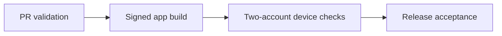

# Circle setup and chat notification acceptance

## Visual Map

This checklist covers Circle creation, grouped Circle/direct Feed rows and
notification presentation across web, iOS and Android. It extends the existing
multi-installation push registry and migration 290 delivery pipeline. No new
schema migration is required; use the current canonical release manifest and schema contracts.

## Release sequence

1. Run the current PR validation and canonical native export/archive lanes.
2. Deploy the backend and web changes through their existing release workflows.
3. Build signed iOS/Android apps with the normal Firebase/APNs configuration,
   preview keychain access group and notification extension enabled.
4. Run the physical acceptance scenarios below before release acceptance.

This Windows workspace can run TypeScript, focused/browser tests, PostgreSQL
integration tests and Android compilation. It cannot produce an Xcode archive
or establish physical APNs/FCM delivery. Current verification results belong in
the PR; older-base test counts are not evidence for the submitted head.

## Physical acceptance

Use two connected accounts and an ordinary Circle containing both. Run the same
message cases for direct and Circle chat. Record build, OS/browser and permission.

| Scenario | Expected result |
| --- | --- |
| Create from Connect or Location | Members opens with a clear add/invite action; at least one other active member is needed to start chat |
| Empty name, rapid double tap, failed create | Validation/retry; one Circle; setup remains reachable |
| Circle type selection | Tinted border/check selection; primary CTA remains visually distinct |
| Matching chat visibly readable | Message appears live; no redundant foreground sound/banner |
| Another tab/chat, modal or attachment viewer | System alert when permitted; tap opens the owning chat after authentication |
| Background, locked and normally terminated | Circle/direct alert and sound; supported badge and warm/cold routing |
| One-thread burst | One Feed row with current count; one web card or native conversation group |
| Two threads | Separate Feed rows and system groups |
| Open Feed only | Feed attention clears; conversation messages remain unread |
| Read chat twice, then receive delayed push | Covered cards clear; later unread messages remain; retained frontiers prevent foreground replay |
| Read on another native installation | Native quiet synchronization reconciles cards and supported badges when delivered |
| Mute, leave, remove member or rejoin | No new eligible alerts to muted/revoked memberships or old membership epochs |
| Permission denied then enabled in Settings | Explicit setup action; registration repairs on resume without repeated prompts |
| Registration fails then Retry | Delivery is not represented as active before registration succeeds |
| Switch account while cleanup awaits | Old callbacks cannot clear the new key's notifications or badge |
| One installation rejects delivery | Only unaccepted installations retry within the existing delivery limit |

## Platform boundaries

Sound depends on notification permission, Focus/Do Not Disturb, Android channel
settings and device restrictions. Android launcher dots/counts follow launcher
support. Web Badging follows browser support and installed-app requirements.
Safari cannot receive silent Web Push: background read-only synchronization is
native only; web reconciles through local reads and foreground events.

Apple requires the restricted notification-filtering entitlement to discard an
already accepted iOS alert in the extension. This app does not have that
entitlement; the extension silences read alerts and removes stale preview/badge
content, but a quiet read-status card may remain until normal reconciliation.
Do not confuse provider acceptance with exactly-once sound or device receipt.
Force-stop/explicit force-quit are separate OS cases from ordinary background.

The user's iPhone acceptance is pending the next TestFlight build. This PR does
not publish a release, change OS notification settings or merge itself.
