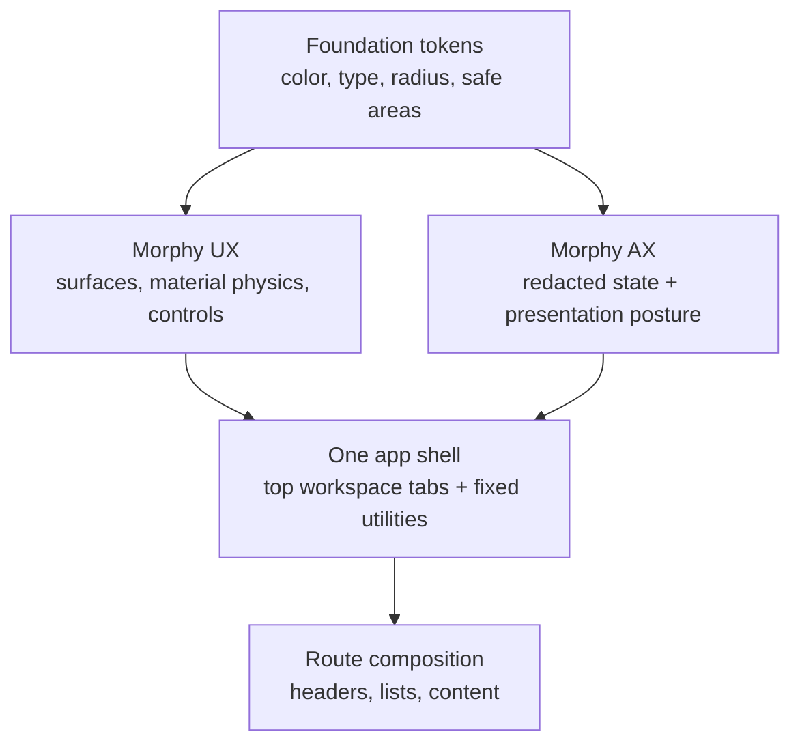

# One UX and AX Design Contract

Status: current execution contract.

## Visual Map



This is the concise design authority for One. It is informed by the checked
Apple interaction reference: quiet system typography, a restrained single
accent, legible hierarchy, and chrome that recedes behind the work. It does
not copy Apple branding or substitute a separate palette for Hussh.

## Ownership

| Layer | Owns | Does not own |
| --- | --- | --- |
| Foundation | semantic color, typography, radius, safe-area, and motion tokens | route-specific visual exceptions |
| Morphy UX | reusable surfaces, controls, ripples, glass, and motion | agent decisions or protected information |
| app-ui | the shared One shell, headers, lists, and route composition | vendor primitive forks |
| Morphy AX | redacted interaction state and lifecycle presentation posture | visual primitives, routing, or action authority |
| feature routes | content and domain-specific tabs using the shared shell | custom fixed chrome or token overrides |

Use `components/ui` for stock shadcn primitives, `lib/morphy-ux` for reusable
visual behavior, and `components/app-ui` for One-specific composition. A route
must not recreate shell chrome, safe-area math, an icon well, or a list row.

## Visual Language

1. One is quiet, direct, and information-first. A screen has one primary
   heading, one next action, and only supporting copy that changes a decision.
2. The Foundation `--app-accent-*` family is the only accent authority. Blue is
   the default; Molten Gold is the user-selected variant. Dark surfaces derive
   from `--background` with `color-mix`, never a hard-coded near-black.
3. White space is structural: page gutters, safe areas, and shared shell
   clearance are intentional. Do not add empty hero space, decorative cards,
   duplicate headers, badge farms, or skeleton-screen chrome.
4. Cards communicate grouping, not decoration. Use flat inset lists for browse
   flows; reserve cards for a real summary, image, chart, or distinct task.
5. Copy uses plain language. One is the private agent; Kai is the finance
   specialist; Nav is the privacy and consent guardian; KYC is the identity
   workflow specialist.

## Shape and Icon Rules

The radius token does not mean every square is a circle.

| Surface | Geometry | Allowed radius |
| --- | --- | --- |
| app icon / launcher artwork | square | 18px card, 20px launcher, 10px menu/top-bar |
| settings and list icon well | square | 10px at 32px, 12px at 40px |
| grouped inset list | compact card | `--app-card-radius-compact` |
| cards and media | semantic card token | `--app-card-radius-*` only |
| standalone chrome control | circular or pill only when it is a control | `--app-radius-pill` |
| avatar, presence dot, toggle thumb | circular | `--app-radius-pill` |

Never use `rounded-full` for a settings, launcher, or app-icon well. Reuse
`AgentSectionIcon` for agent artwork and `SettingsRow` for settings icon wells.
Do not use the small generic control radius as the outer radius of a list group
or card.

## Signed-in Shell Contract

One fixed shell applies to every signed-in standard route. Onboarding, login,
and other explicitly hidden/flow layouts remain exempt through the route layout
contract.

```text
safe area
┌ One / current workspace     workspace tabs                  alerts + Profile ┐
│ Finance                     Market · Portfolio · Analysis                    │
└──────────────────────────────────────────────────────────────────────────────┘
                                     route content
                              Agent Bar (4px visual join)
                   Finance/RIA workspace tabs · One · Connect · Search
safe area
```

1. The centered primary bottom navigation is fixed and constant: **One**,
   **Connect**, and **Search**. Search is a segment in that shared control and
   opens the global command surface. Profile remains a top-bar control.
2. Search opens the existing global command/search surface. It is not agent
   chat and has no route-local replacement.
3. The Agent Bar and bottom utility bar are one bottom-chrome stack. Their
   resting visual separation is 4px; their transforms, safe-area clearance,
   and fade are measured by the shared shell. Neither route nor component may
   add another gap.
4. Finance and RIA workspace tabs may appear as their own compact group to the
   left of the primary bottom control on wide layouts. The combined groups are
   centered as one unit; they remain capability- and route-driven.
5. The rightmost signed-in top-bar control is Profile. It uses the signed-in
   person's image when available and the same generic/initial fallback as the
   Profile route. Connect remains a route but is not shell chrome.
6. Tabs are horizontally scrollable when needed, retain clear selected state,
   and do not push or overlap the top-bar actions on a small viewport.
7. The bottom utility frame uses the exact Agent Bar width constraint. On wide
   layouts its compact action group is right-aligned to the Agent Bar’s edge;
   on phones it stays centered inside that same frame. It must never align to
   the wider page shell or viewport edge.

## Material Physics

1. Fixed chrome uses the shared `bar-glass` surface and one shared route
   transition. Do not add route-local animation frameworks or parallel fades.
2. Actionable controls use the existing `MaterialRipple` owner. The visible
   action surface clips its own ripple; outer cards stay unclipped.
3. Sibling flat controls share one effect, timing family, and press geometry.
   Use `ShellActionSurface` for top/bottom shell actions.
4. Motion confirms cause and effect: press → ripple → state change; navigation
   → one exit/enter crossfade. Reduced-motion behavior remains usable.
5. Keyboard, vault, and modal layers are authoritative. Fixed chrome either
   clears the keyboard via the shared inset manager or yields to an active
   blocking layer; it never competes underneath it.

## List and Header Rules

1. Every standard signed-in route uses the lean shared header; no route-local
   logo, hero, or duplicate title bar.
2. `SettingsGroup` and `SettingsRow` own responsive inset lists: icon well,
   separator, truncation, 44px+ tap target, trailing alignment, and mobile
   stacking. Connected Systems, Profile, and agent lists use the same model.
3. Section starts align on a stable grid. Do not distribute a short row of
   icons across a wide surface.
4. A list row has one primary action. Nested controls must be explicit and
   cannot create a competing full-row click target.
5. First-time source selection (such as portfolio import) uses one lean shared
   header and one compact inset list. Keep the initial decision state within a
   phone viewport: no decorative cards, status badges, drag zones, repeated
   primary buttons, or terminal setup action before the user has chosen a
   source. Progress and completion controls appear only after that choice.

## AX Boundary

Morphy AX may choose presentation posture from redacted signed-in, vault,
route, interaction-layer, and active-agent state. It may not read protected
information, alter navigation, add a visual primitive, infer controls from the
DOM, or create an action. UX is the visual grammar; AX is the bounded,
privacy-safe presentation input.

## Verification

For shared shell changes, prove:

1. route-contract, bottom-navigation, and top-tab unit contracts;
2. phone and desktop browser geometry for top tabs, bottom utilities, Agent
   Bar, safe areas, and keyboard behavior;
3. typecheck, design-system, route, AX, and docs verification;
4. no duplicate chrome, circular app wells, hard-coded theme colors, or
   unmeasured bottom-stack spacing.

Companion references:

- [Design System](./design-system.md)
- [App Surface Design System](./app-surface-design-system.md)
- [Morphy Agent Experience](./morphy-agent-experience.md)
- [Frontend UI Architecture Map](./frontend-ui-architecture-map.md)
