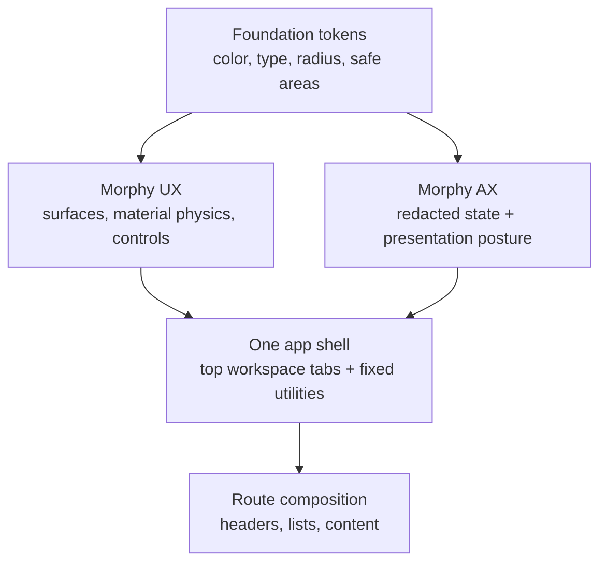

# One UX and AX Design Contract

Status: current execution contract.

## Visual Map



This is the concise design authority for One. It is informed by the checked
Apple interaction reference: quiet system typography, a restrained single
accent, legible hierarchy, and chrome that recedes behind the work. It does
not copy Apple branding or substitute a separate palette for Hussh.

## Ownership

| Layer | Owns | Does not own |
| --- | --- | --- |
| Foundation | semantic color, typography, radius, safe-area, and motion tokens | route-specific visual exceptions |
| Morphy UX | reusable surfaces, controls, ripples, glass, and motion | agent decisions or protected information |
| app-ui | the shared One shell, headers, lists, and route composition | vendor primitive forks |
| Morphy AX | redacted interaction state and lifecycle presentation posture | visual primitives, routing, or action authority |
| feature routes | content and domain-specific tabs using the shared shell | custom fixed chrome or token overrides |

Use `components/ui` for stock shadcn primitives, `lib/morphy-ux` for reusable
visual behavior, and `components/app-ui` for One-specific composition. A route
must not recreate shell chrome, safe-area math, an icon well, or a list row.

## Visual Language

1. One is quiet, direct, and information-first. A screen has one primary
   heading, one next action, and only supporting copy that changes a decision.
2. The Foundation `--app-accent-*` family is the only accent authority. Blue is
   the default; Molten Gold is the user-selected variant. Dark surfaces derive
   from `--background` with `color-mix`, never a hard-coded near-black.
3. White space is structural: page gutters, safe areas, and shared shell
   clearance are intentional. Do not add empty hero space, decorative cards,
   duplicate headers, badge farms, or skeleton-screen chrome.
4. Cards communicate grouping, not decoration. Use flat inset lists for browse
   flows; reserve cards for a real summary, image, chart, or distinct task.
5. Copy uses plain language. One is the private agent; Kai is the finance
   specialist; Nav is the privacy and consent guardian; KYC is the identity
   workflow specialist.
6. Form controls use one capsule field geometry and one measured rhythm: the
   `--app-input-radius` token owns direct-entry shells, `--app-form-field-gap`
   separates a label from its control, and `--app-form-section-gap` separates
   a primary action from related methods. A low-emphasis recovery path may be
   a text link with a 44px hit area; it must not look like a second primary CTA.
   Credential fallback groups keep the “Can’t get in?” descriptor on one
   centered line and every available quiet action on the next centered row
   inside a capped form measure. Separate multiple actions with middle-dot
   separators; do not create a second primary CTA, pill, column, or vertical
   divider. If only one action is available, keep it as the single centered
   element without a separator. Use `--app-form-section-gap` to create the
   larger pause after the primary unlock action and
   `--app-form-related-gap` to keep the descriptor close to its action row.
   Keep visible link text close to its descriptor while preserving the
   transparent 44px hit area; do not use incidental padding or a left-anchored
   action row to create the rhythm. When a credential flow offers a sign-out
   escape, recovery and the alternate unlock method belong in that same quiet
   action row.

## Unified Mobile Header Guidelines

To maintain absolute uniformity across mobile screens, all top-level workspace pages must adhere to the high-end centered layout of the Profile tab:

1. **No Mixed/Stacked Headers:** Double headers, stacked titles, and triple-line headers are strictly prohibited. The page title must never be repeated below the top app bar breadcrumbs.
2. **Clean Centered Typography:** The main screen title and its single-sentence supporting description must be perfectly centered on candidate screens, using Apple-clean typography and a maximum description layout width of `480px` for optimal legibility.
3. **Specialist Squircle Wells:** Workspace icons must be displayed inside glowing frosted squircles (`rounded-[18px]` to `rounded-[22px]`) with a color-matched blurred glow backdrop. Full `rounded-full` circle backgrounds on iconwells are prohibited.
4. **Standalone Left Back Button:** On sub-pages, the back button must sit on its own dedicated body row immediately preceding the main centered header layout (using a clean circular button with a discrete left margin), keeping the typography area immaculate and un-overloaded.

## Material 3 Expressive Physics & Transforms

The Morphy design language relies on physics-based responsive motion, transitioning away from rigid, linear CSS timelines toward fluid underdamped spring interactions.

### 1. Unified Spring Physics
Transforms and popovers model a spring-mass-damper system. Underdamped transitions ($\zeta < 1$) establish smooth, natural bounce profiles. The physical displacement is governed by:

$$m \frac{d^2x}{dt^2} + c \frac{dx}{dt} + kx = 0$$

Where:
- $m$ is the mass (standard = `1.1`), creating a tactile weight feeling.
- $k$ is the spring stiffness (high = `180`, compact = `260`).
- $c$ is the damping coefficient (underdamped $\zeta = c / (2\sqrt{km}) \approx 0.76$).

In CSS, these map to custom bezier ease curves that recreate this momentum:
- **Expressive Expand / Swell:** `cubic-bezier(0.34, 1.56, 0.64, 1)` — creates a subtle, tactile target overshoot during scale transforms.
- **Emphasized Standard Ease:** `cubic-bezier(0.2, 0.8, 0.2, 1)` — provides a premium decelerating entrance.

### 2. Physical Scale Swells & Inertial Deceleration
- **Scale Swell Transitions:** Active dialogue boxes and command search sheets zoom-in from `scale(0.95)` to `scale(1.0)` with a concurrent `blur(8.0px)` backdrop opacity fade, dampening visual pop.
- **Flick Momentum:** List elements and carousels use smooth decay deceleration rates ($v(t) = v_0 \cdot e^{-t / \tau}$ where $\tau \approx 0.2$ represents resistive canvas decay), matching natural touch drags on WebKit and native viewports.

## Shape and Icon Rules

The radius token does not mean every square is a circle.

| Surface | Geometry | Allowed radius |
| --- | --- | --- |
| app icon / launcher artwork | square | 18px card, 20px launcher, 10px menu/top-bar |
| settings and list icon well | square | 10px at 32px, 12px at 40px |
| grouped inset list | compact card | `--app-card-radius-compact` |
| cards and media | semantic card token | `--app-card-radius-*` only |
| standalone chrome control | circular or pill only when it is a control | `--app-radius-pill` |
| avatar, presence dot, toggle thumb | circular | `--app-radius-pill` |
| direct-entry field or field group | capsule | `--app-input-radius` |

Never use `rounded-full` for a settings, launcher, or app-icon well. Reuse
`AgentSectionIcon` for agent artwork and `SettingsRow` for settings icon wells.
Do not use the small generic control radius as the outer radius of a list group
or card.

Direct-entry fields are the exception to the card/control distinction: `Input`,
`InputGroup`, `Textarea`, `SelectTrigger`, `CommandInput`, and combobox field shells use
`--app-input-radius`. Compound fields apply the radius to the outer shell and
keep their inner input control square so the shell remains visually continuous;
`CommandInput` is similarly an inner control whose command surface owns the
visible modal geometry. The token is intentionally a capsule
(`--app-radius-pill`) and is not a substitute for card radii or standalone
action geometry.

## Apple reference boundary

This contract adopts Apple-like clarity, hierarchy, spacing, and hit-target
principles; it is not a claim of Apple platform compliance or a copy of Apple
visual assets. Apple’s Human Interface Guidelines describe text fields as
rectangular input areas and emphasize consistent sizing and even spacing. Hussh
chooses a capsule field silhouette as its own web grammar. The 44px minimum for
interactive targets and additional separation around un-bezelled links are
accessibility decisions grounded in the platform guidance:

- [Apple Text Fields](https://developer.apple.com/design/human-interface-guidelines/text-fields)
- [Apple Accessibility](https://developer.apple.com/design/human-interface-guidelines/accessibility)
- [Apple Buttons](https://developer.apple.com/design/human-interface-guidelines/buttons)

## Signed-in Shell Contract

One fixed shell applies to every signed-in standard route. Onboarding, login,
and other explicitly hidden/flow layouts remain exempt through the route layout
contract.

```text
safe area
┌ One / current workspace     workspace tabs                  alerts + Profile ┐
│ Finance                     Market · Portfolio · Analysis                    │
└──────────────────────────────────────────────────────────────────────────────┘
                                     route content
                              voice-only control (narrow slot)
                              Chat · One · Connect · Feed · Search
safe area
```

1. The centered primary bottom navigation is fixed and constant: **Chat**,
   **One**, **Connect**, **Feed**, and **Search**, in that order. **Chat** is
   the canonical home route (`/`). Search is a segment in that shared control
   and opens the global command surface. Profile remains a top-bar control.
2. Search opens the existing global command/search surface. It is not agent
   chat and has no route-local replacement.
3. The voice-only control and bottom navigation are one bottom-chrome surface.
   There is no divider, nested material, or inter-slot gap; their transform,
   safe-area clearance, and fade are measured by the shared shell. Neither
   route nor component may add another boundary.
4. Finance and RIA workspace tabs render only in the unified top shell. Their
   labels, destinations, active query state, and visibility come from the
   central route registry; route bodies and bottom navigation do not duplicate
   them.
5. The rightmost signed-in top-bar control is Profile. It uses the signed-in
   person's image when available and the same generic/initial fallback as the
   Profile route. Connect remains a route but is not shell chrome.
6. Tabs are horizontally scrollable when needed, retain clear selected state,
   and do not push or overlap the top-bar actions on a small viewport.
7. The bottom navigation frame uses the shared bottom-chrome width constraint.
   Its five segments are equal-width and centered at every breakpoint; it
   never aligns to the wider page shell or viewport edge. The voice slot is
   narrower than the navigation frame while retaining a 44px hit target.
8. Finance is one `/one/kai?tab=` workspace. Market, Portfolio, and Analysis
   use the Profile reading measure and shared outer gutter; their content may
   vary, but they must not introduce a wider dashboard canvas, a second fixed
   header, or a route-local tab bar.

## List and Header Rules

1. Every standard signed-in route uses the lean shared header; no route-local
   logo, hero, or duplicate title bar.
2. Profile is the geometry reference for a primary workspace header: one
   `AppPageShell` at the reading measure, one `AppPageHeaderRegion`, and one
   primary `PageHeader` or profile identity header. Finance tab content may
   render supporting section headings, but it must not create a competing
   primary header above or beside the shared workspace header.
3. `SettingsGroup` and `SettingsRow` own responsive inset lists: icon well,
   separator, truncation, 44px+ tap target, trailing alignment, and mobile
   stacking. Connected Systems, Profile, and agent lists use the same model.
4. Section starts align on a stable grid. Do not distribute a short row of
   icons across a wide surface.
5. A list row has one primary action. Nested controls must be explicit and
   cannot create a competing full-row click target.
6. First-time source selection (such as portfolio import) uses one lean shared
   header and one compact inset list. Keep the initial decision state within a
   phone viewport: no decorative cards, status badges, drag zones, repeated
   primary buttons, or terminal setup action before the user has chosen a
   source. Progress and completion controls appear only after that choice.

## AX Boundary

Morphy AX may choose presentation posture from redacted signed-in, vault,
route, interaction-layer, and active-agent state. It may not read protected
information, alter navigation, add a visual primitive, infer controls from the
DOM, or create an action. UX is the visual grammar; AX is the bounded,
privacy-safe presentation input.

## Verification

For shared shell changes, prove:

1. route-contract, bottom-navigation, and top-tab unit contracts;
2. phone and desktop browser geometry for top tabs, bottom utilities, Agent
   Bar, safe areas, and keyboard behavior;
3. typecheck, design-system, route, AX, and docs verification;
4. no duplicate chrome, circular app wells, hard-coded theme colors, or
   unmeasured bottom-stack spacing.

Companion references:

- [Design System](./design-system.md)
- [App Surface Design System](./app-surface-design-system.md)
- [Morphy Agent Experience](./morphy-agent-experience.md)
- [Frontend UI Architecture Map](./frontend-ui-architecture-map.md)
