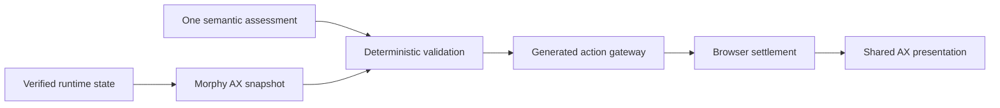

# Morphy Agent Experience

Status: current internal architecture contract.

## Visual Context

Canonical visual owner: [Quality and Design System Index](README.md). Morphy UX owns reusable visual and interaction primitives; Morphy AX owns the pure, redacted derivation that makes agent behavior consistent across voice, chat, onboarding, and ambient surfaces.

## Ownership

Morphy AX is the internal Agent Experience system. It is a peer to Morphy UX, not a replacement:

- Morphy UX owns tokens, motion, reusable surfaces, and interaction primitives.
- Morphy AX owns the shared redacted snapshot, assessment-validation boundary, and presentation posture.
- `AgentRuntimeStateProvider` remains the single frontend runtime owner.
- The One Voice state machine remains the lifecycle authority.
- One remains the sole conversational and semantic head.
- Generated action contracts and the gateway remain the only action authority.

Morphy AX must never introduce another provider, store, router, voice state machine, action registry, route-awareness MCP tool, or consent path.

## Snapshot contract

`MorphyAxSnapshotV1` is organized around four AX dimensions:

| Dimension | Bounded content |
| --- | --- |
| Access | signed-in posture, vault readiness, active persona |
| Context | canonical screen, route family, active playbook, visible modules and controls, onboarding posture |
| Tools | currently available generated action identifiers |
| Orchestration | pending settlement, voice lifecycle posture, bounded busy operations |

Privacy is explicit: the snapshot is redacted and excludes raw voice turns, OTP values, credentials, OAuth material, vault material, private page content, and action slots. The snapshot is derived synchronously and performs no network or model call.

During rollout, `toOneVoiceContextSnapshot` preserves the existing `one_voice_context.v1` wire shape. Disabling `NEXT_PUBLIC_MORPHY_AX_ENABLED` keeps the pre-existing compatibility path authoritative.

## Intelligence and deterministic policy

Semantic meaning must come from intelligence. One's current ADK turn produces a typed assessment describing the conversational disposition, candidate generated action, missing input, ambiguity, and expected outcome. Deterministic code may then:

- verify that the proposed action is currently visible and generated
- enforce route, onboarding phase, consent, vault, confirmation, and settlement boundaries
- normalize bounded fields
- reject stale, conflicting, unavailable, or unsafe proposals
- retain the current goal and request clarification

Deterministic code must not classify meaning from keyword or regex rules, substitute a different action, create a capability, or claim completion. `agent_onboarding` is the bounded policy adjudicator beneath One; it receives One's typed assessment plus redacted journey facts and has no information, action, credential, or speaking authority.

With Morphy AX enabled, Agent Bar validates One's typed action directive against the active snapshot before entering the existing generated gateway. A confirmation-required assessment remains a distinct decision and can only enter the inline confirmation path; it is never collapsed into direct execution.

## Presentation contract

Morphy AX projects the existing voice lifecycle into a shared presentation vocabulary:

`idle → orienting → listening → understanding → confirming → acting → settling → responding`, with `recovering` as the safe failure posture.

The projection controls cadence and appearance only. It cannot dispatch voice transitions or actions. Agent Bar, ambient edge glow, Agent Chat streaming, and onboarding confirmation/recovery consume this shared posture progressively.

## Accuracy and performance

Release gates are measurable:

- 100% route, screen, playbook, visible-control, generated-action, and registered-handler parity
- 100% compatibility projection parity for behavior that has not migrated
- 100% correct or safe-clarification outcome across the fixed critical onboarding corpus
- zero wrong-screen, unauthorized, sensitive-value, or success-before-settlement outcomes
- snapshot and policy p95 at or below 5 ms and p99 at or below 10 ms over 10,000 warmed evaluations
- presentation projection p95 at or below 2 ms
- no additional network call, model call, or live-session recreation for a clear visible action

Open-ended language outside the release corpus is not described as universally perfect. When meaning is unresolved, One asks one natural clarification and preserves the active goal.

CI uses deterministic production-function benchmarks. Live-model and provider timing belongs in UAT because network and provider variance would make local CI misleading. Telemetry may record stage timing, assessment disposition, action identifier, outcome bucket, and route/playbook identifiers; it must not retain raw voice turns, OTPs, email addresses, user identifiers, query strings, slots, or private page information.

## SEO and AEO boundary

SEO and answer-engine content remains server-authored through canonical Next.js metadata, structured content, and public route contracts. A route may share a stable purpose identifier with its voice playbook, but prompt instructions and private AX context are never rendered or indexed. Morphy AX is runtime orchestration, not a second publishing or indexing source.

## Verification

Use the `morphy-ax-governance` workflow. At minimum, run the Morphy AX contract/benchmark tests, shared runtime-context tests, frontend typecheck, generated voice verification, backend onboarding-policy tests, design-system verification, and documentation verification. Browser proof is required for route continuity, inline confirmation, responsive presentation, and provider callback recovery.
