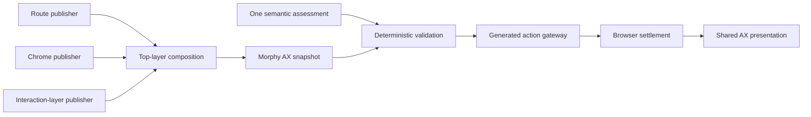

# Morphy Agent Experience

Status: current internal architecture contract.

## Visual Context

Canonical visual owner: [Quality and Design System Index](README.md). Morphy UX owns reusable visual and interaction primitives; Morphy AX owns the pure, redacted derivation that makes agent behavior consistent across voice, chat, onboarding, and ambient surfaces.

## Ownership

Morphy AX is the internal Agent Experience system. It is a peer to Morphy UX, not a replacement:

- Morphy UX owns tokens, motion, reusable surfaces, and interaction primitives.
- Morphy AX owns the shared redacted snapshot, assessment-validation boundary, and presentation posture.
- `AgentRuntimeStateProvider` remains the single frontend runtime owner.
- The One Voice state machine remains the lifecycle authority.
- One remains the sole conversational and semantic head.
- Generated action contracts and the gateway remain the only action authority.

Morphy AX must never introduce another provider, store, router, voice state machine, action registry, route-awareness MCP tool, or consent path.

## Snapshot contract

`MorphyAxSnapshotV1` is organized around four AX dimensions:

| Dimension | Bounded content |
| --- | --- |
| Access | signed-in posture, vault readiness, active persona, presentation accent (`blue` default / `gold`) |
| Context | canonical screen, route family, active playbook, top interaction layer, visible modules and controls, onboarding posture |
| Tools | currently available generated action identifiers |
| Orchestration | pending settlement, voice lifecycle posture, bounded busy operations |

Privacy is explicit: the snapshot is redacted and excludes raw voice turns, OTP values, credentials, OAuth material, vault material, private page content, and action slots. The snapshot is derived synchronously and performs no network or model call.

The `access.accent` field is presentation-only state: it lets presentation surfaces mirror the user's app accent preference (see the accent system in the design-system contract) and is guaranteed by contract test to never change an assessment decision or leak onto the `one_voice_context.v1` wire shape.

During rollout, `toOneVoiceContextSnapshot` preserves the existing `one_voice_context.v1` wire shape. Disabling `NEXT_PUBLIC_MORPHY_AX_ENABLED` keeps the pre-existing compatibility path authoritative.

## Active-layer contract

The existing voice-surface publisher accepts authored publishers in three roles:

- `route` owns the physical page and its ordinary visible controls.
- `chrome` owns persistent shell controls such as Agent Bar.
- `interaction_layer` owns a dialog, popover, sheet, menu, or bounded option list above the route.

These roles share `AgentRuntimeStateProvider`; they are not another provider, store,
router, action registry, or DOM observer. Each publisher has an owner-scoped lease, so
a stale unmount cannot clear or replace a newer publisher. Route revision changes
remove leases that no longer belong to the verified route.

The route publisher also carries a pathname lease. If Next navigation has advanced the
runtime route while React still exposes the prior route publisher, Morphy AX publishes
no executable actions or controls for that transient frame. Local-handler actions are
admitted only while an owner-scoped handler is mounted. A navigation action settles only
after both the browser route and the new authored publisher agree, which removes the
refresh-dependent action-inventory race without reconnecting the live session.

`VoiceInteractionLayerV1` is the redacted interaction-layer contract. It carries a
stable layer id and kind, modality (`nonmodal`, `modal`, or `blocking`), lifecycle,
dismissibility, an exact generated dismiss/cancel action when one exists, visible
generated actions and control ids, bounded authored options, return-focus control,
underlying-action policy, and Agent continuity (`interactive`, `ambient`, or
`suppressed`). It never carries free-form prompt text, private page information,
credentials, OAuth material, or vault material.

The composer exposes the top open layer:

- a modal or blocking layer replaces underlying route actions
- a nonmodal layer ranks its actions first and retains only explicitly allowed route actions
- nested confirmation outranks its parent; closing it restores the parent, then the route
- a nondismissible layer publishes no invented close action

Dismissal is an authored generated action backed by its mounted handler. Morphy AX
does not synthesize clicks or Escape events. Success is settled only after React has
committed the layer removal, focus has returned to the authored control, and the new
surface revision has been published.

## Intelligence and deterministic policy

Semantic meaning must come from intelligence. One's current ADK turn produces a typed assessment describing the conversational disposition, candidate generated action, missing input, ambiguity, and expected outcome. Deterministic code may then:

- verify that the proposed action is currently visible and generated
- enforce route, onboarding phase, consent, vault, confirmation, and settlement boundaries
- normalize bounded fields
- reject stale, conflicting, unavailable, or unsafe proposals
- retain the current goal and request clarification

Deterministic code must not classify meaning from keyword or regex rules, substitute a different action, create a capability, or claim completion. `agent_onboarding` is the bounded policy adjudicator beneath One; it receives One's typed assessment plus redacted journey facts and has no information, action, credential, or speaking authority.

With Morphy AX enabled, Agent Bar validates One's typed action directive against the active snapshot before entering the existing generated gateway. A confirmation-required assessment remains a distinct decision and can only enter the inline confirmation path; it is never collapsed into direct execution.

Top-layer precedence is part of that validation: One semantically assesses the turn
against the bounded active playbook, top layer, visible actions, and pending
settlement. Deterministic policy then rejects stale, hidden, wrong-layer, or
unauthorized actions without substituting a different action. `list_app_actions`
retrieves bounded generated contracts; it is not the semantic classifier.

## Trusted browser activation

Desktop web provider authentication remains popup-first so One's live session and
the current app screen stay present. Direct button activation calls Firebase's popup
path synchronously. A voice directive cannot manufacture the browser's transient user
activation, so `trusted_activation_required` provider actions settle into one exact,
provider-specific Agent Bar action. Tapping **Continue with Apple** or **Continue with
Google** synchronously validates and invokes the already-mounted generated handler
before any asynchronous work. There is no synthetic click, blank broker window, or
same-tab redirect fallback.

The popup is browser-owned, not an in-app interaction layer. Its typed attempt record
contains only the attempt id, provider, initiator, directive correlation, validated
resume route, phase, and settlement. Popup success requires a Firebase user and token
before the journey advances. Cancellation, focus return while Firebase is settling,
SDK failure, retry, and stale completion remain recoverable and cannot let an older
attempt overwrite a newer attempt.

## Presentation contract

Morphy AX projects the existing voice lifecycle into a shared presentation vocabulary:

`idle → orienting → listening → understanding → confirming → acting → settling → responding`, with `recovering` as the safe failure posture.

The projection controls cadence and appearance only. It cannot dispatch voice transitions or actions. Agent Bar, ambient edge glow, Agent Chat streaming, and onboarding confirmation/recovery consume this shared posture progressively.

## Accuracy and performance

Release gates are measurable:

- 100% route, screen, playbook, visible-control, generated-action, and registered-handler parity
- 100% compatibility projection parity for behavior that has not migrated
- 100% correct or safe-clarification outcome across the fixed critical onboarding corpus
- zero wrong-screen, unauthorized, sensitive-value, or success-before-settlement outcomes
- snapshot and policy p95 at or below 5 ms and p99 at or below 10 ms over 10,000 warmed evaluations
- presentation projection p95 at or below 2 ms
- no additional network call, model call, or live-session recreation for a clear visible action
- no hidden underlying action exposure while a modal or blocking layer is active
- provider popup recovery restores a usable Login surface without a page refresh
- route transitions never expose prior-route actions or claim success before the destination publisher settles

Open-ended language outside the release corpus is not described as universally perfect. When meaning is unresolved, One asks one natural clarification and preserves the active goal.

CI uses deterministic production-function benchmarks. Live-model and provider timing belongs in UAT because network and provider variance would make local CI misleading. Telemetry may record stage timing, assessment disposition, action identifier, outcome bucket, and route/playbook identifiers; it must not retain raw voice turns, OTPs, email addresses, user identifiers, query strings, slots, or private page information.

## SEO and AEO boundary

SEO and answer-engine content remains server-authored through canonical Next.js metadata, structured content, and public route contracts. A route may share a stable purpose identifier with its voice playbook, but prompt instructions and private AX context are never rendered or indexed. Morphy AX is runtime orchestration, not a second publishing or indexing source.

## Verification

Use the `morphy-ax-governance` workflow. At minimum, run the Morphy AX
contract/benchmark tests, shared runtime-context tests, frontend typecheck, generated
voice verification, backend onboarding-policy tests, design-system verification, and
documentation verification. Browser proof is required for route continuity, nested
layer ordering/restoration, focus return, Agent continuity, trusted-activation popup
launch, popup close/retry, and success-after-settlement.
