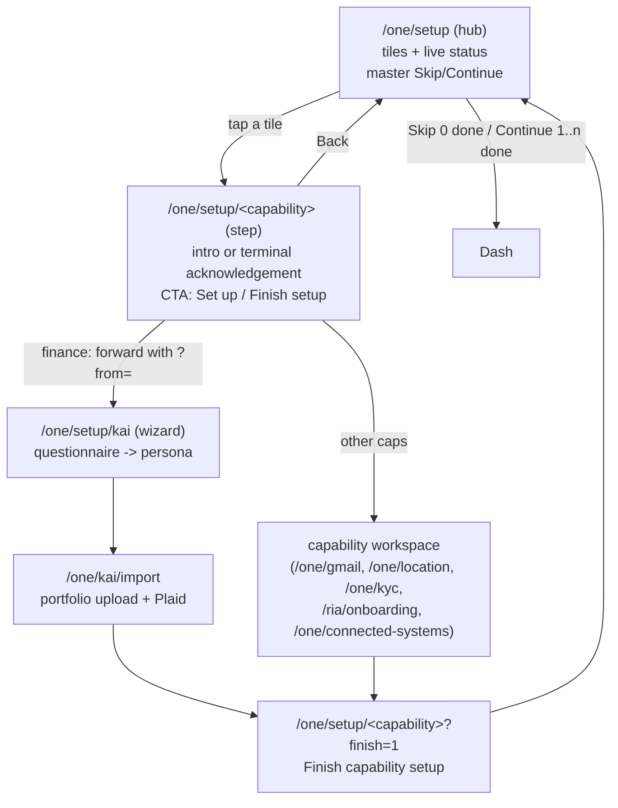
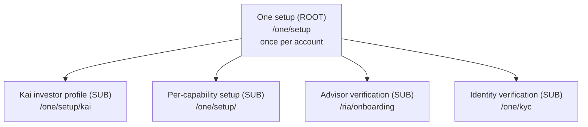

# One Setup Architecture — One first, sub‑setups downstream

Status: canonical reference. Source of truth for how setup is structured,
gated, reset, resumed, and skipped across the app.

> Naming: the account‑level flow and its surfaces are now called **setup**
> (formerly "onboarding"). The canonical routes are `/one/setup` (hub),
> `/one/setup/kai` (Kai investor‑profile wizard), and `/one/setup/<capability>`
> (per‑capability steps). Persisted state uses `setup_*` / `nav_setup_*`
> columns and the `hushh_setup_*` cookies. Some internal symbol names still
> read `onboarding` for back‑compat; the user‑facing surface and routes are
> "setup".

> This is **not** Kai‑specific. The app has **one** account‑level setup
> (the "One" gate) that runs once per account, plus several **sub‑setups**
> that live downstream under One (Kai investor profile, RIA advisor
> verification, KYC). The model mirrors the agent / sub‑agent hierarchy: One is
> the orchestrator above every surface, and each surface owns its own
> setup the way each sub‑agent owns its own job.

## Visual Map

The end‑to‑end curated setup journey, from the hub through a per‑capability
step into the capability's real workspace and back through an explicit terminal
acknowledgement. Vault‑backed capabilities introduce the private vault at the first
operation that actually needs encrypted persistence; provider caches and workflow
state are not PKM memory by implication.

The setup catalog is a deliberate subset of the broader One capability catalog
(single source of truth:
[`lib/onboarding/one-capabilities.ts`](../../../hushh-webapp/lib/onboarding/one-capabilities.ts)):

| Order | Setup step | Kind | Destination | Vault |
| --- | --- | --- | --- | --- |
| 1 | Connect Gmail | connector | `/one/gmail` | `requiresVault` |
| 2 | Set up location | workflow | `/one/location` | `requiresVault` |
| 3 | Let One draft for you | workflow | `/one/kyc` | `requiresVault` |
| 4 | Set up your finances | wizard | `/one/setup/kai` → `/one/kai/import` | `requiresVault` |
| 5 | Set up RIA | advisor verification | `/ria/onboarding` | `requiresVault` |
| 6 | Link your tools | CRM registry and profile setup | `/one/connected-systems` | `requiresVault` |

The hub keeps this authored order within two explicit sections: **Remaining**
first, then **Complete**. The Complete section is absent until at least one
capability reaches its durable terminal acknowledgement; completed rows move to
that bottom section without re-ranking either section. Setup rows reuse the same
capability icon, Gmail mark, and tone colors as the `/one` dashboard. Memory,
Consent, and Information Marketplace remain available in One,
but are not onboarding requirements and are not published as setup-hub actions.
The setup screen reports `completed` only after the capability's durable terminal
acknowledgement. A connector or preferences record without that acknowledgement is
`in-progress`, never a fabricated Ready state.

## 1. The hierarchy

The hierarchy is declared once in
[`lib/navigation/onboarding-registry.ts`](../../../hushh-webapp/lib/navigation/onboarding-registry.ts).
Guards, reset flows, chrome, and this doc all read from that registry so the
shape can never silently drift. **Never hand‑roll setup gating outside the
registry — add or extend an `OnboardingDefinition` instead.**

| Flow | Tier | Route | Reset scope | Resumable | Skippable |
| --- | --- | --- | --- | --- | --- |
| One (setup hub) | `root` | `/one/setup` | `account` | yes | yes |
| Kai investor profile | `sub` | `/one/setup/kai` | `surface` | yes | yes |
| Per‑capability setup | `sub` | `/one/setup/<capability>` | `surface` | yes | yes |
| Advisor verification (RIA) | `sub` | `/ria/onboarding` | `surface` | yes | no |
| Identity verification (KYC) | `sub` | `/one/kyc` | `surface` | no | no |

Note on routes: `/one/setup` is the hub and resolves the **master** account
gate via its own Skip (when 0 capabilities are set up) / Continue (when 1..n are
set up) buttons. `/one/setup/kai` is the standalone Kai investor‑profile
wizard. `/one/setup/<capability>` steps are reached by first‑clicking a
capability tile; they record only that capability's signal and never write the
master account gate. Legacy `/one/onboarding` is removed (404); the legacy
`/kai/onboarding` and `/one/kai/onboarding` deep links 307‑redirect to
`/one/setup/kai`. `routes.ts` keeps `KAI_SETUP` pointing at `/one/setup/kai`
and the `isOneSetup*` predicates as canonical; older `*Onboarding*` symbol
names that remain are back‑compat aliases.

## 2. Who gates onboarding (and who does not)

- `proxy.ts` (Next 16 — **not** `middleware.ts`) does **not** gate setup.
  It only performs legacy route redirects (`/one/onboarding` family →
  `/one/setup/kai`) and passes everything else through. It cannot read the
  client setup cookies, by design.
- The authenticated app-wide `OnboardingJourneyGuard`
  (`components/onboarding/onboarding-journey-guard.tsx`) is authoritative for
  unfinished root setup. It verifies the durable pre-vault row and admits only
  the active capability's authored route family. Query parameters are navigation
  history, not admission authority. `VaultLockGuard` and `PostAuthRouteService`
  retain their narrower vault and post-auth responsibilities.
- Pre-vault mutations invalidate the shared BFF bootstrap cache for that user.
  A route transition therefore cannot keep enforcing an old journey snapshot
  until the cache TTL expires.

## 3. State stores, in trust order

The One root resolves completion from one durable authority plus local mirrors:

1. **Server pre‑vault state** (`PreVaultUserStateService`) — authoritative for
   users with no vault or a locked vault. `setupCompleted === true` (persisted
   as the `setup_completed` column) means the One gate is satisfied.
2. **Local Preferences + localStorage** (`PreVaultOnboardingService`) —
   offline / native bridge; mirrored up to the server when connectivity returns.
3. **Session hint** (`sessionStorage`) — per‑tab fast‑path cache only; never
   authoritative.

The encrypted Kai profile describes Finance preferences. It does not resolve root
setup and does not prove Finance reached its portfolio-source and terminal finish.

### Cookies: `hushh_setup_*`

The client setup cookies are `hushh_setup_required`, `hushh_setup_flow_active`,
and `hushh_setup_complete` (renamed from the legacy `kai_onboarding_*` cookies).
`hushh_setup_required` is a client‑only cookie with **no reader** — it is dead
state retained only because contract tests assert its presence. Do not build
new gating on it. The live cookie is `hushh_setup_flow_active` (read by
`kai-chrome-state` and `AuthStep` to route to the import step after Continue).
See the note in
[`lib/services/onboarding-route-cookie.ts`](../../../hushh-webapp/lib/services/onboarding-route-cookie.ts)
(the file keeps its `onboarding-route-cookie` name; the cookie **values** are
`hushh_setup_*`).

## 4. Lifecycle semantics

### Complete / Skip the One gate

The master account gate is resolved on the **hub**
[`components/onboarding/setup/one-setup-hub.tsx`](../../../hushh-webapp/components/onboarding/setup/one-setup-hub.tsx)
via its own ack button: **Skip** when 0 capabilities are set up, **Continue**
when 1..n are. Both write the authoritative store first and **await** the
server pre‑vault sync before navigating (so the gate is server‑authoritative
the instant the user leaves — this closed a prior fire‑and‑forget race), then
redirect. The shared top-bar Back action never acknowledges root setup. Skip marks the flow "satisfied for now": the user is not bounced
back, but the flow can be re‑run. The Kai wizard at
[`app/one/setup/kai/page.tsx`](../../../hushh-webapp/app/one/setup/kai/page.tsx)
and per‑capability steps at
[`app/one/setup/[capability]/page.tsx`](../../../hushh-webapp/app/one/setup/%5Bcapability%5D/page.tsx)
record their own surface signal only; per‑capability steps never write the
master account gate. Root acknowledgement never writes Finance completion into the
Kai profile.

### Per‑capability step → workspace handoff

Tapping a hub tile opens the shared per‑capability step
[`components/onboarding/setup/onboarding-capability-step.tsx`](../../../hushh-webapp/components/onboarding/setup/onboarding-capability-step.tsx).
The step is presentational and **collects nothing** — it renders pre‑vault and
forwards to the capability's real workspace via
`resolveCapabilityHandoffTarget` (declared in
[`lib/navigation/routes.ts`](../../../hushh-webapp/lib/navigation/routes.ts)).

The step renders a normal `AppPageShell`, so `/one/setup/[capability]` is a
**`standard`** route in
[`lib/navigation/app-route-layout.contract.json`](../../../hushh-webapp/lib/navigation/app-route-layout.contract.json)
— it inherits the app shell's top spacer (`--app-top-content-offset`, which
folds in `env(safe-area-inset-top)`) so its content always clears the top app
bar on notched devices. Only the self‑padding fullscreen wizard at
`/one/setup/kai` is a `flow` route. This is the layout‑level safe‑area
guarantee: step screens never hand‑roll top padding.

- **Finance** forwards to the investor‑preferences **wizard**
  (`/one/setup/kai`), not straight to the dashboard, so the questionnaire →
  persona → portfolio‑import journey is never orphaned. The forward appends a
  `?from=` marker for deterministic back navigation and intentional re-entry.
  Admission still comes only from the durable active-capability record. The wizard
  renders pre‑filled from the saved profile / pre‑vault draft so the person can
  review or edit their answers.
- **Vault‑aware CTA**: capabilities flagged `requiresVault` in the catalog
  ([`lib/onboarding/one-capabilities.ts`](../../../hushh-webapp/lib/onboarding/one-capabilities.ts))
  use **Set up** language. The step still forwards; the destination owns the
  actual private-vault prompt at the first encrypted read or write. This replaces
  the prior misleading "nothing to set up" copy on `email` and `location`,
  which are real vault‑gated workspaces, not explore‑only tabs.
- **Terminal acknowledgement**: every capability returns through
  `/one/setup/<capability>?finish=1`. Only **Finish `<capability>` setup** adds
  it to the durable completed set and clears the active goal. Backing out clears
  the goal without claiming completion.
- **Finance source boundary**: the three preference questions are not completion.
  Finance continues to `/one/kai/import`, where the person chooses Plaid,
  statement upload, or later, and only then reaches **Finish Finance setup**.
- **Gmail boundary**: OAuth success retains active Gmail state and reaches
  **Finish Gmail setup**. Shopping-summary PKM persistence is an explicit action;
  Gmail does not auto-save inferred memory.
- **RIA boundary**: setup-originated advisor onboarding retains the active RIA
  goal and returns to **Finish RIA setup** after successful profile submission.
- **Link your tools boundary**: the live CRM registry is the source for available
  systems. Each row states whether profile creation is supported; One never
  invents a CRM or offers profile creation for a read-only system.
- **Agent progress context**: the onboarding specialist filters the durable
  completed ids against the six-item setup catalog and returns ordered
  `setup_completed_ids` and `setup_remaining_ids`. Stale ids from broader One
  surfaces cannot enter the setup action set.

### Reset / come back to onboarding

`handleResetAccount` in
[`app/profile/profile-workspace-page.tsx`](../../../hushh-webapp/app/profile/profile-workspace-page.tsx) keeps the
identity and vault but returns the account to a just‑set‑up state: it calls
`AccountService.resetAccount` (clears the authoritative pre‑vault completion),
clears local + cache state, re‑arms setup, and redirects to
`/one/setup`. Because the server store is cleared, the One root gate
genuinely reappears — and **only** after an explicit reset or account delete.

### Resume gracefully

Re‑entering a half‑finished flow restores the last saved draft + step from its
draft store (`PreVaultOnboardingService.saveDraft` for One/Kai;
`RiaOnboardingDraft` for RIA). Resumable flows are marked `resumable: true` in
the registry.

### Skip and come back

A skipped sub‑onboarding stays re‑enterable from its own surface independently of
the One gate. Completing or skipping a sub‑onboarding never re‑locks the One
gate, and a satisfied One gate never force‑completes a sub‑onboarding.

## 5. Rules for contributors

1. Model every new setup flow as an `OnboardingDefinition` in the registry.
2. One is the only `account`‑scoped gate. Everything else is `surface`‑scoped.
3. Read the authoritative store; never gate on the dead `required` cookie.
4. Await any server completion sync before navigating away from a flow.
5. Keep the `isOneSetup*` route helpers and `/one/setup*` routes canonical;
   remaining `*Onboarding*` symbol names are back‑compat aliases.
6. Persist via `setup_*` / `nav_setup_*` columns and `hushh_setup_*` cookies;
   the KaiProfile blob uses `setup.*` keys (schema_version 3) with read‑compat
   for legacy `onboarding.*` / `nav_tour_*`.

## 6. Voice/UI parity

Every tap‑only control on the pre‑auth and setup surfaces (`/getting-started`
→ `/login`, `/register-phone`, the `/one/setup` hub, per‑capability steps,
the Kai preferences wizard) has a matching governed `action_id` in the
generated gateway (`contracts/kai/kai-action-gateway.vnext.json`), authored
via colocated `*.voice-action-contract.json` files next to each surface and
regenerated with `npm run build:voice-gateway`. One's ADK agent tree treats
guiding a new user through setup as an ordinary `run_app_action`/`open_screen`
job (see [One Voice Runtime Architecture § Onboarding and Proactive
Prompting](../one/one-voice-runtime-architecture.md#onboarding-and-proactive-prompting)
for the full mechanism, including the new `local_handler` execution path for
in‑place state changes like answering a wizard question).

When adding a new setup screen or control:

1. Author (or extend) a `*.voice-action-contract.json` next to the surface;
   do not hand‑edit the generated gateway JSON.
2. If the control is pure navigation, use `execution_target.path: "route"`.
   If it changes in‑place component state (a radio answer, a form submit,
   a master ack) with no direct route, use `"local_handler"` and register a
   handler via `useLocalOnboardingActionHandler`
   (`hushh-webapp/lib/agent/local-onboarding-actions.ts`).
3. Set `reachability.screens` to BOTH the route‑derived screen id
   (`deriveVoiceRouteScreen()` in `route-screen-derivation.ts`) and any
   custom `screenId` the surface publishes via `usePublishVoiceSurfaceMetadata`
   - the wire value sent to the backend as `hushh:screen` is always the
   route‑derived one.
4. Regenerate and verify: `npm run build:voice-gateway && npm run
   verify:voice-gateway`.
