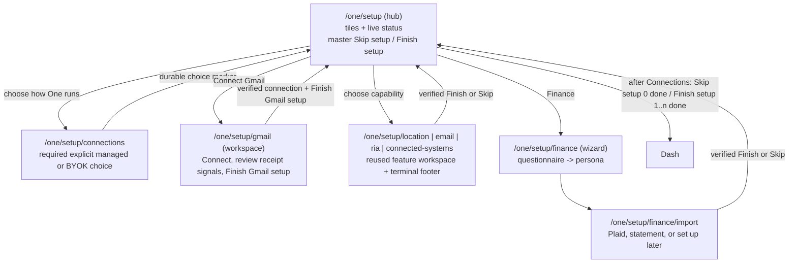
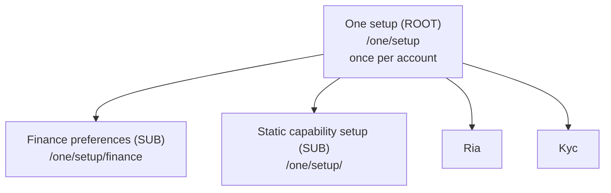

# One Setup Architecture — One first, sub‑setups downstream

Status: canonical reference. Source of truth for how setup is structured,
gated, reset, resumed, and skipped across the app.

> Naming: the account‑level flow and its surfaces are now called **setup**
> (formerly "onboarding"). The canonical routes are `/one/setup` (hub),
> `/one/setup/finance` (Finance preferences), and static
> `/one/setup/<capability>` workspaces. Persisted state uses `setup_*` / `nav_setup_*`
> columns and the `hushh_setup_*` cookies. Some internal symbol names still
> read `onboarding` for back‑compat; the user‑facing surface and routes are
> "setup".

> This is **not** Kai‑specific. The app has **one** account‑level setup
> (the "One" gate) that runs once per account, plus several **sub‑setups**
> that live downstream under One (Kai investor profile, RIA advisor
> verification, KYC). The model mirrors the agent / sub‑agent hierarchy: One is
> the orchestrator above every surface, and each surface owns its own
> setup the way each sub‑agent owns its own job.

## Visual Map

The end‑to‑end setup journey stays inside static setup workspaces. Feature bodies
are reused there; adapters own only journey state, voice publication, logical
return to the hub, and the terminal footer. Vault‑backed capabilities introduce
the private vault at the first operation that needs encrypted persistence. A
setup adapter uses the shared `CapabilityVaultPrerequisite` before mounting a
token-dependent feature body: it checks presence once, opens the established
vault flow with capability-specific context, and resumes only after a fresh
in-memory owner token exists. It never silently creates a vault, passes a key
to One, or changes the global `VaultLockGuard` behavior for ordinary routes.

The setup catalog is a deliberate subset of the broader One capability catalog
(single source of truth:
[`lib/onboarding/one-capabilities.ts`](../../../hushh-webapp/lib/onboarding/one-capabilities.ts)):

Each catalog entry also owns a presentation-admission switch. A `paused`
capability is omitted from the One launcher, agent selector, previews, and
setup journey, and its legacy One/setup route returns to the appropriate hub.
This does not unregister its product agent, revoke a connection, or remove its
Profile recovery controls. Gmail is currently paused while its connector is
being repaired; re-enable that one catalog value only after its focused flow
has passed again.

| Order | Setup step            | Kind                           | Destination                          | Vault           |
| ----- | --------------------- | ------------------------------ | ------------------------------------ | --------------- |
| 1     | Set up location       | workflow                       | `/one/setup/location`                | `requiresVault` |
| 2     | Let One draft for you | workflow                       | `/one/setup/email`                   | `requiresVault` |
| 3     | Set up your finances  | wizard                         | `/one/setup/finance` → `/finance/import` | `requiresVault` |
| 4     | Set up RIA            | advisor verification           | `/one/setup/ria`                     | `requiresVault` |
| 5     | Link your record      | CRM registry and profile setup | `/one/setup/connected-systems`       | `requiresVault` |

The hub keeps this authored order within two explicit sections: **Remaining**
first, then **Complete**. The Complete section is absent until at least one
capability reaches its durable terminal acknowledgement; completed rows move to
that bottom section without re-ranking either section. Setup rows reuse the same
capability icon and tone colors as the `/one` dashboard. Memory,
Consent, and Information Marketplace remain available in One,
but are not onboarding requirements and are not published as setup-hub actions.
Every unfinished row names its actual next action (for example, `Choose location`
or `Verify RIA`); a vault prerequisite never collapses the list into repeated
generic instructions.
The authored capability copy explains the outcome before the route handoff:
Location covers sharing with chosen trusted people, and KYC covers invoking drafting at
`one@hushh.ai`; Connected Systems covers linking a record to chosen external
systems. The visible label, per-step CTA, local voice contract, generated gateway,
and route-orchestration index must use that same authored meaning.
The setup screen reports `completed` only after the capability's durable terminal
acknowledgement. A connector or preferences record without that acknowledgement is
`in-progress`, never a fabricated Ready state.

## 1. The hierarchy

The hierarchy is declared once in
[`lib/navigation/onboarding-registry.ts`](../../../hushh-webapp/lib/navigation/onboarding-registry.ts).
Guards, reset flows, chrome, and this doc all read from that registry so the
shape can never silently drift. **Never hand‑roll setup gating outside the
registry — add or extend an `OnboardingDefinition` instead.**

| Flow                        | Tier   | Route                     | Reset scope | Resumable | Skippable |
| --------------------------- | ------ | ------------------------- | ----------- | --------- | --------- |
| One (setup hub)             | `root` | `/one/setup`              | `account`   | yes       | yes, after Connections choice |
| Finance preferences         | `sub`  | `/one/setup/finance`      | `surface`   | yes       | yes       |
| Static capability setup     | `sub`  | `/one/setup/<capability>` | `surface`   | yes       | yes       |

Note on routes: `/one/setup` is the hub and resolves the **master** account
gate via its own Skip setup (when 0 capabilities are set up) / Finish setup (when 1..n are
set up) buttons. Both remain disabled until the person explicitly selects
Hussh-managed Gemini or BYOK at `/one/setup/connections`. Connections is a
root prerequisite, not an agent capability: it does not change the capability
count or publish a generated voice action. `/one/setup/finance` is the Finance preferences wizard and
`/one/setup/finance/import` selects its source. Every other first-run
capability has its own static setup route. The legacy `/one/setup/[capability]`
and `/one/setup/kai` routes are redirect-only compatibility paths with no
completion authority or executable controls.

## 2. Who gates onboarding (and who does not)

- `proxy.ts` (Next 16 — **not** `middleware.ts`) does **not** gate setup.
  It only performs static compatibility redirects and passes everything else
  through. It cannot read the
  client setup cookies, by design.
- The authenticated app-wide `OnboardingJourneyGuard`
  (`components/onboarding/onboarding-journey-guard.tsx`) is authoritative for
  unfinished root setup. It verifies the durable pre-vault row and admits only
  the active capability's authored route family. Query parameters are navigation
  history, not admission authority. `VaultLockGuard` and `PostAuthRouteService`
  retain their narrower vault and post-auth responsibilities.
- Pre-vault mutations invalidate the shared BFF bootstrap cache for that user.
  A route transition therefore cannot keep enforcing an old journey snapshot
  until the cache TTL expires.

## 3. State stores, in trust order

The One root resolves completion from one durable authority plus local mirrors:

1. **Server pre‑vault state** (`PreVaultUserStateService`) — authoritative for
   users with no vault or a locked vault. `setupCompleted === true` (persisted
   as the `setup_completed` column) means the One gate is satisfied.
2. **Local Preferences + localStorage** (`PreVaultOnboardingService`) —
   offline / native bridge; mirrored up to the server when connectivity returns.
3. **Session hint** (`sessionStorage`) — per‑tab fast‑path cache only; never
   authoritative.

The encrypted Kai profile describes Finance preferences. It does not resolve root
setup and does not prove Finance reached its portfolio-source and terminal finish.

### Cookies: `hushh_setup_*`

The client setup cookies are `hushh_setup_required`, `hushh_setup_flow_active`,
and `hushh_setup_complete` (renamed from the legacy `kai_onboarding_*` cookies).
`hushh_setup_required` is a client‑only cookie with **no reader** — it is dead
state retained only because contract tests assert its presence. Do not build
new gating on it. The live cookie is `hushh_setup_flow_active` (read by
`kai-chrome-state` and `AuthStep` to route to the import step after Continue).
See the note in
[`lib/services/onboarding-route-cookie.ts`](../../../hushh-webapp/lib/services/onboarding-route-cookie.ts)
(the file keeps its `onboarding-route-cookie` name; the cookie **values** are
`hushh_setup_*`).

## 4. Lifecycle semantics

### Complete / Skip the One gate

The master account gate is resolved on the **hub**
[`components/onboarding/setup/one-setup-hub.tsx`](../../../hushh-webapp/components/onboarding/setup/one-setup-hub.tsx)
via its own shared bottom action: **Skip setup** when 0 capabilities are set up, **Finish setup**
when 1..n are. Neither action is available until the durable Connections-choice
marker exists. The click/voice handler force-revalidates that marker immediately
before root settlement, so stale React state cannot bypass it. Both write the authoritative store first and **await** the
server pre‑vault sync before navigating (so the gate is server‑authoritative
the instant the user leaves — this closed a prior fire‑and‑forget race), then
redirect. The shared top-bar Back action never acknowledges root setup. Skip marks the flow "satisfied for now": the user is not bounced
back, but the flow can be re-run. Static setup adapters at
`app/one/setup/{gmail,location,email,finance,ria,connected-systems}` record
only their own capability signal; none can write the master account gate.
Root acknowledgement never writes Finance completion into the Kai profile.
The Connections setup preface writes only the bounded `connections` marker in
the existing pre-vault setup-state set. BYOK material remains encrypted in the
vault and is never present in that marker.

### Static capability workspaces

Every first-run capability is an explicit physical setup route. The shared
`useSetupCapabilityCoordinator` claims or switches the active capability,
returns stale/unknown work to the hub, and owns only durable terminal
settlement. Feature bodies retain all existing business, consent, vault,
connector, and native behavior. The dynamic `[capability]` route is
compatibility-only and redirects known old links; `?finish=1` has no meaning.

- **Gmail** reuses `GmailReceiptsPage`; its finish predicate is a verified
  connector.
- **Location** reuses the location workspace and a four-screen first-run flow:
  welcome, consolidated use cases, required contact selection, and a timed
  circle confirmation. Opening the use-case screen requests missing Location
  and notification permissions from the initiating user gesture. Location is
  required before root setup can continue; notifications remain best-effort.
  At least one contact must be selected. The final circle has no terminal
  button: after its four-second, reduced-motion-safe confirmation, it invokes
  the coordinator's durable finish action and lands on `/one/location`.
  Settlement retries automatically on a transient failure. The first share
  remains optional. A dismissed or failed vault setup leaves Location pending.
- **KYC** reuses the email workspace; it becomes finishable after a verified
  identity and initialized client connector. Sending a draft remains optional.
- **Finance** uses `/one/setup/finance` for preferences and
  `/one/setup/finance/import` for Plaid, statement, or an explicit later
  choice. Preferences alone never finish Finance.
- **RIA** reuses the advisor flow and becomes finishable only after a
  non-rejected profile submission.
- **Linked Systems** reuses the CRM panel and remains optional. The CRM list is
  the only screen that shows **Finish CRM setup**, and it may finish with zero
  or more linked profiles. Each detail first offers **Find existing profile**
  using server-verified email and phone. Only after no match does a separate
  reviewable **Create profile** action appear when the registry allows create.
  Linked profiles remain manageable later from `/one/connected-systems`.
- **Shared terminal presentation**: every verified capability finish normally uses
  `SetupCompletionFooter`: one full-width terminal action in normal route flow
  above the Agent Bar. The shared hidden-shell scroll root owns
  `--onboarding-agent-bar-clearance` for safe areas and
  keyboard-resized native viewports. The Agent Bar and setup terminal controls
  therefore use the same measured geometry rather than independent fallbacks.
  An unfinished capability publishes a visible **Skip
  `<capability>` setup** action that returns to the hub without adding a
  completed capability; once its verified goal is reached, that action becomes
  **Finish `<capability>` setup** and records completion before the same return.
  It keeps the same busy state, control metadata, and settled return-to-hub
  policy. It never presents Finish while input or a connector callback is still
  pending. Location is the bounded exception: its final circle is the terminal
  presentation, publishes no synthetic button control, and auto-settles after
  the fixed confirmation interval.
- **Finance source boundary**: the three preference questions are not completion.
  Finance continues to `/one/setup/finance/import`, where the person chooses Plaid,
  statement upload, or later, and only then reaches **Finish Finance setup**.
- **Gmail boundary**: OAuth success retains active Gmail state and reaches the
  completion-ready Gmail setup route. Until Gmail reports a verified connection,
  its shared bottom action is **Skip Gmail setup**; the verified connection
  swaps it to **Finish Gmail setup**. OAuth success alone never records
capability completion. Desktop web opens Gmail OAuth in a named popup before
the asynchronous connector-start call, then uses the existing backend-owned
callback URI. The parent page retains its memory-only vault session. The popup
holds only an opaque attempt and setup correlation; on verified settlement it
posts a same-origin terminal result to the exact opener, which refreshes the
connector before rendering Finish. It never transfers a vault key, owner token,
Firebase token, OAuth artifact, or receipt content between windows. A blocked
popup never falls back to a same-tab redirect. Shopping-summary PKM persistence
is an explicit action; Gmail does not auto-save inferred memory.
- **External callback correlation**: Gmail and Plaid begin a fresh opaque
  attempt identifier only after the durable journey accepts `pending`. A
  callback may change setup state only when both that identifier and the
  observed journey revision still match. The record contains no OAuth code,
  provider token, email address, voice turn, or private page content. A stale
  callback may complete its provider operation, but it cannot claim onboarding
  progress or replace a newer setup goal.
- **RIA boundary**: setup-originated advisor onboarding retains the active RIA
  goal and returns to **Finish RIA setup** after successful profile submission.
- **Link your tools boundary**: the live CRM registry is the source for available
  systems. Each row states whether profile creation is supported; One never
  invents a CRM or offers profile creation for a read-only system.
- **Agent progress context**: the onboarding specialist filters the durable
  completed ids against the six-item setup catalog and returns ordered
  `setup_completed_ids` and `setup_remaining_ids`. Stale ids from broader One
  surfaces cannot enter the setup action set.

### Reset / come back to onboarding

`handleResetAccount` in
[`app/profile/profile-workspace-page.tsx`](../../../hushh-webapp/app/profile/profile-workspace-page.tsx) keeps the
identity and vault but returns the account to a just‑set‑up state: it calls
`AccountService.resetAccount` (clears the authoritative pre‑vault completion),
clears local + cache state, re‑arms setup, and redirects to
`/one/setup`. Because the server store is cleared, the One root gate
genuinely reappears — and **only** after an explicit reset or account delete.

### Resume gracefully

Re‑entering a half‑finished flow restores the last saved draft + step from its
draft store (`PreVaultOnboardingService.saveDraft` for One/Kai;
`RiaOnboardingDraft` for RIA). Resumable flows are marked `resumable: true` in
the registry.

### Skip and come back

A skipped sub‑onboarding stays re‑enterable from its own surface independently of
the One gate. Completing or skipping a sub‑onboarding never re‑locks the One
gate, and a satisfied One gate never force‑completes a sub‑onboarding.

## 5. Rules for contributors

1. Model every new setup flow as an `OnboardingDefinition` in the registry.
2. One is the only `account`‑scoped gate. Everything else is `surface`‑scoped.
3. Read the authoritative store; never gate on the dead `required` cookie.
4. Await any server completion sync before navigating away from a flow.
5. Keep the `isOneSetup*` route helpers and `/one/setup*` routes canonical;
   remaining `*Onboarding*` symbol names are back‑compat aliases.
6. Persist via `setup_*` / `nav_setup_*` columns and `hushh_setup_*` cookies;
   the KaiProfile blob uses `setup.*` keys (schema_version 3) with read‑compat
   for legacy `onboarding.*` / `nav_tour_*`.

## 6. Voice/UI parity

Every tap-only control on the pre-auth and setup surfaces (`/getting-started`
→ `/login`, `/register-phone`, the `/one/setup` hub, static capability
workspaces, and the Finance preferences/import flow) has a matching governed `action_id` in the
generated gateway (`contracts/kai/kai-action-gateway.vnext.json`), authored
via colocated `*.voice-action-contract.json` files next to each surface and
regenerated with `npm run build:voice-gateway`. One's ADK agent tree treats
guiding a new user through setup as an ordinary `run_app_action`/`open_screen`
job (see [One Voice Runtime Architecture § Onboarding and Proactive
Prompting](../one/one-voice-runtime-architecture.md#onboarding-and-proactive-prompting)
for the full mechanism, including the new `local_handler` execution path for
in‑place state changes like answering a wizard question).

When adding a new setup screen or control:

1. Author (or extend) a `*.voice-action-contract.json` next to the surface;
   do not hand‑edit the generated gateway JSON.
2. If the control is pure navigation, use `execution_target.path: "route"`.
   If it changes in‑place component state (a radio answer, a form submit,
   a master ack) with no direct route, use `"local_handler"` and register a
   handler via `useLocalOnboardingActionHandler`
   (`hushh-webapp/lib/agent/local-onboarding-actions.ts`).
3. Set `reachability.screens` to the exact route-derived static screen id
   (`deriveVoiceRouteScreen()` in `route-screen-derivation.ts`). The browser
   publishes only mounted visible action IDs; a nonempty list is an exact
   backend prompt allowlist, not a ranking hint.
4. Regenerate and verify: `npm run build:voice-gateway && npm run
verify:voice-gateway`.
