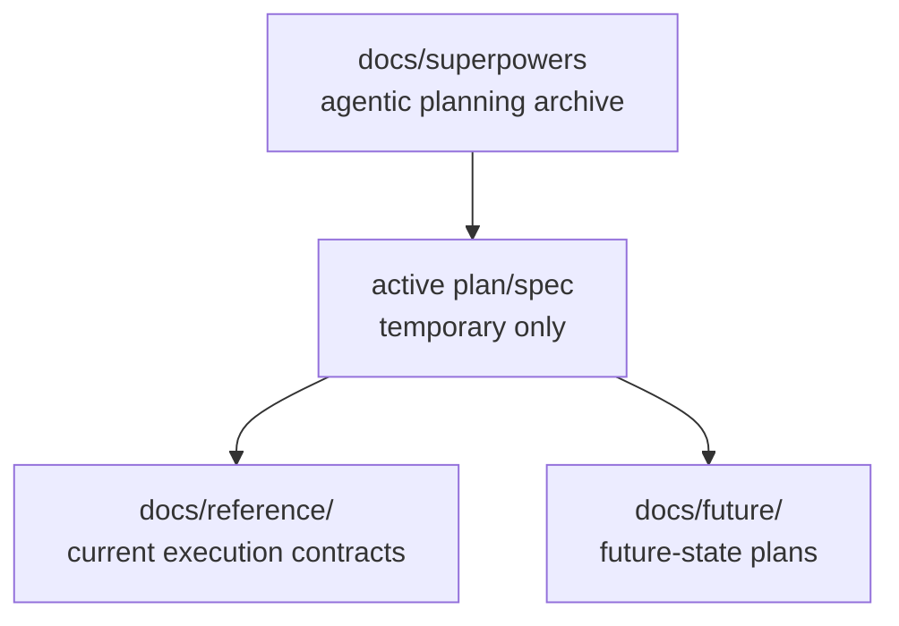

# Superpowers Planning Index

## Visual Map

This directory is the archive for scoped agentic planning artifacts generated
for implementation work. It is not the canonical source of truth for shipped
behavior.

Status: no date-stamped plan/spec artifact is currently retained as active maintained knowledge. Completed and superseded artifacts were merged into canonical references or future plans, then deleted.

Use this home for:

- implementation plans that are meant to be executed task-by-task
- design snapshots that support a bounded build slice
- temporary traceability for active work in flight

Do not use this home for:

- current architecture contracts
- durable product ontology
- backend or frontend package-local references
- future-state roadmap concepts after they become durable planning topics
- permanent historical storage for completed date-stamped plans/specs

Promotion rule:

1. Current implementation truth moves to `docs/reference/...`.
2. Backend-only implementation truth moves to `consent-protocol/docs/...`.
3. Frontend/native-only implementation truth moves to `hushh-webapp/docs/...`.
4. Future-only product or architecture ideas move to `docs/future/...`.
5. Superseded date-stamped artifacts are deleted after durable facts move.

## Active Documents

No active plan/spec artifact is retained right now.

## Related References

- [../README.md](../README.md): canonical documentation entrypoint.
- [../reference/operations/documentation-architecture-map.md](../reference/operations/documentation-architecture-map.md): documentation home map.
- [../reference/operations/docs-governance.md](../reference/operations/docs-governance.md): placement and promotion rules.
