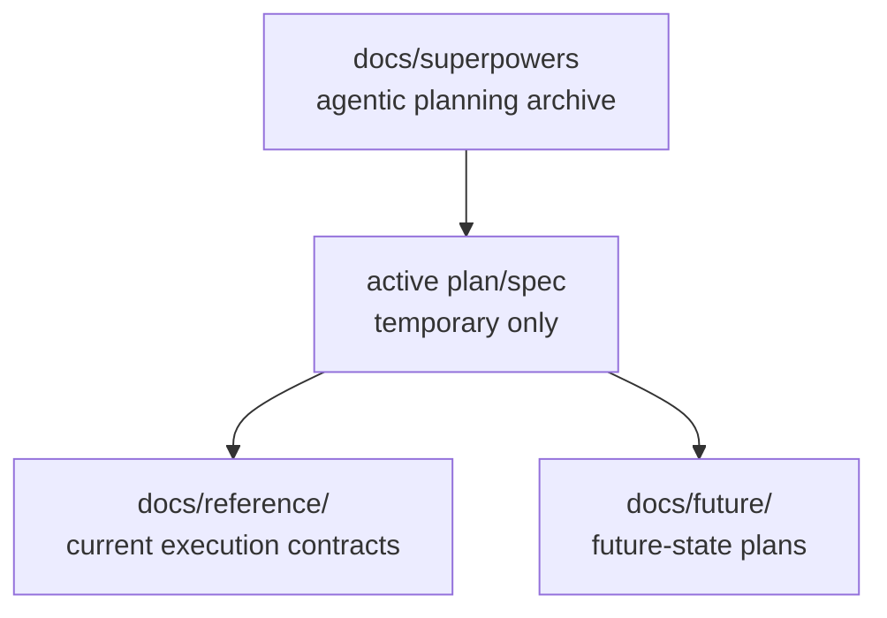

# Superpowers Planning Index

## Visual Map

This directory is the archive for scoped agentic planning artifacts generated
for implementation work. It is not the canonical source of truth for shipped
behavior.

Status: 13 date-stamped artifacts are retained here (6 plans, 7 specs, listed
below). None of them is maintained knowledge, and none should be cited as
current behavior. They are kept for traceability until step 5 of the promotion
rule runs against each one.

Use this home for:

- implementation plans that are meant to be executed task-by-task
- design snapshots that support a bounded build slice
- temporary traceability for active work in flight

Do not use this home for:

- current architecture contracts
- durable product ontology
- backend or frontend package-local references
- future-state roadmap concepts after they become durable planning topics
- permanent historical storage for completed date-stamped plans/specs

Promotion rule:

1. Current implementation truth moves to `docs/reference/...`.
2. Backend-only implementation truth moves to `consent-protocol/docs/...`.
3. Frontend/native-only implementation truth moves to `hushh-webapp/docs/...`.
4. Future-only product or architecture ideas move to `docs/future/...`.
5. Superseded date-stamped artifacts are deleted after durable facts move.

## Retained Artifacts

Historical only. Verify anything here against current code before acting on it.

### Plans

- [plans/2026-07-05-trusted-connections-graph.md](./plans/2026-07-05-trusted-connections-graph.md) — Trusted Connections generalized social graph (1457 lines)
- [plans/2026-07-06-location-unify-trusted-connections.md](./plans/2026-07-06-location-unify-trusted-connections.md) — Location and Trusted Connections unification (1001 lines)
- [plans/2026-07-10-connections-agent-one-tool-loop-parity.md](./plans/2026-07-10-connections-agent-one-tool-loop-parity.md) — Connections Agent One tool-loop parity (1160 lines)
- [plans/2026-07-11-onepoint-rebrand-apple-blue.md](./plans/2026-07-11-onepoint-rebrand-apple-blue.md) — Location rebrand and Apple Blue theme (266 lines)
- [plans/2026-07-13-kyc-agent-llm-redesign.md](./plans/2026-07-13-kyc-agent-llm-redesign.md) — KYC agent LLM redesign (1356 lines)
- [plans/2026-07-13-pickup-watch-helper.md](./plans/2026-07-13-pickup-watch-helper.md) — Pick Me Up, watch your helper approach (215 lines)

### Specs

- [specs/2026-07-05-trusted-connections-graph-design.md](./specs/2026-07-05-trusted-connections-graph-design.md) — Trusted Connections graph design
- [specs/2026-07-06-location-unify-trusted-connections-design.md](./specs/2026-07-06-location-unify-trusted-connections-design.md) — Location SOS/check-in onto the real graph
- [specs/2026-07-07-one-location-drive-to-design.md](./specs/2026-07-07-one-location-drive-to-design.md) — Drive To, live route and ETA sharing
- [specs/2026-07-10-connections-agent-one-subagent-findings.md](./specs/2026-07-10-connections-agent-one-subagent-findings.md) — Connections as a first-class Agent One subagent
- [specs/2026-07-11-onepoint-rebrand-apple-blue-design.md](./specs/2026-07-11-onepoint-rebrand-apple-blue-design.md) — Location rebrand and Apple Blue design
- [specs/2026-07-13-kyc-agent-llm-redesign-design.md](./specs/2026-07-13-kyc-agent-llm-redesign-design.md) — KYC agent LLM redesign design
- [specs/2026-07-13-pickup-watch-helper-design.md](./specs/2026-07-13-pickup-watch-helper-design.md) — Pick Me Up mutual live share and ETA design

## Related References

- [../README.md](../README.md): canonical documentation entrypoint.
- [../reference/operations/documentation-architecture-map.md](../reference/operations/documentation-architecture-map.md): documentation home map.
- [../reference/operations/docs-governance.md](../reference/operations/docs-governance.md): placement and promotion rules.
