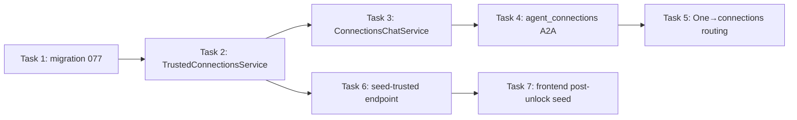

# Trusted Connections — Generalized Social Graph — Implementation Plan

> **For agentic workers:** REQUIRED SUB-SKILL: Use superpowers:subagent-driven-development (recommended) or superpowers:executing-plans to implement this plan task-by-task. Steps use checkbox (`- [ ]`) syntax for tracking.

**Goal:** Add a directional, app-wide "trusted connections" graph that only the Hussh One agent writes and any backend agent reads, resolving people through the existing platform directory.

**Architecture:** A new `trusted_connections` table (directed `owner → trusted` edges) is served by a pure `TrustedConnectionsService` (add/remove/list/is_trusted/seed). A deterministic `ConnectionsChatService` parses "add/remove/list" intent and is exposed to One as the `agent_connections` A2A specialist via the existing `adk_bridge` + classifier seam. Identity is resolved read-only through `OneLocationAgentService.list_verified_recipients` (the same platform directory Location shows). The SOS `one_location_network_connections` graph is left untouched.

**Tech Stack:** Python 3.13, FastAPI, PostgreSQL (raw SQL via `get_db().execute_raw`), pytest / pytest-asyncio (auto mode), TypeScript + Vitest (frontend).

## Visual Map



## Global Constraints

- **Do not modify SOS / One Location connection code.** No changes to `one_location_network_connections` reads/writes/seed, or to `seed_trusted_connections`.
- **Writes flow only through the One agent path** (`agent_connections` lane). No other agent calls the service's write methods.
- **Reads are in-process** (Python import). No new HTTP hop between agents.
- **Directional model:** one directed edge per `(owner_user_id, trusted_user_id)` pair. Not order-normalized.
- **Identity resolution = platform directory only.** Reuse `list_verified_recipients` read-only. No phone-typed input, no free-text name → user_id guessing beyond directory matches. Raw `user_id` allowed for seed/testing.
- **DB access pattern:** SQL uses named params (`:name`); `get_db().execute_raw(sql, params)` returns an object with `.data` (list of dict rows). Mirror `OneLocationAgentService._execute_one` / `_execute_many`.
- **Migration numbering:** next sequential number after `077_marketplace_opportunity_signals.sql` → `078` (rebased onto main, which added 077).
- **Seed env var:** reuse `SOS_SEED_DEV_USER_IDS` (comma-separated).
- **pytest config:** `testpaths=["tests"]`, `asyncio_mode="auto"`. Run tests from `consent-protocol/`.

---

### Task 1: Migration — `trusted_connections` table

**Files:**
- Create: `consent-protocol/db/migrations/078_trusted_connections.sql`
- Modify: `consent-protocol/db/release_migration_manifest.json` (append `078_trusted_connections.sql` to `ordered_migrations`)
- Test: `consent-protocol/tests/test_trusted_connections_migration.py`

**Interfaces:**
- Produces: table `trusted_connections` with columns `id, owner_user_id, trusted_user_id, status, source, resolved_via, label, created_at, updated_at, revoked_at, metadata`; unique index on `(owner_user_id, trusted_user_id)`.

- [ ] **Step 1: Write the failing test**

Create `consent-protocol/tests/test_trusted_connections_migration.py`:

```python
import json
from pathlib import Path

MIGRATIONS = Path(__file__).resolve().parent.parent / "db" / "migrations"
MANIFEST = Path(__file__).resolve().parent.parent / "db" / "release_migration_manifest.json"
FILENAME = "078_trusted_connections.sql"


def test_migration_file_exists_and_defines_table():
    sql = (MIGRATIONS / FILENAME).read_text(encoding="utf-8")
    assert "CREATE TABLE IF NOT EXISTS trusted_connections" in sql
    assert "trusted_connections_no_self" in sql
    assert "ux_trusted_connections_edge" in sql
    assert "BEGIN;" in sql and "COMMIT;" in sql


def test_migration_registered_in_release_manifest():
    manifest = json.loads(MANIFEST.read_text(encoding="utf-8"))
    assert FILENAME in manifest["ordered_migrations"]
```

- [ ] **Step 2: Run test to verify it fails**

Run: `cd consent-protocol && python -m pytest tests/test_trusted_connections_migration.py -v`
Expected: FAIL — `FileNotFoundError` (migration file missing).

- [ ] **Step 3: Create the migration file**

Create `consent-protocol/db/migrations/078_trusted_connections.sql`:

```sql
BEGIN;

-- Generalized, app-wide "trusted connections" graph.
--
-- Directional by design: one edge per (owner_user_id -> trusted_user_id) pair,
-- meaning "owner designates this person as trusted" (like an emergency contact).
-- Written ONLY through the Hussh One agent; read in-process by any agent.
-- Deliberately SEPARATE from one_location_network_connections (SOS) — that graph
-- and its code are untouched. Convergence is future work.

CREATE EXTENSION IF NOT EXISTS pgcrypto;

CREATE TABLE IF NOT EXISTS trusted_connections (
  id              UUID PRIMARY KEY DEFAULT gen_random_uuid(),
  owner_user_id   TEXT NOT NULL,
  trusted_user_id TEXT NOT NULL,
  status          TEXT NOT NULL DEFAULT 'active'
    CHECK (status IN ('active', 'revoked')),
  source          TEXT NOT NULL DEFAULT 'agent_one'
    CHECK (source IN ('agent_one', 'seed', 'import')),
  resolved_via    TEXT
    CHECK (resolved_via IN ('directory', 'user_id')),
  label           TEXT,
  created_at      TIMESTAMPTZ NOT NULL DEFAULT now(),
  updated_at      TIMESTAMPTZ NOT NULL DEFAULT now(),
  revoked_at      TIMESTAMPTZ,
  metadata        JSONB NOT NULL DEFAULT '{}'::jsonb,
  CONSTRAINT trusted_connections_no_self
    CHECK (owner_user_id <> trusted_user_id)
);

CREATE UNIQUE INDEX IF NOT EXISTS ux_trusted_connections_edge
  ON trusted_connections (owner_user_id, trusted_user_id);

CREATE INDEX IF NOT EXISTS idx_trusted_connections_owner
  ON trusted_connections (owner_user_id, status, created_at DESC);

CREATE INDEX IF NOT EXISTS idx_trusted_connections_trusted
  ON trusted_connections (trusted_user_id, status);

COMMENT ON TABLE trusted_connections IS
  'Directional, app-wide trusted-connection graph (owner -> trusted). Written only via Agent One; read in-process by any agent. Separate from one_location_network_connections.';

COMMIT;
```

- [ ] **Step 4: Register in the release manifest**

Edit `consent-protocol/db/release_migration_manifest.json`: append the string `"078_trusted_connections.sql"` as the last element of the `ordered_migrations` array (after `"076_marketplace_access_requests.sql"`). Keep valid JSON (comma after the previous entry).

- [ ] **Step 5: Run tests to verify they pass**

Run: `cd consent-protocol && python -m pytest tests/test_trusted_connections_migration.py -v`
Expected: PASS (2 passed).

- [ ] **Step 6: Commit**

```bash
git add consent-protocol/db/migrations/078_trusted_connections.sql \
        consent-protocol/db/release_migration_manifest.json \
        consent-protocol/tests/test_trusted_connections_migration.py
git commit -m "feat(trusted-connections): add trusted_connections migration"
```

---

### Task 2: `TrustedConnectionsService`

**Files:**
- Create: `consent-protocol/hushh_mcp/services/trusted_connections_service.py`
- Test: `consent-protocol/tests/test_trusted_connections_service.py`

**Interfaces:**
- Consumes: `get_db().execute_raw(sql, params) -> result.data`; `OneLocationAgentService.list_verified_recipients(owner_user_id=...) -> list[dict]` where each dict has keys `userId`, `displayName` (used read-only for resolution).
- Produces:
  - `class TrustedConnectionsError(RuntimeError)` with `(code, message, *, status_code=400)`.
  - `class IdentityUnresolvedError(TrustedConnectionsError)` with attribute `candidates: list[dict]`.
  - `class TrustedConnectionsService`:
    - `add_connection(owner_user_id, *, trusted_user_id=None, query=None, label=None, source="agent_one") -> dict` (keys: `id, ownerUserId, trustedUserId, status, source, resolvedVia, label`)
    - `remove_connection(owner_user_id, trusted_user_id) -> dict` (keys: `removed: int, trustedUserId`)
    - `list_connections(owner_user_id) -> list[dict]` (keys: `trustedUserId, displayName, label, createdAt`)
    - `is_trusted(owner_user_id, trusted_user_id) -> bool`
    - `seed_new_user(owner_user_id, seed_user_ids) -> dict` (keys: `seeded, existingCount, skippedSelf`)

- [ ] **Step 1: Write the failing test**

Create `consent-protocol/tests/test_trusted_connections_service.py`:

```python
import pytest

from hushh_mcp.services.trusted_connections_service import (
    IdentityUnresolvedError,
    TrustedConnectionsError,
    TrustedConnectionsService,
)


def _service(*, rows_one=None, rows_many=None, directory=None):
    """Build a service without a real DB; stub the execute + directory seams."""
    svc = TrustedConnectionsService.__new__(TrustedConnectionsService)
    calls = {"one": [], "many": []}

    def fake_one(sql, params=None):
        calls["one"].append((sql, params or {}))
        return (rows_one or {}).get(_tag(sql))

    def fake_many(sql, params=None):
        calls["many"].append((sql, params or {}))
        return (rows_many or {}).get(_tag(sql), [])

    svc._execute_one = fake_one  # type: ignore[attr-defined]
    svc._execute_many = fake_many  # type: ignore[attr-defined]
    svc._directory_lookup = lambda owner: (directory or [])  # type: ignore[attr-defined]
    svc._calls = calls  # type: ignore[attr-defined]
    return svc


def _tag(sql: str) -> str:
    s = sql.strip().upper()
    if s.startswith("INSERT"):
        return "insert"
    if s.startswith("UPDATE"):
        return "update"
    if "COUNT(*)" in s:
        return "count"
    if s.startswith("SELECT 1"):
        return "exists"
    return "select"


def test_add_by_user_id_passthrough_upserts():
    svc = _service(rows_one={"insert": {"id": "c1"}})
    out = svc.add_connection("owner1", trusted_user_id="devA", label="Dad")
    assert out["trustedUserId"] == "devA"
    assert out["resolvedVia"] == "user_id"
    assert svc._calls["one"][-1][1]["owner_user_id"] == "owner1"


def test_add_by_query_unique_match_resolves_from_directory():
    svc = _service(
        rows_one={"insert": {"id": "c2"}},
        directory=[{"userId": "u-alice", "displayName": "Alice Rivera"}],
    )
    out = svc.add_connection("owner1", query="alice")
    assert out["trustedUserId"] == "u-alice"
    assert out["resolvedVia"] == "directory"


def test_add_by_query_multiple_matches_raises_with_candidates():
    svc = _service(
        directory=[
            {"userId": "u1", "displayName": "Alice Rivera"},
            {"userId": "u2", "displayName": "Alice Tan"},
        ]
    )
    with pytest.raises(IdentityUnresolvedError) as exc:
        svc.add_connection("owner1", query="alice")
    assert len(exc.value.candidates) == 2


def test_add_by_query_no_match_raises():
    svc = _service(directory=[{"userId": "u1", "displayName": "Bob"}])
    with pytest.raises(IdentityUnresolvedError):
        svc.add_connection("owner1", query="alice")


def test_add_rejects_self():
    svc = _service()
    with pytest.raises(TrustedConnectionsError):
        svc.add_connection("owner1", trusted_user_id="owner1")


def test_add_requires_identifier():
    svc = _service()
    with pytest.raises(TrustedConnectionsError):
        svc.add_connection("owner1")


def test_remove_revokes():
    svc = _service(rows_one={"update": {"id": "c1"}})
    out = svc.remove_connection("owner1", "devA")
    assert out == {"removed": 1, "trustedUserId": "devA"}


def test_remove_missing_is_idempotent_noop():
    svc = _service(rows_one={})  # update returns None
    out = svc.remove_connection("owner1", "devA")
    assert out == {"removed": 0, "trustedUserId": "devA"}


def test_list_connections_returns_active():
    svc = _service(
        rows_many={
            "select": [
                {
                    "trusted_user_id": "devA",
                    "display_name": "Alice",
                    "label": None,
                    "created_at": "2026-07-05T00:00:00Z",
                }
            ]
        }
    )
    out = svc.list_connections("owner1")
    assert out == [
        {
            "trustedUserId": "devA",
            "displayName": "Alice",
            "label": None,
            "createdAt": "2026-07-05T00:00:00Z",
        }
    ]


def test_is_trusted_true_false():
    yes = _service(rows_one={"exists": {"ok": 1}})
    assert yes.is_trusted("owner1", "devA") is True
    no = _service(rows_one={})
    assert no.is_trusted("owner1", "devA") is False


def test_seed_inserts_one_edge_per_dev_when_empty():
    svc = _service(rows_one={"count": {"n": 0}, "insert": {"id": "c1"}})
    out = svc.seed_new_user("owner1", ["devA", "devB", "devC"])
    assert out["seeded"] == 3 and out["existingCount"] == 0


def test_seed_skips_when_already_connected():
    svc = _service(rows_one={"count": {"n": 2}})
    out = svc.seed_new_user("owner1", ["devA"])
    assert out == {"seeded": 0, "existingCount": 2, "skippedSelf": 0}


def test_seed_skips_self_and_blanks():
    svc = _service(rows_one={"count": {"n": 0}, "insert": {"id": "c1"}})
    out = svc.seed_new_user("owner1", ["owner1", "", "devB"])
    assert out["seeded"] == 1 and out["skippedSelf"] == 2


def test_seed_rejects_missing_owner():
    svc = _service()
    with pytest.raises(TrustedConnectionsError):
        svc.seed_new_user("  ", ["devA"])
```

- [ ] **Step 2: Run test to verify it fails**

Run: `cd consent-protocol && python -m pytest tests/test_trusted_connections_service.py -v`
Expected: FAIL — `ModuleNotFoundError: hushh_mcp.services.trusted_connections_service`.

- [ ] **Step 3: Write the service**

Create `consent-protocol/hushh_mcp/services/trusted_connections_service.py`:

```python
"""Generalized, app-wide trusted-connection graph.

Directional edges (owner_user_id -> trusted_user_id). Written ONLY through the
Hussh One agent path; read in-process by any agent. Identity is resolved through
the SAME platform directory Location shows (list_verified_recipients), read-only.

Deliberately separate from one_location_network_connections (SOS) — that graph
and its code are untouched.
"""

from __future__ import annotations

import json
import logging
from typing import Any, Callable

from db.db_client import get_db

logger = logging.getLogger(__name__)


class TrustedConnectionsError(RuntimeError):
    def __init__(self, code: str, message: str, *, status_code: int = 400) -> None:
        super().__init__(message)
        self.code = code
        self.message = message
        self.status_code = status_code


class IdentityUnresolvedError(TrustedConnectionsError):
    """Raised when a name query matches zero or many directory people."""

    def __init__(self, message: str, *, candidates: list[dict[str, Any]]) -> None:
        super().__init__("TRUSTED_IDENTITY_UNRESOLVED", message, status_code=409)
        self.candidates = candidates


def _default_directory_lookup(owner_user_id: str) -> list[dict[str, Any]]:
    # Lazy import avoids a hard module dependency and keeps this read-only reuse
    # of the SAME directory Location shows. No location state is mutated.
    from hushh_mcp.services.one_location_agent_service import OneLocationAgentService

    return OneLocationAgentService().list_verified_recipients(owner_user_id=owner_user_id)


class TrustedConnectionsService:
    """Persistence + resolution for the trusted-connection graph."""

    def __init__(
        self,
        *,
        directory_lookup: Callable[[str], list[dict[str, Any]]] | None = None,
    ) -> None:
        self._directory_lookup = directory_lookup or _default_directory_lookup

    # ---- DB seam (mirrors OneLocationAgentService) ----
    def _execute_one(self, sql: str, params: dict[str, Any] | None = None) -> dict[str, Any] | None:
        result = get_db().execute_raw(sql, params or {})
        return result.data[0] if result.data else None

    def _execute_many(self, sql: str, params: dict[str, Any] | None = None) -> list[dict[str, Any]]:
        result = get_db().execute_raw(sql, params or {})
        return result.data or []

    # ---- Resolution ----
    def _resolve_query(self, owner_user_id: str, query: str) -> str:
        needle = (query or "").strip().lower()
        if not needle:
            raise TrustedConnectionsError(
                "TRUSTED_QUERY_EMPTY", "No name given to look up.", status_code=422
            )
        people = self._directory_lookup(owner_user_id) or []
        matches = [
            p
            for p in people
            if needle in str(p.get("displayName") or "").strip().lower()
        ]
        if len(matches) == 1:
            return str(matches[0].get("userId") or "")
        raise IdentityUnresolvedError(
            f"Could not uniquely resolve '{query}' in your directory.",
            candidates=matches,
        )

    # ---- Writes (One agent only) ----
    def add_connection(
        self,
        owner_user_id: str,
        *,
        trusted_user_id: str | None = None,
        query: str | None = None,
        label: str | None = None,
        source: str = "agent_one",
    ) -> dict[str, Any]:
        owner_user_id = (owner_user_id or "").strip()
        if not owner_user_id:
            raise TrustedConnectionsError(
                "TRUSTED_OWNER_MISSING", "Missing owner user id.", status_code=422
            )

        if trusted_user_id:
            resolved_via = "user_id"
            target = trusted_user_id.strip()
        elif query:
            resolved_via = "directory"
            target = self._resolve_query(owner_user_id, query)
        else:
            raise TrustedConnectionsError(
                "TRUSTED_IDENTIFIER_MISSING",
                "Provide a trusted_user_id or a name query.",
                status_code=422,
            )

        if not target:
            raise TrustedConnectionsError(
                "TRUSTED_TARGET_MISSING", "Resolved an empty user id.", status_code=422
            )
        if target == owner_user_id:
            raise TrustedConnectionsError(
                "TRUSTED_NO_SELF", "You cannot add yourself.", status_code=422
            )

        self._execute_one(
            """
            INSERT INTO trusted_connections (
              owner_user_id, trusted_user_id, status, source, resolved_via,
              label, created_at, updated_at, metadata
            )
            VALUES (
              :owner_user_id, :trusted_user_id, 'active', :source, :resolved_via,
              :label, NOW(), NOW(), CAST(:metadata AS JSONB)
            )
            ON CONFLICT (owner_user_id, trusted_user_id) DO UPDATE SET
              status = 'active',
              updated_at = NOW(),
              revoked_at = NULL,
              source = EXCLUDED.source,
              resolved_via = EXCLUDED.resolved_via,
              label = COALESCE(EXCLUDED.label, trusted_connections.label)
            RETURNING id
            """,
            {
                "owner_user_id": owner_user_id,
                "trusted_user_id": target,
                "source": source,
                "resolved_via": resolved_via,
                "label": label,
                "metadata": json.dumps({}),
            },
        )
        return {
            "ownerUserId": owner_user_id,
            "trustedUserId": target,
            "status": "active",
            "source": source,
            "resolvedVia": resolved_via,
            "label": label,
        }

    def remove_connection(self, owner_user_id: str, trusted_user_id: str) -> dict[str, Any]:
        owner_user_id = (owner_user_id or "").strip()
        trusted_user_id = (trusted_user_id or "").strip()
        row = self._execute_one(
            """
            UPDATE trusted_connections
            SET status = 'revoked', revoked_at = NOW(), updated_at = NOW()
            WHERE owner_user_id = :owner_user_id
              AND trusted_user_id = :trusted_user_id
              AND status = 'active'
            RETURNING id
            """,
            {"owner_user_id": owner_user_id, "trusted_user_id": trusted_user_id},
        )
        return {"removed": 1 if row else 0, "trustedUserId": trusted_user_id}

    # ---- Reads (any agent) ----
    def list_connections(self, owner_user_id: str) -> list[dict[str, Any]]:
        rows = self._execute_many(
            """
            SELECT tc.trusted_user_id, tc.label, tc.created_at, a.display_name
            FROM trusted_connections tc
            LEFT JOIN actor_identity_cache a ON a.user_id = tc.trusted_user_id
            WHERE tc.owner_user_id = :owner_user_id
              AND tc.status = 'active'
            ORDER BY tc.created_at DESC
            """,
            {"owner_user_id": (owner_user_id or "").strip()},
        )
        return [
            {
                "trustedUserId": str(r.get("trusted_user_id") or ""),
                "displayName": r.get("display_name"),
                "label": r.get("label"),
                "createdAt": r.get("created_at"),
            }
            for r in rows
        ]

    def is_trusted(self, owner_user_id: str, trusted_user_id: str) -> bool:
        row = self._execute_one(
            """
            SELECT 1 AS ok
            FROM trusted_connections
            WHERE owner_user_id = :owner_user_id
              AND trusted_user_id = :trusted_user_id
              AND status = 'active'
            LIMIT 1
            """,
            {
                "owner_user_id": (owner_user_id or "").strip(),
                "trusted_user_id": (trusted_user_id or "").strip(),
            },
        )
        return bool(row)

    # ---- Seed (mirror of SOS topology; SOS code untouched) ----
    def seed_new_user(self, owner_user_id: str, seed_user_ids: list[str]) -> dict[str, Any]:
        owner_user_id = (owner_user_id or "").strip()
        if not owner_user_id:
            raise TrustedConnectionsError(
                "TRUSTED_OWNER_MISSING", "Missing owner user id.", status_code=422
            )

        existing = self._execute_one(
            """
            SELECT COUNT(*) AS n
            FROM trusted_connections
            WHERE owner_user_id = :owner_user_id AND status = 'active'
            """,
            {"owner_user_id": owner_user_id},
        )
        existing_count = int((existing or {}).get("n") or 0)
        if existing_count > 0:
            return {"seeded": 0, "existingCount": existing_count, "skippedSelf": 0}

        seeded = 0
        skipped_self = 0
        for raw in seed_user_ids:
            dev_id = (raw or "").strip()
            if not dev_id or dev_id == owner_user_id:
                skipped_self += 1
                continue
            self._execute_one(
                """
                INSERT INTO trusted_connections (
                  owner_user_id, trusted_user_id, status, source, resolved_via,
                  created_at, updated_at, metadata
                )
                VALUES (
                  :owner_user_id, :trusted_user_id, 'active', 'seed', 'user_id',
                  NOW(), NOW(), CAST(:metadata AS JSONB)
                )
                ON CONFLICT (owner_user_id, trusted_user_id) DO UPDATE SET
                  status = 'active', updated_at = NOW(), revoked_at = NULL
                RETURNING id
                """,
                {
                    "owner_user_id": owner_user_id,
                    "trusted_user_id": dev_id,
                    "metadata": json.dumps({"source": "trusted_seed"}),
                },
            )
            seeded += 1

        return {"seeded": seeded, "existingCount": existing_count, "skippedSelf": skipped_self}
```

- [ ] **Step 4: Run tests to verify they pass**

Run: `cd consent-protocol && python -m pytest tests/test_trusted_connections_service.py -v`
Expected: PASS (all tests).

- [ ] **Step 5: Commit**

```bash
git add consent-protocol/hushh_mcp/services/trusted_connections_service.py \
        consent-protocol/tests/test_trusted_connections_service.py
git commit -m "feat(trusted-connections): TrustedConnectionsService with directory resolution"
```

---

### Task 3: `ConnectionsChatService` — deterministic intent handler

**Files:**
- Create: `consent-protocol/hushh_mcp/services/connections_chat_service.py`
- Test: `consent-protocol/tests/services/test_connections_chat_service.py`

**Interfaces:**
- Consumes: `TrustedConnectionsService` (`add_connection`, `remove_connection`, `list_connections`; `IdentityUnresolvedError`).
- Produces: `class ConnectionsChatService` with
  `async def handle_turn(self, *, user_id, message, consent_token=None, conversation_id=None) -> dict`
  returning keys `response: str, conversationId: str, isComplete: bool, stateChanged: bool`.
  Constructor accepts `service: TrustedConnectionsService | None = None` for injection.

- [ ] **Step 1: Write the failing test**

Create `consent-protocol/tests/services/test_connections_chat_service.py`:

```python
import pytest

from hushh_mcp.services.connections_chat_service import ConnectionsChatService
from hushh_mcp.services.trusted_connections_service import IdentityUnresolvedError


class _FakeService:
    def __init__(self):
        self.added = []
        self.removed = []
        self.list_rows = []
        self.raise_unresolved = None

    def add_connection(self, owner_user_id, *, trusted_user_id=None, query=None, label=None):
        if self.raise_unresolved is not None:
            raise self.raise_unresolved
        self.added.append((owner_user_id, query, trusted_user_id))
        return {"trustedUserId": trusted_user_id or "resolved", "resolvedVia": "directory"}

    def remove_connection(self, owner_user_id, trusted_user_id):
        self.removed.append((owner_user_id, trusted_user_id))
        return {"removed": 1, "trustedUserId": trusted_user_id}

    def list_connections(self, owner_user_id):
        return self.list_rows


async def _turn(svc, message):
    chat = ConnectionsChatService(service=svc)
    return await chat.handle_turn(user_id="owner1", message=message, conversation_id="c1")


async def test_add_intent_calls_add_with_query():
    svc = _FakeService()
    out = await _turn(svc, "add Alice to my trusted connections")
    assert svc.added and svc.added[0][1] == "Alice"
    assert "added" in out["response"].lower()
    assert out["stateChanged"] is True


async def test_add_unresolved_asks_to_clarify_with_candidates():
    svc = _FakeService()
    svc.raise_unresolved = IdentityUnresolvedError(
        "ambiguous",
        candidates=[
            {"userId": "u1", "displayName": "Alice Rivera"},
            {"userId": "u2", "displayName": "Alice Tan"},
        ],
    )
    out = await _turn(svc, "add Alice to my trusted connections")
    assert "Alice Rivera" in out["response"] and "Alice Tan" in out["response"]
    assert out["stateChanged"] is False


async def test_remove_intent_calls_remove():
    svc = _FakeService()
    out = await _turn(svc, "remove Bob from my trusted connections")
    assert svc.removed and "removed" in out["response"].lower()


async def test_list_intent_lists_names():
    svc = _FakeService()
    svc.list_rows = [{"trustedUserId": "u1", "displayName": "Alice", "label": None}]
    out = await _turn(svc, "who do I trust")
    assert "Alice" in out["response"]
    assert out["stateChanged"] is False


async def test_list_intent_empty():
    svc = _FakeService()
    out = await _turn(svc, "my trusted connections")
    assert "no" in out["response"].lower() or "don't" in out["response"].lower()


async def test_unrecognized_message_is_gentle_help():
    svc = _FakeService()
    out = await _turn(svc, "hello there")
    assert out["isComplete"] is True
    assert "trusted connection" in out["response"].lower()
```

- [ ] **Step 2: Run test to verify it fails**

Run: `cd consent-protocol && python -m pytest tests/test_connections_chat_service.py -v`
Expected: FAIL — `ModuleNotFoundError: hushh_mcp.services.connections_chat_service`.

- [ ] **Step 3: Write the service**

Create `consent-protocol/hushh_mcp/services/connections_chat_service.py`:

```python
"""Deterministic intent handler for the trusted-connections specialist.

One delegates "add/remove/list trusted connections" turns here. The parsing is
deterministic (regex), matching the repo's existing deterministic-planner style —
no LLM call is needed for these three intents. All writes go through
TrustedConnectionsService, so this is the single write surface for the graph.
"""

from __future__ import annotations

import logging
import re
from typing import Any

from hushh_mcp.services.trusted_connections_service import (
    IdentityUnresolvedError,
    TrustedConnectionsError,
    TrustedConnectionsService,
)

logger = logging.getLogger(__name__)

_ADD_RE = re.compile(
    r"\badd\s+(?P<name>.+?)\s+(?:to|into)\s+(?:my\s+)?trusted\s+connections?\b",
    re.IGNORECASE,
)
_REMOVE_RE = re.compile(
    r"\b(?:remove|delete|drop)\s+(?P<name>.+?)\s+(?:from\s+)?(?:my\s+)?trusted\s+connections?\b",
    re.IGNORECASE,
)
_LIST_RE = re.compile(
    r"\b(?:who\s+do\s+i\s+trust|list\s+(?:my\s+)?trusted\s+connections?|my\s+trusted\s+connections?|show\s+(?:my\s+)?trusted\s+connections?)\b",
    re.IGNORECASE,
)

_HELP = (
    "I manage your trusted connections. Try: “add Alice to my trusted "
    "connections”, “remove Bob from my trusted connections”, or “who do I trust”."
)


class ConnectionsChatService:
    def __init__(self, service: TrustedConnectionsService | None = None) -> None:
        self._service = service or TrustedConnectionsService()

    async def handle_turn(
        self,
        *,
        user_id: str,
        message: str | None,
        consent_token: str | None = None,
        conversation_id: str | None = None,
    ) -> dict[str, Any]:
        text = (message or "").strip()
        conv = conversation_id or ""

        add = _ADD_RE.search(text)
        if add:
            return self._add(user_id, add.group("name").strip(), conv)

        remove = _REMOVE_RE.search(text)
        if remove:
            return self._remove(user_id, remove.group("name").strip(), conv)

        if _LIST_RE.search(text):
            return self._list(user_id, conv)

        return self._reply(_HELP, conv, state_changed=False)

    # ---- intents ----
    def _add(self, user_id: str, name: str, conv: str) -> dict[str, Any]:
        try:
            self._service.add_connection(user_id, query=name)
        except IdentityUnresolvedError as exc:
            names = [str(c.get("displayName") or "someone") for c in exc.candidates]
            if names:
                listed = " or ".join(names)
                return self._reply(
                    f"I found more than one match for “{name}”: {listed}. "
                    "Which one should I add?",
                    conv,
                    state_changed=False,
                )
            return self._reply(
                f"I couldn't find “{name}” in your directory yet, so I didn't add anyone.",
                conv,
                state_changed=False,
            )
        except TrustedConnectionsError as exc:
            return self._reply(exc.message, conv, state_changed=False)
        return self._reply(
            f"Added {name} to your trusted connections.", conv, state_changed=True
        )

    def _remove(self, user_id: str, name: str, conv: str) -> dict[str, Any]:
        try:
            target = self._service._resolve_query(user_id, name)  # noqa: SLF001
        except IdentityUnresolvedError:
            return self._reply(
                f"I couldn't uniquely find “{name}” to remove. Can you be more specific?",
                conv,
                state_changed=False,
            )
        result = self._service.remove_connection(user_id, target)
        if result.get("removed"):
            return self._reply(
                f"Removed {name} from your trusted connections.", conv, state_changed=True
            )
        return self._reply(
            f"{name} wasn't in your trusted connections.", conv, state_changed=False
        )

    def _list(self, user_id: str, conv: str) -> dict[str, Any]:
        rows = self._service.list_connections(user_id)
        if not rows:
            return self._reply(
                "You don't have any trusted connections yet.", conv, state_changed=False
            )
        names = [str(r.get("displayName") or r.get("trustedUserId") or "someone") for r in rows]
        return self._reply(
            "Your trusted connections: " + ", ".join(names) + ".",
            conv,
            state_changed=False,
        )

    @staticmethod
    def _reply(response: str, conv: str, *, state_changed: bool) -> dict[str, Any]:
        return {
            "response": response,
            "conversationId": conv,
            "isComplete": True,
            "stateChanged": state_changed,
        }
```

Note: `_remove` resolves the name via the same directory resolver (`_resolve_query`) then revokes — reusing the exact resolution path `add` uses, so behavior is consistent.

- [ ] **Step 4: Run tests to verify they pass**

Run: `cd consent-protocol && python -m pytest tests/test_connections_chat_service.py -v`
Expected: PASS (all tests).

- [ ] **Step 5: Commit**

```bash
git add consent-protocol/hushh_mcp/services/connections_chat_service.py \
        consent-protocol/tests/services/test_connections_chat_service.py
git commit -m "feat(trusted-connections): deterministic ConnectionsChatService"
```

---

### Task 4: A2A specialist `agent_connections`

**Files:**
- Create: `consent-protocol/hushh_mcp/adk_bridge/connections_agent.py`
- Modify: `consent-protocol/hushh_mcp/adk_bridge/__init__.py`
- Test: `consent-protocol/tests/test_connections_a2a.py`

**Interfaces:**
- Consumes: `A2ATask`, `SpecialistTurnResult` from `hushh_mcp.adk_bridge.contract`; `ConnectionsChatService.handle_turn`.
- Produces: `class ConnectionsAgentA2A` with `async def handle(self, task: A2ATask) -> SpecialistTurnResult`; `def get_connections_a2a() -> ConnectionsAgentA2A`; registration of `"agent_connections"` in `_register_builtin_specialists`.

- [ ] **Step 1: Write the failing test**

Create `consent-protocol/tests/test_connections_a2a.py`:

```python
import hushh_mcp.adk_bridge  # noqa: F401  (registers specialists)
from hushh_mcp.adk_bridge.connections_agent import ConnectionsAgentA2A
from hushh_mcp.adk_bridge.contract import A2ATask
from hushh_mcp.adk_bridge.dispatch import dispatch, is_wired_specialist


class _FakeChat:
    async def handle_turn(self, *, user_id, message, consent_token=None, conversation_id=None):
        return {
            "response": f"ok:{message}",
            "conversationId": conversation_id or "c1",
            "isComplete": True,
            "stateChanged": True,
        }


async def test_handle_maps_chat_output_to_turn_result():
    agent = ConnectionsAgentA2A(service=_FakeChat())
    task = A2ATask(
        user_id="owner1",
        consent_token="tok",
        conversation_id="c1",
        message="add Alice to my trusted connections",
    )
    result = await agent.handle(task)
    assert result.text == "ok:add Alice to my trusted connections"
    assert result.model == "one+connections"
    assert result.directive is None
    assert result.state_changed is True


def test_agent_connections_is_registered():
    assert is_wired_specialist("agent_connections") is True


async def test_dispatch_reaches_connections():
    task = A2ATask(
        user_id="owner1",
        consent_token="tok",
        conversation_id="c1",
        message="who do I trust",
    )
    result = await dispatch("agent_connections", task)
    assert result.model == "one+connections"
```

- [ ] **Step 2: Run test to verify it fails**

Run: `cd consent-protocol && python -m pytest tests/test_connections_a2a.py -v`
Expected: FAIL — `ModuleNotFoundError: ...connections_agent` / `agent_connections` not registered.

- [ ] **Step 3: Write the A2A wrapper**

Create `consent-protocol/hushh_mcp/adk_bridge/connections_agent.py`:

```python
"""In-process A2A handler for the Trusted Connections specialist.

Wraps ConnectionsChatService.handle_turn and adapts its dict output into the
generic SpecialistTurnResult. Deterministic + write-capable (add/remove) plus a
read (list); emits no client directive. Consent is validated by the One route
against AGENT_ONE_ORCHESTRATE before dispatch, exactly like the email agent.
"""

from __future__ import annotations

from typing import Any

from hushh_mcp.adk_bridge.contract import A2ATask, SpecialistTurnResult

DELEGATED_MODEL = "one+connections"


class ConnectionsAgentA2A:
    def __init__(self, service: Any = None) -> None:
        if service is not None:
            self._service = service
        else:
            from hushh_mcp.services.connections_chat_service import ConnectionsChatService

            self._service = ConnectionsChatService()

    async def handle(self, task: A2ATask) -> SpecialistTurnResult:
        out: dict = await self._service.handle_turn(
            user_id=task.user_id,
            message=task.message,
            consent_token=task.consent_token,
            conversation_id=task.conversation_id,
        )
        return SpecialistTurnResult(
            conversation_id=str(out.get("conversationId") or task.conversation_id or ""),
            text=str(out.get("response") or ""),
            directive=None,
            is_complete=bool(out.get("isComplete", True)),
            state_changed=bool(out.get("stateChanged", False)),
            model=DELEGATED_MODEL,
        )


_singleton: ConnectionsAgentA2A | None = None


def get_connections_a2a() -> ConnectionsAgentA2A:
    global _singleton
    if _singleton is None:
        _singleton = ConnectionsAgentA2A()
    return _singleton
```

- [ ] **Step 4: Register the specialist**

Edit `consent-protocol/hushh_mcp/adk_bridge/__init__.py`:

Add the import alongside the others:

```python
from hushh_mcp.adk_bridge.connections_agent import get_connections_a2a
```

Add the registration inside `_register_builtin_specialists()`:

```python
    register_specialist(
        "agent_connections", lambda task: get_connections_a2a().handle(task)
    )
```

- [ ] **Step 5: Run tests to verify they pass**

Run: `cd consent-protocol && python -m pytest tests/test_connections_a2a.py -v`
Expected: PASS (all tests).

- [ ] **Step 6: Commit**

```bash
git add consent-protocol/hushh_mcp/adk_bridge/connections_agent.py \
        consent-protocol/hushh_mcp/adk_bridge/__init__.py \
        consent-protocol/tests/test_connections_a2a.py
git commit -m "feat(trusted-connections): register agent_connections A2A specialist"
```

---

### Task 5: One → connections routing (classifier + delegate tool)

**Files:**
- Modify: `consent-protocol/hushh_mcp/agents/orchestrator/tools.py` (add a `_SPECIALIST_ROUTES` entry and a `delegate_to_connections_agent` tool)
- Test: `consent-protocol/tests/test_connections_classifier.py`

**Interfaces:**
- Historical note: the lexical classifier and custom delegate target were retired by the AG-UI/ADK cutover; delegation now remains inside One's authored ADK tree.
- Produces: classifier routes trusted-connection messages to `agent_connections`.

- [ ] **Step 1: Write the failing test**

Create `consent-protocol/tests/test_connections_classifier.py`:

```python
import hushh_mcp.adk_bridge  # noqa: F401  (ensures agent_connections is registered)
from hushh_mcp.agents.orchestrator.tools import classify_specialist_domain


def test_add_routes_to_connections():
    assert classify_specialist_domain("add Alice to my trusted connections") == (
        "connections",
        "agent_connections",
    )


def test_remove_routes_to_connections():
    domain, target = classify_specialist_domain("remove Bob from my trusted connections")
    assert target == "agent_connections"


def test_who_do_i_trust_routes_to_connections():
    domain, target = classify_specialist_domain("who do I trust")
    assert target == "agent_connections"


def test_general_chitchat_stays_general():
    assert classify_specialist_domain("what's the weather") is None


def test_resolve_delegate_target_picks_connections():
    from api.routes.kai.agent_chat import resolve_delegate_target

    assert resolve_delegate_target("add Alice to my trusted connections") == "agent_connections"
```

- [ ] **Step 2: Run test to verify it fails**

Run: `cd consent-protocol && python -m pytest tests/test_connections_classifier.py -v`
Expected: FAIL — classifier returns `None` for the connection messages.

- [ ] **Step 3: Add the classifier route**

Edit `consent-protocol/hushh_mcp/agents/orchestrator/tools.py`. In the `_SPECIALIST_ROUTES` tuple, add this entry immediately BEFORE the `location` entry (so "trusted connection" is matched before any broad cue):

```python
    (
        "connections",
        "agent_connections",
        (
            "trusted connection",
            "trusted connections",
            "who do i trust",
            "people i trust",
            "add to my trusted",
        ),
    ),
```

- [ ] **Step 4: Add the delegate tool (parity with other specialists)**

In the same file, add near the other `delegate_to_*` tools:

```python
@hushh_tool(scope="agent.one.orchestrate", name="delegate_to_connections_agent")
def delegate_to_connections_agent() -> Dict[str, Any]:
    """Delegate current conversation to the trusted-connections specialist."""
    ctx = HushhContext.current()
    return _create_delegation_response("connections", "agent_connections", ctx)
```

- [ ] **Step 5: Run tests to verify they pass**

Run: `cd consent-protocol && python -m pytest tests/test_connections_classifier.py -v`
Expected: PASS (all tests).

- [ ] **Step 6: Run the specialist suite to confirm no regressions**

Run: `cd consent-protocol && python -m pytest tests/test_connections_classifier.py tests/test_connections_a2a.py -v`
Expected: PASS.

- [ ] **Step 7: Commit**

```bash
git add consent-protocol/hushh_mcp/agents/orchestrator/tools.py \
        consent-protocol/tests/test_connections_classifier.py
git commit -m "feat(trusted-connections): route trusted-connection turns to agent_connections"
```

---

### Task 6: Seed endpoint (mirror topology, SOS untouched)

**Files:**
- Create: consent-protocol/api/routes/one/connections.py
- Modify: `consent-protocol/api/routes/one/__init__.py`
- Test: consent-protocol/tests/test_connections_seed_route.py

**Interfaces:**
- Consumes: `require_vault_owner_token` (dependency), `TrustedConnectionsService.seed_new_user`, env `SOS_SEED_DEV_USER_IDS`.
- Produces: `POST /api/one/connections/seed-trusted` returning `{"result": {seeded, existingCount, skippedSelf}}`; `_seed_dev_user_ids()` helper.

- [ ] **Step 1: Write the failing test**

Create consent-protocol/tests/test_connections_seed_route.py:

```python
import importlib


def test_seed_dev_user_ids_parses_csv(monkeypatch):
    module = importlib.import_module("api.routes.one.connections")
    monkeypatch.setenv("SOS_SEED_DEV_USER_IDS", " devA , devB ,, devC ")
    assert module._seed_dev_user_ids() == ["devA", "devB", "devC"]


def test_seed_dev_user_ids_empty_when_unset(monkeypatch):
    module = importlib.import_module("api.routes.one.connections")
    monkeypatch.delenv("SOS_SEED_DEV_USER_IDS", raising=False)
    assert module._seed_dev_user_ids() == []


def test_seed_route_is_registered():
    module = importlib.import_module("api.routes.one.connections")
    paths = {getattr(r, "path", None) for r in module.router.routes}
    assert "/api/one/connections/seed-trusted" in paths
```

- [ ] **Step 2: Run test to verify it fails**

Run: `cd consent-protocol && python -m pytest tests/test_connections_seed_route.py -v`
Expected: FAIL — `ModuleNotFoundError: api.routes.one.connections`.

- [ ] **Step 3: Write the route**

Create consent-protocol/api/routes/one/connections.py:

```python
"""Trusted Connections routes.

Seed endpoint only, for now. Writes to the generalized trusted_connections graph
via TrustedConnectionsService. Mirrors the SOS seed topology (new user -> seed
set) but is a SEPARATE call — the SOS /api/one/location/seed-trusted path and
one_location_network_connections are untouched.
"""

from __future__ import annotations

import os
from typing import Any

from fastapi import APIRouter, Depends, HTTPException, status

from api.middleware import require_vault_owner_token
from hushh_mcp.services.trusted_connections_service import (
    TrustedConnectionsError,
    TrustedConnectionsService,
)

router = APIRouter(prefix="/api/one", tags=["One Trusted Connections"])


def _service() -> TrustedConnectionsService:
    return TrustedConnectionsService()


def _user_id(token_data: dict[str, Any]) -> str:
    return str(token_data.get("user_id") or "").strip()


def _seed_dev_user_ids() -> list[str]:
    """Configured accounts to seed into the trusted graph (reuses SOS list)."""
    raw = str(os.getenv("SOS_SEED_DEV_USER_IDS", "") or "")
    return [item.strip() for item in raw.split(",") if item.strip()]


@router.post("/connections/seed-trusted")
async def seed_trusted_connections(
    token_data: dict = Depends(require_vault_owner_token),
):
    """Seed the current user's trusted graph with configured accounts.

    Idempotent; gated server-side on the user having zero active trusted edges.
    """
    try:
        return {
            "result": _service().seed_new_user(
                _user_id(token_data), _seed_dev_user_ids()
            )
        }
    except TrustedConnectionsError as exc:
        raise HTTPException(
            status_code=exc.status_code, detail={"code": exc.code, "message": exc.message}
        ) from exc
    except Exception as exc:  # noqa: BLE001
        raise HTTPException(
            status_code=status.HTTP_500_INTERNAL_SERVER_ERROR,
            detail={"code": "TRUSTED_SEED_FAILED", "message": "Seed failed."},
        ) from exc
```

- [ ] **Step 4: Register the router**

Edit `consent-protocol/api/routes/one/__init__.py`:

Add the import (with the other imports):

```python
from .connections import router as connections_router
```

Add the include (with the other includes):

```python
router.include_router(connections_router)
```

- [ ] **Step 5: Run tests to verify they pass**

Run: `cd consent-protocol && python -m pytest tests/test_connections_seed_route.py -v`
Expected: PASS (3 passed).

- [ ] **Step 6: Commit**

```bash
git add consent-protocol/api/routes/one/connections.py \
        consent-protocol/api/routes/one/__init__.py \
        consent-protocol/tests/test_connections_seed_route.py
git commit -m "feat(trusted-connections): add seed-trusted endpoint for the shared graph"
```

---

### Task 7: Frontend — seed the shared graph after vault unlock

**Files:**
- Create: hushh-webapp/lib/one-connections/service.ts
- Modify: `hushh-webapp/lib/services/post-unlock-sync-service.ts`
- Test: hushh-webapp/lib/one-connections/__tests__/service.test.ts

**Interfaces:**
- Consumes: `apiJson` from `@/lib/services/api-client`.
- Produces: `OneConnectionsService.seedTrustedConnections({ vaultOwnerToken }) -> Promise<{ seeded; existingCount; skippedSelf }>`; `PostUnlockSyncService.run` additionally returns `trustedSeeded: boolean`.

- [ ] **Step 1: Write the failing test**

Create hushh-webapp/lib/one-connections/__tests__/service.test.ts:

```typescript
import { describe, it, expect, vi, beforeEach } from "vitest";

const apiJson = vi.fn();
vi.mock("@/lib/services/api-client", () => ({
  apiJson: (...args: unknown[]) => apiJson(...args),
  ApiError: class ApiError extends Error {},
}));

import { OneConnectionsService } from "@/lib/one-connections/service";

describe("OneConnectionsService", () => {
  beforeEach(() => apiJson.mockReset());

  it("POSTs to the connections seed endpoint and returns the result", async () => {
    apiJson.mockResolvedValueOnce({
      result: { seeded: 2, existingCount: 0, skippedSelf: 1 },
    });
    const out = await OneConnectionsService.seedTrustedConnections({
      vaultOwnerToken: "tok",
    });
    expect(apiJson).toHaveBeenCalledWith(
      "/api/one/connections/seed-trusted",
      expect.objectContaining({ method: "POST" }),
    );
    expect(out).toEqual({ seeded: 2, existingCount: 0, skippedSelf: 1 });
  });
});
```

- [ ] **Step 2: Run test to verify it fails**

Run: `cd hushh-webapp && npx vitest run lib/one-connections/__tests__/service.test.ts`
Expected: FAIL — cannot resolve `@/lib/one-connections/service`.

- [ ] **Step 3: Write the service**

Create hushh-webapp/lib/one-connections/service.ts:

```typescript
import { apiJson } from "@/lib/services/api-client";

function jsonAuthHeaders(vaultOwnerToken: string): Record<string, string> {
  return {
    Authorization: `Bearer ${vaultOwnerToken}`,
    "Content-Type": "application/json",
  };
}

export interface TrustedSeedResult {
  seeded: number;
  existingCount: number;
  skippedSelf: number;
}

/**
 * Client for the generalized trusted-connections graph. Seeding only, for now.
 * Separate from OneLocationService (SOS) by design.
 */
export const OneConnectionsService = {
  async seedTrustedConnections(params: {
    vaultOwnerToken: string;
  }): Promise<TrustedSeedResult> {
    const response = await apiJson<{ result: TrustedSeedResult }>(
      "/api/one/connections/seed-trusted",
      {
        method: "POST",
        headers: jsonAuthHeaders(params.vaultOwnerToken),
      },
    );
    return response.result;
  },
};
```

- [ ] **Step 4: Run test to verify it passes**

Run: `cd hushh-webapp && npx vitest run lib/one-connections/__tests__/service.test.ts`
Expected: PASS.

- [ ] **Step 5: Wire it into the post-unlock bridge**

Edit `hushh-webapp/lib/services/post-unlock-sync-service.ts`:

Add the import at the top (with the other imports):

```typescript
import { OneConnectionsService } from "@/lib/one-connections/service";
```

After the existing `seedResult` block and before the `return`, add a separate, isolated seed call:

```typescript
    // Seed the generalized trusted-connections graph (idempotent, gated
    // server-side on zero edges). Separate from the SOS seed above; a failure
    // here must not abort onboarding sync.
    const trustedSeed = await OneConnectionsService.seedTrustedConnections({
      vaultOwnerToken: params.vaultOwnerToken,
    }).catch((error) => {
      console.warn("[PostUnlockSyncService] Trusted-connection seed failed:", error);
      return { seeded: 0, existingCount: 0, skippedSelf: 0 };
    });
```

Update the return statement to include `trustedSeeded`:

```typescript
    return {
      onboardingSynced: Boolean(syncResult.synced),
      sosSeeded: Boolean(seedResult.seeded),
      trustedSeeded: Boolean(trustedSeed.seeded),
    };
```

Update the method's return type annotation:

```typescript
  ): Promise<{ onboardingSynced: boolean; sosSeeded: boolean; trustedSeeded: boolean }> {
```

- [ ] **Step 6: Run the post-unlock test to confirm no regression**

Run: `cd hushh-webapp && npx vitest run lib/services/__tests__/post-unlock-sync-service.sos.test.ts lib/one-connections/__tests__/service.test.ts`
Expected: PASS (the existing SOS post-unlock test still passes; the new service test passes).

- [ ] **Step 7: Commit**

```bash
git add hushh-webapp/lib/one-connections/service.ts \
        hushh-webapp/lib/one-connections/__tests__/service.test.ts \
        hushh-webapp/lib/services/post-unlock-sync-service.ts
git commit -m "feat(trusted-connections): seed shared graph after vault unlock"
```

---

## Final verification

- [ ] **Backend suite (new tests + touched neighbors):**

Run: `cd consent-protocol && python -m pytest tests/test_trusted_connections_migration.py tests/test_trusted_connections_service.py tests/test_connections_chat_service.py tests/test_connections_a2a.py tests/test_connections_classifier.py tests/test_connections_seed_route.py -v`
Expected: all PASS.

- [ ] **Confirm SOS untouched:**

Run: `cd consent-protocol && python -m pytest tests/test_one_location_sos_seed.py tests/test_one_location_seed_route.py -v`
Expected: all PASS (no regressions; these files were not modified).

- [ ] **Frontend:**

Run: `cd hushh-webapp && npx vitest run lib/one-connections lib/services/__tests__/post-unlock-sync-service.sos.test.ts`
Expected: all PASS.

---

## Self-review notes

- **Spec coverage:** data model (Task 1), `TrustedConnectionsService` add/remove/list/is_trusted/seed (Task 2), One write path via `agent_connections` (Tasks 3–5), directory-based identity resolution (Task 2 `_resolve_query`, reused in Task 3), reads available in-process to any agent (Task 2 public methods), mirror seed reusing `SOS_SEED_DEV_USER_IDS` (Tasks 6–7). SOS/location code left unmodified throughout.
- **Deferred by design (per spec):** wiring specific Location/Email read call-sites, a full Gemini tool-loop for the connections lane, and any UI beyond seeding — all future work, not in this plan.
