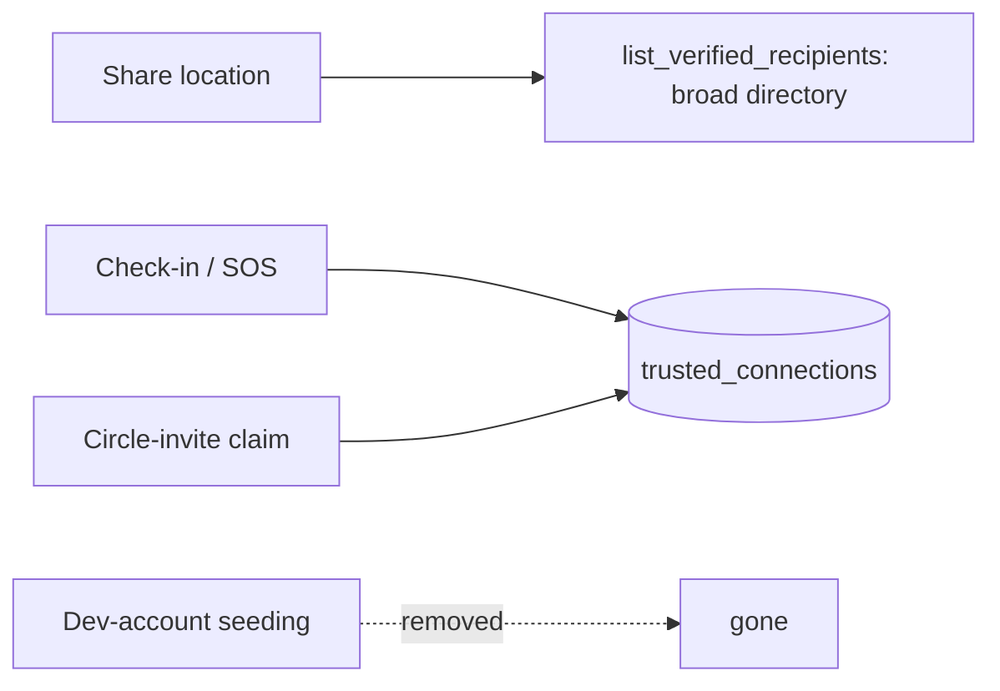

# Location ↔ Trusted Connections Unification — Implementation Plan

> **For agentic workers:** REQUIRED SUB-SKILL: Use superpowers:subagent-driven-development (recommended) or superpowers:executing-plans to implement this plan task-by-task. Steps use checkbox (`- [ ]`) syntax for tracking.

**Goal:** Make SOS and Check-in (page + location agent) broadcast to the user's real `trusted_connections` graph, retire the preseeded SOS graph (`one_location_network_connections`), and add a `propose_check_in` agent tool.

**Architecture:** Approach A from the design spec — repoint all location reads/writes to the directional `trusted_connections` graph, migrate real rows in, remove all seeding, and drop the old table. The frontend keeps its `networkConnections` state field (now sourced from the unified graph) so SOS/check-in selection code barely changes.

**Tech Stack:** Python (FastAPI, raw SQL via `get_db().execute_raw`), Postgres migrations (`consent-protocol/db/migrations/NNN_*.sql`), Google GenAI function-calling agent, TypeScript/Next.js frontend, pytest + vitest.

**Spec:** `docs/superpowers/specs/2026-07-06-location-unify-trusted-connections-design.md`

## Visual Map



## Global Constraints

- Coordinate-safety invariant: the server/agent NEVER sees raw coordinates. `propose_*` tools return coordinate-free descriptors; the browser captures/encrypts/publishes. New check-in code MUST follow this.
- Migrations: wrap in `BEGIN;`/`COMMIT;`, use `IF EXISTS`/`IF NOT EXISTS`, idempotent. Next number is `079` (078 is latest).
- `trusted_connections` is directional: `(owner_user_id → trusted_user_id)` means "owner trusts this person to receive owner's location/SOS."
- Commits: use `git commit -s` (DCO sign-off required by CI). Do NOT add a `Co-Authored-By: Claude` trailer.
- Run backend tests with `cd consent-protocol && uv run --no-project python -m pytest <path>`. DB-backed tests require the local backend tunnel (`bash scripts/runtime/run_backend_local.sh local`) or run in CI.
- Run webapp tests with `cd hushh-webapp && npm test -- <path>` (vitest).
- Pre-existing unrelated failure to ignore: `tests/agents/test_location_agent_tools.py::test_location_agent_yaml_declares_callable_tools` (manifest drift on main).

---

## Task 1: Migration 079 — migrate real connections into `trusted_connections`, purge seeds

**Files:**
- Create: `consent-protocol/db/migrations/079_unify_location_connections.sql`
- Test: `consent-protocol/tests/test_unify_location_connections_migration.py` (DB-backed; mirrors `tests/test_one_location_public_invite_migration.py`)

**Interfaces:**
- Produces: `trusted_connections` now allows `source='circle_invite'`; contains one directional edge per real (non-seeded) `one_location_network_connections` pair, in BOTH directions; no `source='seed'` rows remain. Old table is left intact (dropped in Task 9).

- [ ] **Step 1: Write the migration SQL**

Create `consent-protocol/db/migrations/079_unify_location_connections.sql`:

```sql
BEGIN;

-- Unify location SOS/check-in onto the app-wide trusted_connections graph.
--
-- 1. Allow a 'circle_invite' provenance on trusted_connections.source.
-- 2. Copy REAL one_location_network_connections rows (undirected pairs, NOT the
--    dev seed) into trusted_connections as BOTH directional edges, preserving
--    existing mutual SOS reachability.
-- 3. Purge preseeded trusted rows (source='seed').
--
-- The old one_location_network_connections table is retired in a later migration
-- once all code stops referencing it. Idempotent: ON CONFLICT DO NOTHING + IF
-- EXISTS guards.

-- 1. Widen the source CHECK to include circle_invite.
ALTER TABLE trusted_connections
  DROP CONSTRAINT IF EXISTS trusted_connections_source_check;
ALTER TABLE trusted_connections
  ADD CONSTRAINT trusted_connections_source_check
  CHECK (source IN ('agent_one', 'seed', 'import', 'circle_invite'));

-- 2a. Copy a -> b for every real active pair.
INSERT INTO trusted_connections (
  owner_user_id, trusted_user_id, status, source, resolved_via,
  created_at, updated_at, metadata
)
SELECT
  nc.user_a_id, nc.user_b_id, 'active', 'circle_invite', 'user_id',
  NOW(), NOW(), '{"source":"migrated_from_network"}'::jsonb
FROM one_location_network_connections nc
WHERE nc.status = 'active'
  AND nc.user_a_id <> nc.user_b_id
  AND COALESCE(nc.metadata->>'source', '') <> 'sos_seed'
ON CONFLICT (owner_user_id, trusted_user_id) DO NOTHING;

-- 2b. Copy b -> a (the reverse direction) for the same real pairs.
INSERT INTO trusted_connections (
  owner_user_id, trusted_user_id, status, source, resolved_via,
  created_at, updated_at, metadata
)
SELECT
  nc.user_b_id, nc.user_a_id, 'active', 'circle_invite', 'user_id',
  NOW(), NOW(), '{"source":"migrated_from_network"}'::jsonb
FROM one_location_network_connections nc
WHERE nc.status = 'active'
  AND nc.user_a_id <> nc.user_b_id
  AND COALESCE(nc.metadata->>'source', '') <> 'sos_seed'
ON CONFLICT (owner_user_id, trusted_user_id) DO NOTHING;

-- 3. Remove preseeded trusted rows so no dev account remains a trusted contact.
DELETE FROM trusted_connections WHERE source = 'seed';

COMMIT;
```

- [ ] **Step 2: Write the DB-backed migration test**

Create `consent-protocol/tests/test_unify_location_connections_migration.py`, following the harness in `tests/test_one_location_public_invite_migration.py` (apply migrations to a scratch DB, seed rows, assert). Test body:

```python
"""079 migration: real network connections migrate into trusted_connections
(both directions), seeded rows are excluded, and source='seed' trusted rows are purged.

DB-backed — requires the local backend tunnel or CI Postgres.
"""
from __future__ import annotations

import pytest

from tests.helpers.migration_db import apply_migrations, get_test_db  # pattern from test_one_location_public_invite_migration.py


@pytest.mark.db
def test_079_migrates_real_pairs_both_directions_and_drops_seeds():
    db = get_test_db()
    apply_migrations(db, upto="078")
    # a real invite-claimed pair (ordered a<b) and a seeded pair
    db.execute_raw(
        """
        INSERT INTO one_location_network_connections
          (user_a_id, user_b_id, inviter_user_id, invitee_user_id, status,
           connected_at, created_at, updated_at, metadata)
        VALUES
          ('userA', 'userB', 'userA', 'userB', 'active', NOW(), NOW(), NOW(), '{"source":"invite_to_one"}'::jsonb),
          ('devX', 'userZ', 'userZ', 'devX', 'active', NOW(), NOW(), NOW(), '{"source":"sos_seed"}'::jsonb)
        """,
        {},
    )
    # a preseeded trusted row that must be purged
    db.execute_raw(
        """
        INSERT INTO trusted_connections (owner_user_id, trusted_user_id, status, source, resolved_via)
        VALUES ('userA', 'devSeed', 'active', 'seed', 'user_id')
        """,
        {},
    )

    apply_migrations(db, upto="079")

    rows = db.execute_raw(
        "SELECT owner_user_id, trusted_user_id, source FROM trusted_connections ORDER BY owner_user_id, trusted_user_id",
        {},
    ).data
    edges = {(r["owner_user_id"], r["trusted_user_id"]) for r in rows}
    # real pair migrated both directions
    assert ("userA", "userB") in edges
    assert ("userB", "userA") in edges
    # seeded network pair NOT migrated
    assert ("devX", "userZ") not in edges and ("userZ", "devX") not in edges
    # preseeded trusted row purged
    assert all(r["source"] != "seed" for r in rows)
```

- [ ] **Step 3: Run the test**

Run: `cd consent-protocol && uv run --no-project python -m pytest tests/test_unify_location_connections_migration.py -v`
Expected: PASS (with DB available). If the DB tunnel is down, note it and run in CI.

- [ ] **Step 4: Commit**

```bash
git add consent-protocol/db/migrations/079_unify_location_connections.sql consent-protocol/tests/test_unify_location_connections_migration.py
git commit -s -m "feat(location): migration to unify network connections into trusted_connections"
```

---

## Task 2: Repoint `list_verified_recipients` eligibility rule #1 to `trusted_connections`

**Files:**
- Modify: `consent-protocol/hushh_mcp/services/one_location_agent_service.py` (lines 2376-2384, rule #1 EXISTS clause inside `list_verified_recipients`)
- Test: `consent-protocol/tests/services/test_one_location_agent_service.py` (add case near existing recipient-directory tests ~L113/425/992)

**Interfaces:**
- Consumes: `trusted_connections` table (Task 1).
- Produces: a user is eligible as a recipient (rule #1) when the owner has an active `trusted_connections` edge to them.

- [ ] **Step 1: Write the failing test**

Add to `consent-protocol/tests/services/test_one_location_agent_service.py` (match the file's existing fake-DB style; the fake should return a row only when the SQL contains `trusted_connections`):

```python
def test_list_verified_recipients_rule1_uses_trusted_connections(monkeypatch):
    svc = OneLocationAgentService()
    captured = {}

    def fake_execute_many(sql, params):
        captured["sql"] = sql
        captured["params"] = params
        return [{
            "user_id": "friend", "display_name": "Friend", "phone_number": None,
            "phone_verified": True, "key_id": "k1", "public_key_jwk": "{}",
            "algorithm": "ECDH-P256-AES256-GCM", "key_created_at": None,
        }]

    monkeypatch.setattr(svc, "_execute_many", fake_execute_many)
    monkeypatch.setattr(svc, "_apply_kai_circle_recommendations", lambda **kw: kw["recipients"])
    out = svc.list_verified_recipients(owner_user_id="owner")
    assert "trusted_connections" in captured["sql"]
    assert "one_location_network_connections" not in captured["sql"]
    assert out and out[0]["userId"] == "friend"
```

- [ ] **Step 2: Run test to verify it fails**

Run: `cd consent-protocol && uv run --no-project python -m pytest tests/services/test_one_location_agent_service.py::test_list_verified_recipients_rule1_uses_trusted_connections -v`
Expected: FAIL (SQL still references `one_location_network_connections`).

- [ ] **Step 3: Replace rule #1 in the SQL**

In `list_verified_recipients`, replace the rule-#1 EXISTS block (currently lines 2376-2384):

```python
                EXISTS (
                  SELECT 1
                  FROM one_location_network_connections nc
                  WHERE nc.status = 'active'
                    AND (
                      (nc.user_a_id = :owner_user_id AND nc.user_b_id = a.user_id)
                      OR (nc.user_b_id = :owner_user_id AND nc.user_a_id = a.user_id)
                    )
                )
```

with:

```python
                EXISTS (
                  SELECT 1
                  FROM trusted_connections tc
                  WHERE tc.status = 'active'
                    AND tc.owner_user_id = :owner_user_id
                    AND tc.trusted_user_id = a.user_id
                )
```

Also update the docstring comment at 2345-2348 to say "an active trusted_connections edge (owner → this person)" instead of "One Network connection".

> IMPORTANT — do not narrow the share directory. This repoint changes ONLY rule #1;
> rule #2 (`phone_verified = TRUE`, i.e. all phone-verified users) and rule #3
> (marketplace) stay OR'd in, so `list_verified_recipients` remains broad for the
> Share feature (`trusted ∪ all-phone-verified ∪ marketplace`). The repoint exists
> because the old table is being dropped (Task 9) and to guarantee trusted
> connections are always in the pool. Check-in/SOS are gated separately by Task 3's
> `networkConnections` filter — NOT here.

- [ ] **Step 4: Run test to verify it passes**

Run: `cd consent-protocol && uv run --no-project python -m pytest tests/services/test_one_location_agent_service.py::test_list_verified_recipients_rule1_uses_trusted_connections -v`
Expected: PASS.

- [ ] **Step 5: Commit**

```bash
git add consent-protocol/hushh_mcp/services/one_location_agent_service.py consent-protocol/tests/services/test_one_location_agent_service.py
git commit -s -m "feat(location): recipient directory rule #1 reads trusted_connections"
```

---

## Task 3: Source `list_state.networkConnections` from `trusted_connections`

**Files:**
- Modify: `consent-protocol/hushh_mcp/services/one_location_agent_service.py` (lines 3684-3695, the `network_connections` query in `list_state`) and lines 3731-3735 (the `networkConnections` payload list)
- Add: a mapper `_trusted_connection_as_network_payload` next to `_one_network_connection_payload` (~L1618)
- Test: `consent-protocol/tests/test_one_location_list_state_resilience.py` (has a `networkConnections` assertion at :62)

**Interfaces:**
- Produces: `list_state()["networkConnections"]` is a list of `{id, userAId, userBId, status, ...}` items where `userAId` = owner, `userBId` = trusted, sourced from active `trusted_connections` edges. Frontend `selectSosConnectedRecipients` (reads `userAId`/`userBId`/`status`) keeps working unchanged.

- [ ] **Step 1: Write the failing test**

Add to `consent-protocol/tests/test_one_location_list_state_resilience.py`:

```python
def test_list_state_network_connections_sourced_from_trusted(monkeypatch):
    svc = OneLocationAgentService()

    def fake_many(name, sql, params):
        if "trusted_connections" in sql:
            return [{"id": "e1", "owner_user_id": "owner", "trusted_user_id": "friend",
                     "status": "active", "created_at": None, "updated_at": None}]
        return []

    # patch the internal _safe_many used by list_state (see existing test's monkeypatching)
    # ... assert result:
    state = _run_list_state_with(svc, monkeypatch, fake_many, user_id="owner")
    conns = state["networkConnections"]
    assert conns and conns[0]["userAId"] == "owner" and conns[0]["userBId"] == "friend"
    assert conns[0]["status"] == "active"
```

> Match the existing resilience test's monkeypatch approach for `_safe_many`/`_execute_many`; the helper `_run_list_state_with` is illustrative — wire it to the file's existing setup.

- [ ] **Step 2: Run test to verify it fails**

Run: `cd consent-protocol && uv run --no-project python -m pytest tests/test_one_location_list_state_resilience.py::test_list_state_network_connections_sourced_from_trusted -v`
Expected: FAIL (query still hits `one_location_network_connections`; payload shape mismatch).

- [ ] **Step 3: Add the mapper**

Add next to `_one_network_connection_payload` (after line 1634):

```python
    @staticmethod
    def _trusted_connection_as_network_payload(
        row: dict[str, Any] | None,
    ) -> dict[str, Any] | None:
        """Map a trusted_connections edge (owner -> trusted) into the legacy
        networkConnections payload shape the frontend SOS/check-in selectors read.
        userAId is always the owner, userBId the trusted person."""
        if not row:
            return None
        return {
            "id": str(row.get("id") or ""),
            "userAId": str(row.get("owner_user_id") or ""),
            "userBId": str(row.get("trusted_user_id") or ""),
            "inviterUserId": str(row.get("owner_user_id") or ""),
            "inviteeUserId": str(row.get("trusted_user_id") or ""),
            "inviteId": None,
            "status": str(row.get("status") or "active"),
            "connectedAt": _iso(row.get("created_at")),
            "createdAt": _iso(row.get("created_at")),
            "updatedAt": _iso(row.get("updated_at")),
            "revokedAt": _iso(row.get("revoked_at")),
        }
```

- [ ] **Step 4: Repoint the query + payload in `list_state`**

Replace the `network_connections` query (3684-3695):

```python
        network_connections = _safe_many(
            "network_connections",
            """
            SELECT id, owner_user_id, trusted_user_id, status, created_at, updated_at, revoked_at
            FROM trusted_connections
            WHERE status = 'active'
              AND owner_user_id = :user_id
            ORDER BY created_at DESC
            LIMIT 50
            """,
            {"user_id": user_id},
        )
```

Replace the `networkConnections` payload list (3731-3735):

```python
            "networkConnections": [
                payload
                for row in network_connections
                if (payload := self._trusted_connection_as_network_payload(row))
            ],
```

- [ ] **Step 5: Run test to verify it passes**

Run: `cd consent-protocol && uv run --no-project python -m pytest tests/test_one_location_list_state_resilience.py -v`
Expected: PASS.

- [ ] **Step 6: Commit**

```bash
git add consent-protocol/hushh_mcp/services/one_location_agent_service.py consent-protocol/tests/test_one_location_list_state_resilience.py
git commit -s -m "feat(location): list_state networkConnections sourced from trusted_connections"
```

---

## Task 4: Circle-invite claim writes a one-way `trusted_connections` edge (claimer → inviter)

**Files:**
- Modify: `consent-protocol/hushh_mcp/services/one_location_agent_service.py` (lines 3341-3384, the INSERT in `claim_circle_invite`)
- Test: `consent-protocol/tests/services/test_one_location_agent_service.py`

**Interfaces:**
- Consumes: `trusted_connections` (Task 1).
- Produces: claiming an invite inserts `(owner=claimant, trusted=inviter)` with `source='circle_invite'`. The claimant's SOS/check-in now reaches the inviter.

- [ ] **Step 1: Write the failing test**

Add to `consent-protocol/tests/services/test_one_location_agent_service.py` (fake-DB style; assert the INSERT targets `trusted_connections` with claimant as owner):

```python
def test_claim_circle_invite_writes_one_way_trusted_edge(monkeypatch):
    svc = OneLocationAgentService()
    writes = []
    monkeypatch.setattr(svc, "_circle_invite_row_for_token",
                        lambda **kw: {"id": "inv1", "owner_user_id": "inviter", "message": ""})
    monkeypatch.setattr(svc, "_identity_row",
                        lambda uid: {"user_id": uid, "phone_verified": True, "display_name": uid})

    def fake_one(sql, params):
        writes.append((sql, params))
        return {"id": "edge1", "owner_user_id": params.get("owner_user_id"),
                "trusted_user_id": params.get("trusted_user_id"), "status": "active"}

    monkeypatch.setattr(svc, "_execute_one", fake_one)
    svc.claim_circle_invite(invite_token="tok", claimant_user_id="claimant")
    insert = next(w for w in writes if "INSERT INTO trusted_connections" in w[0])
    assert insert[1]["owner_user_id"] == "claimant"
    assert insert[1]["trusted_user_id"] == "inviter"
```

- [ ] **Step 2: Run test to verify it fails**

Run: `cd consent-protocol && uv run --no-project python -m pytest tests/services/test_one_location_agent_service.py::test_claim_circle_invite_writes_one_way_trusted_edge -v`
Expected: FAIL (still inserts into `one_location_network_connections`).

- [ ] **Step 3: Replace the INSERT in `claim_circle_invite`**

Replace the block that computes `user_a_id, user_b_id = self._network_pair(...)` and the `one_location_network_connections` INSERT (3341-3384) with a directional trusted-edge insert:

```python
        connection_row = self._execute_one(
            """
            INSERT INTO trusted_connections (
              owner_user_id, trusted_user_id, status, source, resolved_via,
              created_at, updated_at, metadata
            )
            VALUES (
              :owner_user_id, :trusted_user_id, 'active', 'circle_invite', 'user_id',
              NOW(), NOW(), CAST(:metadata_json AS JSONB)
            )
            ON CONFLICT (owner_user_id, trusted_user_id) DO UPDATE SET
              status = 'active',
              updated_at = NOW(),
              revoked_at = NULL,
              source = 'circle_invite'
            RETURNING id, owner_user_id, trusted_user_id, status
            """,
            {
                "owner_user_id": claimant_user_id,
                "trusted_user_id": owner_user_id,
                "metadata_json": _json_param(
                    {"source": "invite_to_one", "invite_id": invite_id}
                ),
            },
        )
```

Then update any downstream use of `connection_row` in this method (e.g. building the response payload) to read `owner_user_id`/`trusted_user_id` keys; if it previously called `_one_network_connection_payload(connection_row)`, use `_trusted_connection_as_network_payload(connection_row)` instead. Read lines 3378-3460 during implementation and adjust the return payload accordingly.

- [ ] **Step 4: Run test to verify it passes**

Run: `cd consent-protocol && uv run --no-project python -m pytest tests/services/test_one_location_agent_service.py::test_claim_circle_invite_writes_one_way_trusted_edge -v`
Expected: PASS.

- [ ] **Step 5: Commit**

```bash
git add consent-protocol/hushh_mcp/services/one_location_agent_service.py consent-protocol/tests/services/test_one_location_agent_service.py
git commit -s -m "feat(location): circle-invite claim writes one-way trusted_connections edge"
```

---

## Task 5: Remove backend seeding (service methods + routes)

**Files:**
- Modify: `consent-protocol/hushh_mcp/services/one_location_agent_service.py` — delete `seed_trusted_connections` (3462-3537)
- Modify: `consent-protocol/hushh_mcp/services/trusted_connections_service.py` — delete `seed_new_user` (216-265)
- Modify: `consent-protocol/api/routes/one/location.py` — delete `_sos_seed_dev_user_ids` (117-123) and the `POST /location/seed-trusted` handler (338-355)
- Delete: consent-protocol/api/routes/one/connections.py (entire file — only contained the seed route)
- Modify: `consent-protocol/api/routes/one/__init__.py` — remove `connections_router` import + include (lines 7, 21)
- Delete tests: consent-protocol/tests/test_one_location_sos_seed.py, consent-protocol/tests/test_connections_seed_route.py, `consent-protocol/tests/test_one_location_seed_route.py`, and the `seed_new_user` cases in `consent-protocol/tests/test_trusted_connections_service.py` (lines 137-156)

**Interfaces:**
- Produces: no seed endpoints exist; `POST /api/one/location/seed-trusted` and `POST /api/one/connections/seed-trusted` return 404.

- [ ] **Step 1: Write the failing test**

Add to `consent-protocol/tests/test_one_location_seed_route.py` — replace its body to assert the route is GONE (invert the existing assertion at :19):

```python
def test_seed_trusted_routes_removed():
    from api.routes.one import router  # aggregate One router
    paths = {r.path for r in router.routes}
    assert "/api/one/location/seed-trusted" not in paths
    assert "/api/one/connections/seed-trusted" not in paths
```

- [ ] **Step 2: Run test to verify it fails**

Run: `cd consent-protocol && uv run --no-project python -m pytest tests/test_one_location_seed_route.py::test_seed_trusted_routes_removed -v`
Expected: FAIL (routes still registered).

- [ ] **Step 3: Delete the code**

- Delete `seed_trusted_connections` from `one_location_agent_service.py` (3462-3537).
- Delete `seed_new_user` from `trusted_connections_service.py` (216-265, and its `# ---- Seed ----` comment).
- Delete `_sos_seed_dev_user_ids` and the `seed_trusted_contacts` route from `location.py`; drop the now-unused `import os` there if nothing else uses it (grep first).
- `git rm consent-protocol/api/routes/one/connections.py`.
- In `consent-protocol/api/routes/one/__init__.py` remove the `from .connections import router as connections_router` import and its `include_router(connections_router)` call.
- Delete `tests/test_one_location_sos_seed.py`, `tests/test_connections_seed_route.py`; delete the four `seed_new_user` tests in `tests/test_trusted_connections_service.py` (137-156).

- [ ] **Step 4: Run tests to verify pass + nothing else broke**

Run: `cd consent-protocol && uv run --no-project python -m pytest tests/test_one_location_seed_route.py tests/test_trusted_connections_service.py tests/test_connections_chat_service.py -v`
Expected: PASS (seed route gone; remaining trusted-connections tests green).

- [ ] **Step 5: Commit**

```bash
git add -A consent-protocol/hushh_mcp consent-protocol/api consent-protocol/tests
git commit -s -m "feat(location): remove dev-account seeding of trusted connections"
```

---

## Task 6: Remove frontend seeding calls + client methods

**Files:**
- Modify: `hushh-webapp/lib/services/post-unlock-sync-service.ts` — remove both seed blocks (29-47), the `OneConnectionsService` import (line 5), and the `sosSeeded`/`trustedSeeded` return fields (19, 49-53)
- Modify: `hushh-webapp/lib/one-location/service.ts` — delete `seedTrustedContacts` (341-351)
- Delete: hushh-webapp/lib/one-connections/service.ts (only held `seedTrustedConnections`) and its test hushh-webapp/lib/one-connections/__tests__/service.test.ts
- Modify tests: `hushh-webapp/lib/services/__tests__/post-unlock-sync-service.sos.test.ts` (remove seed mocks/assertions at 11,21,38,40,43,52), `hushh-webapp/lib/one-location/__tests__/service-sos.test.ts` (remove `seedTrustedContacts` cases 98-101)

**Interfaces:**
- Consumes: nothing new.
- Produces: `PostUnlockSyncService` no longer calls any seed endpoint; return type is `{ onboardingSynced: boolean }`.

- [ ] **Step 1: Update the failing test**

Edit `hushh-webapp/lib/services/__tests__/post-unlock-sync-service.sos.test.ts` to assert seeding is NOT called:

```typescript
it("does not seed trusted contacts or connections", async () => {
  const seedSpy = vi.spyOn(OneLocationService, "seedTrustedContacts" as never);
  await PostUnlockSyncService.run({ vaultOwnerToken: "t" } as never);
  expect(seedSpy).not.toHaveBeenCalled();
});
```

(Remove the old assertions that expected seeding to happen.)

- [ ] **Step 2: Run test to verify it fails**

Run: `cd hushh-webapp && npm test -- lib/services/__tests__/post-unlock-sync-service.sos.test.ts`
Expected: FAIL (seeding still invoked / method still present).

- [ ] **Step 3: Delete the code**

- In `post-unlock-sync-service.ts`: remove the `OneConnectionsService` import; delete the two seed blocks (29-47); change the return to `return { onboardingSynced: Boolean(syncResult.synced) };` and its declared return type to `Promise<{ onboardingSynced: boolean }>`.
- In `one-location/service.ts`: delete `seedTrustedContacts` (341-351).
- `git rm hushh-webapp/lib/one-connections/service.ts hushh-webapp/lib/one-connections/__tests__/service.test.ts`.
- Remove the `seedTrustedContacts` cases from `service-sos.test.ts` (98-101).
- Grep for any remaining `OneConnectionsService` / `seedTrustedContacts` / `seedTrustedConnections` importers and clean them: `cd hushh-webapp && grep -rn "OneConnectionsService\|seedTrustedContacts\|seedTrustedConnections" --include=*.ts --include=*.tsx | grep -v __tests__`.

- [ ] **Step 4: Run tests**

Run: `cd hushh-webapp && npm test -- lib/services/__tests__/post-unlock-sync-service.sos.test.ts lib/one-location/__tests__/service-sos.test.ts`
Expected: PASS.

- [ ] **Step 5: Commit**

```bash
git add -A hushh-webapp/lib
git commit -s -m "feat(location): stop seeding trusted contacts on post-unlock"
```

---

## Task 7: Add `propose_check_in` agent tool (backend)

> **Historical note (2026-08-26):** `propose_check_in` and the Location Agent
> tool it describes were later retired -- Nearby Check-In shipped as its own
> generated action gateway surface instead, and this specialist's tool no
> longer exists. The test file this task creates,
> consent-protocol/tests/test_location_chat_check_in_directive.py, was
> deleted along with it. Left as historical record; do not follow this task
> as current instructions.

**Files:**
- Modify: `consent-protocol/hushh_mcp/agents/location/tools.py` — add `propose_check_in` after `propose_sos_panic` (~234) and add to `V2_LOCATION_TOOLS` (~528)
- Modify: `consent-protocol/hushh_mcp/agents/location/agent.yaml` — add the tool binding + a system-instruction line
- Modify: `consent-protocol/hushh_mcp/services/location_chat_service.py` — add its `FunctionDeclaration` (after 360), add to `_QUERY_TOOL_NAMES` (65-79), map it in `_directive_from_tool` (after 675), add a `check_in` branch to `_build_client_action` (after 735), add `("check_in","completed")`/`("check_in","cancelled")` to `_ACTION_RESULT_TEMPLATES` (94-102), and add `"check_in"` to the `_handle_action_result` state-change set (766-770)
- Test: consent-protocol/tests/test_location_chat_check_in_directive.py (mirror `tests/test_location_chat_sos_directive.py`)

**Interfaces:**
- Produces: agent tool `propose_check_in(duration_hours: float, note: str | None = None)` → `{"proposed": "check_in", "durationHours": hours, "note": note}`; a `check_in` clientAction `{id, type:"check_in", durationHours, note, summary}`.

- [ ] **Step 1: Write the failing test**

Create consent-protocol/tests/test_location_chat_check_in_directive.py:

```python
import pytest
from google.genai import types

from hushh_mcp.agents.location.tools import V2_LOCATION_TOOLS, propose_check_in
from hushh_mcp.hushh_adk.context import HushhContext
from hushh_mcp.services.location_chat_service import _function_declarations_v2, LocationChatService


def test_propose_check_in_registered():
    assert any(getattr(t, "_name", "") == "propose_check_in" for t in V2_LOCATION_TOOLS)
    names = {d.name for d in _function_declarations_v2(types)}
    assert "propose_check_in" in names


async def test_propose_check_in_returns_descriptor():
    with HushhContext(user_id="u", consent_token="t", vault_keys={}):  # noqa: S106
        out = await propose_check_in.__wrapped__(2.0, "on my way")
    assert out == {"proposed": "check_in", "durationHours": 2.0, "note": "on my way"}


def test_check_in_directive_and_action():
    d = LocationChatService._directive_from_tool(
        "propose_check_in", {"proposed": "check_in", "durationHours": 2.0, "note": "hi"}
    )
    assert d == {"type": "check_in", "durationHours": 2.0, "note": "hi"}
    svc = LocationChatService.__new__(LocationChatService)
    action = svc._build_client_action([d])
    assert action["type"] == "check_in" and action["durationHours"] == 2.0 and action["note"] == "hi"
```

- [ ] **Step 2: Run test to verify it fails**

Run: `cd consent-protocol && uv run --no-project python -m pytest tests/test_location_chat_check_in_directive.py -v`
Expected: FAIL (`propose_check_in` not defined).

- [ ] **Step 3: Add the tool in `tools.py`**

After `propose_sos_panic` (line 233), add:

```python
@hushh_tool(scope=ConsentScope.CAP_LOCATION_LIVE_SHARE, name="propose_check_in")
async def propose_check_in(duration_hours: float, note: str | None = None) -> dict[str, Any]:
    """Propose a check-in: share live location with the user's ready trusted
    contacts for a bounded time with an optional note. The browser creates the
    grants per recipient, encrypts, and publishes. Coordinate-free."""
    _ctx()
    try:
        hours = float(duration_hours)
    except (TypeError, ValueError) as exc:
        raise ValueError("duration_hours must be a number between 0 and 24") from exc
    if not (0 < hours <= 24):
        raise ValueError("duration_hours must be greater than 0 and at most 24")
    clean_note = (note or "").strip()[:120] or None
    return {"proposed": "check_in", "durationHours": hours, "note": clean_note}
```

Add `propose_check_in,` to `V2_LOCATION_TOOLS` (after `propose_sos_panic,` at line 528).

- [ ] **Step 4: Wire it in `location_chat_service.py`**

Add to `_QUERY_TOOL_NAMES` (inside the set at 65-79): `"propose_check_in",`.

Add to `_ACTION_RESULT_TEMPLATES` (94-102):

```python
    ("check_in", "completed"): "Done — your trusted contacts can see your check-in. ✓",
    ("check_in", "cancelled"): "Okay — I didn't check you in.",
```

Add a `FunctionDeclaration` right after the `propose_sos_panic` one (after line 360, inside the `.extend([...])`):

```python
            types.FunctionDeclaration(
                name="propose_check_in",
                description=(
                    "Propose a check-in: share live location with the user's ready "
                    "trusted contacts for duration_hours (0<h<=24) with an optional note. "
                    "The browser creates grants per recipient, encrypts, and publishes. "
                    "Coordinate-free. Ask for the duration first (request_duration_choice)."
                ),
                parameters=schema(
                    type=kind.OBJECT,
                    properties={
                        "duration_hours": schema(type=kind.NUMBER, description="0 < hours <= 24"),
                        "note": schema(type=kind.STRING, description="Optional short note"),
                    },
                    required=["duration_hours"],
                ),
            ),
```

Add to `_directive_from_tool` after the `propose_sos_panic` branch (after line 675):

```python
        if name == "propose_check_in" and result.get("proposed") == "check_in":
            return {
                "type": "check_in",
                "durationHours": result.get("durationHours"),
                "note": result.get("note"),
            }
```

Add a `check_in` branch to `_build_client_action` after the `sos` branch (after line 735, before `return None`):

```python
        check_in = next((d for d in directives if d.get("type") == "check_in"), None)
        if check_in:
            hours = check_in.get("durationHours")
            return {
                "id": action_id,
                "type": "check_in",
                "durationHours": hours,
                "note": check_in.get("note"),
                "summary": f"Check in with your trusted contacts for {hours}h",
            }
```

Add `"check_in"` to the `_handle_action_result` state-change tuple (766-770).

- [ ] **Step 5: Add the agent.yaml binding + instruction**

In `agent.yaml`, add under `tools:` (mirror the `propose_sos_panic` entry style):

```yaml
  - name: propose_check_in
    description: Propose a bounded check-in share to the user's ready trusted contacts (browser encrypts/publishes).
    py_func: hushh_mcp.agents.location.tools.propose_check_in
    required_scope: cap.location.live.share
```

Add a line to the system_instruction near the SOS guidance: "To check in (non-emergency), confirm a duration, then call propose_check_in with duration_hours and an optional note; it shares with the user's ready trusted contacts."

- [ ] **Step 6: Run tests**

Run: `cd consent-protocol && uv run --no-project python -m pytest tests/test_location_chat_check_in_directive.py tests/test_location_chat_sos_directive.py -v`
Expected: PASS.

- [ ] **Step 7: Commit**

```bash
git add consent-protocol/hushh_mcp/agents/location consent-protocol/hushh_mcp/services/location_chat_service.py consent-protocol/tests/test_location_chat_check_in_directive.py
git commit -s -m "feat(location): add propose_check_in agent tool + directive"
```

---

## Task 8: Add the `check_in` browser runtime + `runCheckIn`

**Files:**
- Create: `hushh-webapp/lib/one-location/check-in-trigger.ts` (`runCheckIn`)
- Create: `hushh-webapp/lib/one-location/__tests__/check-in-trigger.test.ts`
- Modify: `hushh-webapp/lib/agent/specialist-directive-runtime.ts` — add a `check_in` handler after the `sos_panic` block (after line 185)
- Test: `hushh-webapp/lib/agent/__tests__/specialist-directive-runtime.check-in.test.ts` (mirror the SOS runtime test)

**Interfaces:**
- Consumes: `selectSosConnectedRecipients`, `isSosShareReadyRecipient`, `SosShareReadyRecipient` from `sos-trigger.ts`; `OneLocationService`, `encryptLocationForRecipient`.
- Produces: `runCheckIn({ vaultOwnerToken, recipients, point, durationHours, note, publish }): Promise<string[]>` (returns created grant ids); runtime handles `type === "check_in"` on the directive payload `{ durationHours, note }`.

- [ ] **Step 1: Write the failing test for `runCheckIn`**

Create `hushh-webapp/lib/one-location/__tests__/check-in-trigger.test.ts`:

```typescript
import { describe, it, expect, vi } from "vitest";
import { runCheckIn } from "@/lib/one-location/check-in-trigger";
import { OneLocationService } from "@/lib/one-location/service";

describe("runCheckIn", () => {
  it("creates one grant per recipient with the chosen duration + note and publishes", async () => {
    const created: any[] = [];
    vi.spyOn(OneLocationService, "createGrant").mockImplementation(async (p: any) => {
      created.push(p);
      return { id: `g-${p.recipientUserId}` } as any;
    });
    const published: string[] = [];
    const recipients = [
      { userId: "a", keyId: "ka", publicKeyJwk: {}, canReceiveLocation: true },
      { userId: "b", keyId: "kb", publicKeyJwk: {}, canReceiveLocation: true },
    ] as any;
    const ids = await runCheckIn({
      vaultOwnerToken: "t",
      recipients,
      point: { latitude: 1, longitude: 2, accuracyM: 3 } as any,
      durationHours: 2,
      note: "on my way",
      publish: async (grant) => { published.push(grant.id); },
    });
    expect(ids).toEqual(["g-a", "g-b"]);
    expect(created[0]).toMatchObject({ durationHours: 2, reason: "on my way" });
    expect(published).toEqual(["g-a", "g-b"]);
  });
});
```

- [ ] **Step 2: Run test to verify it fails**

Run: `cd hushh-webapp && npm test -- lib/one-location/__tests__/check-in-trigger.test.ts`
Expected: FAIL (module not found).

- [ ] **Step 3: Implement `runCheckIn`**

Create `hushh-webapp/lib/one-location/check-in-trigger.ts`:

```typescript
import { OneLocationService } from "@/lib/one-location/service";
import type { OneLocationGrant, PlainLocationPoint } from "@/lib/one-location/types";
import type { SosShareReadyRecipient } from "@/lib/one-location/sos-trigger";

export interface RunCheckInParams {
  vaultOwnerToken: string;
  /** Only share-ready recipients — caller pre-filters with isSosShareReadyRecipient. */
  recipients: SosShareReadyRecipient[];
  point: PlainLocationPoint;
  durationHours: number;
  note?: string | null;
  publish: (
    grant: OneLocationGrant,
    recipient: SosShareReadyRecipient,
    point: PlainLocationPoint,
  ) => Promise<void>;
}

/** Non-emergency check-in: bounded share to the user's ready trusted contacts.
 * Unlike SOS it uses a caller-chosen duration + note and records no SOS incident. */
export async function runCheckIn(params: RunCheckInParams): Promise<string[]> {
  const { vaultOwnerToken, recipients, point, durationHours, note, publish } = params;
  if (!recipients.length) throw new Error("No check-in recipients provided.");
  const reason = (note ?? "").trim() || "Checking in";
  const grantIds: string[] = [];
  for (const recipient of recipients) {
    const grant = await OneLocationService.createGrant({
      vaultOwnerToken,
      recipientUserId: recipient.userId,
      recipientKeyId: recipient.keyId,
      durationHours,
      reason,
    });
    grantIds.push(grant.id);
    await publish(grant, recipient, point);
  }
  return grantIds;
}
```

- [ ] **Step 4: Run test to verify it passes**

Run: `cd hushh-webapp && npm test -- lib/one-location/__tests__/check-in-trigger.test.ts`
Expected: PASS.

- [ ] **Step 5: Write the failing runtime-handler test**

Create `hushh-webapp/lib/agent/__tests__/specialist-directive-runtime.check-in.test.ts` mirroring `specialist-directive-runtime.sos.test.ts` (mock `OneLocationService.getState` to return one ready trusted recipient + a networkConnection, and `captureCurrentPosition`), asserting a `check_in` directive returns `status: "completed"` and calls `createGrant` with the payload duration/note. Cancelled-when-no-recipients case returns `status: "cancelled"`.

- [ ] **Step 6: Run it (fails)**

Run: `cd hushh-webapp && npm test -- lib/agent/__tests__/specialist-directive-runtime.check-in.test.ts`
Expected: FAIL (no `check_in` handler).

- [ ] **Step 7: Add the runtime handler**

In `specialist-directive-runtime.ts`, add `runCheckIn` to imports and insert after the `sos_panic` block (after line 185):

```typescript
    if (type === "check_in") {
      const state = await OneLocationService.getState(vaultOwnerToken);
      const connected = selectSosConnectedRecipients(
        state.recipients ?? [],
        state.networkConnections,
        currentUserId,
      );
      const ready = connected.filter(isSosShareReadyRecipient);
      if (!ready.length) {
        return { delegate_agent_id: "agent_location", kind: "action", id, type, status: "cancelled" };
      }
      const point = await OneLocationService.captureCurrentPosition();
      await runCheckIn({
        vaultOwnerToken,
        recipients: ready,
        point,
        durationHours: Number(payload.durationHours) || 1,
        note: payload.note ?? null,
        publish: async (grant, recipient, pt) => {
          const envelope = await encryptLocationForRecipient({
            point: pt,
            recipientPublicKeyJwk: recipient.publicKeyJwk,
            recipientKeyId: recipient.keyId,
          });
          await OneLocationService.storeEnvelope({ vaultOwnerToken, grantId: grant.id, envelope });
        },
      });
      return { delegate_agent_id: "agent_location", kind: "action", id, type, status: "completed" };
    }
```

Update the import block (lines 3-7) to also import `runCheckIn` from `@/lib/one-location/check-in-trigger`.

- [ ] **Step 8: Run tests**

Run: `cd hushh-webapp && npm test -- lib/agent/__tests__/specialist-directive-runtime.check-in.test.ts lib/agent/__tests__/specialist-directive-runtime.sos.test.ts`
Expected: PASS.

- [ ] **Step 9: Commit**

```bash
git add hushh-webapp/lib/one-location/check-in-trigger.ts hushh-webapp/lib/one-location/__tests__/check-in-trigger.test.ts hushh-webapp/lib/agent/specialist-directive-runtime.ts hushh-webapp/lib/agent/__tests__/specialist-directive-runtime.check-in.test.ts
git commit -s -m "feat(location): agent check-in browser runtime + runCheckIn"
```

---

## Task 9: Drop `one_location_network_connections` + sweep remaining references

**Files:**
- Create: consent-protocol/db/migrations/080_drop_one_location_network_connections.sql
- Modify: `consent-protocol/hushh_mcp/services/one_location_agent_service.py` — remove the `_optional_signal_rows` query against the table (~955-959), and remove `_network_pair` (1607-1616) + `_one_network_connection_payload` (1618-1634) if grep shows they are now unused
- Modify: account-deletion cleanup that `DELETE`s from the table (find via grep) to target `trusted_connections` instead
- Modify tests: `consent-protocol/tests/services/test_account_service_cleanup_tables.py` (line 107), `consent-protocol/tests/test_one_location_public_invite_migration.py` (lines 71, 73, 79), and `tests/services/test_one_location_agent_service.py:113,425,992`

**Interfaces:**
- Produces: `one_location_network_connections` no longer exists; no code references it.

- [ ] **Step 1: Sweep for references**

Run: `cd consent-protocol && grep -rn "one_location_network_connections\|_network_pair\|_one_network_connection_payload" hushh_mcp api | grep -v "\.pyc"`
List every hit; each must be removed or repointed before the drop.

- [ ] **Step 2: Write the migration**

Create consent-protocol/db/migrations/080_drop_one_location_network_connections.sql:

```sql
BEGIN;

-- Retire the legacy SOS graph. All reads/writes now go through trusted_connections
-- (migrated in 079). Safe to drop after the app no longer references the table.
DROP TABLE IF EXISTS one_location_network_connections;

COMMIT;
```

- [ ] **Step 3: Remove/repoint remaining code references**

- Remove or repoint the `_optional_signal_rows` query at ~955 (if it powered a signal used by `_apply_kai_circle_recommendations`, repoint to `trusted_connections` with the owner→trusted shape; otherwise delete the signal). Read the surrounding function during implementation.
- Delete `_network_pair` and `_one_network_connection_payload` only if Step 1 shows no remaining callers (Task 4 removed the last `_network_pair` call; Task 3 replaced `_one_network_connection_payload` in `list_state`).
- Repoint the account-cleanup `DELETE FROM one_location_network_connections` to `DELETE FROM trusted_connections WHERE owner_user_id = :user_id OR trusted_user_id = :user_id` (locate via the grep; update the corresponding assertion in `test_account_service_cleanup_tables.py:107`).
- Update the migration-list test references so they no longer expect the dropped table.

- [ ] **Step 4: Run tests**

Run: `cd consent-protocol && uv run --no-project python -m pytest tests/services/test_account_service_cleanup_tables.py tests/services/test_one_location_agent_service.py tests/test_one_location_list_state_resilience.py -v`
Expected: PASS. Re-run the Step-1 grep and confirm zero remaining references.

- [ ] **Step 5: Commit**

```bash
git add -A consent-protocol/db/migrations consent-protocol/hushh_mcp consent-protocol/tests
git commit -s -m "feat(location): drop legacy one_location_network_connections table"
```

---

## Task 10: Docs + full governance/test sweep

**Files:**
- Modify: `docs/reference/architecture/api-contracts.md` (line 184, remove the `/api/one/location/seed-trusted` seed entry; note SOS/check-in now use `trusted_connections`)
- Modify: any doc referencing the seed endpoints or the two-graph split (grep `docs/` for `seed-trusted`, `one_location_network_connections`, `SOS_SEED_DEV_USER_IDS`)
- Modify: deploy configs referencing `SOS_SEED_DEV_USER_IDS` (`deploy/backend.cloudbuild.yaml` line 201, `.github/workflows/deploy-uat.yml:283`) — remove the now-unused variable plumbing

**Interfaces:** none (docs/config only).

- [ ] **Step 1: Update docs + configs**

Grep and edit: `grep -rn "seed-trusted\|SOS_SEED_DEV_USER_IDS\|one_location_network_connections" docs deploy .github`. Update `api-contracts.md` and remove the dead env var from deploy configs.

- [ ] **Step 2: Run the full affected suites**

```bash
cd consent-protocol && uv run --no-project python -m pytest tests/ -k "location or trusted or connections or seed" -q
cd ../hushh-webapp && npm test -- lib/one-location lib/agent lib/services
```
Expected: green (except the known pre-existing `test_location_agent_yaml_declares_callable_tools`).

- [ ] **Step 3: Run governance/lint**

```bash
cd consent-protocol && uv run --no-project ruff check hushh_mcp api tests
```
Expected: clean. Fix any lint. Also run the repo governance check if present (`config/ci-governance.json`-driven) before pushing.

- [ ] **Step 4: Commit**

```bash
git add -A docs deploy .github
git commit -s -m "docs(location): update contracts/config after trusted-connection unification"
```

---

## Self-Review

**Spec coverage:**
- Unify onto `trusted_connections` → Tasks 1-4, 9. ✓
- Seeding removed entirely → Tasks 5, 6, 10. ✓
- Migrate real rows, drop seeded → Task 1 (copy non-`sos_seed`, purge `source='seed'`). ✓
- Circle invite one-way (claimer→inviter) → Task 4. ✓
- Location agent SOS unchanged + new check-in → Tasks 7, 8 (SOS auto-targets unified graph via Tasks 2-3). ✓
- Readiness unchanged (`canReceiveLocation`) → reused in Tasks 7-8 recipient filtering. ✓
- Behavior changes/risks (one-way invite, table drop, empty circle) → Tasks 4, 9; docs Task 10. ✓

**Placeholder scan:** DB-backed test helpers (`apply_migrations`, `_run_list_state_with`) are marked as "match existing harness" because the exact fixture names live in the referenced test files; the executor wires them to the real helpers. All app-layer code is complete.

**Type consistency:** `runCheckIn` params/returns match the runtime handler and test; `propose_check_in` descriptor keys (`proposed`,`durationHours`,`note`) match `_directive_from_tool` → `_build_client_action` → runtime `payload.durationHours`/`payload.note`. `networkConnections` payload keys (`userAId`,`userBId`,`status`) match the frontend `selectSosConnectedRecipients` reader.
