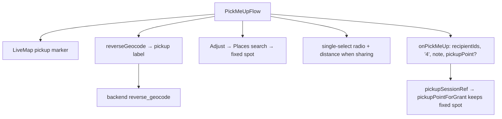

# Pick Me Up Redesign Implementation Plan

> **For agentic workers:** REQUIRED SUB-SKILL: Use superpowers:subagent-driven-development (recommended) or superpowers:executing-plans to implement this plan task-by-task. Steps use checkbox (`- [ ]`) syntax for tracking.

**Goal:** Redesign the One Location "Pick Me Up" quick action to the Apple Blue v2 reference — a single-card map with a reverse-geocoded pickup spot, single-recipient selection, and a note — plus reverse geocoding, an adjustable fixed pickup spot, and gating Meeting + Safe Arrival as "coming soon".

**Architecture:** New backend `reverse_geocode` (Google Geocoding API) surfaced via `OneLocationService.reverseGeocode`. `PickMeUpFlow` is rewritten to the reference layout with single-select recipients and distance shown only when a contact is sharing. A fixed "Adjust" spot is kept fixed by a `pickupSessionRef`/`pickupPointForGrant` in the owner watch loop (mirroring `driveSessionRef`). `onPickMeUp` gains an optional fixed pickup point.

**Tech Stack:** Next.js (App Router) + React 18 + TypeScript, Tailwind, Vitest (frontend); FastAPI + Google Geocoding API, pytest (backend).

## Visual Map



## Global Constraints

- Backend Maps key `GOOGLE_MAPS_API_KEY` (server-side); never expose it / never touch browser `NEXT_PUBLIC_GOOGLE_MAPS_API_KEY`.
- Reverse geocode degrades gracefully: on no results / failure, callers fall back to "Live location".
- Pick Me Up is single-recipient (radio). `handlePickMeUp` still takes `recipientIds: string[]`; the flow passes `[selectedId]`.
- Distance ("X km away") shows ONLY when the chosen contact is currently sharing their live location with the user; otherwise omitted (no fabricated data).
- Drop urgency + duration pickers; share duration = `"4"` ("until picked up").
- Adjusted fixed pickup spots must NOT drift to live GPS (kept fixed by `pickupPointForGrant`).
- Meeting + Safe Arrival are "coming soon" (Safe Arrival flips from wired).
- Commits: `git commit -s` (DCO). Do NOT add a `Co-Authored-By: Claude` trailer.
- Tests: `npx vitest run <file>` (from `hushh-webapp/`); `.venv/bin/python -m pytest <file>` (from `consent-protocol/`). Typecheck `npx tsc --noEmit`.

---

### Task 1: Backend reverse geocode

**Files:**
- Modify: `consent-protocol/hushh_mcp/services/google_maps_service.py` (add `_GEOCODE_URL` near line 21; add `reverse_geocode` method after `place_details`)
- Modify: `consent-protocol/api/routes/one/location.py` (add `MapsReverseGeocodeRequest` near line 99; add route after `maps_place_details`, line ~388)
- Test: `consent-protocol/tests/services/test_google_maps_service.py`; `consent-protocol/tests/test_one_location_maps_routes.py`

**Interfaces:**
- Produces: `GoogleMapsService.reverse_geocode(*, lat: float, lng: float) -> {"name": str|None, "formattedAddress": str|None}`.
- Produces: `POST /api/one/location/maps/reverse-geocode` body `{lat,lng}` → `{"place": {...}}`.

- [ ] **Step 1: Write the failing service test**

Add to `consent-protocol/tests/services/test_google_maps_service.py`:

```python
@pytest.mark.asyncio
async def test_reverse_geocode_parses_name_and_address(monkeypatch):
    def handler(request: httpx.Request) -> httpx.Response:
        assert "latlng=" in str(request.url)
        return httpx.Response(
            200,
            json={
                "results": [
                    {
                        "formatted_address": "476 5th Ave, New York, NY 10018, USA",
                        "types": ["point_of_interest", "establishment"],
                        "address_components": [{"long_name": "Central Library", "types": ["point_of_interest"]}],
                    }
                ]
            },
        )

    monkeypatch.setattr(gms, "GOOGLE_MAPS_API_KEY", "k")
    monkeypatch.setattr(gms, "_async_client", lambda: _client_with(handler))
    svc = gms.GoogleMapsService()
    out = await svc.reverse_geocode(lat=40.75, lng=-73.98)
    assert out == {
        "name": "Central Library",
        "formattedAddress": "476 5th Ave, New York, NY 10018, USA",
    }


@pytest.mark.asyncio
async def test_reverse_geocode_empty_results_returns_nulls(monkeypatch):
    def handler(request: httpx.Request) -> httpx.Response:
        return httpx.Response(200, json={"results": []})

    monkeypatch.setattr(gms, "GOOGLE_MAPS_API_KEY", "k")
    monkeypatch.setattr(gms, "_async_client", lambda: _client_with(handler))
    svc = gms.GoogleMapsService()
    out = await svc.reverse_geocode(lat=1.0, lng=2.0)
    assert out == {"name": None, "formattedAddress": None}
```

- [ ] **Step 2: Run to verify fail**

Run: `.venv/bin/python -m pytest tests/services/test_google_maps_service.py::test_reverse_geocode_parses_name_and_address tests/services/test_google_maps_service.py::test_reverse_geocode_empty_results_returns_nulls -v`
Expected: FAIL — `reverse_geocode` not defined.

- [ ] **Step 3: Add `_GEOCODE_URL` + `reverse_geocode`**

In `google_maps_service.py`, add after the `_ROUTES_URL` constant (line 21):

```python
_GEOCODE_URL = "https://maps.googleapis.com/maps/api/geocode/json"
```

Add this method immediately after `place_details` (after line 130):

```python
    async def reverse_geocode(self, *, lat: float, lng: float) -> dict[str, Any]:
        key = _require_key()
        async with _async_client() as client:
            try:
                response = await client.get(
                    _GEOCODE_URL,
                    params={"latlng": f"{lat},{lng}", "key": key},
                )
            except httpx.HTTPError as exc:
                raise GoogleMapsError(
                    f"Reverse geocode failed: {exc}", status_code=502
                ) from exc
        if response.status_code >= 400:
            logger.warning("maps.reverse_geocode upstream %s", response.status_code)
            raise GoogleMapsError("Reverse geocode failed.", status_code=502)
        results = response.json().get("results") or []
        if not results:
            return {"name": None, "formattedAddress": None}
        formatted = results[0].get("formatted_address") or None
        name: str | None = None
        for result in results:
            types = result.get("types") or []
            if any(t in types for t in ("point_of_interest", "establishment", "premise")):
                components = result.get("address_components") or []
                if components:
                    name = components[0].get("long_name") or None
                break
        return {"name": name, "formattedAddress": formatted}
```

- [ ] **Step 4: Run to verify pass**

Run: `.venv/bin/python -m pytest tests/services/test_google_maps_service.py -v`
Expected: PASS.

- [ ] **Step 5: Add the route + request model**

In `consent-protocol/api/routes/one/location.py`, add after `MapsPlaceDetailsRequest` (line ~99):

```python
class MapsReverseGeocodeRequest(_CamelModel):
    lat: float = Field(ge=-90, le=90)
    lng: float = Field(ge=-180, le=180)
```

Add this route after `maps_place_details` (after its closing, ~line 388):

```python
@router.post("/location/maps/reverse-geocode")
async def maps_reverse_geocode(
    payload: MapsReverseGeocodeRequest,
    token_data: dict = Depends(require_vault_owner_token),
):
    _user_id(token_data)
    try:
        place = await _maps_service().reverse_geocode(lat=payload.lat, lng=payload.lng)
        return {"place": place}
    except GoogleMapsError as exc:
        raise HTTPException(
            status_code=exc.status_code,
            detail={"code": "ONE_LOCATION_MAPS_FAILED", "message": str(exc)},
        ) from exc
```

- [ ] **Step 6: Add a passthrough route test**

In `consent-protocol/tests/test_one_location_maps_routes.py`, mirror `test_route_eta_route`: monkeypatch `gms.GoogleMapsService.reverse_geocode` with an async fake returning `{"name": "Central Library", "formattedAddress": "476 5th Ave"}`, POST `/api/one/location/maps/reverse-geocode` with `{"lat": 40.75, "lng": -73.98}`, assert 200 and `data["place"]["name"] == "Central Library"`.

- [ ] **Step 7: Run both suites + commit**

Run: `.venv/bin/python -m pytest tests/services/test_google_maps_service.py tests/test_one_location_maps_routes.py -q`
Expected: PASS.

```bash
git add consent-protocol/hushh_mcp/services/google_maps_service.py consent-protocol/api/routes/one/location.py consent-protocol/tests/services/test_google_maps_service.py consent-protocol/tests/test_one_location_maps_routes.py
git commit -s -m "feat(one-location): reverse geocode for pickup-spot labels"
```

---

### Task 2: Frontend reverseGeocode service

**Files:**
- Modify: `hushh-webapp/lib/one-location/service.ts` (add `reverseGeocode` after `placeDetails`, line ~442)

(No new unit test — `reverseGeocode` is a thin `apiJson` wrapper covered by the backend tests and exercised in the PickMeUpFlow test in Task 4.)

**Interfaces:**
- Consumes: backend `POST /api/one/location/maps/reverse-geocode` (Task 1).
- Produces: `OneLocationService.reverseGeocode({ vaultOwnerToken, lat, lng }): Promise<{ name: string | null; formattedAddress: string | null }>`.

- [ ] **Step 1: Add the service method**

In `hushh-webapp/lib/one-location/service.ts`, add after `placeDetails`:

```typescript
  static async reverseGeocode(params: {
    vaultOwnerToken: string;
    lat: number;
    lng: number;
  }): Promise<{ name: string | null; formattedAddress: string | null }> {
    const response = await apiJson<{
      place: { name: string | null; formattedAddress: string | null };
    }>("/api/one/location/maps/reverse-geocode", {
      method: "POST",
      headers: jsonAuthHeaders(params.vaultOwnerToken),
      body: JSON.stringify({ lat: params.lat, lng: params.lng }),
    });
    return response.place;
  }
```

- [ ] **Step 2: Typecheck**

Run: `npx tsc --noEmit`
Expected: no new errors.

- [ ] **Step 3: Commit**

```bash
git add hushh-webapp/lib/one-location/service.ts
git commit -s -m "feat(one-location): OneLocationService.reverseGeocode"
```

---

### Task 3: View-model plumbing — live-point lookup, fixed pickup point, watch loop

**Files:**
- Modify: `hushh-webapp/components/one-location/redesign/location-redesign-hub.tsx` (`LocationHubViewModel` interface: add `recipientLivePoint`; extend `onPickMeUp` signature)
- Modify: `hushh-webapp/app/one/location/page.tsx` (vm object: add `recipientLivePoint`, widen `onPickMeUp`; add `pickupSessionRef` + `pickupPointForGrant`; use it in the watch loop; extend `handlePickMeUp`)

**Interfaces:**
- Produces: `vm.recipientLivePoint(userId: string) => PlainLocationPoint | null`.
- Produces: `vm.onPickMeUp(recipientIds: string[], durationHours: string, message?: string, pickupPoint?: { latitude: number; longitude: number; label?: string })`.

- [ ] **Step 1: Extend the view-model interface**

In `location-redesign-hub.tsx`, change the `onPickMeUp` type (line ~221) to:

```typescript
  onPickMeUp: (
    recipientIds: string[],
    durationHours: string,
    message?: string,
    pickupPoint?: { latitude: number; longitude: number; label?: string },
  ) => void;
```

Add to the interface near `decryptedPoints` (after line 245):

```typescript
  /** Latest decrypted live point for a contact who is sharing with the user, else null. */
  recipientLivePoint: (userId: string) => PlainLocationPoint | null;
```

- [ ] **Step 2: Add `pickupSessionRef` + `pickupPointForGrant` in page.tsx**

After `driveSessionRef` (line ~1890) add:

```typescript
  const pickupSessionRef = useRef<{
    grantIds: Set<string>;
    point: PlainLocationPoint;
  } | null>(null);
```

After `drivePointForGrant` (after line ~2760) add:

```typescript
  // Keep an adjusted (fixed) pickup spot fixed: the watch loop must not overwrite
  // these grants with live GPS as the owner moves.
  const pickupPointForGrant = useCallback(
    (grant: OneLocationGrant, livePoint: PlainLocationPoint): PlainLocationPoint => {
      const session = pickupSessionRef.current;
      if (session && session.grantIds.has(grant.id)) return session.point;
      return livePoint;
    },
    [],
  );
```

In the watch republish loop (line ~3246, where `drivePointForGrant(grant, point)` is called), chain the pickup override:

```typescript
          const driven = await drivePointForGrant(grant, point);
          const pointForGrant = pickupPointForGrant(grant, driven);
```

(Replace the existing `const pointForGrant = await drivePointForGrant(grant, point);` line.) Add `pickupPointForGrant` to that effect's dependency array.

- [ ] **Step 3: Extend `handlePickMeUp` for a fixed pickup point**

In `handlePickMeUp` (line ~4322), add `pickupPoint` as the 4th parameter and branch the location source. Replace the parameter list and the readiness/point block:

```typescript
  const handlePickMeUp = useCallback(
    async (
      recipientIds: string[],
      durationHoursValue: string,
      messageValue?: string,
      pickupPoint?: { latitude: number; longitude: number; label?: string },
    ) => {
```

Replace the `ensureForegroundLocationReady` + `const point = readiness.point;` block with:

```typescript
        let point: PlainLocationPoint;
        if (pickupPoint) {
          // Adjusted fixed spot: share exactly this point (kept fixed by the watch loop).
          point = {
            latitude: pickupPoint.latitude,
            longitude: pickupPoint.longitude,
            capturedAt: nowIso(),
            sourcePlatform: "web",
          };
        } else {
          const readiness = await ensureForegroundLocationReady({
            capturePoint: true,
            autoOpenSettings: true,
          });
          if (!readiness.ready || !readiness.point) {
            toast.error("Couldn't get your location — pickup request not sent.");
            return;
          }
          point = readiness.point;
        }
```

After the `for (const recipient of selected)` grant-creation loop (after `successCount += 1;` and the loop close), record the fixed session when adjusted:

```typescript
        if (pickupPoint) {
          pickupSessionRef.current = {
            grantIds: new Set(grantCreatedIds),
            point,
          };
        }
```

To collect `grantCreatedIds`, declare `const grantCreatedIds: string[] = [];` before the loop and `grantCreatedIds.push(grant.id);` inside it. If `nowIso()`/an ISO helper is not already imported in page.tsx, use `new Date().toISOString()` inline instead.

- [ ] **Step 4: Add `recipientLivePoint` to the vm object**

In the vm object literal (near `onPickMeUp` binding, line ~4929), update the binding to pass `pickupPoint` and add `recipientLivePoint`:

```typescript
    onPickMeUp: (recipientIds, durationHoursValue, messageValue, pickupPoint) =>
      void handlePickMeUp(recipientIds, durationHoursValue, messageValue, pickupPoint),
    recipientLivePoint: (userId: string) => {
      const grant = (state?.receivedGrants ?? []).find(
        (g) => String(g.ownerUserId || "").trim() === userId,
      );
      if (!grant) return null;
      return decryptedPoints[grant.id] ?? null;
    },
```

- [ ] **Step 5: Typecheck**

Run: `npx tsc --noEmit`
Expected: no new errors. (If `OneLocationGrant` isn't imported in page.tsx, it already is — used by `drivePointForGrant`.)

- [ ] **Step 6: Commit**

```bash
git add hushh-webapp/components/one-location/redesign/location-redesign-hub.tsx hushh-webapp/app/one/location/page.tsx
git commit -s -m "feat(one-location): fixed pickup spot + recipient live-point lookup for Pick Me Up"
```

---

### Task 4: PickMeUpFlow rewrite (reference layout)

**Files:**
- Rewrite: `hushh-webapp/components/one-location/redesign/pick-me-up-flow.tsx`
- Rewrite: `hushh-webapp/components/one-location/redesign/__tests__/pick-me-up-flow.test.tsx` (create if absent)

**Interfaces:**
- Consumes: `vm.recipientLivePoint`, `vm.onPickMeUp(...,pickupPoint?)` (Task 3); `OneLocationService.reverseGeocode`, `placesAutocomplete`, `placeDetails` (Task 2 / existing); `LiveMap`; `haversineMeters` from `@/lib/one-location/marker-interpolation`.

- [ ] **Step 1: Write the test first**

Create `hushh-webapp/components/one-location/redesign/__tests__/pick-me-up-flow.test.tsx`:

```tsx
import { describe, expect, it, vi } from "vitest";
import { render, screen, fireEvent, waitFor } from "@testing-library/react";

vi.mock("@/lib/one-location/use-google-maps", () => ({
  useGoogleMaps: () => ({ status: "loading" }),
}));

import { PickMeUpFlow } from "@/components/one-location/redesign/pick-me-up-flow";
import { OneLocationService } from "@/lib/one-location/service";
import type { LocationHubViewModel } from "@/components/one-location/redesign/location-redesign-hub";
import type { PlainLocationPoint } from "@/lib/one-location/types";

const point: PlainLocationPoint = {
  latitude: 28.6562,
  longitude: 77.241,
  capturedAt: "2026-07-12T00:00:00Z",
  sourcePlatform: "web",
};

function makeVm(overrides: Partial<LocationHubViewModel> = {}): LocationHubViewModel {
  return {
    vaultOwnerToken: "token",
    onPickMeUp: vi.fn(),
    sosRecipients: [
      { userId: "a", displayName: "Ankit", keyId: "k1", publicKeyJwk: {} as JsonWebKey, canReceiveLocation: true },
      { userId: "b", displayName: "Akshat", keyId: "k2", publicKeyJwk: {} as JsonWebKey, canReceiveLocation: true },
    ],
    isRecipientShareReady: () => true,
    recipientLabel: (r) => r.displayName ?? r.userId,
    recipientSubtitle: () => "Trusted",
    recipientLivePoint: () => null,
    myLocationPoint: point,
    myLocationError: null,
    onShowMyLocation: vi.fn(),
    formatDateTime: () => "now",
    busy: null,
    ...overrides,
  } as unknown as LocationHubViewModel;
}

describe("PickMeUpFlow", () => {
  it("single-selects a recipient and labels the button with their name", async () => {
    vi.spyOn(OneLocationService, "reverseGeocode").mockResolvedValue({
      name: "Central Library",
      formattedAddress: "476 5th Ave",
    });
    const vm = makeVm();
    render(<PickMeUpFlow vm={vm} onClose={vi.fn()} />);

    fireEvent.click(await screen.findByRole("button", { name: /Ankit/i }));
    const ask = await screen.findByRole("button", { name: /ask ankit to pick me up/i });
    await waitFor(() => expect(ask).not.toBeDisabled());
    fireEvent.click(ask);
    await waitFor(() =>
      // No note typed → message is undefined; no fixed spot → pickupPoint undefined.
      expect(vm.onPickMeUp).toHaveBeenCalledWith(["a"], "4", undefined, undefined),
    );
  });

  it("switching selection replaces the prior one (radio, not multi)", async () => {
    const vm = makeVm();
    render(<PickMeUpFlow vm={vm} onClose={vi.fn()} />);
    fireEvent.click(await screen.findByRole("button", { name: /Ankit/i }));
    fireEvent.click(await screen.findByRole("button", { name: /Akshat/i }));
    expect(
      await screen.findByRole("button", { name: /ask akshat to pick me up/i }),
    ).toBeInTheDocument();
  });

  it("shows distance only for a contact that is sharing", async () => {
    const vm = makeVm({
      recipientLivePoint: (id) =>
        id === "a"
          ? { latitude: 28.60, longitude: 77.20, capturedAt: "x", sourcePlatform: "web" }
          : null,
    });
    render(<PickMeUpFlow vm={vm} onClose={vi.fn()} />);
    expect(await screen.findByText(/km away/i)).toBeInTheDocument();
  });

  it("reverse-geocodes the pickup spot label", async () => {
    vi.spyOn(OneLocationService, "reverseGeocode").mockResolvedValue({
      name: "Central Library",
      formattedAddress: "476 5th Ave",
    });
    const vm = makeVm();
    render(<PickMeUpFlow vm={vm} onClose={vi.fn()} />);
    expect(await screen.findByText(/Central Library/)).toBeInTheDocument();
  });
});
```

- [ ] **Step 2: Run to verify fail**

Run: `npx vitest run components/one-location/redesign/__tests__/pick-me-up-flow.test.tsx`
Expected: FAIL (old multi-select UI / different labels).

- [ ] **Step 3: Rewrite `pick-me-up-flow.tsx`**

Replace the file with the reference layout below. It keeps the encrypted pipeline (calls `vm.onPickMeUp`), single-selects a recipient, reverse-geocodes the pickup label, supports Adjust, and shows distance only when a contact is sharing.

```tsx
"use client";

/**
 * One Location redesign — Pick Me Up flow (Quick Action).
 *
 * Ask ONE trusted person to come to your pickup spot. The spot defaults to your
 * live location (reverse-geocoded for a human label) and can be Adjusted to a
 * fixed searched place. Distance to a contact is shown only when they are
 * currently sharing their live location with you. On confirm it hands the chosen
 * recipient + note (+ optional fixed pickup point) to `vm.onPickMeUp`.
 */

import { useEffect, useMemo, useState } from "react";
import { Check, Navigation } from "lucide-react";

import { cn } from "@/lib/utils";
import { OneLocationService } from "@/lib/one-location/service";
import { LiveMap } from "@/components/one-location/live-map";
import { haversineMeters } from "@/lib/one-location/marker-interpolation";
import type { PlainLocationPoint } from "@/lib/one-location/types";

import { CARD_SURFACE } from "./tokens";
import type { LocationHubViewModel } from "./location-redesign-hub";

const PICKUP_DURATION_HOURS = "4"; // "until picked up"
const NOTE_MAX = 160;

function initialsOf(label: string): string {
  const words = label.trim().split(/\s+/).filter(Boolean);
  if (words.length >= 2) return `${words[0]![0] ?? ""}${words[1]![0] ?? ""}`.toUpperCase();
  return (words[0]?.slice(0, 1) || "?").toUpperCase();
}

function avatarTone(index: number): string {
  const tones = [
    "bg-red-500 text-white",
    "bg-sky-500 text-white",
    "bg-violet-500 text-white",
    "bg-emerald-500 text-white",
    "bg-amber-500 text-white",
  ];
  return tones[index % tones.length]!;
}

type FixedSpot = { latitude: number; longitude: number; label: string };

export function PickMeUpFlow({
  vm,
  onClose,
}: {
  vm: LocationHubViewModel;
  onClose: () => void;
}) {
  const contacts = vm.sosRecipients;
  const busy = vm.busy === "share" || vm.busy === "selfLocation";
  const livePoint = vm.myLocationPoint;

  const [selectedId, setSelectedId] = useState<string | null>(null);
  const [note, setNote] = useState("");
  const [fixedSpot, setFixedSpot] = useState<FixedSpot | null>(null);
  const [geoLabel, setGeoLabel] = useState<string | null>(null);

  // Adjust search state
  const [adjustOpen, setAdjustOpen] = useState(false);
  const [query, setQuery] = useState("");
  const [suggestions, setSuggestions] = useState<{ placeId: string; text: string }[]>([]);

  // The point we actually share: fixed spot if adjusted, else the live location.
  const pickupPoint: { latitude: number; longitude: number } | null = fixedSpot
    ? { latitude: fixedSpot.latitude, longitude: fixedSpot.longitude }
    : livePoint
      ? { latitude: livePoint.latitude, longitude: livePoint.longitude }
      : null;

  // Reverse-geocode the LIVE location for the default label (skip when adjusted).
  useEffect(() => {
    const token = vm.vaultOwnerToken;
    if (!token || fixedSpot || !livePoint) {
      setGeoLabel(null);
      return;
    }
    let cancelled = false;
    (async () => {
      try {
        const place = await OneLocationService.reverseGeocode({
          vaultOwnerToken: token,
          lat: livePoint.latitude,
          lng: livePoint.longitude,
        });
        if (cancelled) return;
        const label = place.name
          ? place.formattedAddress
            ? `${place.name} · ${place.formattedAddress}`
            : place.name
          : place.formattedAddress;
        setGeoLabel(label ?? null);
      } catch {
        if (!cancelled) setGeoLabel(null);
      }
    })();
    return () => {
      cancelled = true;
    };
  }, [vm.vaultOwnerToken, livePoint, fixedSpot]);

  // Debounced Places autocomplete for Adjust.
  useEffect(() => {
    const token = vm.vaultOwnerToken;
    const q = query.trim();
    if (!token || !adjustOpen || q.length < 2) {
      setSuggestions([]);
      return;
    }
    let cancelled = false;
    const handle = setTimeout(async () => {
      try {
        const results = await OneLocationService.placesAutocomplete({
          vaultOwnerToken: token,
          input: q,
        });
        if (!cancelled) setSuggestions(results);
      } catch {
        if (!cancelled) setSuggestions([]);
      }
    }, 300);
    return () => {
      cancelled = true;
      clearTimeout(handle);
    };
  }, [query, adjustOpen, vm.vaultOwnerToken]);

  const selectPlace = async (placeId: string) => {
    const token = vm.vaultOwnerToken;
    if (!token) return;
    try {
      const place = await OneLocationService.placeDetails({ vaultOwnerToken: token, placeId });
      setFixedSpot({ latitude: place.latitude, longitude: place.longitude, label: place.label });
      setAdjustOpen(false);
      setQuery("");
      setSuggestions([]);
    } catch {
      /* leave adjust open; user can retry */
    }
  };

  const pickupLabel = fixedSpot
    ? fixedSpot.label
    : geoLabel ?? "Live location";

  const selectedContact = contacts.find((c) => c.userId === selectedId) ?? null;
  const selectedName = selectedContact ? vm.recipientLabel(selectedContact) : null;
  const canAsk = Boolean(pickupPoint) && Boolean(selectedContact) && !busy;

  function distanceLabel(userId: string): string | null {
    if (!pickupPoint) return null;
    const p = vm.recipientLivePoint(userId);
    if (!p) return null;
    const meters = haversineMeters(
      { lat: pickupPoint.latitude, lng: pickupPoint.longitude },
      { lat: p.latitude, lng: p.longitude },
    );
    return `${(meters / 1000).toFixed(1)} km away`;
  }

  const mapPoint: PlainLocationPoint | null = fixedSpot
    ? { latitude: fixedSpot.latitude, longitude: fixedSpot.longitude, capturedAt: new Date().toISOString(), sourcePlatform: "web" }
    : livePoint;

  return (
    <div className="space-y-4">
      {/* HEADER */}
      <div className="flex items-center justify-between">
        <h2 className="text-[24px] font-semibold leading-tight tracking-[-0.3px] text-foreground">
          Pick me up
        </h2>
        <button type="button" onClick={onClose} className="text-[15px] text-[#007aff]">
          Cancel
        </button>
      </div>

      {/* PICKUP CARD */}
      <section className={cn(CARD_SURFACE, "overflow-hidden p-0")}>
        <div className="relative h-[150px] bg-[#eceef2] dark:bg-white/5">
          {mapPoint ? (
            <LiveMap point={mapPoint} className="absolute inset-0" />
          ) : (
            <div className="absolute inset-0 flex flex-col items-center justify-center gap-3 px-6 text-center">
              <p className="text-sm text-muted-foreground">
                Turn on your live location so they know where to come.
              </p>
              <button
                type="button"
                onClick={vm.onShowMyLocation}
                disabled={vm.busy === "selfLocation"}
                className="inline-flex items-center gap-2 rounded-full bg-[#007aff] px-4 py-2 text-sm font-semibold text-white disabled:opacity-50"
              >
                {vm.busy === "selfLocation" ? "Capturing…" : "Capture location"}
              </button>
            </div>
          )}
        </div>
        <div className="flex items-center gap-3 px-4 py-3">
          <div className="min-w-0 flex-1">
            <div className="text-[15px] font-semibold text-foreground">Your pickup spot</div>
            <div className="truncate text-sm text-muted-foreground">{pickupLabel}</div>
          </div>
          {fixedSpot ? (
            <button
              type="button"
              onClick={() => setFixedSpot(null)}
              className="shrink-0 text-[15px] text-[#007aff]"
            >
              Use live
            </button>
          ) : (
            <button
              type="button"
              onClick={() => setAdjustOpen((v) => !v)}
              className="shrink-0 text-[15px] text-[#007aff]"
            >
              Adjust
            </button>
          )}
        </div>
      </section>

      {/* ADJUST SEARCH */}
      {adjustOpen ? (
        <section className={cn(CARD_SURFACE, "p-3")}>
          <input
            type="text"
            value={query}
            onChange={(e) => setQuery(e.target.value)}
            placeholder="Search a pickup place…"
            className="h-10 w-full rounded-[12px] border border-border/70 bg-background px-3 text-sm text-foreground outline-none focus:ring-2 focus:ring-[#007aff]/25"
          />
          {suggestions.length ? (
            <div className="mt-2 space-y-1">
              {suggestions.map((s) => (
                <button
                  key={s.placeId}
                  type="button"
                  onClick={() => void selectPlace(s.placeId)}
                  className="flex w-full items-center gap-2 rounded-[11px] px-2 py-2 text-left hover:bg-[#007aff]/10"
                >
                  <Navigation className="h-4 w-4 shrink-0 rotate-90 text-[#007aff]" />
                  <span className="min-w-0 flex-1 truncate text-sm text-foreground">{s.text}</span>
                </button>
              ))}
            </div>
          ) : null}
        </section>
      ) : null}

      {/* WHO DO YOU ASK */}
      <div>
        <p className="mb-2 px-1 text-[13px] font-semibold uppercase tracking-wide text-muted-foreground">
          Who do you ask
        </p>
        <section className={cn(CARD_SURFACE, "px-4")}>
          {contacts.length ? (
            contacts.map((recipient, index) => {
              const ready = vm.isRecipientShareReady(recipient);
              const selected = selectedId === recipient.userId;
              const dist = distanceLabel(recipient.userId);
              return (
                <button
                  key={recipient.userId}
                  type="button"
                  onClick={ready ? () => setSelectedId(recipient.userId) : undefined}
                  disabled={!ready}
                  aria-pressed={selected}
                  className={cn(
                    "flex w-full items-center gap-[13px] py-3 text-left",
                    index < contacts.length - 1 && "border-b border-black/[0.06] dark:border-white/10",
                    !ready && "cursor-not-allowed opacity-60",
                  )}
                >
                  <span
                    className={cn(
                      "flex h-[42px] w-[42px] shrink-0 items-center justify-center rounded-full text-sm font-semibold",
                      avatarTone(index),
                    )}
                    aria-hidden
                  >
                    {initialsOf(vm.recipientLabel(recipient))}
                  </span>
                  <span className="min-w-0 flex-1">
                    <span className="block truncate text-[16px] font-semibold text-foreground">
                      {vm.recipientLabel(recipient)}
                    </span>
                    {dist ? (
                      <span className="block truncate text-sm text-muted-foreground">{dist}</span>
                    ) : null}
                  </span>
                  <span
                    className={cn(
                      "flex h-6 w-6 shrink-0 items-center justify-center rounded-full border-2 transition-colors",
                      selected ? "border-[#007aff] bg-[#007aff] text-white" : "border-border",
                    )}
                  >
                    {selected ? <Check className="h-3.5 w-3.5" strokeWidth={3} /> : null}
                  </span>
                </button>
              );
            })
          ) : (
            <p className="py-5 text-center text-sm text-muted-foreground">
              No trusted contacts yet. Add people to your Circle first.
            </p>
          )}
        </section>
      </div>

      {/* NOTE */}
      <div>
        <p className="mb-2 px-1 text-[13px] font-semibold uppercase tracking-wide text-muted-foreground">
          Note
        </p>
        <section className={cn(CARD_SURFACE, "p-3")}>
          <input
            type="text"
            value={note}
            onChange={(e) => setNote(e.target.value.slice(0, NOTE_MAX))}
            placeholder="Meet me at the main entrance."
            className="w-full bg-transparent text-[15px] text-foreground outline-none placeholder:text-muted-foreground"
          />
        </section>
      </div>

      <p className="px-1 text-center text-sm text-muted-foreground">
        {fixedSpot
          ? "They see your pickup spot until you're picked up or cancel."
          : "They see your live pickup spot until you're picked up or cancel."}
      </p>

      {/* ACTION */}
      <div className="pt-1">
        <button
          type="button"
          onClick={() =>
            selectedContact &&
            vm.onPickMeUp(
              [selectedContact.userId],
              PICKUP_DURATION_HOURS,
              note.trim() || undefined,
              fixedSpot ?? undefined,
            )
          }
          disabled={!canAsk}
          className="flex w-full items-center justify-center gap-2 rounded-full bg-[#007aff] py-4 text-[17px] font-medium text-white transition-opacity disabled:opacity-40"
        >
          <Navigation className="h-[18px] w-[18px]" fill="currentColor" strokeWidth={0} />
          {busy ? "Asking…" : selectedName ? `Ask ${selectedName} to pick me up` : "Select who to ask"}
        </button>
      </div>
    </div>
  );
}
```

- [ ] **Step 4: Run tests + tsc + eslint**

Run: `npx vitest run components/one-location/redesign/__tests__/pick-me-up-flow.test.tsx`
Expected: PASS (4).
Run: `npx tsc --noEmit` and `npx eslint components/one-location/redesign/pick-me-up-flow.tsx`
Expected: clean.

- [ ] **Step 5: Commit**

```bash
git add hushh-webapp/components/one-location/redesign/pick-me-up-flow.tsx hushh-webapp/components/one-location/redesign/__tests__/pick-me-up-flow.test.tsx
git commit -s -m "feat(one-location): Pick Me Up reference layout, single-select, reverse-geocoded spot, adjust"
```

---

### Task 5: Meeting + Safe Arrival → coming soon

**Files:**
- Modify: `hushh-webapp/components/one-location/redesign/location-redesign-hub.tsx` (Safe Arrival card, line ~695-699)
- Test: extend the hub/quick-actions test if one asserts card wiring; otherwise add a focused assertion.

- [ ] **Step 1: Gate Safe Arrival**

In the Safe Arrival `QuickActionCard` (line ~695), remove its `onClick={() => setFlow("safe-arrival")}` and add `comingSoon`, matching the Meeting card. Result:

```tsx
        <QuickActionCard
          icon={/* unchanged */}
          title="Safe Arrival"
          subtitle="Get notified"
          comingSoon
        />
```

Update the nearby comment (line ~656) so the wired list no longer names Safe Arrival.

- [ ] **Step 2: Typecheck (remove now-unused wiring if flagged)**

Run: `npx tsc --noEmit` then `npx eslint components/one-location/redesign/location-redesign-hub.tsx`
Expected: clean. If `onSafeArrival`/`safeArrivalBusy` become unused and eslint flags them, leave the vm fields (other code/tests reference the interface) — only remove a genuinely unused local. Do not delete `SafeArrivalFlow` or its flow branch.

- [ ] **Step 3: Commit**

```bash
git add hushh-webapp/components/one-location/redesign/location-redesign-hub.tsx
git commit -s -m "feat(one-location): gate Safe Arrival + Meeting as coming soon"
```

---

### Task 6: End-to-end verification

- [ ] **Step 1: Full suites**

Run (from `hushh-webapp/`): `npx vitest run components/one-location lib/one-location && npx tsc --noEmit`
Run (from `consent-protocol/`): `.venv/bin/python -m pytest tests/services/test_google_maps_service.py tests/test_one_location_maps_routes.py`
Expected: all PASS.

- [ ] **Step 2: Drive it on the iOS simulator**

Rebuild against the local backend and launch (per the run-ios-sim skill; remember GOTCHA: never pipe `xcodebuild` to `tail`; a moving simulated location avoids the static-fix hang). Verify: pickup card shows the map + reverse-geocoded "Your pickup spot" label; single-select radio; distance appears only for a contact sharing with you; Adjust sets a fixed spot (label updates, "Use live" reverts); "Ask <name> to pick me up" creates the grant; Meeting + Safe Arrival render as coming soon.
