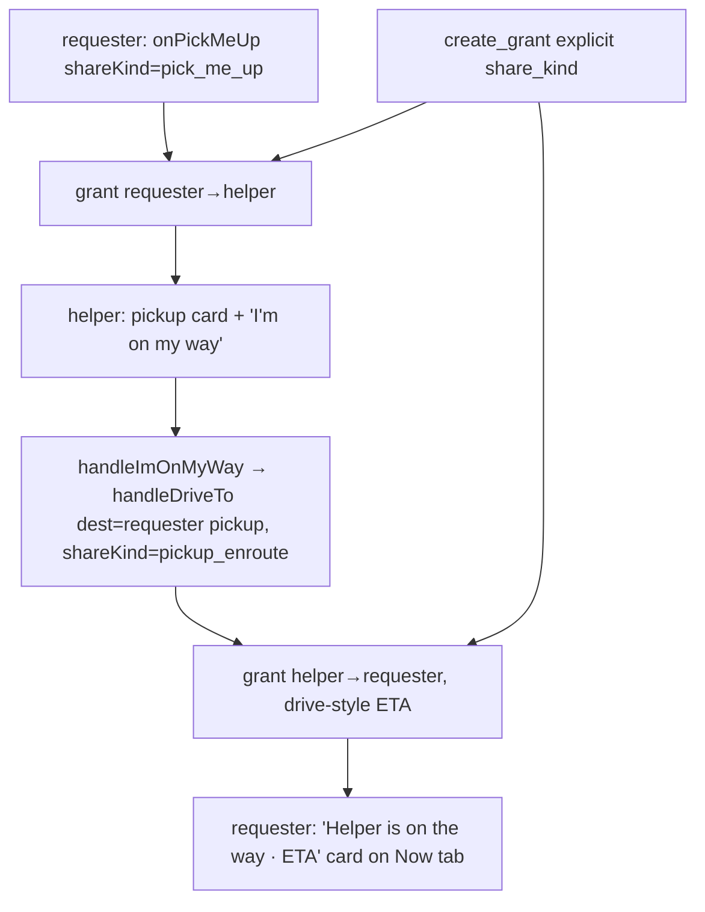

# Pick Me Up — watch your helper approach — Implementation Plan

> **For agentic workers:** REQUIRED SUB-SKILL: Use superpowers:subagent-driven-development (recommended) or superpowers:executing-plans to implement this plan task-by-task. Steps use checkbox (`- [ ]`) syntax for tracking.

**Goal:** Make Pick Me Up mutual — when the helper taps "I'm on my way", they share live location + ETA back to the requester, who watches them approach on a Now-tab card.

**Architecture:** Add an explicit `pick_me_up` share kind on the backend `create_grant`. The helper's received pickup card gets an "I'm on my way" action that reuses the Drive-To pipeline (destination = the requester's already-shared pickup point, marked `pickup_enroute`). The requester correlates their outbound `pick_me_up` grant with the inbound `pickup_enroute` grant and renders a live "on the way" card via existing `recipientLivePoint` + the drive ETA payload.

**Tech Stack:** Next.js + React + TS, Vitest (frontend); FastAPI + pytest (backend).

## Visual Map



## Global Constraints

- Reverse share reuses the existing `createGrant` + `publishEnvelope` + watch loop — no crypto/consent change. It needs the requester in the helper's `recipients` list (guaranteed by connection).
- Backend adds an explicit optional `share_kind` on `create_grant`; when absent, classification is unchanged (`_classify_share_kind`). Requires a backend deploy.
- Share kinds used: `pick_me_up` (requester→helper), `pickup_enroute` (helper→requester, drive-style).
- Commits: `git commit -s` (DCO); NO `Co-Authored-By: Claude`.
- Tests: `npx vitest run <file>` (from `hushh-webapp/`); `.venv/bin/python -m pytest <file>` (from `consent-protocol/`). `npx tsc --noEmit`.

---

### Task 1: Backend — explicit `pick_me_up` / `pickup_enroute` share kind

**Files:**
- Modify: `consent-protocol/api/routes/one/location.py` (`CreateGrantRequest`, `create_grant` route ~433)
- Modify: `consent-protocol/hushh_mcp/services/one_location_agent_service.py` (`create_grant` ~2666, notification copy ~2782)
- Test: `consent-protocol/tests/test_one_location_routes.py` (or the grants test file)

**Interfaces:**
- Produces: `POST /api/one/location/grants` accepts optional `shareKind` → persisted on the grant; overrides `_classify_share_kind` when present.

- [ ] **Step 1: Add `share_kind` to the request model**

In `location.py`, add to `CreateGrantRequest`:

```python
    share_kind: str | None = Field(default=None, alias="shareKind", max_length=40)
```

Pass it through in the `create_grant` route to the service call: add `share_kind=payload.share_kind`.

- [ ] **Step 2: Honor explicit `share_kind` in the service**

In `create_grant` (service ~2666), accept `share_kind: str | None = None`. Where the grant's kind is derived today (via `_classify_share_kind(reason)`), prefer the explicit value:

```python
    resolved_kind = share_kind or _classify_share_kind(reason)
```

Use `resolved_kind` wherever the classified kind is stored/used. Add `"pick_me_up"` and `"pickup_enroute"` to the notification copy switch (title "Pickup requested" / body `"<name>: <message>"` for `pick_me_up`; en-route can reuse drive copy). Keep `_visible_share_message(reason)` returning the freeform note so the pickup message surfaces.

- [ ] **Step 3: Test + commit**

Add a test: creating a grant with `shareKind: "pick_me_up"` + a freeform `reason` yields a grant whose kind is `pick_me_up` and whose visible message is the note. Run `.venv/bin/python -m pytest tests/test_one_location_routes.py -q`.

```bash
git commit -s -m "feat(one-location): explicit pick_me_up/pickup_enroute share kind on create_grant"
```

---

### Task 2: Frontend service + handlePickMeUp share kind

**Files:**
- Modify: `hushh-webapp/lib/one-location/service.ts` (`createGrant` ~339)
- Modify: `hushh-webapp/app/one/location/page.tsx` (`handlePickMeUp` createGrant call; `onPickMeUp` unchanged signature — pickup already carries a message)

**Interfaces:**
- Produces: `OneLocationService.createGrant({..., shareKind?: string})` passthrough.

- [ ] **Step 1: Add `shareKind` passthrough**

In `service.ts createGrant`, add `shareKind?: string` to params and include it in the body when present:

```typescript
        body: JSON.stringify({
          recipientUserId: params.recipientUserId,
          recipientKeyId: params.recipientKeyId,
          durationHours: params.durationHours,
          ...(params.reason ? { reason: params.reason } : {}),
          ...(params.shareKind ? { shareKind: params.shareKind } : {}),
        }),
```

- [ ] **Step 2: handlePickMeUp tags the grant**

In `handlePickMeUp` (page.tsx ~4337), the `createGrant` call gains `shareKind: "pick_me_up"` (the pickup message stays as `reason`).

- [ ] **Step 3: tsc + commit**

Run `npx tsc --noEmit`.
```bash
git commit -s -m "feat(one-location): tag Pick Me Up grants with pick_me_up share kind"
```

---

### Task 3: `handleDriveTo` shareKind override + `handleImOnMyWay`

**Files:**
- Modify: `hushh-webapp/app/one/location/page.tsx` (`handleDriveTo` ~4234 add optional `shareKind`; new `handleImOnMyWay`; vm binding)
- Modify: `hushh-webapp/components/one-location/redesign/location-redesign-hub.tsx` (`LocationHubViewModel`: add `onImOnMyWay`)

**Interfaces:**
- Produces: `handleDriveTo(destination, recipientIds, durationHours, shareKind?)` — when `shareKind` given, the createGrant call passes it (still drive-style/ETA via `reason:"drive_to"`).
- Produces: `vm.onImOnMyWay(grant: OneLocationGrant)` → creates the reverse drive-style share to `grant.ownerUserId` with destination = the requester's shared pickup point.

- [ ] **Step 1: Add optional `shareKind` to handleDriveTo**

Add a 4th param `shareKind?: string`; in its `createGrant` call add `...(shareKind ? { shareKind } : {})`. Default callers (the Drive-To flow) are unaffected.

- [ ] **Step 2: `handleImOnMyWay`**

Add:

```typescript
  const handleImOnMyWay = useCallback(
    async (grant: OneLocationGrant) => {
      const helperUserId = String(grant.ownerUserId || "").trim();
      const point = decryptedPoints[grant.id];
      if (!helperUserId || !point) {
        toast.error("Can't start yet — open their pickup first.");
        return;
      }
      const destination: DriveDestination = {
        label: `${receivedGrantOwnerLabel(grant)} · pickup`,
        latitude: point.latitude,
        longitude: point.longitude,
      };
      await handleDriveTo(destination, [helperUserId], "4", "pickup_enroute");
    },
    [decryptedPoints, handleDriveTo],
  );
```

Wire `onImOnMyWay: (grant) => void handleImOnMyWay(grant)` in the vm object, and add `onImOnMyWay: (grant: OneLocationGrant) => void;` to `LocationHubViewModel`.

Note: `handleDriveTo` filters `sosActionRecipients` by the given id — the requester must be in that trusted list (they are, as a connection). If the filter is empty it already toasts "select a trusted contact"; adjust that message path only if needed.

- [ ] **Step 3: tsc + commit**

```bash
git commit -s -m "feat(one-location): handleImOnMyWay reverse pickup share (drive-style, pickup_enroute)"
```

---

### Task 4: Helper card — show message + "I'm on my way"

**Files:**
- Modify: `hushh-webapp/components/one-location/redesign/cards.tsx` (`SharedWithMeCard` ~240)
- Modify: `hushh-webapp/components/one-location/redesign/location-redesign-hub.tsx` (`InboxHub` wiring ~1287)
- Test: `components/one-location/redesign/__tests__/*` (add a card test)

- [ ] **Step 1: Card props**

Add optional `message?: string`, `isPickup?: boolean`, `onImOnMyWay?: () => void`, `enRoute?: boolean` to `SharedWithMeCard`. Render `message` (when present) above the actions. When `isPickup && onImOnMyWay && !enRoute`, render a primary "I'm on my way" button; when `enRoute`, render a muted "En route — sharing your location" state.

- [ ] **Step 2: Inbox wiring**

In `InboxHub`, pass `message={grant.shareMessage ?? undefined}`, `isPickup={grant.shareKind === "pick_me_up"}`, and `onImOnMyWay={() => vm.onImOnMyWay(grant)}`. Compute `enRoute` from whether an active outbound `pickup_enroute` grant to `grant.ownerUserId` already exists (so the button flips after tapping).

- [ ] **Step 3: Test + commit**

Test: a `pick_me_up` grant renders the message + "I'm on my way" and calls `onImOnMyWay`; a non-pickup grant does not. Run the card test + `npx tsc --noEmit`.
```bash
git commit -s -m "feat(one-location): pickup card shows message + I'm on my way"
```

---

### Task 5: Requester — "[Helper] is on the way" card

**Files:**
- Create: `PickupEnRouteCard` in `hushh-webapp/components/one-location/redesign/cards.tsx`
- Modify: `hushh-webapp/components/one-location/redesign/location-redesign-hub.tsx` (Now tab ~598; derive en-route pairs)
- Modify: `hushh-webapp/app/one/location/page.tsx` (expose the data the card needs, if not already on vm)
- Test: card + derivation tests

**Interfaces:**
- Consumes: `vm.receivedGrants`, `vm.decryptedPoints`, `vm.recipientLivePoint`, `driveEtaText`, active outbound grants.

- [ ] **Step 1: Derive en-route pairs**

On the Now tab (or a small selector), compute helpers who are en route: for each **received** grant with `shareKind === "pickup_enroute"` that has a decrypted live point, and for whom the requester has an **active outbound** `pick_me_up` grant, produce `{ helperName, point, etaSeconds }` (ETA from `point.drive?.etaSeconds`).

- [ ] **Step 2: `PickupEnRouteCard`**

Render "[Helper] is on the way", `driveEtaText(etaSeconds)` (falls back to "on the way" when null), the helper's live map (`vm.renderMapPreview(point, false)` / `LiveMap`), and a "Cancel pickup" button (revokes the outbound grant via existing `onStopGrant`). Place it above `SharingStatusCard` on the Now tab.

- [ ] **Step 3: Test + commit**

Test: given a `pickup_enroute` received grant with a drive payload + a matching outbound pickup, the card shows the helper name + ETA. Run tests + `npx tsc --noEmit` + `npx eslint`.
```bash
git commit -s -m "feat(one-location): requester 'helper is on the way' live card + ETA"
```

---

### Task 6: End-to-end verification

- [ ] **Step 1: Suites** — `npx vitest run components/one-location lib/one-location && npx tsc --noEmit` (frontend); `.venv/bin/python -m pytest tests/test_one_location_routes.py tests/services/test_google_maps_service.py` (backend). All pass.
- [ ] **Step 2: iOS sim** — build against UAT, drive two accounts (or two sims): requester asks pickup → helper sees message + taps "I'm on my way" → requester's Now tab shows "[Helper] is on the way · ETA" updating as the helper's simulated location moves. (Never pipe `xcodebuild` to `tail`; use a moving simulated location.)
