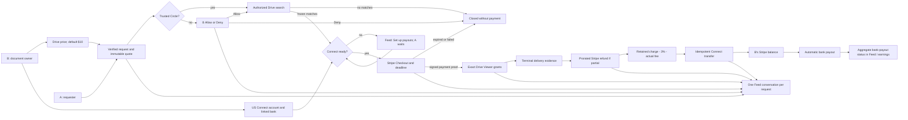

# Drive request pricing and owner payout

Status: implementation plan. The current payout draft is not release-ready. This plan covers a **price per successful Google Drive request**, not a recurring subscription.

## Product contract

- B owns the documents and may set one Google Drive request price in Profile. The existing whole-dollar range is $1–$500; when the custom-price switch is off, the effective price remains $10. B may be offline after setup; the saved price still applies.
- A sees the quoted amount before sending and again before paying. The request holds that quote even if B edits future prices. A is never charged merely for sending a request.
- Trusted Circle skips B's per-request approval. Outside the circle, B must explicitly Allow or Deny. Neither pricing nor payout setup changes that consent boundary.
- Search may start before B finishes payout onboarding. No Pay action becomes usable until matching files exist, the request is authorized, and B's US Stripe Connect account is remotely verified as ready.
- A pays once per request. Signed Stripe payment confirmation precedes exact-file Viewer grants. No matches, Deny, expired request, or failed payment means no sharing and no owner earning.
- After terminal delivery, A is refunded proportionally for undelivered files. Hussh retains 3% of the final retained charge; B bears the actual processing fee up to the retained proceeds. Only then does the owner earning transfer to B's connected Stripe balance. Stripe's automatic payout later deposits available funds into B's linked US bank.
- Revocation stops access after payment but does not silently rewrite a completed sale. Refunds, chargebacks, and transfer reversals use explicit reconciled states.

## Visual Map

Knowledge graph of the request, consent, payment, delivery, and payout authorities:

Authority edges: the database order owns the quote; Stripe's signed webhook owns payment proof; Google permission outcomes own delivery; Stripe's charge balance transaction owns the actual fee; Stripe's transfer owns `Sent to Stripe`; connected-account `payout.paid` owns bank-arrival status. A bank payout can combine several request earnings, so it must not be presented as a one-to-one request payment without reconciliation.

## Implementation slices

1. **Complete the existing payout draft safely.** Register migration 292 and rollback; make already enrolled earnings reconcile when the enrollment flag is off; bind the verified connected account to checkout; finish earned-settlement handling when a participant erases their account; close missing owner-readiness projections. Preserve historical orders without retroactive payout enrollment.
2. **Persist owner pricing.** Add an owner-scoped, server-validated custom-price setting and USD whole-dollar price. Keep $10 as the default when custom pricing is off. Use one authority for both Trusted and non-Trusted requests; store the quote at request creation and prevent later edits from changing it. Maintain legacy request compatibility. Keep the existing non-Trusted approval gate.
3. **Show the journey.** Add Profile pricing and payout setup; disclose the quote before A sends; show the locked quote in Sent/Feed/Consent. In B's Feed make payout setup an action, not just text. Use one current request summary with concise payment, delivery, refund and owner-earning states. Keep the payment countdown and make expired links unclickable. Do not label a Connect transfer as a bank deposit.
4. **Close the money loop.** Settle only after terminal grant evidence and successful partial refund; use the actual Stripe fee, a unique transfer group, idempotency and reconciliation for unknown responses. Track connected-account onboarding and aggregate payout status through signed Connect events, including failed bank payouts and repair.
5. **Release with parity.** Run focused unit/API/UI and PostgreSQL concurrency checks, then the repo's core gate and exact-head CI. Deploy schema with payout flag off; configure UAT test-mode Stripe secrets, event destination and US test connected account; enable only after sandbox acceptance. Production uses the same code but separately provisioned live credentials, live connected accounts, bank links, webhook secret, and readiness verification. Switching API keys alone is insufficient.

## Failure and latency contract

- Fail closed on stale quotes, owner-price changes after request creation, duplicate requests, duplicate/out-of-order webhooks, mismatched test/live objects, lost checkout return, expired links, missing Drive grants, partial delivery, refunds, disputes, account changes, bank failures, and erasure.
- No arbitrary sleep or provider polling in the request/checkout path. Database state commits notify the existing document Feed stream; authenticated reread remains the source of truth, with focus/poll fallback. Measure request-to-search, search-to-quote, webhook-to-grant, delivery-to-transfer, and DB-event-to-Feed separately. Google search, Stripe settlement, identity review and bank deposit cannot have zero external latency.
- Sandbox assertions: B can onboard a US test account and test bank; A can pay with a test card; both trust modes preserve consent; no-match creates no charge; a partial grant refunds the undelivered share; Hussh keeps 3%; the exact fee is read from Stripe; transfer happens once; a failed payout shows bank repair without pretending the deposit succeeded.

Stripe references: [Express onboarding](https://docs.stripe.com/connect/express-accounts), [separate charges and transfers](https://docs.stripe.com/connect/separate-charges-and-transfers), [connected-account payouts](https://docs.stripe.com/connect/payouts-connected-accounts), [Connect testing](https://docs.stripe.com/connect/testing).
