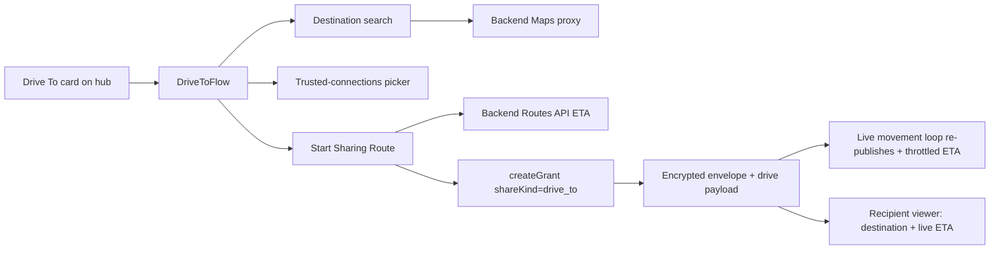

# Design: Drive To — live route + ETA sharing to trusted connections

**Date:** 2026-07-07
**Branch:** `feat/one-location-drive-to`
**Status:** Approved (design) — pending implementation plan

## Visual Map



## Problem

The One Location hub shows a "Drive To" quick-action card, but it is a `comingSoon`
placeholder (`hushh-webapp/components/one-location/redesign/location-redesign-hub.tsx:555`).
Users cannot share where they are headed or a live ETA. The provided design
screenshots show the "Drive To" screen (destination search → "Start Sharing Route")
and a related "Pick Me Up" screen, but neither shows how recipients are chosen —
the user explicitly wants sharing with **trusted connections**.

This design delivers **Drive To only** (Pick Me Up is out of scope): a user searches
a destination, picks trusted connections, and shares their **live location plus a
live-updating ETA** until they stop or the share expires.

## Scope & decisions (from brainstorming)

| Decision | Choice |
|---|---|
| Feature scope | **Drive To only.** Pick Me Up deferred (future card). |
| Share behavior | **Live** — moving location + live-updating ETA (reuses existing movement loop). |
| Recipient view | **Reuse existing viewers** (in-app grant viewer + public-link page), keyless embed. |
| Maps calls | **Backend proxy** — restricted server-side key, never exposed to browser. |
| Destination sources | **Places autocomplete + Recent destinations.** (No saved places, no calendar in v1.) |
| Recipient selection | **Pick from trusted connections**, whole circle pre-selected, narrowable. |
| Stop conditions | **Manual stop + duration expiry.** No arrival geofence in v1. |

## Google Maps API key — current state

There is **no** Google Maps / Places / Routes key in the repo. The only Google
key is `GOOGLE_API_KEY` in `consent-protocol/.env`, scoped for **Gemini / Vertex AI**
(the agent LLM) and explicitly marked server-side-only. There is no
`NEXT_PUBLIC_GOOGLE_MAPS_API_KEY`.

**Action required (human):** provision a Google Maps Platform key with **Places API**
and **Routes API** enabled, restricted to the backend server, and set it as
`GOOGLE_MAPS_API_KEY` in `consent-protocol` env. This design wires everything to read
that variable and documents it in `.env.example`, but the GCP key must be created out
of band. Reusing the Gemini key for browser Maps is explicitly rejected (would expose
it in client JS and mixes unrelated GCP scopes).

## Reuse vs. build-new

**Reuse as-is:**
- E2E crypto + grant + envelope + publish pipeline: `hushh-webapp/lib/one-location/encryption.ts` (`encryptLocationForRecipient`), `service.ts` (`createGrant`, `storeEnvelope`, `viewEnvelope`), and `page.tsx` `publishEnvelope` / `publishEnvelopeWithRetry` / `handleShare`.
- Live movement heartbeat: `page.tsx` `watchCurrentPosition → publishMovement` loop (~L3269–3294).
- Trusted-connections circle: `sosActionRecipients` / `selectSosConnectedRecipients` (`lib/one-location/sos-trigger.ts`), surfaced as `vm.sosRecipients`. This IS "share with trusted connections."
- Flow scaffolding: `FlowKind` state machine, `check-in-flow.tsx` as the `DriveToFlow` template, `QuickActionCard`, `PersonSearchInput` (`redesign/selectors.tsx`), duration control, `TaskFlowHeader` (`redesign/primitives.tsx`), `redesign/tokens.ts`.
- Keyless viewers: `LocalMapPreview` (`page.tsx`) and `app/one/location/request/[token]/page-client.tsx`; `googleMapsDirectionsUrl` deep link.
- Grant `metadata` JSONB + envelope `metadata` JSONB — carry Drive-To data with no schema migration.

**Build new:**
- `DriveToFlow` component + `onDriveTo` wiring + `"drive-to"` FlowKind branch.
- `DestinationSearchInput` (Places autocomplete via backend proxy) + recents store.
- Backend Maps proxy endpoints (autocomplete, place details, route-ETA) + `GOOGLE_MAPS_API_KEY`.
- Encrypted `drive` payload on the envelope + `drive_to` shareKind.
- Recipient-viewer rendering of destination label + live ETA.

## Architecture

### Frontend — the Drive To flow

1. **Enable the card**: add `"drive-to"` to the `FlowKind` union
   (`location-redesign-hub.tsx:207–214`), remove `comingSoon` and add
   `onClick={onDriveTo}` on the card (L555–561), thread `onDriveTo` through
   `NowHub` props and `setFlow("drive-to")` (mirroring `onCheckIn`), and add a
   `<DriveToFlow>` branch in the flow switch (L330–364).
2. **`DriveToFlow`** (new file in `redesign/`, cloned from `check-in-flow.tsx`):
   - **Destination search** — `DestinationSearchInput` with debounced autocomplete
     against the backend Places proxy; **recent destinations** listed above results;
     selecting a result resolves coordinates via the place-details proxy.
   - **Recipient picker** — reuse `PersonSearchInput` + `vm.sosRecipients`, whole
     circle pre-selected, narrowable.
   - **Duration selector** — reuse Check-In control (≤24h, matching grant bound).
   - **Action bar** — "Start Sharing Route" → `vm.onDriveTo(destination, recipientIds, durationHours)`.
3. **Recents store** — last ~5 destinations in IndexedDB (local only; no destination
   PII persisted to the backend), following the existing local-key storage pattern in
   `encryption.ts`.

### Share lifecycle & live ETA

- **On start**: compute initial ETA via backend Routes API proxy
  (origin = current position, destination). For each recipient, reuse `createGrant`
  with `shareKind: "drive_to"` and publish an envelope whose **encrypted** payload is
  extended to:
  ```
  { ...PlainLocationPoint,
    drive: { destination: {lat, lng, label},
             etaSeconds, etaComputedAt, distanceMeters } }
  ```
- **Live updates**: reuse the `watchCurrentPosition → publishMovement` loop as the
  heartbeat. ETA is **recomputed throttled** — at most once per ~60s or ~250m moved —
  to bound Routes API cost; between recomputes, re-publish the moving location with the
  last known ETA. (Throttle is the chosen default; tunable.)
- **Stop**: manual "Stop sharing" revokes the drive grants; duration expiry uses the
  existing grant TTL. No arrival geofence in v1.

### Recipient view (reuse existing viewers)

Extend the in-app grant viewer (`LocalMapPreview`) and the public-link page
(`request/[token]/page-client.tsx`): when the decrypted payload has a `drive` field,
render **destination label + live ETA** (e.g. "~14 min away") and a **"Directions"**
deep link (reusing `googleMapsDirectionsUrl`). The current-position map embed stays
keyless and unchanged. No route polyline / no Maps JS SDK on the viewer side in v1
(keeps it keyless); polyline rendering is a documented later enhancement.

### Backend — Maps proxy & grant kind

- **New proxy endpoints** under `/api/one/location/` (auth via existing vault-owner
  token; per-user rate limiting):
  - `POST …/places/autocomplete` → Google Places Autocomplete
  - `POST …/places/details` → Place Details (coords for a selected place)
  - `POST …/route-eta` → Google Routes API (`directions/v2:computeRoutes`; origin+destination → `etaSeconds`, `distanceMeters`)
- Uses **new server-side `GOOGLE_MAPS_API_KEY`** (no `NEXT_PUBLIC_` prefix), added to
  `consent-protocol/.env.example` + `.env`.
- Allow `shareKind: "drive_to"` on grants via existing grant kind/`metadata` handling.
  Duration bound (≤24h) unchanged.

### Data model

**No new tables, no schema migration.** Destination/ETA live inside the encrypted
envelope payload (backend never sees them). Grant kind uses the existing
`metadata`/shareKind path. This preserves the E2E model established by migration
`069_drop_kai_location_plaintext.sql`.

### Types

- Extend `PlainLocationPoint` (`lib/one-location/types.ts`) with an optional `drive`
  field as above.
- Add `drive_to` to the shareKind union (`types.ts`, ~L159).

## Error handling

- **Places/Routes failure**: degrade gracefully — allow the location share to
  proceed **without** ETA and show a non-blocking "ETA unavailable" note. Reuse
  `publishEnvelopeWithRetry` for envelope publishing.
- **Geolocation permission**: reuse existing permission handling in `page.tsx`.
- **Missing key**: proxy endpoints return a clear error; the flow still allows a plain
  live-location share (no destination/ETA) so the feature degrades rather than breaks.

## Testing

- **Backend (pytest)**: the three proxy endpoints with Google calls mocked (success +
  failure), auth enforcement, and `drive_to` grant acceptance with the duration bound.
- **Frontend (vitest)**: `DriveToFlow` (destination select → start → grants published
  with `drive` payload), recents store, ETA throttling logic, and viewer rendering of
  destination + live ETA (backend service mocked).

## Out of scope (future work)

- "Pick Me Up" screen (Uber/Lyft deep links + notify).
- Saved places (Home/Work) and calendar-meeting destinations.
- Arrival geofence / auto-stop + "Safe Arrival" notification.
- Interactive route polyline map on the recipient side (Maps JS SDK).
