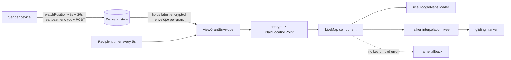

# Design: Seamless live-location map (gliding marker) for recipient + owner

**Date:** 2026-07-08
**Branch:** `feat/one-location-live-map-streaming`
**Status:** Approved (design) — pending implementation plan

## Visual Map

## Problem

Recipients of a One Location live share watch an embedded Google Maps **iframe**
(`app/one/location/page.tsx` — `LocalMapPreview`, `googleMapsLocationEmbedUrl` →
`https://www.google.com/maps?q=...&output=embed`). Every new coordinate changes the
iframe `src`, so the **entire map reloads** — a flicker/jump, not a moving dot. On top
of that, the recipient only **polls every 20s** (`refreshVisibleGrants` at
`LIVE_LOCATION_UPDATE_INTERVAL_MS = 20_000`), so movement lags.

Meanwhile the **sender already streams fresh coordinates** to the backend: a GPS
`watchPosition` publishes an encrypted envelope on movement (throttled to
`LIVE_LOCATION_MIN_PUBLISH_INTERVAL_MS = 8_000`), plus a 20s heartbeat while stationary.
So the backend always holds the latest coordinate — the weak link is purely the
**recipient read cadence + render**, not data freshness.

This design makes the recipient (and the owner's own preview) feel near-live: a real
interactive map whose marker **glides** to each newly fetched coordinate, read every 5s.
It is **frontend-only** — no backend, DB, or streaming changes. The encryption/key
durability work from PR #4352 stays exactly as-is.

## Scope & decisions (from brainstorming)

| Decision | Choice |
|---|---|
| Map rendering | **Google Maps JavaScript API** via `@googlemaps/js-api-loader` (loader option A). Real marker we move — no iframe reload. |
| Freshness transport | **Faster polling only.** Recipient poll 20s → **5s**. No SSE/WebSocket (deferred). |
| Smoothness | **Client-side marker interpolation** — tween between two real fetched points. |
| Key handling | **New, separate** browser key `NEXT_PUBLIC_GOOGLE_MAPS_API_KEY`, referrer-restricted + Maps-JS-only. Server-side `GOOGLE_MAPS_API_KEY` proxy untouched. |
| Surfaces | **In-app only** — recipient live view + owner self-preview (shared `LocalMapPreview`). Public `invite`/`request` token pages stay on the iframe. |
| Fallback | **Graceful** — no key or Maps-JS load failure → existing iframe embed. |

## Google Maps API key — current state & action required

The repo's `GOOGLE_MAPS_API_KEY` is **server-side only** by deliberate policy
(`consent-protocol/hushh_mcp/services/google_maps_service.py`: *"Keeps the Maps key on
the backend. The frontend never sees it."*). It is used to proxy Places + Routes via
`/api/one/location/maps/*`. That policy is **preserved** — this design does not touch it.

The Maps **JavaScript** API must load its key in the browser, so this design introduces
a **distinct** key:

**Action required (human):** provision a Google Maps Platform browser key with **Maps
JavaScript API only** enabled, **HTTP-referrer restricted** to Hushh domains
(`*.hushh.ai`, UAT hosts, `localhost` for dev), and set it as
`NEXT_PUBLIC_GOOGLE_MAPS_API_KEY` in the `hushh-webapp` env for UAT then prod (mirrors
how PR #4343 wired the backend key, but this is a *new browser key*). Referrer-restricted
Maps-JS keys are the documented, intended way to use Maps JS and are safe to expose.
Reusing the server-side `GOOGLE_MAPS_API_KEY` in the browser is explicitly rejected.

Until the key exists, the component falls back to the iframe, so code is safe to ship first.

## Architecture & components

### New files
- **`hushh-webapp/components/one-location/live-map.tsx`** — `<LiveMap point={...} />`.
  Renders **only the map canvas** (the region currently occupied by the iframe). The
  surrounding card (status pill, "Directions" button, drive-ETA card) stays in
  `LocalMapPreview`, unchanged. Falls back to the iframe embed internally when the map
  can't load.
- **`hushh-webapp/lib/one-location/use-google-maps.ts`** — singleton loader hook wrapping
  `@googlemaps/js-api-loader`. Loads the script **once** app-wide; returns
  `{ status: 'loading' | 'ready' | 'error' }`. `status: 'error'` when the key is missing
  or the script fails.
- **`hushh-webapp/lib/one-location/marker-interpolation.ts`** — pure, unit-testable
  helpers: `lerpLatLng(from, to, t)`, an ease function (e.g. easeInOutQuad), and
  `shouldSnap(from, to)` (distance threshold — teleport / first fix → snap instead of
  animate).

### Changed files
- **`app/one/location/page.tsx`** — inside `LocalMapPreview`, replace the `<iframe>` block
  with `<LiveMap point={point} />`. Change the recipient refresh loop interval (below).
  Keep `googleMapsLocationEmbedUrl` (reused by the fallback).

### Dependency
- Add `@googlemaps/js-api-loader` (+ `@types/google.maps` for TS) to `hushh-webapp`.

## Data flow & interpolation

1. Encryption/decryption path is **unchanged**: `refreshVisibleGrants` →
   `viewGrantEnvelope` → decrypt → `PlainLocationPoint`. `<LiveMap>` receives the
   already-decrypted point.
2. On loader `ready`: create `google.maps.Map` + one `AdvancedMarkerElement` (fall back to
   classic `Marker` if unavailable), centered on the point.
3. On each new `point` prop: start a `requestAnimationFrame` tween from the marker's
   current LatLng to the new one over ~the poll interval, easing applied; `map.panTo`
   smoothly if the point drifts near the viewport edge. **Cancel any in-flight frame**
   before starting a new tween so rapid updates don't stack.
4. `shouldSnap` guard: first fix or an implausibly large jump → set position directly, no
   animation.
5. Stale point (`isLocationPointStale`) → stop the tween/pulse; the parent already switches
   the status pill to "Last known location".

**Interpolation is cosmetic only** — it animates the marker *between two real fetched
coordinates*; it never predicts or invents positions.

## Freshness (poll cadence)

- Add `LIVE_VIEW_REFRESH_INTERVAL_MS = 5_000` and use it for the **recipient** live-view
  loop (`refreshVisibleGrants`) only.
- **Unchanged:** owner publish heartbeat (`LIVE_LOCATION_UPDATE_INTERVAL_MS`), movement
  `watchPosition`, and the `liveViewInFlightRef` in-flight guard (prevents overlapping
  fetches at the tighter cadence).
- Trade-off: ~4× recipient read volume. Acceptable; interpolation keeps the dot gliding
  between the 5s reads. End-to-end staleness ≈ publish throttle + poll interval (a few
  seconds, worst case ~13s).

## Error handling & graceful degradation

- No `NEXT_PUBLIC_GOOGLE_MAPS_API_KEY`, or Maps-JS load failure (`status: 'error'`) →
  render the existing iframe embed (reuse `googleMapsLocationEmbedUrl`). No regression;
  safe to ship before the key is provisioned.
- Decryption / "ask to share again" states are upstream and unchanged.
- Marker animation is robust to rapid updates (prior rAF cancelled) and cleans up on
  unmount.

## Testing

- **Unit (vitest):** `marker-interpolation.ts` — lerp midpoints, easing bounds [0,1], snap
  threshold behavior.
- **Component:** `<LiveMap>` renders the iframe fallback when the key is absent; renders the
  map container and calls marker `setPosition` on point change when the loader is mocked
  `ready`.
- **Regression:** existing one-location client suite stays green; `tsc` + lint clean.
- **Manual verify:** real-device check via TestFlight + screen recording once TestFlight
  access is restored (known current blocker).

## Rollout (ordering)

1. **Ship the code** — degrades to iframe if the key is absent, so safe anytime.
2. **Provision** the referrer-restricted `NEXT_PUBLIC_GOOGLE_MAPS_API_KEY` in UAT, then
   prod env. No DB migration, no backend deploy.

## Out of scope (YAGNI)

- SSE/WebSocket push (only shaves the ~5s read gap to ~1s; clean future spec).
- Public `invite`/`request` token pages (would load the browser key on unauthenticated
  pages).
- Native background live-tracking (web geolocation is foreground-only; needs the native app).
- Drawing the drive **route polyline** on the new map (the drive-ETA card stays as-is).
