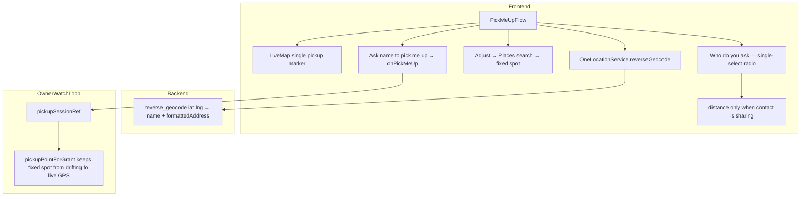

# Pick Me Up redesign + reverse-geocoded pickup spot — design

**Date:** 2026-07-12
**Branch:** `feat/pick-me-up-quick-action`
**Status:** Approved

## Visual Map

## Goal

Redesign the One Location **Pick Me Up** quick action to match the Apple Blue v2
reference: a clean single-card map with the pickup spot, a reverse-geocoded
address, single-recipient selection, and a note. Add the ability to show a
human-readable place name/address for the current location (reverse geocoding)
and to Adjust the pickup spot to a fixed searched place. Gate the last two quick
actions (Meeting, Safe Arrival) as "coming soon".

## Scope

In scope:
- Backend reverse geocoding (`reverse_geocode`) + route + frontend service.
- `PickMeUpFlow` rewrite to the reference layout.
- Single-recipient (radio) selection.
- Distance ("X km away") shown only when the contact is currently sharing their
  live location with the user.
- Adjust → fixed pickup spot (Places search), shared instead of live GPS, kept
  fixed by a `pickupSessionRef` in the owner watch loop.
- Meeting + Safe Arrival → "coming soon" in the quick-actions grid.

Out of scope:
- Reworking Drive-To's "Starting from" to use reverse geocoding (future reuse).
- "usually fastest" heuristic labels (we cannot back them with data).
- Changing the encryption/consent pipeline.

## Components

### 1. Backend — reverse geocode

Files: `consent-protocol/hushh_mcp/services/google_maps_service.py`,
`consent-protocol/api/routes/one/location.py`, tests.

- `reverse_geocode(*, lat, lng) -> {"name": str | None, "formattedAddress": str | None}`.
  Calls Google Geocoding API `https://maps.googleapis.com/maps/api/geocode/json?latlng=<lat>,<lng>&key=…`.
  - `formattedAddress` = `results[0].formatted_address`.
  - `name` = the most specific named component when present (e.g. a
    `point_of_interest`/`establishment`/`premise` in `results`), else `null`.
  - Returns both `null` when there are no results (caller falls back).
  - Reuses `_require_key()` and the existing async client + error mapping.
- Route: `POST /api/one/location/maps/reverse-geocode` (auth: `require_vault_owner_token`),
  body `{ lat, lng }`, returns `{ "place": <dict> }`. Mirrors `maps_place_details`.

Frontend: `OneLocationService.reverseGeocode({ vaultOwnerToken, lat, lng })`
returns `{ name: string | null; formattedAddress: string | null }`.

### 2. `PickMeUpFlow` rewrite

File: `hushh-webapp/components/one-location/redesign/pick-me-up-flow.tsx` + test.

Layout (top → bottom):
- Header: "Pick me up" title + blue "Cancel" (matches Drive-to header pattern).
- **Pickup card** (`CARD_SURFACE`, `overflow-hidden`):
  - Map area (`h-[150px]`): `LiveMap` for the pickup point when we have one; a
    "Capture location" prompt when no fix.
  - Row: "Your pickup spot" + reverse-geocoded label
    (`name ? "<name> · <formattedAddress>" : formattedAddress ?? "Live location"`)
    + a blue **Adjust** button on the right.
- **WHO DO YOU ASK** — single-select radio list. Each row: avatar + name +
  optional "X km away" subtitle (only when a live point for that contact exists)
  + a radio circle (filled blue when selected). Selecting sets `selectedId`
  (replaces any prior selection).
- **NOTE** — free-text card (`maxLength` 160), placeholder "Meet me at the main entrance."
- Footer helper text: "They see your live pickup spot until you're picked up or cancel."
  (When a fixed spot is set: "They see your pickup spot until you're picked up or cancel.")
- Action button: "Ask <name> to pick me up" (name of the selected recipient);
  disabled until a recipient is selected and a pickup point exists.

Adjust behavior:
- Tapping "Adjust" reveals a Places search (reuse the debounced
  `placesAutocomplete` + `placeDetails` pattern from Drive-To). Selecting a place
  sets a fixed pickup spot `{ latitude, longitude, label }`. The map + address
  row reflect the fixed spot. A "Use live location" affordance clears it back to
  live.

Distance:
- `vm.recipientLivePoint(userId)` (new vm helper) returns the contact's latest
  decrypted live point if they are currently sharing with the user, else `null`.
  When present, show `"<km> km away"` computed from the pickup point via the
  existing `locationDistanceMeters`/haversine helper.

### 3. Owner watch loop — keep a fixed pickup spot fixed

File: `hushh-webapp/app/one/location/page.tsx`.

- `onPickMeUp` view-model binding + `handlePickMeUp` gain an optional
  `pickupPoint?: { latitude: number; longitude: number; label?: string }`.
  - When provided: skip live capture; build the shared `PlainLocationPoint` from
    the fixed spot; record `pickupSessionRef = { grantIds, point }`.
  - When absent: unchanged (live capture + live watch).
- Add `pickupSessionRef` (mirrors `driveSessionRef`) and
  `pickupPointForGrant(grant, livePoint)` returning the fixed point for grants in
  `pickupSessionRef.grantIds`, else `livePoint`. Call it in the watch republish
  loop alongside `drivePointForGrant` so a fixed pickup does not drift to live GPS.
- Selection is single-recipient: `handlePickMeUp` still accepts `recipientIds`
  (an array with one id) — no signature break; the flow passes `[selectedId]`.

### 4. Quick actions — Meeting + Safe Arrival coming soon

File: `hushh-webapp/components/one-location/redesign/location-redesign-hub.tsx`.

- The Safe Arrival `QuickActionCard` gains `comingSoon` and drops its
  `onClick={() => setFlow("safe-arrival")}` (Meeting is already `comingSoon`).
- The `safe-arrival` flow branch may remain in the switch (unreachable) or be
  left as-is; the card no longer opens it.

## Data flow

1. User opens Pick Me Up → live location captured (existing) → `reverseGeocode`
   fills the pickup-spot label.
2. Optional: Adjust → Places search → fixed pickup spot (label + lat/lng).
3. User picks ONE contact (radio); distance shown if that contact is sharing.
4. User adds an optional note.
5. "Ask <name> to pick me up" → `onPickMeUp([selectedId], "4", note, pickupPoint?)`.
6. `handlePickMeUp` creates the grant + publishes the pickup point; fixed spots
   are kept fixed by `pickupPointForGrant` in the watch loop.

## Error handling / fallbacks

- No location fix → "Capture location" prompt in the map area; button disabled.
- `reverseGeocode` failure/unavailable → label falls back to "Live location".
- Maps JS unavailable → `LiveMap` iframe fallback (existing).
- `handlePickMeUp` keeps its existing toast on every failure branch.

## Testing

- Backend: `reverse_geocode` parses `name`/`formattedAddress`; returns nulls on
  empty results; field/URL shape asserted; passthrough route test.
- `pick-me-up-flow.test.tsx`: single-select (selecting B deselects A); button
  label "Ask <name> to pick me up"; distance shown only when a live point is
  provided; Adjust sets a fixed spot; `onPickMeUp` called with `[selectedId]`,
  `"4"`, note, and the fixed point when adjusted.
- Hub test / assertion: Safe Arrival renders as coming-soon (no `safe-arrival`
  flow opens on click).
