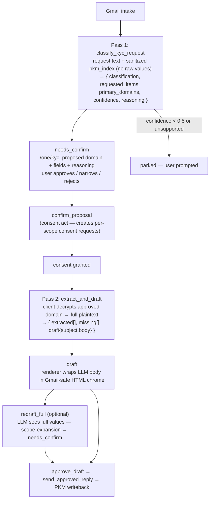

# KYC Agent LLM Redesign — Design Spec

**Date:** 2026-07-13
**Branch:** `feat/kyc-agent`
**Status:** Approved (design), pending implementation plan

## Problem

The One Email KYC agent (`agent_kyc`) picks the wrong data to disclose. A real
failure: an inbound email asked *"provide your information so I can confirm your
hotel booking."* The deterministic keyword scope-detection
(`_detect_scope_candidates`) matched on "hotel / booking / travel" and pulled
from the user's **travel** domain (a prior flight search) — when the request was
for **personal / identity** information and should have mapped to the **identity**
domain.

Root causes:

1. **Classification and scope selection are keyword regex, not comprehension.**
   `_looks_like_kyc`, `_detect_scope_candidates`, and `_extract_required_fields`
   match surface strings. They reason about the *words in the email*, not *what
   data is actually being requested*.
2. **The zero-knowledge redraft tokenizes PII into opaque tokens
   (`{{F0}}..{{FN}}`)**, so the LLM never sees real values and cannot reason
   about them (can't reformat a phone number, can't tell identity data from
   travel data, can't extract the exact field requested).
3. **The regex fast-path router (`isKeywordOnlyInstruction`) is coded but
   dormant** — never wired into the UI; every redraft goes through the LLM path
   today regardless.

## Goal

Rebuild the KYC **brains** — classification, domain/field selection, extraction,
and drafting — around an LLM that sees the **real data**, so the agent maps a
request to the correct PKM domain, extracts the exact fields requested, and
composes a natural reply. Keep an explicit per-request consent gate.

## Visual Map



## Scope

**Rebuild (the brains):**
- Classification / KYC detection (`_looks_like_kyc`, `_looks_like_financial_request`)
- Scope / domain / field detection (`_detect_scope_candidates`,
  `_detect_available_scope_candidates`, `_extract_required_fields`)
- Client-side value extraction (`extractApprovedValues` + the ~70-line `aliases`
  table in `one-kyc-client-zk-service.ts`)
- Draft composition (currently the deterministic renderer) and redraft
  (currently regex + tokenized LLM)

**Keep (the plumbing — works, security-hardened):**
- Gmail Pub/Sub webhook intake, `sync_recent_messages` catch-up
- Sender-identity matching, `blocked` on unknown sender
- Client-connector key gate (`needs_client_connector`) — enforces browser-held key
- Consent-request primitives (per-scope requests sharing a bundle id)
- `approve_draft` / `send_approved_reply` (consent revalidation on send)
- PKM writeback receipt, terminal-draft purge
- CWE-209 error-payload hardening

**Explicitly NOT doing:** a greenfield rewrite of `OneEmailKycService`. That
would discard ~4,600 lines of working consent/Gmail plumbing to fix a
classification bug.

## Decisions (locked with product owner)

| Decision | Choice | Rationale |
|---|---|---|
| Where the PII-seeing LLM runs | **Server-side** (Gemini Vertex proxy), accept PII exposure | Most capable models today; transitional — see BYOK/on-device below |
| How much PKM the LLM sees | **Two-pass**, sequenced around the confirm gate | Routing needs no values; full values sent only for the one approved domain |
| Consent | **Explicit confirm retained** — LLM proposes, user approves | Per-request consent is the legal backbone and the misroute safety net |
| Drafting | **LLM composes** the reply (merged into Pass 2) | Natural prose over rigid template; guarded by structured extract list |

### Forward direction: BYOK / on-device (transitional trade-off)

The server-side-PII path is **transitional**. The product is moving to BYOK LLM
keys and on-device inference, which restore the privacy posture. Therefore all
LLM calls (classify / extract+draft / redraft) go through a **single injectable
LLM provider interface** (the codebase already injects `llmRewrite` into
`runLlmRedraft`). Swapping to BYOK or on-device must require **no change to the
workflow, contracts, or guardrails** — only a different provider implementation
behind the seam.

## Architecture — new workflow state machine

The deterministic brains are removed. New states:

```
inbound Gmail ──> sender match ──(unknown)──> blocked
      │
      └─> client-connector gate ──(no key)──> needs_client_connector
             │
             ▼
        [PASS 1: LLM routing]   request text + sanitized pkm_index (NO values)
             │  → { classification, requested_items, primary_domains, confidence, reasoning }
             ▼
        needs_confirm   ── /one/kyc shows proposed domain + fields + reasoning
             │              user approves / edits / rejects each proposed field
             ▼ (user approves — this IS the consent act)
        create consent request(s) for approved scopes  ──> consent granted
             │
             ▼
        [PASS 2: LLM extract + draft]   client decrypts ONLY approved domain →
             │   full values + approved field list
             │  → { extracted[], draft{subject, body} }
             ▼
        draft (renderer wraps LLM body into Gmail-safe HTML chrome)
             │
             ▼ optional
        redraft (LLM sees full values, no tokenization)
             │
             ▼
        approve_draft ──> send_approved_reply ──> PKM writeback
```

The **confirm step is the consent act** — it preserves per-request consent and
is the human safety net that catches any Pass-1 misroute before disclosure.

## LLM contracts

Both run **server-side, Gemini Vertex, temperature 0**, strict JSON schema with
bounded retry-on-malformed.

### Pass 1 — Routing

Replaces `_looks_like_kyc` + `_detect_scope_candidates` + `_extract_required_fields`.

```
INPUT:
  request_text:  inbound email subject + body
  pkm_index:     available_domains[], domain_summaries{}, computed_tags[]   ← NO raw values
  scope_catalog: known attr.* / financial.* scopes the LLM may map to

OUTPUT (strict JSON):
{
  "classification": "kyc" | "kyc_financial" | "financial" | "unsupported",
  "requested_items": [
    { "label": "Full name", "domain": "identity",
      "scope": "attr.identity.name", "rationale": "personal info to confirm booking" }
  ],
  "primary_domains": ["identity"],
  "confidence": 0.0-1.0,
  "reasoning": "Email asks for personal info to confirm a hotel booking → identity verification, not travel itinerary."
}
```

`reasoning` is shown at the confirm step so a bad route is visible and rejectable.

### Pass 2 — Extract + Draft

Replaces the client-side `extractApprovedValues` alias table **and** demotes the
deterministic renderer to a formatter/fallback.

```
INPUT:
  domain_data:      full decrypted JSON of the ONE approved domain (real values)
  requested_fields: field list the user approved at confirm
  request_text:     inbound request (for draft tone/context)

OUTPUT (strict JSON):
{
  "extracted": [ { "scope": "attr.identity.name", "label": "Full name", "value": "Jane A. Doe" } ],
  "missing":   [ "attr.identity.passport_number" ],
  "draft":     { "subject": "...", "body": "..." }
}
```

- `extracted[]` — structured, drives the **subset guardrail**.
- `missing[]` — requested fields the user doesn't have; surfaced in UI.
- `draft` — LLM-composed reply prose using real values.

## Security / ZK invariant changes

### What changes (the accepted trade-off)

| Invariant | Today | After |
|---|---|---|
| `redactDraftForLlm` opaque tokenization | All PII → `{{F0}}..{{FN}}` before any server call | **Removed** for extract/draft/redraft; real values sent to server LLM |
| PKM plaintext to server | Never | Pass 1: sanitized index only. Pass 2 + redraft: full values, **approved domain only** |
| `SECURITY.md` / ZK reference docs | "Server never sees plaintext" | Amended: KYC extract/draft/redraft sends approved-domain plaintext to the Gemini Vertex proxy |

### What stays intact

- **`CHECK (draft_body IS NULL)` — kept.** Draft is composed by the LLM but
  assembled/persisted client-side only; never stored server-side.
- Client-connector key gate, X25519/AES-GCM client-side decryption, consent
  revalidation on send — unchanged.
- Server logs only SHA-256 hashes of instructions, never bodies.

### New consent scope — `agent.kyc.disclose.llm`

Because full PII now leaves the client for the LLM, this gets its own explicit,
auditable consent — distinct from `agent.kyc.process` (workflow) and
`agent.kyc.redraft.llm` (cosmetic redraft). Granted at the confirm step alongside
the per-field scopes, so the user explicitly consents to *"my identity data is
sent to the LLM to answer this request."*

## Guardrails (all fail-closed — keep prior state + show error)

1. **Pass 1 confidence floor** — below threshold, or `classification:
   "unsupported"`, the workflow parks and asks the user rather than auto-proposing.
2. **Confirm gate** — human safety net for any Pass-1 misroute (would have caught
   the hotel-booking bug even if Pass 1 failed).
3. **Pass 2 subset invariant** — `extracted` scopes ⊆ approved fields, enforced
   in code after the call. Replaces the old `FIELD_SET_CHANGED` guard.
4. **Draft value-provenance check** — every value appearing in `draft.body` must
   come from `extracted[]`; catches the LLM inventing or leaking a value in prose.
5. **Scope-expansion block on redraft** — a redraft asking for more data routes
   back to `needs_confirm`, never silently discloses (kept from today).
6. **Strict JSON schema validation** with bounded retries; malformed output fails
   closed to the deterministic renderer fallback.

## Components / files affected

**Backend (`consent-protocol/`):**
- `hushh_mcp/services/one_email_kyc_service.py` — remove deterministic brains;
  add Pass-1 routing call and Pass-2 extract+draft call; redraft with full data.
- `api/routes/one/email.py` — routing/classify + extract endpoints (new or
  folded into existing workflow endpoints).
- `hushh_mcp/constants.py` — add `AGENT_KYC_DISCLOSE_LLM = "agent.kyc.disclose.llm"`.
- `hushh_mcp/consent/scope_helpers.py`, `scope_bundles.py` — register new scope.
- LLM prompts (Pass 1 routing, Pass 2 extract+draft) — via the injectable provider.
- `hushh_mcp/agents/kyc/agent.yaml` — update declared scopes/behavior.

**Frontend (`hushh-webapp/`):**
- `app/one/kyc/page.tsx` — new state flow: show LLM proposal + reasoning, confirm,
  trigger extract+draft, render.
- `lib/services/one-kyc-client-zk-service.ts` — replace `extractApprovedValues`
  alias extraction with Pass-2 call; drop `redactDraftForLlm` tokenization for the
  extract/redraft path; client decrypt → send approved domain.
- `lib/services/one-kyc-service.ts` — new API methods for the two passes.
- `lib/services/one-kyc-approved-disclosure-renderer.ts` — demote to
  formatter/fallback: wrap LLM `body` in Gmail-safe HTML chrome; fallback draft.

**Docs:**
- `SECURITY.md` and the ZK reference docs — amend the plaintext guarantee.
- `consent-protocol/docs/reference/agent-development.md` — update the One Email KYC section; fix the
  broken `docs/reference/architecture/one-email-kyc.md` reference.

## Testing

- **Regression for the reported bug:** hotel-booking request + a PKM containing
  both `travel` (flight search) and `identity` domains → Pass 1 must return
  `primary_domains: ["identity"]`, never `travel`.
- Pass 2: exact field extraction across name-mismatched / nested structures;
  subset-invariant violation rejected; value-provenance check catches an invented
  value in `draft.body`; `missing[]` surfaced.
- Consent: proposal → confirm creates the right scopes incl.
  `agent.kyc.disclose.llm`; reject discloses nothing.
- Fail-closed paths: low confidence, `unsupported`, malformed JSON, subset
  violation, scope-expansion attempt on redraft.
- **Classification eval harness** — reuse the `consent-protocol/scripts/eval_pkm_structure_agent.py`
  pattern: a labeled set of inbound requests → expected domain, so routing
  accuracy is measurable and regression-guarded over time.

## Open items for the implementation plan

- Exact endpoint shape: two new endpoints vs. folding both passes into the
  existing workflow lifecycle endpoints.
- Confidence-floor threshold value and the `unsupported` UX.
- Provider-interface signature that cleanly admits server / BYOK / on-device
  implementations.
