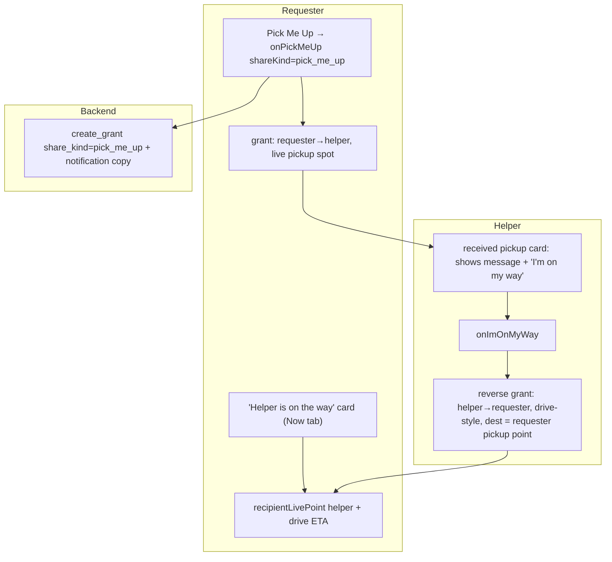

# Pick Me Up — watch your helper approach (mutual live share + ETA) — design

**Date:** 2026-07-13
**Branch:** `feat/pickup-live-eta`
**Status:** Proposed (awaiting review)

## Visual Map

## Goal

Upgrade **Pick Me Up** from a one‑way share into a **mutual** pickup: when the
helper accepts ("I'm on my way"), they share their **live location + ETA** back
to the requester, who then watches the helper approach on a live "on the way"
card. Today the helper's card is view‑only and the requester sees nothing after
asking.

## Key model facts (from code map)

- Pick Me Up is a **share** (owner=requester → recipient=helper), pickup note in
  `grant.shareMessage`. It is NOT an access request; received shares are
  view‑only today.
- The reverse share (helper → requester) reuses the **existing** `createGrant` +
  `publishEnvelope` + foreground watch loop unchanged. It only needs the
  requester present in the helper's `recipients` list (guaranteed — they're
  connected, `enforce_connection`).
- `vm.recipientLivePoint(userId)` already returns a contact's decrypted live
  point once they share back — the requester needs no new fetch plumbing.
- ETA rides inside the envelope as `DriveSharePayload` when the share is
  **drive‑style** — so the helper's reverse share is a Drive‑To to the
  requester's pickup point.

## Scope

In scope:
- Backend: a `pick_me_up` **share kind** (explicit on `create_grant`) + pickup
  notification copy.
- Helper: received **pickup card** shows the message + an **"I'm on my way"**
  action that creates the drive‑style reverse share (dest = requester's pickup
  point).
- Requester: an **"[Helper] is on the way · ETA"** live card on the Now tab.

Out of scope:
- Decline/negotiation flow, multi‑helper pickups, background tracking changes,
  turn‑by‑turn navigation, arrival auto‑detection (future).

## Components

### 1. Backend — `pick_me_up` share kind

Files: `consent-protocol/hushh_mcp/services/one_location_agent_service.py`
(`create_grant`, `_classify_share_kind` ~322, `_send_metadata_notification`
~2782), `consent-protocol/api/routes/one/location.py` (`CreateGrantRequest`,
`create_grant` route ~433), tests.

- Add an explicit optional `share_kind` param to `create_grant` (route request
  model + service). When provided, it wins over `_classify_share_kind`; when
  absent, behavior is unchanged. Persist on the grant (existing `shareKind`
  field).
- Recognize `"pick_me_up"` in notification copy: title "Pickup requested", body
  `"<Requester>: <pickup message>"`, deep‑link to the Inbox shared card
  (existing `_one_location_url`).
- No change to encryption/consent; the reverse grant is a normal `create_grant`.

Frontend `OneLocationService.createGrant` gains an optional `shareKind` passthrough;
`handlePickMeUp` passes `shareKind: "pick_me_up"`.

### 2. Helper side — pickup card + "I'm on my way"

Files: `components/one-location/redesign/cards.tsx` (`SharedWithMeCard` ~240),
`components/one-location/redesign/location-redesign-hub.tsx` (`InboxHub` ~1287
wiring), `app/one/location/page.tsx` (new `handleImOnMyWay`), tests.

- `SharedWithMeCard` gains optional `message` + `onImOnMyWay` props. Render the
  pickup message; when the grant is a `pick_me_up` and not already responded,
  show a primary **"I'm on my way"** button (and, after tapping, an "En route —
  sharing your location" state).
- `InboxHub` passes `grant.shareMessage` and, for `shareKind === "pick_me_up"`,
  an `onImOnMyWay={() => vm.onImOnMyWay(grant)}` handler.
- `handleImOnMyWay(grant)` (reuses the Drive‑To pipeline): destination =
  `decryptedPoints[grant.id]` (the requester's shared pickup point) as a
  `DriveDestination` (label "<requester> · pickup"); recipient =
  `grant.ownerUserId` (looked up in the helper's `recipients` list for
  `keyId`/`publicKeyJwk`); `shareKind: "pickup_enroute"`; duration = until
  picked up. Calls the same `createGrant` + `publishEnvelopeWithRetry` + drive
  ETA path so the helper's live position + ETA flow to the requester.
- Guard: if the requester isn't in the helper's recipients list (edge), show a
  clear toast ("Can't share back — reconnect first") rather than failing
  silently.

### 3. Requester side — "[Helper] is on the way" card

Files: `components/one-location/redesign/location-redesign-hub.tsx` (Now tab,
near `SharingStatusCard` ~598), a new `PickupEnRouteCard` in `cards.tsx`,
`app/one/location/page.tsx` (derive the en‑route state), tests.

- Derive, on the requester: for each **active outbound** `pick_me_up` grant
  (owner=me, recipient=helper), check for a **received** grant from that helper
  (`ownerUserId === helper`, `shareKind === "pickup_enroute"`) with a decrypted
  live point. When found → show `PickupEnRouteCard`.
- `PickupEnRouteCard` shows "[Helper] is on the way", their **live map**
  (`renderMapPreview`/`LiveMap` on `recipientLivePoint(helper)`), and **ETA**
  from the received drive payload (`point.drive.etaSeconds` via `driveEtaText`),
  plus a "Cancel pickup" affordance that revokes the outbound grant.
- No new fetch: `recipientLivePoint` + the envelope's drive payload already
  carry position + ETA.

## Data flow

1. Requester → "Ask <helper> to pick me up" → `onPickMeUp(..., shareKind: pick_me_up)`.
2. Helper gets a notification + a pickup card (message shown) → taps **"I'm on my way"**.
3. Helper's app creates a drive‑style reverse grant to the requester (dest =
   requester's pickup point) → shares live position + ETA.
4. Requester's Now tab shows **"[Helper] is on the way · ETA"** with the helper's
   live map, updating in real time.
5. Either side cancels/expires → cards clear.

## Error handling / fallbacks

- Helper not connected to requester → toast, no silent failure.
- Helper location permission denied → existing `ensureForegroundLocationReady`
  toasts (reused).
- Helper not sharing yet / no fix → requester card shows "Waiting for <helper> to
  start sharing" until a point arrives.
- ETA unavailable → card shows position without ETA ("on the way").

## Testing

- Backend: `create_grant` honors explicit `share_kind: pick_me_up`; notification
  copy for pickup; classification unchanged when kind absent.
- Frontend: `SharedWithMeCard` renders message + "I'm on my way" only for
  `pick_me_up`; `handleImOnMyWay` calls `createGrant` with recipient =
  requester, drive‑style, `pickup_enroute`; `PickupEnRouteCard` shows helper
  name + ETA from the drive payload; requester en‑route derivation matches
  outbound pickup ↔ inbound `pickup_enroute`.
