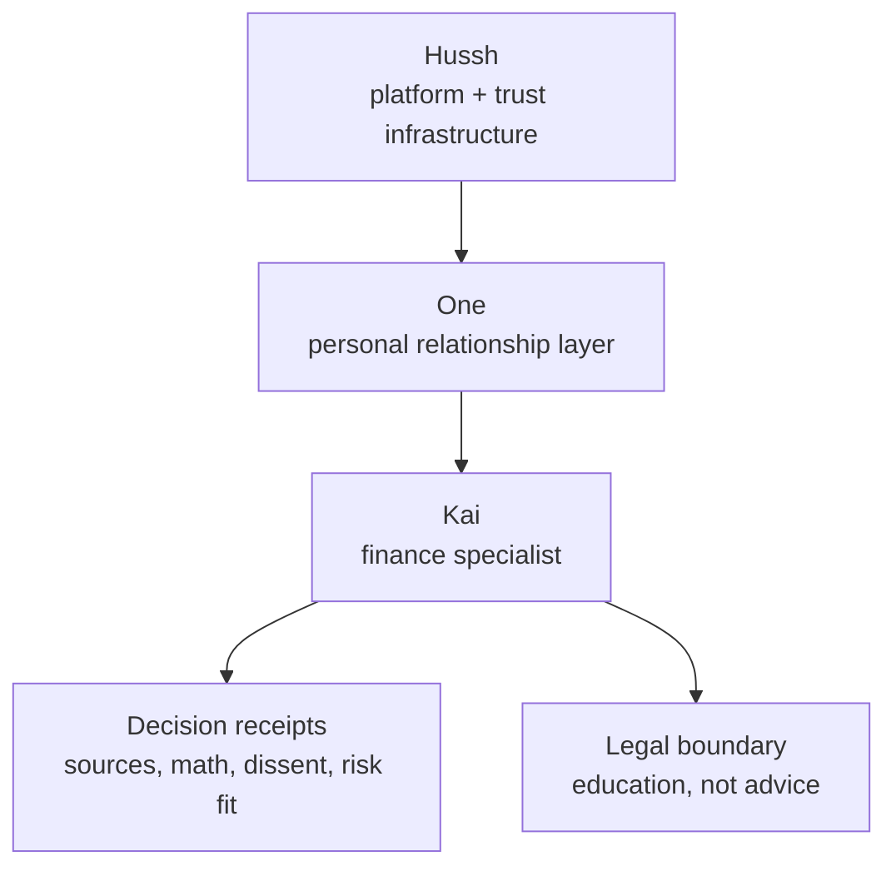

# Kai Vision

> Finance specialist under One, not the platform-level identity.

## Visual Map

## Role

Kai is the finance specialist that One summons for portfolio, market, investment debate, RIA, and decision-receipt workflows.

Kai does not own the broad product surface. Consent, vault, deletion, privacy-policy authority, and ordinary relationship speech belong to the One/Nav/KYC model documented in current references and future plans.

## North Star

Kai should feel like a disciplined investment committee a user can carry with them:

- evidence before confidence
- real data before synthesis
- dissent before conclusion
- risk-persona fit before generic advice
- receipts before recommendations

The product promise is not "the model knows best." The product promise is that the user can see why a finance conclusion was formed, what evidence supported it, what uncertainty remains, and what risk tradeoff they are accepting.

## Legal Boundary

Kai is described in this repository as an educational and informational tool.

Kai is not represented here as:

- a registered investment adviser
- a broker-dealer
- a fiduciary
- a solicitation to buy or sell securities
- a substitute for a licensed financial professional

Any investment-related output must preserve this boundary and should not imply that this repository itself establishes regulated advisory status.

## Current-State Boundary

This vision page is not the source of truth for shipped runtime behavior.

Use these current references instead:

- [Kai Index](../../reference/kai/README.md)
- [Kai Architecture Specification v1](../../reference/kai/kai-architecture-specification-v1.md)
- [Kai Accuracy Contract](../../reference/kai/kai-accuracy-contract.md)
- [One Voice Kai Compatibility Runtime](../../reference/one/one-voice-kai-compatibility-runtime.md)
- [One Voice Runtime Architecture](../../reference/one/one-voice-runtime-architecture.md)

## Future-State Boundary

Future Kai ideas belong in future or R&D planning homes, not this vision index:

- [Future Kai](../../future/kai/README.md)
- [On-Device Future Plan](../../reference/ai/on-device-future-plan/README.md)
- [One Product Surface Evolution Plan](../../future/one-product-surface-evolution-plan.md)

Speculative on-device execution, hybrid execution, specialist committee structure, and new regulatory posture must stay future-state unless linked current-state references and tests prove the implementation.

## Non-Goals

This page must not become:

- an implementation architecture document
- an on-device runtime plan
- a provider or cache inventory
- a legal entity registration statement
- a replacement for One/Nav/KYC ownership docs
- a place to preserve superseded Kai-era product language
