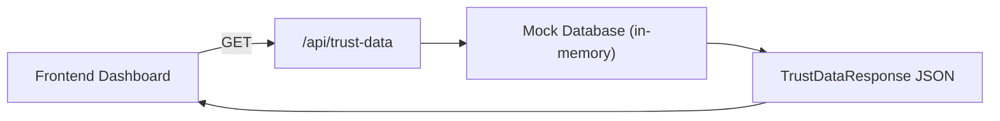

# Hussh — Privacy Dashboard Trust-Data API

A Next.js API route serving mock trust data for a user-facing privacy dashboard.

## Context

The **Hussh** project provides a privacy-first dashboard where users can monitor which third-party services access their data, toggle granular permissions, and audit every access attempt. This API route (`/api/trust-data`) is the backend data source that powers that dashboard.

## Architecture

## Proposed Changes (Completed)

---

### API Route

#### [NEW] [route.ts](./src/app/api/trust-data/route.ts)

- **TypeScript Interfaces** — `ConnectedService`, `Permission`, `AccessLog`, `TrustDataResponse`
- **Union Types** — `ServiceStatus`, `PermissionState`, `AccessResult` for strict typing
- **Mock Data** — Realistic dataset with 6 services, 8 permissions, 10 access logs
- **GET Handler** — Returns `NextResponse.json()` with 120ms simulated latency
- **Error Handling** — `try/catch` block returning `{ error: string }` with HTTP 500

---

### Project Scaffolding

#### [NEW] [package.json](./package.json)
- Next.js 15 + React 19 + TypeScript 5

#### [NEW] [tsconfig.json](./tsconfig.json)
- Strict mode, bundler module resolution, `@/*` path alias

#### [NEW] [next.config.ts](./next.config.ts)
- Minimal configuration placeholder

## Data Model

| Entity | Count | Key Fields |
|---|---|---|
| `connected_services` | 6 | `status`: Active / Pending / Revoked |
| `permissions` | 8 | `state`: On / Off, across 4 categories |
| `access_logs` | 10 | `result`: Authorized / BLOCKED_BY_CONSENT / Denied / Rate_Limited |

### Permission Categories
- **Data Sharing** — Analytics sharing, third-party enrichment
- **Notifications** — Email alerts, push notifications
- **Security** — Biometric auth, new device login verification
- **Privacy** — Location tracking, marketing cookies

## Future Roadmap

| Phase | Description |
|---|---|
| **Phase 2** | Build frontend dashboard consuming this API |
| **Phase 3** | Replace mock data with a real database (PostgreSQL / Prisma) |
| **Phase 4** | Add PATCH/PUT routes for toggling permissions |
| **Phase 5** | Add authentication middleware (NextAuth / Clerk) |
| **Phase 6** | Real-time access log streaming via WebSockets |

## Verification

### Automated
- `npx tsc --noEmit` — ✅ Zero TypeScript errors
- `Invoke-RestMethod -Uri http://localhost:3000/api/trust-data` — ✅ Full JSON response returned

### Manual
- Start dev server with `npm run dev`
- Hit `http://localhost:3000/api/trust-data` in browser
- Verify all four top-level keys: `user`, `connected_services`, `permissions`, `access_logs`
